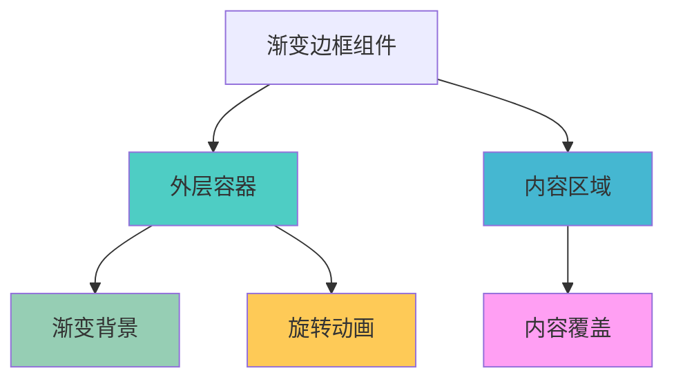
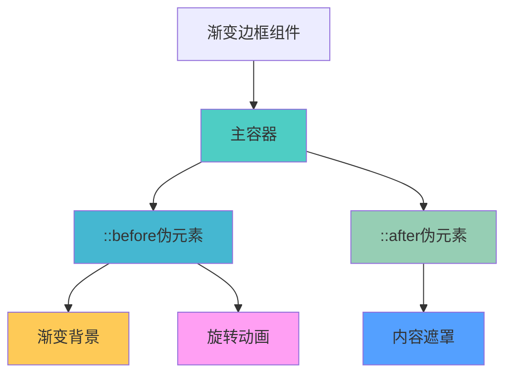
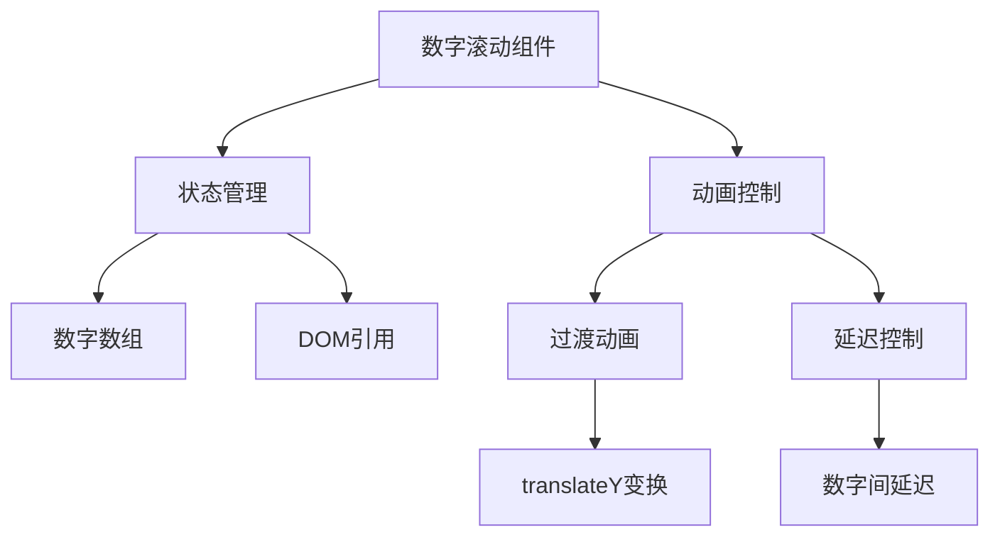
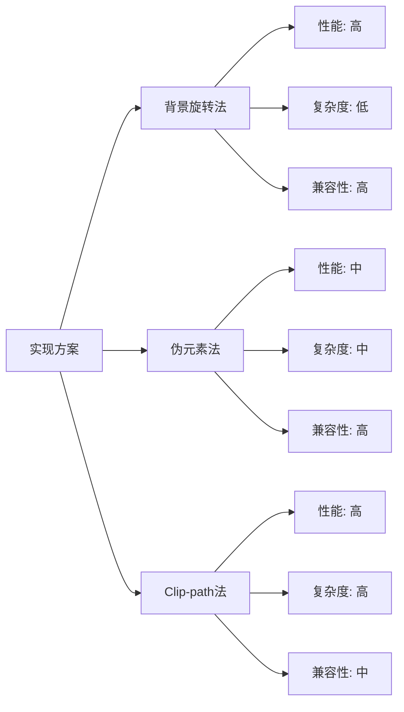

# CSS 渐变边框效果

CSS 渐变边框是一种常见的视觉效果，可以为元素添加动态、炫酷的边框样式。本文介绍几种实现渐变边框的方法。

## 🎨 实现方案

### 方案一：背景图旋转法

**核心思路**：

- 创建一个渐变背景图
- 通过 CSS 动画让背景图顺时针/逆时针旋转
- 使用定位在背景图上覆盖内容区域

**优点**：

- 实现简单，兼容性好
- 动画效果流畅
- 可以实现复杂的渐变效果

**适用场景**：

- 按钮边框动画
- 卡片装饰效果
- 加载状态指示器

<demo react="react/CssBorder/One/index.tsx" 
:reactFiles="['react/CssBorder/One/index.tsx','react/CssBorder/One/index.scss']" 
/>

**实现原理图**：



**核心实现代码**：

```scss
.around-one {
	display: flex;
	justify-content: center;
	align-items: center;
	position: relative;
	width: 320px;
	height: 220px;
	margin: 16px auto;
	border-radius: 10px;
	animation: aroundOneMove 2s linear infinite;
	background: linear-gradient(-100deg, #13f41c 0%, #33acf1 100%);

	.card {
		display: flex;
		justify-content: center;
		align-items: center;
		background-color: #f9fce0;
		width: 300px;
		height: 200px;
		border-radius: 10px;
	}
}

@keyframes aroundOneMove {
	0% {
		background: linear-gradient(0deg, #13f41c 0%, #33acf1 100%);
	}
	25% {
		background: linear-gradient(90deg, #13f41c 0%, #33acf1 100%);
	}
	50% {
		background: linear-gradient(180deg, #13f41c 0%, #33acf1 100%);
	}
	75% {
		background: linear-gradient(270deg, #13f41c 0%, #33acf1 100%);
	}
	100% {
		background: linear-gradient(360deg, #13f41c 0%, #33acf1 100%);
	}
}
```

### 方案二：background-image 实现

**核心思路**：

- 使用 `background-image` 创建渐变背景
- 通过 `background-clip` 和 `padding` 控制边框区域
- 结合伪元素实现更复杂的效果

**优点**：

- 代码简洁
- 性能较好
- 易于维护

**实现原理图**：



### 示例 1：基础渐变边框

<demo react="react/CssBorder/Two/index.tsx"
:reactFiles="['react/CssBorder/Two/index.tsx','react/CssBorder/Two/index.scss']"
/>

**实现要点**：

- 使用 `linear-gradient` 创建渐变效果
- 通过 `background-origin` 控制背景起始位置
- 设置合适的 `padding` 值作为边框宽度

**核心实现代码**：

```scss
.around-two {
	position: relative;
	z-index: 0;
	width: 320px;
	height: 150px;
	border-radius: 10px;
	overflow: hidden;
	padding: 2rem;
	margin: 16px auto;
	text-align: center;

	&::before {
		content: '';
		position: absolute;
		z-index: -2;
		left: -50%;
		top: -50%;
		width: 200%;
		height: 200%;
		background-color: #399953;
		background-repeat: no-repeat;
		background-size: 50% 50%, 50% 50%;
		background-position: 0 0, 100% 0, 100% 100%, 0 100%;
		background-image: linear-gradient(#399953, #399953), linear-gradient(#fbb300, #fbb300),
			linear-gradient(#d53e33, #d53e33), linear-gradient(#377af5, #377af5);
		animation: rotate 4s linear infinite;
	}

	&::after {
		content: '';
		position: absolute;
		z-index: -1;
		left: 6px;
		top: 6px;
		width: calc(100% - 12px);
		height: calc(100% - 12px);
		background: white;
		border-radius: 5px;
	}
}
```

### 示例 2：动态渐变边框

<demo react="react/CssBorder/Three/index.tsx"
:reactFiles="['react/CssBorder/Three/index.tsx','react/CssBorder/Three/index.scss']"
/>

**实现要点**：

- 结合 CSS 动画实现颜色变化
- 使用 `background-size` 和 `background-position` 创建动态效果
- 通过 `animation-timing-function` 控制动画节奏

**核心实现代码**：

```scss
.around-three {
	position: relative;
	z-index: 0;
	width: 300px;
	height: 180px;
	margin: 20px;
	border-radius: 10px;
	overflow: hidden;
	padding: 2rem;
	color: #fff;

	&::before {
		content: '';
		position: absolute;
		z-index: -2;
		left: -50%;
		top: -50%;
		width: 200%;
		height: 200%;
		background-color: #1a232a;
		background-repeat: no-repeat;
		background-position: 0 0;
		background-image: conic-gradient(transparent, rgb(245, 118, 60), transparent 30%);
		animation: aroundThreeRotate 4s linear infinite;
	}

	&::after {
		content: '';
		position: absolute;
		z-index: -1;
		left: 6px;
		top: 6px;
		width: calc(100% - 12px);
		height: calc(100% - 12px);
		background: #000;
		border-radius: 5px;
	}
}

@keyframes aroundThreeRotate {
	100% {
		transform: rotate(1turn);
	}
}
```

## 🔢 扩展应用：数字滚动效果

渐变边框技术也可以应用到其他动画效果中，如数字滚动：

<demo react="react/Animate/NumberRoller/index.tsx"
:reactFiles="['react/Animate/NumberRoller/index.tsx','react/Animate/NumberRoller/index.scss']"
/>

**实现原理**：



**核心实现代码**：

```typescript
// 数字滚动效果核心逻辑
useEffect(() => {
	if (digits.length === 0) return;

	// 确保DOM已渲染
	const timer = setTimeout(() => {
		digits.forEach((_, index) => {
			const listRef = digitListRefs.current[index];
			if (!listRef) return;

			// 计算每个数字的延迟
			const delay = (digits.length - index - 1) * CONFIG.DELAY_BETWEEN_DIGITS;

			// 设置过渡效果
			listRef.style.transition = `transform ${CONFIG.DURATION - delay}ms ease-in-out`;

			// 延迟启动动画
			setTimeout(() => {
				const targetDigit = parseInt(digits[index], 10);
				const extraRolls = CONFIG.ROLL_COUNT * 10;
				const targetY = -(extraRolls + targetDigit) * CONFIG.DIGIT_HEIGHT;
				listRef.style.transform = `translateY(${targetY}px)`;
			}, delay);
		});
	}, 100);

	return () => clearTimeout(timer);
}, [digits]);
```

## 💡 最佳实践

### 性能优化

- 优先使用 `transform` 而非改变 `background-position`
- 避免在动画中频繁重绘
- 使用 `will-change` 属性提示浏览器优化

### 兼容性考虑

- 为旧版浏览器提供降级方案
- 使用 CSS 前缀确保兼容性
- 测试不同设备上的表现

### 设计建议

- 保持渐变色彩的和谐统一
- 控制动画速度，避免过于炫目
- 考虑用户的视觉体验和可访问性

## 🎯 应用场景

### 1. UI 组件增强

- **按钮**: 为按钮添加动态边框效果
- **卡片**: 为内容卡片添加装饰性边框
- **输入框**: 为表单元素添加焦点状态边框

### 2. 动画效果

- **加载指示器**: 创建旋转的渐变边框作为加载动画
- **进度条**: 使用渐变边框表示进度状态
- **通知框**: 为重要通知添加醒目的边框效果

### 3. 品牌展示

- **Logo 容器**: 为品牌 Logo 添加特色边框
- **标语展示**: 为关键信息添加装饰性边框
- **产品展示**: 为产品图片添加动态边框效果

## 🔧 技术要点

### 1. 渐变类型选择

- **linear-gradient**: 线性渐变，适合创建方向性边框
- **radial-gradient**: 径向渐变，适合创建圆形扩散效果
- **conic-gradient**: 圆锥渐变，适合创建旋转效果

### 2. 动画性能优化

```scss
// 使用硬件加速
.transform-element {
	will-change: transform;
	transform: translateZ(0); // 触发硬件加速
}

// 优化动画属性
.optimized-animation {
	animation-timing-function: ease-out; // 使用合适的缓动函数
	animation-fill-mode: both; // 保持动画状态
}
```

### 3. 响应式设计

```scss
// 媒体查询适配不同屏幕
.responsive-border {
	width: 300px;
	height: 200px;

	@media (max-width: 768px) {
		width: 200px;
		height: 150px;
	}

	@media (max-width: 480px) {
		width: 150px;
		height: 100px;
	}
}
```

## 📊 性能对比

不同实现方案的性能对比：



## 🔒 安全与维护

### 1. 浏览器兼容性

- 测试主流浏览器的支持情况
- 为不支持的浏览器提供降级方案
- 使用 Autoprefixer 等工具自动添加前缀

### 2. 代码维护

- 使用 SCSS 变量管理颜色和尺寸
- 保持代码结构清晰
- 添加详细的注释说明

### 3. 性能监控

- 监控动画对页面性能的影响
- 避免过度使用复杂动画
- 在移动设备上测试性能表现

---

_渐变边框效果为网页增添了现代感和动态美，合理运用可以显著提升用户界面的视觉吸引力。_
