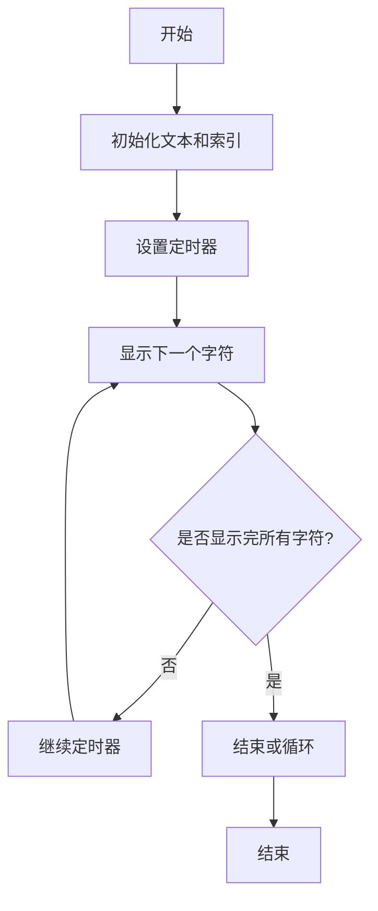
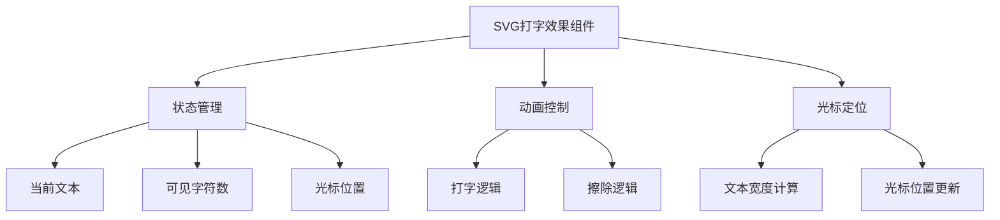
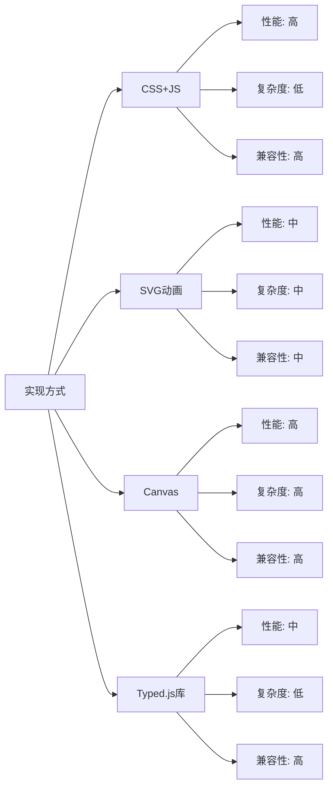

# 打字效果 (Typed Effect)

打字效果是一种模拟真实打字过程的动画效果，常用于网站首页、介绍页面等场景，能够吸引用户注意力并增强交互体验。

## 🎯 效果特点

- **逐字显示**: 文字逐个字符出现，模拟真实打字
- **光标闪烁**: 配合光标动画增强真实感
- **速度控制**: 可调节打字速度和停顿时间
- **循环播放**: 支持多段文字循环显示

## 💻 基础实现

### CSS + JavaScript 实现

<demo react="react/Animate/Typed/index.tsx" 
:reactFiles="['react/Animate/Typed/index.tsx','react/Animate/Typed/index.scss']" 
/>

**核心原理**：

- 使用 JavaScript 控制文字的逐步显示
- CSS 实现光标闪烁动画
- 通过定时器控制打字速度

**实现要点**：

```javascript
// 核心逻辑示例
const typeText = (text, element, speed = 100) => {
	let i = 0;
	const timer = setInterval(() => {
		element.textContent += text.charAt(i);
		i++;
		if (i > text.length) {
			clearInterval(timer);
		}
	}, speed);
};
```

### 实现流程图



## 🎨 SVG 打字效果

### 路径动画实现

<demo react="react/Animate/Typed/svg.tsx" 
:reactFiles="['react/Animate/Typed/svg.tsx','react/Animate/Typed/svg.scss']" 
/>

**核心原理**：

- 使用 SVG 路径描绘文字轮廓
- 通过 `stroke-dasharray` 和 `stroke-dashoffset` 实现描边动画
- 结合 CSS 动画控制绘制过程

**实现要点**：

```css
/* SVG 路径动画 */
.svg-text {
	stroke-dasharray: 1000;
	stroke-dashoffset: 1000;
	animation: draw 3s ease-in-out forwards;
}

@keyframes draw {
	to {
		stroke-dashoffset: 0;
	}
}
```

### SVG 打字效果架构



## 🛠️ 技术对比

| 实现方式 | 优点                       | 缺点         | 适用场景            |
| -------- | -------------------------- | ------------ | ------------------- |
| CSS + JS | 简单易懂，兼容性好         | 功能相对简单 | 基础文字打字效果    |
| SVG 动画 | 视觉效果丰富，支持路径动画 | 复杂度较高   | 艺术字体、Logo 动画 |
| Canvas   | 性能好，功能强大           | 开发复杂度高 | 复杂交互动画        |
| 第三方库 | 功能完善，开箱即用         | 增加项目体积 | 快速开发需求        |

## 📚 常用库推荐

### Typed.js

- **特点**: 功能完善，配置简单
- **大小**: ~17KB
- **GitHub**: https://github.com/mattboldt/typed.js

**使用示例**：

```javascript
import Typed from 'typed.js';

const typed = new Typed('#typed-element', {
	strings: ['Hello World', 'Welcome to our site'],
	typeSpeed: 50,
	backSpeed: 50,
	loop: true
});
```

### TypeIt

- **特点**: 轻量级，API 友好
- **大小**: ~6KB
- **GitHub**: https://github.com/alexmacarthur/typeit

## 🎨 设计建议

### 用户体验

- **速度适中**: 不要太快或太慢，保持自然节奏
- **适时停顿**: 在句号、逗号处适当停顿
- **可跳过**: 提供跳过动画的选项

### 视觉设计

- **字体选择**: 使用等宽字体效果更佳
- **颜色搭配**: 确保文字与背景对比度足够
- **光标样式**: 设计符合整体风格的光标

### 性能优化

- **避免重排**: 使用 `transform` 而非改变布局属性
- **节流控制**: 合理控制动画频率
- **内存管理**: 及时清理定时器和事件监听

## 🚀 进阶应用

### 多行打字效果

- 支持段落级别的打字动画
- 保持文本格式和换行

### 交互式打字

- 用户输入触发动画
- 实时响应用户操作

### 主题切换

- 支持明暗主题
- 动态调整颜色和样式

## ⚙️ 核心实现细节

### 手动实现打字效果

```javascript
// 手动实现的打字效果核心逻辑
useEffect(() => {
  const textDiv = manualTypedRef.current;
  if (!textDiv) {
    return;
  }

  const text = ['这里是一个打字效果'] as string[];
  let lineIndex = 0;
  let charIndex = 0;

  let timeoutId: number;
  const typeSpeed = 150; // 打字速度（毫秒）

  const typeText = () => {
    if (lineIndex < text.length) {
      if (charIndex < text[lineIndex].length) {
        textDiv.textContent += text[lineIndex][charIndex++];
        timeoutId = window.setTimeout(typeText, typeSpeed);
      } else {
        // 一行结束，准备换行（如果还有下一行）
        lineIndex++;
        charIndex = 0;
        if (lineIndex < text.length) {
          textDiv.textContent += '\n';
          timeoutId = window.setTimeout(typeText, typeSpeed);
        }
      }
    }
  };

  // 启动打字效果
  timeoutId = window.setTimeout(typeText, typeSpeed);

  // 返回清理函数
  return () => {
    window.clearTimeout(timeoutId);
  };
}, []);
```

### 使用 Typed.js 库实现

```javascript
// 使用 typed.js 库的打字效果
useEffect(() => {
	if (!typedRef.current) return;
	const typed = new Typed(typedRef.current, {
		strings: ['<i>First</i> sentence.', '&amp; a second sentence.'],
		typeSpeed: 50,
		backSpeed: 50,
		loop: true,
		showCursor: false,
		cursorChar: '|',
		contentType: 'html'
	});

	return () => {
		typed.destroy();
	};
}, []);
```

### SVG 打字效果实现

```javascript
// SVG打字效果核心逻辑
useEffect(() => {
	typeRef.current = false;
	let timeoutId: number;
	const typingSpeed = 80;

	const animationTick = () => {
		if (typeRef.current) return;

		if (isErasingRef.current) {
			// 擦除逻辑
			setVisibleChars(prev => {
				if (prev > 0) {
					timeoutId = window.setTimeout(animationTick, typingSpeed / 2);
					return prev - 1;
				} else {
					// 擦除完毕, 切换文本
					isErasingRef.current = false;
					const nextIndex = (textIndexRef.current + 1) % INPUT_TEXTS.length;
					textIndexRef.current = nextIndex;
					setCurrentText(INPUT_TEXTS[nextIndex]); // 这会触发 effect 重新运行
					return 0;
				}
			});
		} else {
			// 打字逻辑
			setVisibleChars(prev => {
				if (prev < currentText.length) {
					timeoutId = window.setTimeout(animationTick, typingSpeed);
					return prev + 1;
				} else {
					// 打字完毕, 等待后开始擦除
					isErasingRef.current = true;
					timeoutId = window.setTimeout(animationTick, 2000);
					return prev;
				}
			});
		}
	};

	// 开始动画
	// 为新文本设置初始延迟
	timeoutId = window.setTimeout(animationTick, 1000);

	// 清理函数
	return () => {
		typeRef.current = true;
		clearTimeout(timeoutId);
	};
}, [currentText]); // 仅在 currentText 改变时重新运行 effect
```

## 🔧 最佳实践

### 1. 性能优化建议

- 使用 `requestAnimationFrame` 替代 `setTimeout` 以获得更流畅的动画
- 合理设置打字速度，避免过快或过慢影响用户体验
- 及时清理定时器和事件监听器，防止内存泄漏

### 2. 可访问性考虑

- 为屏幕阅读器用户提供替代文本
- 允许用户跳过动画效果
- 确保动画不会引发癫痫等健康问题

### 3. 响应式设计

- 根据屏幕尺寸调整字体大小
- 在移动设备上考虑性能影响
- 提供降级方案以应对不支持的浏览器

### 4. 错误处理

- 处理文本加载失败的情况
- 提供优雅的降级方案
- 在组件卸载时正确清理资源

## 📊 性能分析

不同实现方式的性能对比：



## 🔒 安全考虑

1. **XSS 防护**: 当使用用户输入的文本时，确保进行适当的转义和验证
2. **资源加载**: 确保第三方库的安全性和可靠性
3. **浏览器兼容性**: 测试不同浏览器的兼容性问题

## 🎯 应用场景

1. **网站首页**: 吸引用户注意力的标语展示
2. **产品介绍**: 逐步展示产品特性
3. **教程引导**: 模拟命令行输入效果
4. **聊天界面**: 模拟消息逐字显示效果

---

_打字效果虽然简单，但细节决定体验。合理运用能为网站增添生动的交互魅力。_
