# 瀑布流布局实现指南

瀑布流（Masonry Layout）是一种流行的网页布局方式，特别适用于展示不同高度的内容卡片，如图片画廊、文章列表、产品展示等。本文将介绍多种实现瀑布流的方法。

## 🎯 瀑布流特点

- **自适应高度**: 内容块根据实际内容自动调整高度
- **紧密排列**: 最小化空白区域，提高空间利用率
- **响应式设计**: 根据屏幕宽度自动调整列数
- **视觉美观**: 创造不规则但和谐的视觉效果

## 📐 工作原理

```mermaid
graph TD
    A[瀑布流布局] --> B[布局计算]
    A --> C[内容渲染]
    A --> D[响应式适配]

    B --> B1[列高度计算]
    B --> B2[最佳位置选择]
    B --> B3[位置定位]

    C --> C1[图片加载]
    C --> C2[懒加载优化]
    C --> C3[骨架屏显示]

    D --> D1[断点检测]
    D --> D2[列数调整]
    D --> D3[重新布局]
```



## 🛠️ 实现方案对比

| 方案            | 优点                | 缺点                      | 适用场景       |
| --------------- | ------------------- | ------------------------- | -------------- |
| **Masonry.js**  | 功能完善，配置灵活  | 需要 JavaScript，体积较大 | 复杂交互需求   |
| **CSS Grid**    | 纯 CSS 实现，性能好 | 浏览器兼容性要求高        | 现代浏览器项目 |
| **CSS Flexbox** | 兼容性好，实现简单  | 需要预知内容高度          | 简单布局需求   |
| **CSS Columns** | 代码简洁，自动分列  | 阅读顺序问题              | 文本内容展示   |

## 📚 Masonry.js 实现

### 基础用法

<demo react="react/Masonry/index.tsx" 
:reactFiles="['react/Masonry/index.tsx','react/Masonry/MasonryImageGallery.tsx','react/Masonry/PreviewModal.tsx','react/Masonry/PreviewProvider.tsx']" 
/>

**核心特性**：

- 自动计算最佳位置
- 支持响应式断点
- 丰富的配置选项
- 动画过渡效果

### 配置选项详解

```javascript
// Masonry 配置示例
const masonryOptions = {
	// 列宽设置
	columnWidth: 200, // 固定列宽
	columnWidth: '.grid-sizer', // 使用元素作为列宽参考

	// 间距设置
	gutter: 10, // 固定间距
	gutter: '.gutter-sizer', // 使用元素作为间距参考

	// 响应式设置
	fitWidth: true, // 容器宽度自适应

	// 动画设置
	transitionDuration: '0.4s', // 过渡动画时长

	// 排序设置
	horizontalOrder: true, // 保持水平顺序

	// 百分比宽度
	percentPosition: true // 使用百分比定位
};
```

### React 组件实现

```typescript
interface MasonryImageGalleryProps {
	images: ImageItem[];
	pageSize?: number;
	skeletonCount?: number;
	columnCount?: number; // 控制展示的列数
}

const MasonryImageGallery: React.FC<MasonryImageGalleryProps> = ({
	images = [],
	pageSize = 12,
	skeletonCount = 6,
	columnCount = 4 // 默认4列
}) => {
	const gridRef = useRef<HTMLDivElement>(null);
	const loaderRef = useRef<HTMLDivElement>(null);
	const masonryInstanceRef = useRef<any>(null);
	const [page, setPage] = useState(1);
	const [isLoading, setIsLoading] = useState(false);
	const [initialLoading, setInitialLoading] = useState(true);
	const { openPreview } = usePreview();

	// 根据列数生成对应的CSS类
	const getColumnClasses = () => {
		switch (columnCount) {
			case 2:
				return 'w-full sm:w-1/2';
			case 3:
				return 'w-full sm:w-1/2 md:w-1/3';
			case 5:
				return 'w-full sm:w-1/2 md:w-1/3 lg:w-1/5';
			case 6:
				return 'w-full sm:w-1/2 md:w-1/3 lg:w-1/6';
			case 4:
			default:
				return 'w-full sm:w-1/2 md:w-1/3 lg:w-1/4';
		}
	};

	// 确保currentImages至少是一个空数组
	const currentImages = images && Array.isArray(images) ? images.slice(0, page * pageSize) : [];
	const isEnd = currentImages.length >= (images?.length || 0);
	const imgList = currentImages.map(i => i.src).filter(src => src); // 过滤掉空src

	useEffect(() => {
		if (!gridRef.current) return;

		// 只在新图片加载时设置loading状态，避免已有布局时的闪烁
		const isNewImages =
			currentImages.length > 0 &&
			(!masonryInstanceRef.current || currentImages.length > imgList.length);
		if (isNewImages) {
			setIsLoading(true);
		}

		const imgLoad = imagesLoaded(gridRef.current);

		const layoutMasonry = () => {
			// 如果已经有实例，则重新布局而不是创建新实例
			if (masonryInstanceRef.current) {
				masonryInstanceRef.current.reloadItems();
				masonryInstanceRef.current.layout();
			} else {
				// 首次创建实例
				masonryInstanceRef.current = new Masonry(gridRef.current!, {
					itemSelector: '.masonry-item',
					columnWidth: '.masonry-sizer',
					gutter: 16,
					percentPosition: true
				});
			}
			setIsLoading(false);
			setInitialLoading(false);
		};

		imgLoad.on('always', layoutMasonry);

		// 清理函数 - 移除监听器
		return () => {
			imgLoad.off('always', layoutMasonry);
			// imgLoad.destroy() 方法不存在，已移除
		};
	}, [currentImages]);

	// 组件卸载时销毁 Masonry 实例
	useEffect(() => {
		return () => {
			if (masonryInstanceRef.current) {
				// 销毁 Masonry 实例的引用
				masonryInstanceRef.current = null;
			}
		};
	}, []);

	useEffect(() => {
		const el = loaderRef.current;
		if (!el || isEnd) return;

		// 创建一次性的IntersectionObserver配置
		const observer = new IntersectionObserver(
			entries => {
				if (entries[0].isIntersecting && !isLoading) {
					setPage(p => p + 1);
				}
			},
			{ threshold: 1.0 }
		);

		observer.observe(el);

		// 清理函数
		return () => observer.disconnect();
	}, [isLoading, isEnd]); // 只有当依赖项真正改变时才重新创建观察者

	/**
	 * 打开图片预览
	 * @param idx 图片索引
	 */
	const handleOpenPreview = (idx: number) => {
		if (idx < 0 || idx >= imgList.length) return; // 安全检查
		openPreview(imgList, idx);
	};

	return (
		<div className="p-6">
			<div className="masonry-grid relative" ref={gridRef}>
				<div className={`masonry-sizer ${getColumnClasses()}`} />
				{currentImages.map((img, idx) => (
					<div key={img.id} className={`masonry-item mb-4 float-left ${getColumnClasses()}`}>
						<div
							className="rounded shadow overflow-hidden cursor-pointer"
							// 使用封装的handleOpenPreview
							onClick={() => handleOpenPreview(idx)}
						>
							
						</div>
					</div>
				))}
				{initialLoading &&
					Array.from({ length: skeletonCount }).map((_, i) => (
						<div
							key={`skeleton-${i}`}
							className={`masonry-item mb-4 float-left ${getColumnClasses()}`}
						>
							<div className="animate-pulse bg-gray-300 h-40 rounded shadow" />
						</div>
					))}
				{!isEnd && !isLoading && (
					<div ref={loaderRef} className="w-full h-12 my-4 text-center text-gray-500">
						加载中...
					</div>
				)}
			</div>
		</div>
	);
};
```

## 🎨 CSS Grid 实现

### 现代 CSS 方案

```css
.masonry-grid {
	display: grid;
	grid-template-columns: repeat(auto-fill, minmax(250px, 1fr));
	grid-gap: 20px;
	grid-auto-rows: 10px; /* 设置很小的行高 */
}

.masonry-item {
	/* 根据内容高度动态设置跨越的行数 */
	grid-row-end: span var(--row-span);
}
```

```javascript
// JavaScript 计算行跨度
function setGridRowSpan() {
	const items = document.querySelectorAll('.masonry-item');
	items.forEach(item => {
		const height = item.offsetHeight;
		const rowSpan = Math.ceil(height / 10); // 10px 是 grid-auto-rows 的值
		item.style.setProperty('--row-span', rowSpan);
	});
}
```

### CSS Grid 优势

- **性能优异**: 浏览器原生支持，渲染效率高
- **响应式友好**: 自动适应容器宽度
- **代码简洁**: 相对较少的 CSS 代码

## 🔧 CSS Flexbox 实现

### 多列 Flexbox 方案

```css
.masonry-container {
	display: flex;
	flex-direction: row;
	gap: 20px;
}

.masonry-column {
	flex: 1;
	display: flex;
	flex-direction: column;
	gap: 20px;
}
```

```javascript
// JavaScript 分配内容到列
function distributeItems() {
	const container = document.querySelector('.masonry-container');
	const items = Array.from(document.querySelectorAll('.masonry-item'));
	const columnCount = 3; // 列数

	// 创建列
	for (let i = 0; i < columnCount; i++) {
		const column = document.createElement('div');
		column.className = 'masonry-column';
		container.appendChild(column);
	}

	const columns = document.querySelectorAll('.masonry-column');

	// 分配项目到高度最小的列
	items.forEach(item => {
		const shortestColumn = Array.from(columns).reduce((prev, current) =>
			prev.offsetHeight < current.offsetHeight ? prev : current
		);
		shortestColumn.appendChild(item);
	});
}
```

## 📱 响应式设计

### 断点配置

```javascript
// Masonry.js 响应式配置
const responsiveOptions = {
	breakpoints: {
		1200: {
			columnWidth: 300,
			gutter: 20
		},
		768: {
			columnWidth: 250,
			gutter: 15
		},
		480: {
			columnWidth: '100%',
			gutter: 10
		}
	}
};
```

### CSS 媒体查询

```css
/* 桌面端 */
@media (min-width: 1200px) {
	.masonry-grid {
		grid-template-columns: repeat(4, 1fr);
	}
}

/* 平板端 */
@media (min-width: 768px) and (max-width: 1199px) {
	.masonry-grid {
		grid-template-columns: repeat(3, 1fr);
	}
}

/* 移动端 */
@media (max-width: 767px) {
	.masonry-grid {
		grid-template-columns: repeat(2, 1fr);
	}
}
```

## 🖼️ 图片画廊增强

### LightBox 集成

<demo react="react/LightBox/index.tsx" 
:reactFiles="['react/LightBox/index.tsx','react/LightBox/Gallery.tsx','react/LightBox/Lightbox.tsx']" 
/>

**增强功能**：

- 图片预览放大
- 键盘导航支持
- 触摸手势支持
- 缩略图导航

### 懒加载优化

```javascript
// Intersection Observer 实现懒加载
const imageObserver = new IntersectionObserver(entries => {
	entries.forEach(entry => {
		if (entry.isIntersecting) {
			const img = entry.target;
			img.src = img.dataset.src;
			img.classList.remove('lazy');
			imageObserver.unobserve(img);
		}
	});
});

// 观察所有懒加载图片
document.querySelectorAll('img[data-src]').forEach(img => {
	imageObserver.observe(img);
});
```

## ⚡ 性能优化

### 虚拟滚动

```javascript
// 虚拟滚动实现
class VirtualMasonry {
	constructor(container, items, itemHeight = 200) {
		this.container = container;
		this.items = items;
		this.itemHeight = itemHeight;
		this.visibleItems = [];
		this.scrollTop = 0;

		this.init();
	}

	init() {
		this.container.addEventListener('scroll', this.onScroll.bind(this));
		this.render();
	}

	onScroll() {
		this.scrollTop = this.container.scrollTop;
		this.render();
	}

	render() {
		const containerHeight = this.container.clientHeight;
		const startIndex = Math.floor(this.scrollTop / this.itemHeight);
		const endIndex = Math.min(
			startIndex + Math.ceil(containerHeight / this.itemHeight) + 1,
			this.items.length
		);

		// 只渲染可见区域的项目
		this.visibleItems = this.items.slice(startIndex, endIndex);
		this.updateDOM();
	}
}
```

### 图片优化

```javascript
// 响应式图片加载
function getOptimalImageSize(containerWidth) {
	if (containerWidth <= 480) return 'small';
	if (containerWidth <= 768) return 'medium';
	return 'large';
}

// 渐进式图片加载
function loadProgressiveImage(img) {
	// 先加载低质量版本
	const lowQualitySrc = img.dataset.lowSrc;
	const highQualitySrc = img.dataset.highSrc;

	img.src = lowQualitySrc;

	// 预加载高质量版本
	const highQualityImg = new Image();
	highQualityImg.onload = () => {
		img.src = highQualitySrc;
		img.classList.add('loaded');
	};
	highQualityImg.src = highQualitySrc;
}
```

## 🎨 动画效果

### 进入动画

```css
.masonry-item {
	opacity: 0;
	transform: translateY(50px);
	transition: all 0.6s ease;
}

.masonry-item.loaded {
	opacity: 1;
	transform: translateY(0);
}

/* 错开动画时间 */
.masonry-item:nth-child(1) {
	transition-delay: 0.1s;
}
.masonry-item:nth-child(2) {
	transition-delay: 0.2s;
}
.masonry-item:nth-child(3) {
	transition-delay: 0.3s;
}
```

### 悬停效果

```css
.masonry-item {
	transition: transform 0.3s ease, box-shadow 0.3s ease;
}

.masonry-item:hover {
	transform: translateY(-10px);
	box-shadow: 0 20px 40px rgba(0, 0, 0, 0.1);
}
```

## 🧪 故障排除

### 1. 布局闪烁问题

**问题**: 页面加载时瀑布流布局出现闪烁
**解决方案**:

- 使用骨架屏占位符
- 在图片加载完成后再进行布局计算
- 预先设置容器高度

### 2. 响应式适配问题

**问题**: 在不同屏幕尺寸下布局错乱
**解决方案**:

- 使用媒体查询调整列数
- 设置合适的断点
- 测试不同设备的显示效果

### 3. 性能问题

**问题**: 图片过多时页面卡顿
**解决方案**:

- 实现图片懒加载
- 使用虚拟滚动技术
- 优化图片资源大小

## 🔧 实际应用建议

### 选择合适的方案

1. **内容类型考虑**

   - 图片为主：推荐 Masonry.js + 懒加载
   - 文本卡片：可考虑 CSS Grid
   - 混合内容：Masonry.js 更灵活

2. **性能要求**

   - 高性能要求：CSS Grid 或 Flexbox
   - 功能丰富：Masonry.js
   - 简单展示：CSS Columns

### 开发最佳实践

1. **预加载关键资源**
2. **实现骨架屏加载**
3. **添加错误处理机制**
4. **考虑无障碍访问**
5. **测试不同设备和网络环境**

## 🛠️ 技术要点

### 1. Masonry.js 核心原理

- 使用 [imagesLoaded](https://github.com/desandro/imagesloaded) 检测图片加载完成
- 通过计算各列高度确定下一个元素的最佳位置
- 利用 CSS transitions 实现平滑动画效果

### 2. 响应式断点处理

- 使用 `window.matchMedia` 监听屏幕尺寸变化
- 动态调整列宽和间距
- 重新计算布局以适应新尺寸

### 3. 懒加载实现

- 利用 Intersection Observer API
- 预加载即将进入视口的图片
- 释放已离开视口的图片资源

---

_瀑布流布局是现代网页设计的重要组成部分，选择合适的实现方案并注重性能优化，可以创造出优秀的用户体验。_ 📱
