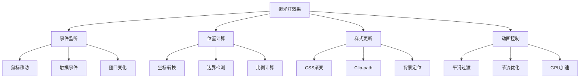

# 聚光灯效果实现与使用

聚光灯效果是一种引人注目的视觉交互效果，通过模拟光照效果来突出显示特定区域或跟随鼠标移动，广泛应用于产品展示、图片浏览、游戏界面等场景。

## 效果特点

### 视觉特性

- **光照模拟**: 模拟真实的聚光灯照射效果
- **动态跟随**: 跟随鼠标或触摸点移动
- **渐变过渡**: 光圈边缘的自然渐变效果
- **可调参数**: 光圈大小、亮度、颜色可自定义

### 交互体验

- **实时响应**: 流畅的鼠标跟随效果
- **视觉引导**: 引导用户注意力到特定区域
- **沉浸感**: 增强页面的交互沉浸感
- **多设备支持**: 支持鼠标和触摸操作

## 📐 工作原理



## 💻 实现演示

<demo react="react/Spotlight/index.tsx" 
:reactFiles="['react/Spotlight/index.tsx']" 
/>

## 🛠️ 核心实现原理

### 基础 CSS 实现

```css
.spotlight-container {
	position: relative;
	overflow: hidden;
	background: #000;
}

.spotlight-overlay {
	position: absolute;
	top: 0;
	left: 0;
	width: 100%;
	height: 100%;
	background: radial-gradient(
		circle at var(--mouse-x, 50%) var(--mouse-y, 50%),
		transparent 0%,
		transparent var(--spotlight-size, 100px),
		rgba(0, 0, 0, 0.8) var(--spotlight-fade, 150px),
		rgba(0, 0, 0, 0.95) 100%
	);
	pointer-events: none;
	transition: background 0.1s ease;
}
```

### JavaScript 鼠标跟踪

```javascript
class SpotlightEffect {
	constructor(container, options = {}) {
		this.container = container;
		this.options = {
			size: 100,
			fade: 50,
			opacity: 0.8,
			color: 'rgba(0, 0, 0, 0.8)',
			smooth: true,
			...options
		};

		this.overlay = null;
		this.mouseX = 0;
		this.mouseY = 0;
		this.animationId = null;

		this.init();
	}

	init() {
		this.createOverlay();
		this.bindEvents();
	}

	createOverlay() {
		this.overlay = document.createElement('div');
		this.overlay.className = 'spotlight-overlay';
		this.container.appendChild(this.overlay);

		this.updateSpotlight();
	}

	bindEvents() {
		this.container.addEventListener('mousemove', this.handleMouseMove.bind(this));
		this.container.addEventListener('mouseleave', this.handleMouseLeave.bind(this));
		this.container.addEventListener('mouseenter', this.handleMouseEnter.bind(this));
	}

	handleMouseMove(e) {
		const rect = this.container.getBoundingClientRect();
		this.mouseX = ((e.clientX - rect.left) / rect.width) * 100;
		this.mouseY = ((e.clientY - rect.top) / rect.height) * 100;

		if (this.options.smooth) {
			this.smoothUpdate();
		} else {
			this.updateSpotlight();
		}
	}

	smoothUpdate() {
		if (this.animationId) {
			cancelAnimationFrame(this.animationId);
		}

		this.animationId = requestAnimationFrame(() => {
			this.updateSpotlight();
		});
	}

	updateSpotlight() {
		if (!this.overlay) return;

		const { size, fade, color } = this.options;

		this.overlay.style.background = `
      radial-gradient(
        circle at ${this.mouseX}% ${this.mouseY}%,
        transparent 0%,
        transparent ${size}px,
        ${color} ${size + fade}px,
        ${color} 100%
      )
    `;
	}

	handleMouseLeave() {
		if (this.overlay) {
			this.overlay.style.opacity = '0';
		}
	}

	handleMouseEnter() {
		if (this.overlay) {
			this.overlay.style.opacity = '1';
		}
	}

	destroy() {
		if (this.animationId) {
			cancelAnimationFrame(this.animationId);
		}

		if (this.overlay) {
			this.overlay.remove();
		}
	}
}
```

### React Hook 实现

```typescript
interface SpotlightOptions {
	size?: number;
	fade?: number;
	opacity?: number;
	color?: string;
	smooth?: boolean;
	enabled?: boolean;
}

const useSpotlight = (options: SpotlightOptions = {}) => {
	const containerRef = useRef<HTMLDivElement>(null);
	const overlayRef = useRef<HTMLDivElement>(null);
	const mousePos = useRef({ x: 50, y: 50 });
	const animationId = useRef<number>();

	const {
		size = 100,
		fade = 50,
		opacity = 0.8,
		color = 'rgba(0, 0, 0, 0.8)',
		smooth = true,
		enabled = true
	} = options;

	const updateSpotlight = useCallback(() => {
		if (!overlayRef.current) return;

		const { x, y } = mousePos.current;
		overlayRef.current.style.background = `
      radial-gradient(
        circle at ${x}% ${y}%,
        transparent 0%,
        transparent ${size}px,
        ${color} ${size + fade}px,
        ${color} 100%
      )
    `;
	}, [size, fade, color]);

	const handleMouseMove = useCallback(
		(e: MouseEvent) => {
			if (!containerRef.current) return;

			const rect = containerRef.current.getBoundingClientRect();
			mousePos.current = {
				x: ((e.clientX - rect.left) / rect.width) * 100,
				y: ((e.clientY - rect.top) / rect.height) * 100
			};

			if (smooth) {
				if (animationId.current) {
					cancelAnimationFrame(animationId.current);
				}
				animationId.current = requestAnimationFrame(updateSpotlight);
			} else {
				updateSpotlight();
			}
		},
		[smooth, updateSpotlight]
	);

	useEffect(() => {
		const container = containerRef.current;
		if (!container || !enabled) return;

		container.addEventListener('mousemove', handleMouseMove);

		return () => {
			container.removeEventListener('mousemove', handleMouseMove);
			if (animationId.current) {
				cancelAnimationFrame(animationId.current);
			}
		};
	}, [handleMouseMove, enabled]);

	return { containerRef, overlayRef };
};
```

## 🎨 高级功能

### 多光源效果

```typescript
const MultiSpotlight = () => {
	const [lights, setLights] = useState<Array<{ x: number; y: number; id: string }>>([]);

	const addLight = (e: React.MouseEvent) => {
		const rect = e.currentTarget.getBoundingClientRect();
		const newLight = {
			x: ((e.clientX - rect.left) / rect.width) * 100,
			y: ((e.clientY - rect.top) / rect.height) * 100,
			id: Math.random().toString(36).substr(2, 9)
		};

		setLights(prev => [...prev, newLight]);
	};

	const removeLight = (id: string) => {
		setLights(prev => prev.filter(light => light.id !== id));
	};

	const generateGradient = () => {
		if (lights.length === 0) return 'rgba(0, 0, 0, 0.8)';

		const gradients = lights.map(
			light =>
				`radial-gradient(circle at ${light.x}% ${light.y}%, transparent 0%, transparent 80px, rgba(0, 0, 0, 0.8) 120px)`
		);

		return gradients.join(', ');
	};

	return (
		<div
			className="multi-spotlight"
			onClick={addLight}
			style={{
				background: generateGradient()
			}}
		>
			{lights.map(light => (
				<div
					key={light.id}
					className="light-marker"
					style={{
						left: `${light.x}%`,
						top: `${light.y}%`
					}}
					onClick={e => {
						e.stopPropagation();
						removeLight(light.id);
					}}
				/>
			))}
		</div>
	);
};
```

### 彩色聚光灯

```typescript
const ColorfulSpotlight = () => {
	const [currentColor, setCurrentColor] = useState('#ff6b6b');
	const colors = ['#ff6b6b', '#4ecdc4', '#45b7d1', '#96ceb4', '#feca57'];

	const getGradient = (x: number, y: number) => `
    radial-gradient(
      circle at ${x}% ${y}%,
      ${currentColor}40 0%,
      ${currentColor}20 50px,
      transparent 100px,
      rgba(0, 0, 0, 0.8) 150px,
      rgba(0, 0, 0, 0.9) 100%
    )
  `;

	return (
		<div className="colorful-spotlight">
			<div className="color-picker">
				{colors.map(color => (
					<button
						key={color}
						className={`color-btn ${currentColor === color ? 'active' : ''}`}
						style={{ backgroundColor: color }}
						onClick={() => setCurrentColor(color)}
					/>
				))}
			</div>
			{/* 聚光灯实现 */}
		</div>
	);
};
```

### 动画聚光灯

```typescript
const AnimatedSpotlight = () => {
	const [isAnimating, setIsAnimating] = useState(false);
	const animationRef = useRef<number>();
	const startTime = useRef<number>();

	const startAnimation = () => {
		setIsAnimating(true);
		startTime.current = Date.now();
		animate();
	};

	const animate = () => {
		const elapsed = Date.now() - (startTime.current || 0);
		const progress = (elapsed % 4000) / 4000; // 4秒循环

		// 计算圆形路径上的位置
		const angle = progress * Math.PI * 2;
		const centerX = 50;
		const centerY = 50;
		const radius = 30;

		const x = centerX + Math.cos(angle) * radius;
		const y = centerY + Math.sin(angle) * radius;

		// 更新聚光灯位置
		updateSpotlightPosition(x, y);

		if (isAnimating) {
			animationRef.current = requestAnimationFrame(animate);
		}
	};

	const stopAnimation = () => {
		setIsAnimating(false);
		if (animationRef.current) {
			cancelAnimationFrame(animationRef.current);
		}
	};

	return (
		<div className="animated-spotlight">
			<button onClick={isAnimating ? stopAnimation : startAnimation}>
				{isAnimating ? '停止动画' : '开始动画'}
			</button>
			{/* 聚光灯实现 */}
		</div>
	);
};
```

## 📱 移动端适配

### 触摸事件支持

```typescript
const TouchSpotlight = () => {
	const handleTouchMove = (e: React.TouchEvent) => {
		e.preventDefault();
		const touch = e.touches[0];
		const rect = e.currentTarget.getBoundingClientRect();

		const x = ((touch.clientX - rect.left) / rect.width) * 100;
		const y = ((touch.clientY - rect.top) / rect.height) * 100;

		updateSpotlight(x, y);
	};

	const handleTouchStart = (e: React.TouchEvent) => {
		const touch = e.touches[0];
		const rect = e.currentTarget.getBoundingClientRect();

		const x = ((touch.clientX - rect.left) / rect.width) * 100;
		const y = ((touch.clientY - rect.top) / rect.height) * 100;

		updateSpotlight(x, y);
	};

	return (
		<div
			className="touch-spotlight"
			onTouchStart={handleTouchStart}
			onTouchMove={handleTouchMove}
			style={{ touchAction: 'none' }}
		>
			{/* 内容 */}
		</div>
	);
};
```

### 设备检测

```typescript
const useDeviceDetection = () => {
	const [isMobile, setIsMobile] = useState(false);

	useEffect(() => {
		const checkDevice = () => {
			setIsMobile(
				/Android|webOS|iPhone|iPad|iPod|BlackBerry|IEMobile|Opera Mini/i.test(
					navigator.userAgent
				) || window.innerWidth < 768
			);
		};

		checkDevice();
		window.addEventListener('resize', checkDevice);

		return () => window.removeEventListener('resize', checkDevice);
	}, []);

	return isMobile;
};
```

## ⚡ 性能优化

### 节流优化

```typescript
const useThrottledSpotlight = (delay = 16) => {
	const lastUpdate = useRef(0);

	const throttledUpdate = useCallback(
		(x: number, y: number) => {
			const now = Date.now();
			if (now - lastUpdate.current >= delay) {
				updateSpotlight(x, y);
				lastUpdate.current = now;
			}
		},
		[delay]
	);

	return throttledUpdate;
};
```

### GPU 加速

```css
.spotlight-overlay {
	will-change: background;
	transform: translateZ(0); /* 强制 GPU 加速 */
	backface-visibility: hidden;
}
```

### 内存管理

```typescript
const useSpotlightCleanup = () => {
	const cleanupFunctions = useRef<Array<() => void>>([]);

	const addCleanup = (fn: () => void) => {
		cleanupFunctions.current.push(fn);
	};

	useEffect(() => {
		return () => {
			cleanupFunctions.current.forEach(fn => fn());
			cleanupFunctions.current = [];
		};
	}, []);

	return addCleanup;
};
```

## 🧪 故障排除

### 1. 聚光灯效果不跟随鼠标

**问题**: 聚光灯位置不正确或不跟随鼠标移动
**解决方案**:

- 检查坐标计算是否正确
- 确保容器的 position 属性设置正确
- 验证事件监听器是否正确绑定

### 2. 性能问题

**问题**: 页面卡顿或聚光灯更新延迟
**解决方案**:

- 使用 requestAnimationFrame 优化更新
- 实现节流或防抖机制
- 启用 GPU 加速

### 3. 移动端兼容性问题

**问题**: 在移动设备上效果异常或无法正常工作
**解决方案**:

- 添加触摸事件支持
- 适配不同屏幕尺寸
- 测试各种移动设备

## 🛠️ 技术要点

### 1. CSS 渐变技术

- 使用 radial-gradient 创建圆形光圈效果
- 通过 CSS 变量动态控制光圈位置和大小
- 利用 clip-path 实现更复杂的形状

### 2. 坐标系统转换

- 将鼠标坐标从视口坐标转换为相对容器的百分比
- 处理容器边界情况
- 支持响应式设计

### 3. 动画优化

- 使用 requestAnimationFrame 实现平滑动画
- 通过 CSS transition 优化过渡效果
- 启用 GPU 加速提升性能

## 应用场景

### 1. 产品展示

```typescript
const ProductShowcase = ({ product }) => (
	<div className="product-showcase">
		<SpotlightEffect size={150} fade={80}>
			
			<div className="product-info">
				<h3>{product.name}</h3>
				<p>{product.description}</p>
			</div>
		</SpotlightEffect>
	</div>
);
```

### 2. 图片浏览器

```typescript
const ImageViewer = ({ images }) => {
	const [currentImage, setCurrentImage] = useState(0);

	return (
		<div className="image-viewer">
			<SpotlightEffect size={200} color="rgba(0, 0, 0, 0.7)">
				
			</SpotlightEffect>

			<div className="image-controls">
				{images.map((_, index) => (
					<button
						key={index}
						onClick={() => setCurrentImage(index)}
						className={index === currentImage ? 'active' : ''}
					/>
				))}
			</div>
		</div>
	);
};
```

### 3. 游戏界面

```typescript
const GameMap = ({ playerPosition, visibilityRadius }) => (
	<div className="game-map">
		<SpotlightEffect
			size={visibilityRadius}
			fade={50}
			color="rgba(0, 0, 0, 0.9)"
			position={playerPosition}
		>
			<div className="game-world">{/* 游戏世界内容 */}</div>
		</SpotlightEffect>
	</div>
);
```

## 最佳实践

### 设计原则

1. **适度使用**: 避免过度的聚光灯效果影响内容阅读
2. **性能优先**: 使用 CSS 渐变而非 Canvas 绘制
3. **可访问性**: 提供禁用动画的选项
4. **响应式**: 在不同设备上调整效果强度

### 实施建议

1. **渐进增强**: 从静态效果开始，逐步添加交互
2. **用户控制**: 允许用户调整或关闭效果
3. **性能监控**: 监控对页面性能的影响
4. **兼容性测试**: 确保在不同浏览器中正常工作

---

_聚光灯效果是增强用户体验的有效手段，合理使用可以创造出令人印象深刻的交互体验。_ 🔦
