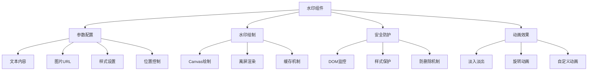

# 水印组件实现与使用

水印是一种重要的版权保护和品牌标识技术，广泛应用于文档、图片、视频等数字内容中。本文将详细介绍如何实现一个功能完善的前端水印组件。

## 🎯 水印的作用与意义

### 主要用途

- **版权保护**: 防止内容被非法复制和使用
- **品牌标识**: 增强品牌曝光和识别度
- **溯源追踪**: 帮助追踪内容的来源和传播路径
- **防篡改**: 检测内容是否被恶意修改

### 应用场景

- **文档系统**: 合同、报告、证书等重要文档
- **图片展示**: 摄影作品、设计稿、产品图片
- **视频内容**: 教学视频、宣传片、直播内容
- **网页内容**: 防止页面内容被截图盗用

## 📐 工作原理



## 🛠️ 技术实现方案

### 方案对比

| 实现方式        | 优点               | 缺点                   | 适用场景     |
| --------------- | ------------------ | ---------------------- | ------------ |
| **Canvas 绘制** | 灵活度高，效果丰富 | 性能开销大，不支持 SEO | 复杂水印效果 |
| **CSS 背景**    | 性能好，实现简单   | 功能有限，易被修改     | 简单文字水印 |
| **SVG 实现**    | 矢量图形，缩放清晰 | 兼容性问题             | 图形水印     |
| **DOM 覆盖**    | 实现简单，兼容性好 | 容易被删除             | 基础防护需求 |

## 💻 核心实现

### React 水印组件

<demo react="react/Watermark/index.tsx" 
:reactFiles="['react/Watermark/index.tsx','react/Watermark/MdWatermark.tsx']" 
/>

### 基础实现原理

```typescript
interface WatermarkProps {
	text?: string; // 水印文字
	fontSize?: number; // 字体大小
	color?: string; // 文字颜色
	opacity?: number; // 透明度
	rotate?: number; // 旋转角度
	gap?: [number, number]; // 水印间距
	offset?: [number, number]; // 偏移量
	image?: string; // 图片水印
	children?: React.ReactNode; // 子组件
}

const Watermark: React.FC<WatermarkProps> = ({
	text = 'Watermark',
	fontSize = 16,
	color = 'rgba(0, 0, 0, 0.15)',
	opacity = 1,
	rotate = -22,
	gap = [100, 100],
	offset = [0, 0],
	image,
	children
}) => {
	// 实现逻辑...
};
```

### Canvas 绘制水印

```javascript
function createWatermarkCanvas(options) {
	const { text, fontSize, color, opacity, rotate, gap, image } = options;

	const canvas = document.createElement('canvas');
	const ctx = canvas.getContext('2d');

	// 设置画布尺寸
	const [gapX, gapY] = gap;
	canvas.width = gapX;
	canvas.height = gapY;

	// 设置文字样式
	ctx.font = `${fontSize}px Arial`;
	ctx.fillStyle = color;
	ctx.globalAlpha = opacity;
	ctx.textAlign = 'center';
	ctx.textBaseline = 'middle';

	// 旋转画布
	ctx.translate(canvas.width / 2, canvas.height / 2);
	ctx.rotate((rotate * Math.PI) / 180);

	if (image) {
		// 绘制图片水印
		const img = new Image();
		img.onload = () => {
			ctx.drawImage(img, -img.width / 2, -img.height / 2);
		};
		img.src = image;
	} else {
		// 绘制文字水印
		ctx.fillText(text, 0, 0);
	}

	return canvas.toDataURL();
}
```

### 高级功能实现

```typescript
interface WatermarkProps {
	/** 水印文本内容，可以是字符串或字符串数组（多行文本） */
	content?: string | string[];
	/** 多行文本行间距 */
	lineHeight?: number;
	/** 水印图片URL或Base64字符串 */
	imageUrl?: string;
	/** 水印图片宽度 */
	imageWidth?: number;
	/** 水印图片高度 */
	imageHeight?: number;
	/** 水印文本颜色 */
	color?: string;
	/** 水印文本字体大小 */
	fontSize?: number;
	/** 水印旋转角度（度） */
	rotate?: number;
	/** 容器类名 */
	className?: string;
	/** 容器样式 */
	style?: React.CSSProperties;
	/** 子元素 */
	children: React.ReactNode;
	/** 水印间距 [x, y] */
	gap?: [number, number];
	/** 水印应用的容器，默认为组件自身的容器 */
	container?: React.RefObject<HTMLElement> | null;
	/** 水印透明度（0-1） */
	opacity?: number;
	/** 水印对齐方式 */
	align?: WatermarkAlign;
	/** 水印重复模式 */
	repeat?: WatermarkRepeat;
	/** 水印偏移量 */
	offset?: WatermarkOffset;
	/** 水印层级 */
	zIndex?: number;
	/** 响应式配置 */
	responsiveOptions?: WatermarkResponsiveOptions;
	/** 是否启用性能优化 */
	optimizePerformance?: boolean;
	/** 动画类型 */
	animation?: WatermarkAnimation;
	/** 动画持续时间（毫秒） */
	animationDuration?: number;
	/** 动画延迟（毫秒） */
	animationDelay?: number;
}
```

## 🔒 安全防护机制

### 防删除保护

```javascript
class WatermarkProtector {
	constructor(container, watermarkElement) {
		this.container = container;
		this.watermarkElement = watermarkElement;
		this.observer = null;
		this.init();
	}

	init() {
		// 使用 MutationObserver 监控 DOM 变化
		this.observer = new MutationObserver(mutations => {
			mutations.forEach(mutation => {
				// 检测水印元素是否被删除
				if (mutation.type === 'childList') {
					const removedNodes = Array.from(mutation.removedNodes);
					if (removedNodes.includes(this.watermarkElement)) {
						this.restoreWatermark();
					}
				}

				// 检测样式是否被修改
				if (mutation.type === 'attributes' && mutation.target === this.watermarkElement) {
					this.restoreWatermark();
				}
			});
		});

		// 开始监控
		this.observer.observe(this.container, {
			childList: true,
			attributes: true,
			subtree: true
		});
	}

	restoreWatermark() {
		// 重新创建水印
		console.warn('水印被篡改，正在恢复...');
		this.createWatermark();
	}

	createWatermark() {
		// 重新生成水印元素
		const newWatermark = this.generateWatermarkElement();
		this.container.appendChild(newWatermark);
		this.watermarkElement = newWatermark;
	}

	destroy() {
		if (this.observer) {
			this.observer.disconnect();
		}
	}
}
```

### 样式保护

```javascript
// 使用 CSS 自定义属性增加修改难度
function setProtectedStyles(element, styles) {
	const styleSheet = document.createElement('style');
	const randomClass = `watermark-${Math.random().toString(36).substr(2, 9)}`;

	element.className = randomClass;

	const cssRules = Object.entries(styles)
		.map(([key, value]) => `${key}: ${value} !important;`)
		.join(' ');

	styleSheet.textContent = `.${randomClass} { ${cssRules} }`;
	document.head.appendChild(styleSheet);

	return styleSheet;
}
```

### 防截图保护

```javascript
// 检测开发者工具
function detectDevTools() {
	const threshold = 160;

	setInterval(() => {
		if (
			window.outerHeight - window.innerHeight > threshold ||
			window.outerWidth - window.innerWidth > threshold
		) {
			console.warn('检测到开发者工具，水印保护已激活');
			// 可以在这里添加额外的保护措施
		}
	}, 1000);
}

// 禁用右键菜单
document.addEventListener('contextmenu', e => {
	e.preventDefault();
});

// 禁用常用快捷键
document.addEventListener('keydown', e => {
	// 禁用 F12, Ctrl+Shift+I, Ctrl+U 等
	if (
		e.key === 'F12' ||
		(e.ctrlKey && e.shiftKey && e.key === 'I') ||
		(e.ctrlKey && e.key === 'u')
	) {
		e.preventDefault();
	}
});
```

## 🎨 高级功能

### 动态水印

```javascript
class DynamicWatermark {
	constructor(options) {
		this.options = options;
		this.currentUser = this.getCurrentUser();
		this.timestamp = new Date().toLocaleString();
	}

	generateDynamicText() {
		const { template } = this.options;

		return template
			.replace('{{user}}', this.currentUser)
			.replace('{{time}}', this.timestamp)
			.replace('{{ip}}', this.getUserIP());
	}

	getCurrentUser() {
		// 获取当前用户信息
		return localStorage.getItem('username') || '匿名用户';
	}

	async getUserIP() {
		try {
			const response = await fetch('https://api.ipify.org?format=json');
			const data = await response.json();
			return data.ip;
		} catch {
			return '未知IP';
		}
	}
}
```

### 批量水印处理

```javascript
class BatchWatermark {
	constructor(options) {
		this.options = options;
		this.queue = [];
		this.processing = false;
	}

	addToQueue(elements) {
		this.queue.push(...elements);
		if (!this.processing) {
			this.processQueue();
		}
	}

	async processQueue() {
		this.processing = true;

		while (this.queue.length > 0) {
			const element = this.queue.shift();
			await this.processElement(element);

			// 避免阻塞主线程
			await new Promise(resolve => setTimeout(resolve, 10));
		}

		this.processing = false;
	}

	async processElement(element) {
		const watermarkData = await this.generateWatermark(this.options);
		this.applyWatermark(element, watermarkData);
	}
}
```

### 响应式水印

```javascript
class ResponsiveWatermark {
	constructor(container, options) {
		this.container = container;
		this.options = options;
		this.resizeObserver = null;
		this.init();
	}

	init() {
		this.createWatermark();
		this.setupResizeObserver();
	}

	setupResizeObserver() {
		this.resizeObserver = new ResizeObserver(entries => {
			for (const entry of entries) {
				this.updateWatermarkSize(entry.contentRect);
			}
		});

		this.resizeObserver.observe(this.container);
	}

	updateWatermarkSize(rect) {
		const { width, height } = rect;

		// 根据容器大小调整水印参数
		const fontSize = Math.max(12, Math.min(24, width / 50));
		const gap = [width / 8, height / 8];

		this.options.fontSize = fontSize;
		this.options.gap = gap;

		this.recreateWatermark();
	}
}
```

## 📱 移动端适配

### 触摸事件处理

```javascript
// 禁用长按保存图片
document.addEventListener('touchstart', e => {
	if (e.touches.length > 1) {
		e.preventDefault();
	}
});

// 禁用双击缩放
let lastTouchEnd = 0;
document.addEventListener('touchend', e => {
	const now = Date.now();
	if (now - lastTouchEnd <= 300) {
		e.preventDefault();
	}
	lastTouchEnd = now;
});
```

### 设备像素比适配

```javascript
function getDevicePixelRatio() {
	return window.devicePixelRatio || 1;
}

function createHighDPICanvas(width, height) {
	const canvas = document.createElement('canvas');
	const ctx = canvas.getContext('2d');
	const ratio = getDevicePixelRatio();

	canvas.width = width * ratio;
	canvas.height = height * ratio;
	canvas.style.width = width + 'px';
	canvas.style.height = height + 'px';

	ctx.scale(ratio, ratio);

	return { canvas, ctx };
}
```

## ⚡ 性能优化

### 虚拟化渲染

```javascript
class VirtualWatermark {
	constructor(container, options) {
		this.container = container;
		this.options = options;
		this.visibleWatermarks = new Map();
		this.watermarkPool = [];
	}

	render() {
		const visibleArea = this.getVisibleArea();
		const requiredWatermarksCount = this.calculateRequiredWatermarksCount(visibleArea);

		// 回收不可见的水印
		this.recycleInvisibleWatermarks(visibleArea);

		// 创建新的可见水印
		this.createVisibleWatermarks(requiredWatermarksCount);
	}

	recycleInvisibleWatermarks(visibleArea) {
		this.visibleWatermarks.forEach((watermark, key) => {
			if (!this.isInVisibleArea(watermark, visibleArea)) {
				this.watermarkPool.push(watermark);
				this.visibleWatermarks.delete(key);
				watermark.style.display = 'none';
			}
		});
	}
}
```

### 缓存机制

```javascript
class WatermarkCache {
	constructor() {
		this.cache = new Map();
		this.maxSize = 50;
	}

	generateKey(options) {
		return JSON.stringify(options);
	}

	get(options) {
		const key = this.generateKey(options);
		return this.cache.get(key);
	}

	set(options, watermarkData) {
		const key = this.generateKey(options);

		if (this.cache.size >= this.maxSize) {
			const firstKey = this.cache.keys().next().value;
			this.cache.delete(firstKey);
		}

		this.cache.set(key, watermarkData);
	}
}
```

## 🧪 故障排除

### 1. 水印显示异常

**问题**: 水印在某些浏览器中显示不正常或位置偏移
**解决方案**:

- 检查 Canvas 绘制时的设备像素比处理
- 确保 CSS 样式正确应用
- 测试不同浏览器的兼容性

### 2. 性能问题

**问题**: 页面加载大量水印时出现卡顿
**解决方案**:

- 启用性能优化选项
- 使用离屏 Canvas 绘制
- 实现水印缓存机制

### 3. 安全防护失效

**问题**: 水印被轻易删除或修改
**解决方案**:

- 增强 DOM 监控机制
- 添加多重防护策略
- 定期更新防护逻辑

## 🛠️ 技术要点

### 1. Canvas 绘制技术

- 使用离屏 Canvas 提高绘制性能
- 正确处理设备像素比以确保清晰度
- 实现旋转和缩放效果

### 2. DOM 监控机制

- 利用 MutationObserver 监控 DOM 变化
- 实时检测水印元素的删除和修改
- 自动恢复被篡改的水印

### 3. 响应式设计

- 使用 ResizeObserver 监听容器尺寸变化
- 动态调整水印参数以适应不同屏幕
- 实现高性能的重绘机制

## 🎯 最佳实践

### 设计原则

1. **不影响用户体验**: 水印应该尽量不干扰正常的内容阅读
2. **适度保护**: 平衡安全性和用户体验
3. **性能优先**: 避免水印功能影响页面性能
4. **兼容性考虑**: 确保在不同浏览器和设备上正常工作

### 实施建议

1. **渐进增强**: 从基础功能开始，逐步添加高级特性
2. **用户教育**: 向用户说明水印的作用和重要性
3. **监控告警**: 建立水印篡改的监控和告警机制
4. **定期更新**: 根据新的攻击手段更新防护策略

### 法律合规

1. **隐私保护**: 确保水印中的个人信息符合隐私法规
2. **用户同意**: 在必要时获得用户对水印功能的同意
3. **数据安全**: 保护水印相关的敏感信息

---

_水印技术是数字内容保护的重要手段，合理实施可以有效保护知识产权和品牌价值。记住，技术手段只是辅助，完善的法律保护和用户教育同样重要。_ 🔒
