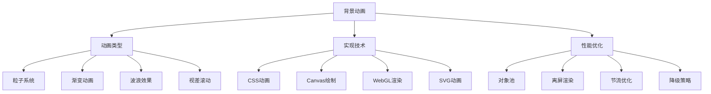

# 背景动画实现与使用

背景动画是现代网页设计中的重要元素，能够显著提升页面的视觉吸引力和用户体验。本文将介绍多种背景动画的实现方法，从简单的 CSS 动画到复杂的 JavaScript 粒子系统。

## 动画类型概览

### 常见背景动画类型

- **粒子系统**: 模拟粒子运动的动态效果
- **几何图形**: 移动的几何形状和图案
- **渐变动画**: 颜色渐变的流动效果
- **波浪效果**: 模拟水波或声波的动画
- **星空效果**: 闪烁的星星和流星效果
- **网格动画**: 动态的网格和连线效果

### 技术实现方式

- **CSS 动画**: 性能优异，适合简单效果
- **Canvas 绘制**: 灵活度高，适合复杂动画
- **WebGL**: 硬件加速，适合高性能需求
- **SVG 动画**: 矢量图形，适合几何动画

## 工作原理



## 实现演示

<demo react="react/BackgroundAnimation/index.tsx" 
:reactFiles="['react/BackgroundAnimation/index.tsx']" 
/>

## 核心实现方案

### 1. CSS 渐变动画

```css
/* 流动渐变背景 */
.gradient-animation {
	background: linear-gradient(-45deg, #ee7752, #e73c7e, #23a6d5, #23d5ab);
	background-size: 400% 400%;
	animation: gradient-shift 15s ease infinite;
}

@keyframes gradient-shift {
	0% {
		background-position: 0% 50%;
	}
	50% {
		background-position: 100% 50%;
	}
	100% {
		background-position: 0% 50%;
	}
}

/* 脉冲效果 */
.pulse-background {
	background: radial-gradient(circle, rgba(255, 255, 255, 0.1) 0%, transparent 70%);
	animation: pulse 2s ease-in-out infinite;
}

@keyframes pulse {
	0%,
	100% {
		transform: scale(1);
		opacity: 1;
	}
	50% {
		transform: scale(1.1);
		opacity: 0.7;
	}
}
```

### 2. 粒子系统实现

```typescript
interface Particle {
	x: number;
	y: number;
	vx: number;
	vy: number;
	size: number;
	color: string;
	opacity: number;
	life: number;
	maxLife: number;
}

class ParticleSystem {
	private canvas: HTMLCanvasElement;
	private ctx: CanvasRenderingContext2D;
	private particles: Particle[] = [];
	private animationId: number = 0;

	constructor(canvas: HTMLCanvasElement, private options: ParticleOptions = {}) {
		this.canvas = canvas;
		this.ctx = canvas.getContext('2d')!;
		this.resize();
		this.init();
	}

	private init() {
		// 创建初始粒子
		for (let i = 0; i < (this.options.count || 100); i++) {
			this.particles.push(this.createParticle());
		}

		this.animate();
	}

	private createParticle(): Particle {
		return {
			x: Math.random() * this.canvas.width,
			y: Math.random() * this.canvas.height,
			vx: (Math.random() - 0.5) * (this.options.speed || 2),
			vy: (Math.random() - 0.5) * (this.options.speed || 2),
			size: Math.random() * (this.options.maxSize || 5) + 1,
			color: this.options.color || '#ffffff',
			opacity: Math.random(),
			life: 0,
			maxLife: Math.random() * 200 + 100
		};
	}

	private updateParticle(particle: Particle) {
		// 更新位置
		particle.x += particle.vx;
		particle.y += particle.vy;

		// 更新生命周期
		particle.life++;
		particle.opacity = 1 - particle.life / particle.maxLife;

		// 边界检测
		if (particle.x < 0 || particle.x > this.canvas.width) {
			particle.vx *= -1;
		}
		if (particle.y < 0 || particle.y > this.canvas.height) {
			particle.vy *= -1;
		}

		// 重生粒子
		if (particle.life >= particle.maxLife) {
			Object.assign(particle, this.createParticle());
		}
	}

	private drawParticle(particle: Particle) {
		this.ctx.save();
		this.ctx.globalAlpha = particle.opacity;
		this.ctx.fillStyle = particle.color;
		this.ctx.beginPath();
		this.ctx.arc(particle.x, particle.y, particle.size, 0, Math.PI * 2);
		this.ctx.fill();
		this.ctx.restore();
	}

	private animate = () => {
		this.ctx.clearRect(0, 0, this.canvas.width, this.canvas.height);

		this.particles.forEach(particle => {
			this.updateParticle(particle);
			this.drawParticle(particle);
		});

		this.animationId = requestAnimationFrame(this.animate);
	};

	resize() {
		this.canvas.width = window.innerWidth;
		this.canvas.height = window.innerHeight;
	}

	destroy() {
		cancelAnimationFrame(this.animationId);
	}
}
```

### 3. 波浪效果实现

```typescript
class WaveAnimation {
	private canvas: HTMLCanvasElement;
	private ctx: CanvasRenderingContext2D;
	private waves: Wave[] = [];
	private animationId: number = 0;

	constructor(canvas: HTMLCanvasElement) {
		this.canvas = canvas;
		this.ctx = canvas.getContext('2d')!;
		this.init();
	}

	private init() {
		// 创建多层波浪
		this.waves = [
			{
				amplitude: 50,
				frequency: 0.01,
				phase: 0,
				speed: 0.02,
				color: 'rgba(74, 144, 226, 0.3)',
				offset: this.canvas.height * 0.7
			},
			{
				amplitude: 30,
				frequency: 0.015,
				phase: Math.PI,
				speed: 0.025,
				color: 'rgba(74, 144, 226, 0.5)',
				offset: this.canvas.height * 0.8
			},
			{
				amplitude: 20,
				frequency: 0.02,
				phase: Math.PI / 2,
				speed: 0.03,
				color: 'rgba(74, 144, 226, 0.7)',
				offset: this.canvas.height * 0.9
			}
		];

		this.animate();
	}

	private drawWave(wave: Wave) {
		this.ctx.beginPath();
		this.ctx.moveTo(0, this.canvas.height);

		for (let x = 0; x <= this.canvas.width; x++) {
			const y = wave.offset + Math.sin(x * wave.frequency + wave.phase) * wave.amplitude;
			this.ctx.lineTo(x, y);
		}

		this.ctx.lineTo(this.canvas.width, this.canvas.height);
		this.ctx.closePath();

		this.ctx.fillStyle = wave.color;
		this.ctx.fill();
	}

	private animate = () => {
		this.ctx.clearRect(0, 0, this.canvas.width, this.canvas.height);

		this.waves.forEach(wave => {
			wave.phase += wave.speed;
			this.drawWave(wave);
		});

		this.animationId = requestAnimationFrame(this.animate);
	};

	destroy() {
		cancelAnimationFrame(this.animationId);
	}
}
```

### 4. React Hook 封装

```typescript
interface BackgroundAnimationOptions {
	type: 'particles' | 'waves' | 'gradient';
	config?: any;
	enabled?: boolean;
}

const useBackgroundAnimation = (options: BackgroundAnimationOptions) => {
	const canvasRef = useRef<HTMLCanvasElement>(null);
	const animationRef = useRef<ParticleSystem | WaveAnimation | null>(null);

	useEffect(() => {
		if (!canvasRef.current || !options.enabled) return;

		const canvas = canvasRef.current;

		// 根据类型创建不同的动画
		switch (options.type) {
			case 'particles':
				animationRef.current = new ParticleSystem(canvas, options.config);
				break;
			case 'waves':
				animationRef.current = new WaveAnimation(canvas);
				break;
			default:
				break;
		}

		// 处理窗口大小变化
		const handleResize = () => {
			if (animationRef.current && 'resize' in animationRef.current) {
				animationRef.current.resize();
			}
		};

		window.addEventListener('resize', handleResize);

		return () => {
			window.removeEventListener('resize', handleResize);
			if (animationRef.current) {
				animationRef.current.destroy();
			}
		};
	}, [options.type, options.enabled]);

	return canvasRef;
};
```

## 高级效果

### 1. 交互式粒子

```typescript
class InteractiveParticles extends ParticleSystem {
	private mouse = { x: 0, y: 0 };
	private isMouseActive = false;

	constructor(canvas: HTMLCanvasElement, options: ParticleOptions) {
		super(canvas, options);
		this.bindEvents();
	}

	private bindEvents() {
		this.canvas.addEventListener('mousemove', this.handleMouseMove);
		this.canvas.addEventListener('mouseenter', () => (this.isMouseActive = true));
		this.canvas.addEventListener('mouseleave', () => (this.isMouseActive = false));
	}

	private handleMouseMove = (e: MouseEvent) => {
		const rect = this.canvas.getBoundingClientRect();
		this.mouse.x = e.clientX - rect.left;
		this.mouse.y = e.clientY - rect.top;
	};

	protected updateParticle(particle: Particle) {
		super.updateParticle(particle);

		if (this.isMouseActive) {
			// 计算粒子与鼠标的距离
			const dx = this.mouse.x - particle.x;
			const dy = this.mouse.y - particle.y;
			const distance = Math.sqrt(dx * dx + dy * dy);

			// 鼠标吸引效果
			if (distance < 100) {
				const force = (100 - distance) / 100;
				particle.vx += (dx / distance) * force * 0.1;
				particle.vy += (dy / distance) * force * 0.1;
			}
		}
	}
}
```

### 2. 音频可视化背景

```typescript
class AudioVisualizationBackground {
	private canvas: HTMLCanvasElement;
	private ctx: CanvasRenderingContext2D;
	private audioContext: AudioContext;
	private analyser: AnalyserNode;
	private dataArray: Uint8Array;

	constructor(canvas: HTMLCanvasElement, audioElement: HTMLAudioElement) {
		this.canvas = canvas;
		this.ctx = canvas.getContext('2d')!;
		this.setupAudio(audioElement);
	}

	private setupAudio(audioElement: HTMLAudioElement) {
		this.audioContext = new AudioContext();
		this.analyser = this.audioContext.createAnalyser();

		const source = this.audioContext.createMediaElementSource(audioElement);
		source.connect(this.analyser);
		this.analyser.connect(this.audioContext.destination);

		this.analyser.fftSize = 256;
		this.dataArray = new Uint8Array(this.analyser.frequencyBinCount);
	}

	private animate = () => {
		this.analyser.getByteFrequencyData(this.dataArray);

		this.ctx.clearRect(0, 0, this.canvas.width, this.canvas.height);

		// 根据音频数据绘制可视化效果
		const barWidth = this.canvas.width / this.dataArray.length;

		this.dataArray.forEach((value, index) => {
			const barHeight = (value / 255) * this.canvas.height;
			const hue = (index / this.dataArray.length) * 360;

			this.ctx.fillStyle = `hsla(${hue}, 70%, 50%, 0.8)`;
			this.ctx.fillRect(index * barWidth, this.canvas.height - barHeight, barWidth - 1, barHeight);
		});

		requestAnimationFrame(this.animate);
	};

	start() {
		this.animate();
	}
}
```

### 3. 3D 效果背景

```typescript
class ThreeDBackground {
	private canvas: HTMLCanvasElement;
	private ctx: CanvasRenderingContext2D;
	private cubes: Cube3D[] = [];
	private camera = { x: 0, y: 0, z: 500 };

	constructor(canvas: HTMLCanvasElement) {
		this.canvas = canvas;
		this.ctx = canvas.getContext('2d')!;
		this.init();
	}

	private init() {
		// 创建3D立方体
		for (let i = 0; i < 20; i++) {
			this.cubes.push({
				x: (Math.random() - 0.5) * 1000,
				y: (Math.random() - 0.5) * 1000,
				z: (Math.random() - 0.5) * 1000,
				rotationX: 0,
				rotationY: 0,
				rotationZ: 0,
				size: Math.random() * 50 + 20
			});
		}

		this.animate();
	}

	private project3D(x: number, y: number, z: number) {
		const scale = this.camera.z / (this.camera.z + z);
		return {
			x: (x - this.camera.x) * scale + this.canvas.width / 2,
			y: (y - this.camera.y) * scale + this.canvas.height / 2,
			scale
		};
	}

	private drawCube(cube: Cube3D) {
		const projected = this.project3D(cube.x, cube.y, cube.z);

		if (projected.scale > 0) {
			const size = cube.size * projected.scale;

			this.ctx.save();
			this.ctx.translate(projected.x, projected.y);
			this.ctx.rotate(cube.rotationY);

			// 绘制立方体的简化版本（正方形）
			this.ctx.fillStyle = `rgba(100, 150, 255, ${projected.scale})`;
			this.ctx.fillRect(-size / 2, -size / 2, size, size);

			this.ctx.restore();
		}
	}

	private animate = () => {
		this.ctx.clearRect(0, 0, this.canvas.width, this.canvas.height);

		this.cubes.forEach(cube => {
			cube.rotationY += 0.01;
			cube.z += 2;

			// 重置位置
			if (cube.z > this.camera.z) {
				cube.z = -500;
			}

			this.drawCube(cube);
		});

		requestAnimationFrame(this.animate);
	};
}
```

## 响应式设计

### 设备适配

```typescript
const useResponsiveAnimation = () => {
	const [deviceType, setDeviceType] = useState<'mobile' | 'tablet' | 'desktop'>('desktop');

	useEffect(() => {
		const updateDeviceType = () => {
			const width = window.innerWidth;
			if (width < 768) {
				setDeviceType('mobile');
			} else if (width < 1024) {
				setDeviceType('tablet');
			} else {
				setDeviceType('desktop');
			}
		};

		updateDeviceType();
		window.addEventListener('resize', updateDeviceType);

		return () => window.removeEventListener('resize', updateDeviceType);
	}, []);

	const getAnimationConfig = () => {
		switch (deviceType) {
			case 'mobile':
				return { particleCount: 30, animationSpeed: 0.5 };
			case 'tablet':
				return { particleCount: 60, animationSpeed: 0.75 };
			default:
				return { particleCount: 100, animationSpeed: 1 };
		}
	};

	return { deviceType, getAnimationConfig };
};
```

### 性能监控

```typescript
class PerformanceMonitor {
	private fps = 0;
	private lastTime = 0;
	private frameCount = 0;

	update() {
		this.frameCount++;
		const currentTime = performance.now();

		if (currentTime - this.lastTime >= 1000) {
			this.fps = this.frameCount;
			this.frameCount = 0;
			this.lastTime = currentTime;

			// 根据FPS调整动画质量
			if (this.fps < 30) {
				this.reduceQuality();
			} else if (this.fps > 55) {
				this.increaseQuality();
			}
		}
	}

	private reduceQuality() {
		// 减少粒子数量或降低动画复杂度
		console.log('Reducing animation quality due to low FPS');
	}

	private increaseQuality() {
		// 可以适当增加效果质量
		console.log('FPS is good, maintaining quality');
	}
}
```

## 性能优化

### 1. 对象池模式

```typescript
class ObjectPool<T> {
	private pool: T[] = [];
	private createFn: () => T;
	private resetFn: (obj: T) => void;

	constructor(createFn: () => T, resetFn: (obj: T) => void, initialSize = 10) {
		this.createFn = createFn;
		this.resetFn = resetFn;

		// 预创建对象
		for (let i = 0; i < initialSize; i++) {
			this.pool.push(this.createFn());
		}
	}

	get(): T {
		if (this.pool.length > 0) {
			return this.pool.pop()!;
		}
		return this.createFn();
	}

	release(obj: T) {
		this.resetFn(obj);
		this.pool.push(obj);
	}
}
```

### 2. 离屏渲染

```typescript
class OffscreenRenderer {
	private offscreenCanvas: HTMLCanvasElement;
	private offscreenCtx: CanvasRenderingContext2D;

	constructor(width: number, height: number) {
		this.offscreenCanvas = document.createElement('canvas');
		this.offscreenCanvas.width = width;
		this.offscreenCanvas.height = height;
		this.offscreenCtx = this.offscreenCanvas.getContext('2d')!;
	}

	renderToOffscreen(renderFn: (ctx: CanvasRenderingContext2D) => void) {
		this.offscreenCtx.clearRect(0, 0, this.offscreenCanvas.width, this.offscreenCanvas.height);
		renderFn(this.offscreenCtx);
	}

	drawToMainCanvas(mainCtx: CanvasRenderingContext2D, x = 0, y = 0) {
		mainCtx.drawImage(this.offscreenCanvas, x, y);
	}
}
```

## 故障排除

### 1. 动画卡顿问题

**问题**: 背景动画在某些设备上出现卡顿
**解决方案**:

- 使用 requestAnimationFrame 优化动画帧率
- 实现性能监控和自动降级
- 减少复杂计算和 DOM 操作

### 2. 内存泄漏问题

**问题**: 长时间运行后内存占用持续增加
**解决方案**:

- 正确清理动画循环和事件监听器
- 使用对象池管理粒子对象
- 定期检查和释放无用资源

### 3. 响应式适配问题

**问题**: 在不同屏幕尺寸下动画效果异常
**解决方案**:

- 实现响应式设计适配
- 根据设备类型调整动画参数
- 处理窗口大小变化事件

## 技术要点

### 1. Canvas 绘制优化

- 使用离屏 Canvas 提高绘制性能
- 合理使用 save/restore 减少状态切换开销
- 批量绘制相同元素以减少绘制调用

### 2. 动画性能监控

- 实时监控 FPS 并根据性能调整动画质量
- 使用 Performance API 分析性能瓶颈
- 实现自动降级策略保证用户体验

### 3. 内存管理

- 使用对象池避免频繁创建和销毁对象
- 及时清理无用的事件监听器和定时器
- 实现合理的资源回收机制

## 应用场景

### 1. 登录页面背景

```typescript
const LoginBackground = () => (
	<div className="login-container">
		<BackgroundAnimation
			type="particles"
			config={{
				count: 50,
				color: '#4a90e2',
				speed: 1
			}}
		/>
		<div className="login-form">{/* 登录表单 */}</div>
	</div>
);
```

### 2. 产品展示页

```typescript
const ProductShowcase = () => (
	<div className="showcase-container">
		<BackgroundAnimation
			type="waves"
			config={{
				colors: ['#ff6b6b', '#4ecdc4', '#45b7d1']
			}}
		/>
		<div className="product-content">{/* 产品内容 */}</div>
	</div>
);
```

### 3. 音乐播放器

```typescript
const MusicPlayer = ({ audioElement }) => (
	<div className="music-player">
		<AudioVisualizationBackground audioElement={audioElement} />
		<div className="player-controls">{/* 播放器控件 */}</div>
	</div>
);
```

## 最佳实践

### 设计原则

1. **性能优先**: 确保动画不影响页面主要功能
2. **用户控制**: 提供开启/关闭动画的选项
3. **可访问性**: 考虑动画敏感用户的需求
4. **电池友好**: 在移动设备上适当降低动画强度

### 实施建议

1. **渐进增强**: 从静态背景开始，逐步添加动画
2. **性能监控**: 实时监控 FPS 和内存使用
3. **降级策略**: 在低性能设备上自动降低质量
4. **用户偏好**: 尊重用户的动画偏好设置

---

_背景动画是提升用户体验的有效手段，但需要在视觉效果和性能之间找到平衡点。_ 🌟
