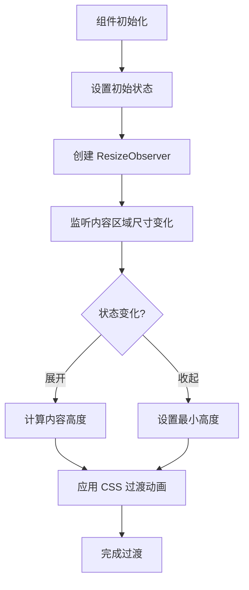

# SizeTransition 过渡效果

SizeTransition 是一个用于实现不固定高度 div 过渡效果的组件。它使用 ResizeObserver API 监听元素尺寸变化，并通过 CSS transition 属性实现平滑的高度过渡动画。

## 效果特点

- **平滑过渡**: 通过 CSS transition 实现流畅的高度变化动画
- **自动适配**: 使用 ResizeObserver 自动监听内容区域尺寸变化
- **灵活控制**: 提供展开、收起、切换方法供外部调用
- **响应式设计**: 适配不同屏幕尺寸和设备

## 工作原理

SizeTransition 组件的工作流程如下：



## Vue 版本实现

### 基础使用

<demo vue="vue/SizeTransition/example.vue" 
:vueFiles="['vue/SizeTransition/index.vue','vue/SizeTransition/example.vue']" 
/>

**核心原理**：

- 使用 ResizeObserver API 监听内容区域高度变化
- 通过 requestAnimationFrame 实现平滑的展开/收起动画
- 利用 CSS transition 属性实现过渡效果

**实现要点**：

1. 使用插槽（slot）放置可变高度内容
2. 通过 ref 获取内容区域 DOM 元素
3. 使用 ResizeObserver 监听尺寸变化并同步高度
4. 提供 expand、contract、toggle 方法控制状态

### 高级使用

```vue
<template>
	<SizeTransition ref="sizeTransitionRef" :min-height="20" :init-state="false">
		<div>可变高度的内容</div>
	</SizeTransition>

	<button @click="expand">展开</button>
	<button @click="contract">收起</button>
	<button @click="toggle">切换</button>
</template>

<script setup>
import { ref } from 'vue';
import SizeTransition from './SizeTransition/index.vue';

const sizeTransitionRef = ref(null);

const expand = () => {
	sizeTransitionRef.value.expand();
};

const contract = () => {
	sizeTransitionRef.value.contract();
};

const toggle = () => {
	sizeTransitionRef.value.toggle();
};
</script>
```

## React 版本实现

### 基础使用

<demo react="react/SizeTransition/example.tsx" 
:reactFiles="['react/SizeTransition/index.tsx','react/SizeTransition/example.tsx','react/SizeTransition/size-transition.scss']" 
/>

**核心原理**：

- 使用 useRef 获取 DOM 元素引用
- 使用 ResizeObserver API 监听元素尺寸变化
- 通过 useState 管理组件状态和高度值
- 使用 useImperativeHandle 暴露方法给父组件

**实现要点**：

1. 使用 forwardRef 转发 ref 引用
2. 在 useEffect 中初始化 ResizeObserver
3. 通过 requestAnimationFrame 实现平滑动画
4. 使用 CSS transition 实现过渡效果

### 高级使用

```jsx
import React, { useRef } from 'react';
import SizeTransition from './SizeTransition';

const MyComponent = () => {
	const sizeTransitionRef = useRef();

	const handleExpand = () => {
		sizeTransitionRef.current?.expand();
	};

	const handleContract = () => {
		sizeTransitionRef.current?.contract();
	};

	const handleToggle = () => {
		sizeTransitionRef.current?.toggle();
	};

	return (
		<div>
			<SizeTransition ref={sizeTransitionRef} minHeight={0} initState={true}>
				<div>可变高度的内容</div>
			</SizeTransition>

			<button onClick={handleExpand}>展开</button>
			<button onClick={handleContract}>收起</button>
			<button onClick={handleToggle}>切换</button>
		</div>
	);
};
```

## 技术对比

| 实现方式       | 优点               | 缺点               | 适用场景       |
| -------------- | ------------------ | ------------------ | -------------- |
| CSS + JS       | 简单易懂，兼容性好 | 功能相对简单       | 基础过渡效果   |
| ResizeObserver | 性能好，自动监听   | 需要 polyfill 兼容 | 现代浏览器项目 |
| 第三方库       | 功能完善，开箱即用 | 增加项目体积       | 快速开发需求   |

## API 说明

### Props

#### Vue 版本

| 属性名    | 类型    | 默认值 | 说明                                |
| --------- | ------- | ------ | ----------------------------------- |
| minHeight | Number  | 0      | 收起时的最小高度                    |
| initState | Boolean | true   | 初始状态，true 为展开，false 为收起 |

#### React 版本

| 属性名    | 类型      | 默认值 | 说明                                |
| --------- | --------- | ------ | ----------------------------------- |
| minHeight | number    | 0      | 收起时的最小高度                    |
| initState | boolean   | true   | 初始状态，true 为展开，false 为收起 |
| children  | ReactNode | -      | 内容区域                            |

### 方法

通过 ref 可以调用组件的以下方法：

- `expand()`: 展开内容
- `contract()`: 收起内容
- `toggle()`: 切换展开/收起状态

## 注意事项

1. **浏览器兼容性**: 该组件依赖 ResizeObserver API，对于较老的浏览器可能需要添加 polyfill
2. **性能优化**: 组件会自动监听内容区域的高度变化并更新过渡效果
3. **响应式设计**: 组件适配不同屏幕尺寸，确保在移动设备上也能正常工作

### 浏览器兼容性

对于不支持的浏览器，可以安装并使用 polyfill：

```bash
npm install @juggle/resize-observer
```

然后在项目的入口文件中添加：

```javascript
// 在 ResizeObserver 使用之前添加
if (!window.ResizeObserver) {
	window.ResizeObserver = require('@juggle/resize-observer').ResizeObserver;
}
```

或者使用动态导入：

```javascript
if (!window.ResizeObserver) {
	const { ResizeObserver } = await import('@juggle/resize-observer');
	window.ResizeObserver = ResizeObserver;
}
```

## 设计建议

### 用户体验

- **动画时长**: 保持 0.3s 的过渡时间，既不会太快也不会太慢
- **初始状态**: 根据内容重要性决定默认展开或收起
- **交互反馈**: 提供明确的展开/收起按钮，增强用户控制感

### 视觉设计

- **间距处理**: 合理设置内容区域的 padding，确保视觉舒适度
- **背景色**: 使用浅色背景突出内容区域
- **圆角设计**: 添加适当的 border-radius 提升视觉效果

### 性能优化

- **避免重排**: 使用 `transform` 而非改变布局属性
- **节流控制**: ResizeObserver 本身已优化性能，无需额外节流
- **内存管理**: 组件销毁时正确断开 ResizeObserver 连接

## 进阶应用

### 嵌套使用

- 支持多个 SizeTransition 组件嵌套使用
- 确保各层级动画协调一致

### 动态内容

- 适配动态加载的内容
- 支持异步数据更新后的高度调整

### 主题切换

- 支持明暗主题
- 动态调整样式和动画效果

## 性能分析

SizeTransition 组件的性能表现：


## 故障排除

常见问题及解决方案：

1. **过渡动画不平滑**：

   - 检查 CSS transition 属性是否正确设置
   - 确保内容区域没有复杂的重排操作

2. **高度计算不准确**：

   - 确保 ResizeObserver 正确监听内容区域
   - 检查内容是否包含异步加载的元素

3. **方法调用无效**：
   - 确保正确传递 ref 引用
   - 检查组件是否已正确挂载

---

_SizeTransition 过渡效果组件为不固定高度的内容区域提供了优雅的展开/收起动画，提升了用户界面的交互体验。_
