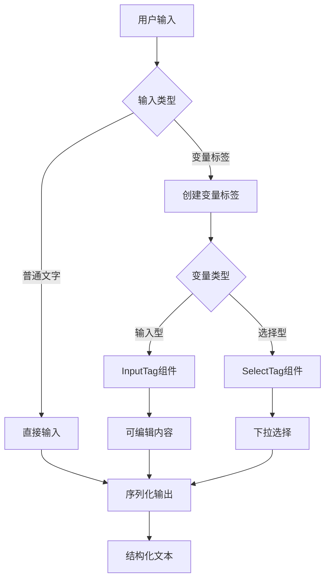
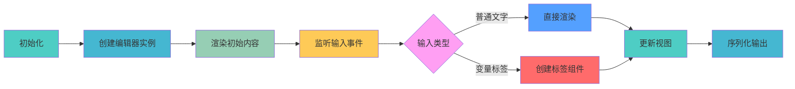

# Prompt 变量模板输入框

Prompt 变量模板输入框，支持混合输入（文字+模板变量），既保留了模板输入的优势，又保持了灵活的自由编辑能力。

## 效果特点

- **混合输入**: 支持文字与模板变量混合输入
- **动态模板**: 支持输入型变量和选择型变量
- **完整复制**: 模板内容可完整复制粘贴
- **结构化输出**: 提交时能生成包含用户所有选择/输入的完整结构化文本

## 工作原理

Prompt 变量模板输入框的工作流程如下：



## React 版本实现

### 基础使用

<demo react="react/PromptTemplate/example.tsx" 
:reactFiles="['react/PromptTemplate/index.tsx','react/PromptTemplate/example.tsx','react/PromptTemplate/index.scss']" 
/>

**核心原理**：

- 使用 slate-react 库实现富文本编辑器功能
- 通过自定义的 InputTag 和 SelectTag 组件实现可编辑的变量模板
- 利用 slate 的 inline 节点特性支持光标在变量标签内部和周围正确定位

**实现要点**：

1. 使用 Slate 组件作为编辑器容器
2. 通过 renderElement 函数处理不同类型的元素
3. 使用 InputTag 组件实现可输入的变量标签
4. 使用 SelectTag 组件实现下拉选择的变量标签
5. 通过 serializeToPlainText 函数将编辑器内容转换为纯文本

### 高级使用

<demo react="react/PromptTemplate/example.tsx" 
:reactFiles="['react/PromptTemplate/index.tsx','react/PromptTemplate/example.tsx','react/PromptTemplate/index.scss']" 
/>

```jsx
import React, { useRef } from 'react';
import PromptTemplate from './PromptTemplate';

const MyComponent = () => {
	const promptTemplateRef = useRef();

	const handleGetContent = () => {
		const content = promptTemplateRef.current?.getContent();
		console.log(content);
	};

	const handleSetContent = () => {
		const template = [
			{
				type: 'paragraph',
				children: [
					{ text: '请帮我写一篇关于' },
					{ type: 'input-tag', children: [{ text: '人工智能' }], label: '[主题]' },
					{ text: '的' },
					{
						type: 'select-tag',
						children: [{ text: '' }],
						value: '文章',
						options: [
							{ label: '文章', value: '文章' },
							{ label: '论文', value: '论文' },
							{ label: '报告', value: '报告' }
						]
					},
					{ text: '，要求字数在' },
					{ type: 'input-tag', children: [{ text: '1500' }], label: '[字数]' },
					{ text: '字左右。' }
				]
			}
		];
		promptTemplateRef.current?.setContent(template);
	};

	return (
		<div>
			<PromptTemplate ref={promptTemplateRef} />
			<button onClick={handleGetContent}>获取内容</button>
			<button onClick={handleSetContent}>设置模板</button>
		</div>
	);
};
```

## 技术对比

| 实现方式             | 优点                     | 缺点               | 适用场景       |
| -------------------- | ------------------------ | ------------------ | -------------- |
| 手搓 contenteditable | 自由度最高               | 坑多，维护成本高   | 特殊定制需求   |
| 富文本编辑器         | 功能完善                 | 体积大，学习成本高 | 复杂编辑场景   |
| slate.js             | 可定制性强，插件生态丰富 | 学习曲线陡峭       | 中等复杂度项目 |

## API 说明

### Props

| 属性名       | 类型   | 默认值                                          | 说明         |
| ------------ | ------ | ----------------------------------------------- | ------------ |
| placeholder  | string | '请输入 Prompt 模板'                            | 输入框占位符 |
| initialValue | Node[] | [{type: 'paragraph', children: [{ text: '' }]}] | 初始值       |

### 方法

通过 ref 可以调用组件的以下方法：

- `getContent()`: 获取编辑器内容（纯文本格式）
- `setContent(value: Node | Node[])`: 设置编辑器内容

## ⚠️ 注意事项

1. **浏览器兼容性**: 该组件依赖现代浏览器特性，对于较老的浏览器可能需要添加 polyfill
2. **性能优化**: 组件会自动监听内容区域的高度变化并更新过渡效果
3. **响应式设计**: 组件适配不同屏幕尺寸，确保在移动设备上也能正常工作

## 进阶应用

### 模板库

- 支持预设模板库快速插入
- 支持用户自定义模板保存

### 动态内容

- 适配动态加载的内容
- 支持异步数据更新后的高度调整

### 主题切换

- 支持明暗主题
- 动态调整样式和动画效果

## 性能分析

Prompt 变量模板输入框组件的性能表现：



## 故障排除

常见问题及解决方案：

1. **光标定位异常**：

   - 检查 slate 的 isInline 配置是否正确
   - 确保变量标签组件的 DOM 结构正确

2. **内容序列化不准确**：

   - 检查 serializeToPlainText 函数的实现
   - 确保所有元素类型都被正确处理

3. **方法调用无效**：
   - 确保正确传递 ref 引用
   - 检查组件是否已正确挂载
