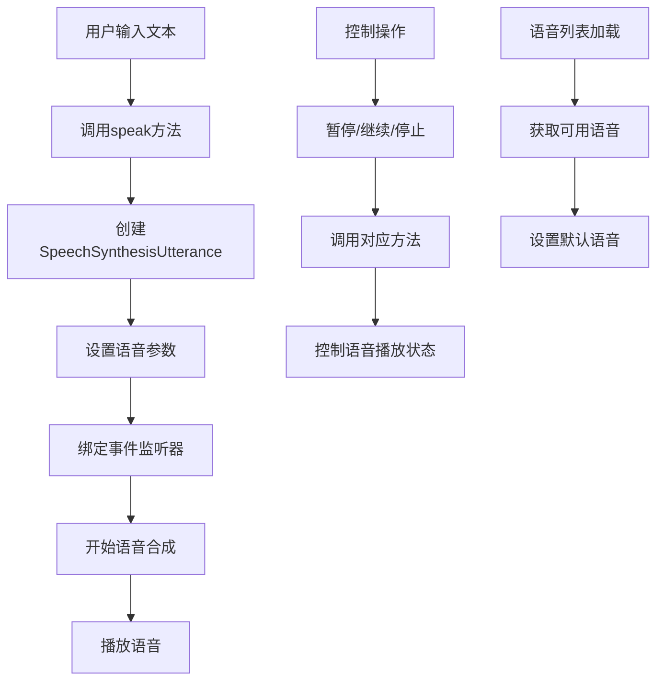
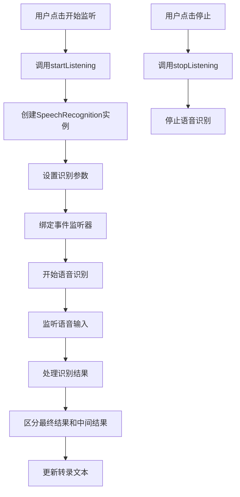
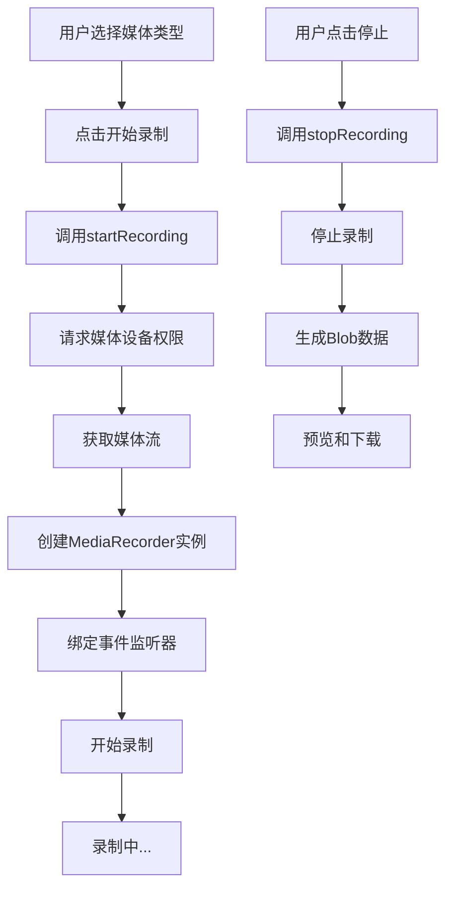

# 语音与媒体功能集成实现

## 简介

本文档介绍了如何在 React 应用中集成三种核心的语音与媒体功能：文字转语音(TTS)、语音转文字(STT)和媒体录制。这些功能基于浏览器原生 API 实现，包括 Web Speech API 和 MediaRecorder API，无需额外依赖第三方库。

## 功能模块一：文字转语音 (TTS)

### 技术原理

文字转语音(Text-To-Speech, TTS)功能基于 Web Speech API 中的 SpeechSynthesis 接口实现，允许将文本内容转换为自然语音播放。

### 核心组件

```tsx
// 文件路径: /example/components/react/SpeechMedia/hooks/useTextToSpeech.ts
import { useState, useEffect, useRef } from 'react';

// 定义语音类型
export interface Voice {
	name: string;
	lang: string;
	voiceURI: string;
	default: boolean;
}

// 定义 TTS 配置
export interface TTSConfig {
	rate: number;
	pitch: number;
	volume: number;
	voiceIndex?: number;
}

// 定义 Hook 返回类型
export interface UseTextToSpeechReturn {
	voices: Voice[];
	isSpeaking: boolean;
	isPaused: boolean;
	speak: (text: string, config?: TTSConfig) => void;
	pause: () => void;
	resume: () => void;
	stop: () => void;
	setVoice: (index: number) => void;
	status: 'idle' | 'speaking' | 'paused' | 'stopped';
}

const useTextToSpeech = (): UseTextToSpeechReturn => {
	const [voices, setVoices] = useState<Voice[]>([]);
	const [isSpeaking, setIsSpeaking] = useState(false);
	const [isPaused, setIsPaused] = useState(false);
	const [status, setStatus] = useState<'idle' | 'speaking' | 'paused' | 'stopped'>('idle');
	const [selectedVoiceIndex, setSelectedVoiceIndex] = useState<number>(0);

	const synthesisRef = useRef<SpeechSynthesis | null>(null);
	const utteranceRef = useRef<SpeechSynthesisUtterance | null>(null);

	// 初始化语音合成
	useEffect(() => {
		if (typeof window !== 'undefined' && 'speechSynthesis' in window) {
			synthesisRef.current = window.speechSynthesis;

			const loadVoices = () => {
				const availableVoices = synthesisRef.current!.getVoices();
				const formattedVoices = availableVoices.map(voice => ({
					name: voice.name,
					lang: voice.lang,
					voiceURI: voice.voiceURI,
					default: voice.default
				}));
				setVoices(formattedVoices);

				// 尝试选择中文语音
				const chineseVoiceIndex = formattedVoices.findIndex(
					voice => voice.lang.includes('zh') || voice.lang.includes('CN')
				);

				if (chineseVoiceIndex !== -1) {
					setSelectedVoiceIndex(chineseVoiceIndex);
				}
			};

			// 语音列表可能异步加载
			if (synthesisRef.current.getVoices().length > 0) {
				loadVoices();
			} else {
				synthesisRef.current.addEventListener('voiceschanged', loadVoices);
			}

			return () => {
				if (synthesisRef.current) {
					synthesisRef.current.cancel();
					synthesisRef.current.removeEventListener('voiceschanged', loadVoices);
				}
			};
		} else {
			console.warn('浏览器不支持语音合成功能');
		}
	}, []);

	// 播放语音 - 核心功能
	const speak = (text: string, config?: TTSConfig) => {
		if (!synthesisRef.current || !text) return;

		// 停止当前正在播放的语音
		stop();

		// 创建新的语音实例
		const utterance = new SpeechSynthesisUtterance(text);
		utterance.rate = config?.rate ?? 1;
		utterance.pitch = config?.pitch ?? 1;
		utterance.volume = config?.volume ?? 1;

		if (voices[config?.voiceIndex ?? selectedVoiceIndex]) {
			utterance.voice = synthesisRef.current.getVoices()[config?.voiceIndex ?? selectedVoiceIndex];
		}

		// 设置事件监听
		utterance.onstart = () => {
			setIsSpeaking(true);
			setIsPaused(false);
			setStatus('speaking');
		};

		utterance.onend = () => {
			setIsSpeaking(false);
			setIsPaused(false);
			setStatus('stopped');
		};

		utteranceRef.current = utterance;
		synthesisRef.current.speak(utterance);
	};

	// 暂停语音
	const pause = () => {
		if (synthesisRef.current && isSpeaking) {
			synthesisRef.current.pause();
			setIsPaused(true);
			setStatus('paused');
		}
	};

	// 继续播放
	const resume = () => {
		if (synthesisRef.current && isPaused) {
			synthesisRef.current.resume();
			setIsPaused(false);
			setStatus('speaking');
		}
	};

	// 停止播放
	const stop = () => {
		if (synthesisRef.current) {
			synthesisRef.current.cancel();
			setIsSpeaking(false);
			setIsPaused(false);
			setStatus('stopped');
		}
	};

	// 设置语音
	const setVoice = (index: number) => {
		if (index >= 0 && index < voices.length) {
			setSelectedVoiceIndex(index);
		}
	};

	return {
		voices,
		isSpeaking,
		isPaused,
		speak,
		pause,
		resume,
		stop,
		setVoice,
		status
	};
};

export default useTextToSpeech;
```

### 实现思路图



## 功能模块二：语音转文字 (STT)

### 技术原理

语音转文字(Speech-To-Text, STT)功能基于 Web Speech API 中的 SpeechRecognition 接口实现，允许将用户的语音输入实时转换为文本内容。

### 核心组件

```tsx
// 文件路径: /example/components/react/SpeechMedia/hooks/useSpeechToText.ts
import { useState, useEffect, useRef } from 'react';

// 定义识别结果类型
export interface SpeechRecognitionResult {
	transcript: string;
	confidence: number;
}

// 定义 Hook 返回类型
export interface UseSpeechToTextReturn {
	isListening: boolean;
	transcript: string;
	interimTranscript: string;
	isSupported: boolean;
	startListening: () => void;
	stopListening: () => void;
	resetTranscript: () => void;
	error: string | null;
}

const useSpeechToText = (): UseSpeechToTextReturn => {
	const [isListening, setIsListening] = useState(false);
	const [transcript, setTranscript] = useState('');
	const [interimTranscript, setInterimTranscript] = useState('');
	const [isSupported, setIsSupported] = useState(false);
	const [error, setError] = useState<string | null>(null);

	const recognitionRef = useRef<any>(null);

	// 初始化语音识别
	useEffect(() => {
		// 检查浏览器支持
		const SpeechRecognition =
			(window as any).SpeechRecognition || (window as any).webkitSpeechRecognition;

		if (SpeechRecognition) {
			setIsSupported(true);
			recognitionRef.current = new SpeechRecognition();
			recognitionRef.current.continuous = true;
			recognitionRef.current.interimResults = true;
			recognitionRef.current.lang = 'zh-CN';

			recognitionRef.current.onresult = (event: any) => {
				let interim = '';
				let final = '';

				for (let i = event.resultIndex; i < event.results.length; i++) {
					const transcript = event.results[i][0].transcript;
					if (event.results[i].isFinal) {
						final += transcript + ' ';
					} else {
						interim += transcript;
					}
				}

				if (final) {
					setTranscript(prev => prev + final);
				}

				setInterimTranscript(interim);
			};

			recognitionRef.current.onerror = (event: any) => {
				setError(event.error);
				setIsListening(false);
			};

			recognitionRef.current.onend = () => {
				setIsListening(false);
			};
		} else {
			setIsSupported(false);
			setError('浏览器不支持语音识别功能');
		}

		return () => {
			if (recognitionRef.current) {
				recognitionRef.current.stop();
			}
		};
	}, []);

	// 开始监听 - 核心功能
	const startListening = () => {
		if (recognitionRef.current && !isListening) {
			try {
				setInterimTranscript('');
				recognitionRef.current.start();
				setIsListening(true);
				setError(null);
			} catch (err) {
				setError('启动语音识别失败');
			}
		}
	};

	// 停止监听
	const stopListening = () => {
		if (recognitionRef.current && isListening) {
			recognitionRef.current.stop();
			setIsListening(false);
		}
	};

	// 重置转录内容
	const resetTranscript = () => {
		setTranscript('');
		setInterimTranscript('');
	};

	return {
		isListening,
		transcript,
		interimTranscript,
		isSupported,
		startListening,
		stopListening,
		resetTranscript,
		error
	};
};

export default useSpeechToText;
```

### 实现思路图



## 功能模块三：媒体录制

### 技术原理

媒体录制功能基于浏览器的 MediaRecorder API 实现，允许录制音频或视频内容，并将其保存为文件。

### 核心组件

```tsx
// 文件路径: /example/components/react/SpeechMedia/hooks/useMediaRecorder.ts
import { useState, useRef } from 'react';

// 定义媒体类型
export type MediaType = 'audio' | 'video';

// 定义 Hook 返回类型
export interface UseMediaRecorderReturn {
	isRecording: boolean;
	mediaBlob: Blob | null;
	startRecording: () => Promise<void>;
	stopRecording: () => void;
	resetRecording: () => void;
	error: string | null;
	isSupported: boolean;
}

const useMediaRecorder = (mediaType: MediaType = 'audio'): UseMediaRecorderReturn => {
	const [isRecording, setIsRecording] = useState(false);
	const [mediaBlob, setMediaBlob] = useState<Blob | null>(null);
	const [error, setError] = useState<string | null>(null);
	const [isSupported, setIsSupported] = useState(true);

	const mediaRecorderRef = useRef<MediaRecorder | null>(null);
	const mediaStreamRef = useRef<MediaStream | null>(null);
	const chunksRef = useRef<Blob[]>([]);

	// 检查浏览器支持
	const checkSupport = () => {
		if (!navigator.mediaDevices || !window.MediaRecorder) {
			setIsSupported(false);
			setError('浏览器不支持媒体录制功能');
			return false;
		}
		return true;
	};

	// 开始录制 - 核心功能
	const startRecording = async () => {
		if (!checkSupport()) return;

		try {
			// 获取媒体流
			const constraints = mediaType === 'audio' ? { audio: true } : { video: true, audio: true };

			const stream = await navigator.mediaDevices.getUserMedia(constraints);
			mediaStreamRef.current = stream;

			// 创建MediaRecorder实例
			const mediaRecorder = new MediaRecorder(stream);
			mediaRecorderRef.current = mediaRecorder;
			chunksRef.current = [];

			// 设置事件监听
			mediaRecorder.ondataavailable = event => {
				if (event.data.size > 0) {
					chunksRef.current.push(event.data);
				}
			};

			mediaRecorder.onstop = () => {
				const blob = new Blob(chunksRef.current, {
					type: mediaType === 'audio' ? 'audio/webm' : 'video/webm'
				});
				setMediaBlob(blob);
				setIsRecording(false);

				// 停止所有轨道
				stream.getTracks().forEach(track => track.stop());
			};

			mediaRecorder.onerror = event => {
				setError('录制过程中发生错误');
				setIsRecording(false);
			};

			// 开始录制
			mediaRecorder.start();
			setIsRecording(true);
			setError(null);
		} catch (err) {
			setError('获取媒体设备权限失败: ' + (err as Error).message);
			setIsRecording(false);
		}
	};

	// 停止录制
	const stopRecording = () => {
		if (mediaRecorderRef.current && isRecording) {
			mediaRecorderRef.current.stop();
		}
	};

	// 重置录制
	const resetRecording = () => {
		setMediaBlob(null);
		setError(null);
		chunksRef.current = [];

		// 如果还在录制中，先停止
		if (mediaRecorderRef.current && isRecording) {
			mediaRecorderRef.current.stop();
		}
	};

	return {
		isRecording,
		mediaBlob,
		startRecording,
		stopRecording,
		resetRecording,
		error,
		isSupported
	};
};

export default useMediaRecorder;
```

### 实现思路图



## 集成示例

### 主组件实现

```tsx
// 文件路径: /example/components/react/SpeechMedia/index.tsx
import React, { useState } from 'react';
import useTextToSpeech, { Voice } from './hooks/useTextToSpeech';
import useSpeechToText from './hooks/useSpeechToText';
import useMediaRecorder from './hooks/useMediaRecorder';
import './speech-media.scss';

const SpeechMediaExample: React.FC = () => {
	const [activeTab, setActiveTab] = useState<'tts' | 'stt' | 'recorder'>('tts');

	// TTS相关状态
	const [ttsText, setTtsText] = useState(
		'欢迎使用语音功能集成示例！这个示例展示了文字转语音、语音转文字和媒体录制功能。'
	);
	const [ttsRate, setTtsRate] = useState(1);
	const [ttsPitch, setTtsPitch] = useState(1);
	const [ttsVolume, setTtsVolume] = useState(1);

	const {
		voices,
		isSpeaking,
		isPaused,
		speak: ttsSpeak,
		pause: ttsPause,
		resume: ttsResume,
		stop: ttsStop,
		setVoice: ttsSetVoice,
		status: ttsStatus
	} = useTextToSpeech();

	// STT相关状态
	const {
		isListening,
		transcript: sttTranscript,
		interimTranscript: sttInterimTranscript,
		isSupported: sttIsSupported,
		startListening: sttStartListening,
		stopListening: sttStopListening,
		resetTranscript: sttResetTranscript,
		error: sttError
	} = useSpeechToText();

	// MediaRecorder相关状态
	const [mediaType, setMediaType] = useState<'audio' | 'video'>('audio');

	const {
		isRecording,
		mediaBlob,
		startRecording: mediaStartRecording,
		stopRecording: mediaStopRecording,
		resetRecording: mediaResetRecording,
		error: mediaError,
		isSupported: mediaIsSupported
	} = useMediaRecorder(mediaType);

	const handleTtsSpeak = () => {
		ttsSpeak(ttsText, { rate: ttsRate, pitch: ttsPitch, volume: ttsVolume });
	};

	const handleMediaStartRecording = async () => {
		try {
			await mediaStartRecording();
		} catch (err) {
			console.error('开始录制失败:', err);
		}
	};

	// 核心渲染结构
	return (
		<div className="speech-media-container">
			<h1>语音功能集成示例</h1>
			<p className="description">集成文字转语音、语音转文字和媒体录制功能</p>

			{/* 标签页导航 */}
			<div className="tab-navigation">
				<button className={activeTab === 'tts' ? 'active' : ''} onClick={() => setActiveTab('tts')}>
					文字转语音
				</button>
				<button
					className={activeTab === 'stt' ? 'active' : ''}
					onClick={() => setActiveTab('stt')}
					disabled={!sttIsSupported}
				>
					语音转文字
				</button>
				<button
					className={activeTab === 'recorder' ? 'active' : ''}
					onClick={() => setActiveTab('recorder')}
					disabled={!mediaIsSupported}
				>
					媒体录制
				</button>
			</div>

			{/* 文字转语音模块 */}
			{activeTab === 'tts' && (
				<div className="tab-content tts-tab">
					<h2>文字转语音 (TTS)</h2>
					{/* TTS功能UI */}
				</div>
			)}

			{/* 语音转文字模块 */}
			{activeTab === 'stt' && sttIsSupported && (
				<div className="tab-content stt-tab">
					<h2>语音转文字 (STT)</h2>
					{/* STT功能UI */}
				</div>
			)}

			{/* 媒体录制模块 */}
			{activeTab === 'recorder' && mediaIsSupported && (
				<div className="tab-content recorder-tab">
					<h2>媒体录制</h2>
					{/* MediaRecorder功能UI */}
				</div>
			)}
		</div>
	);
};

export default SpeechMediaExample;
```

### 示例组件

```tsx
// 文件路径: /example/components/react/SpeechMedia/example.tsx
import React from 'react';
import SpeechMediaExample from './index';

const SpeechMediaDemo: React.FC = () => {
	return (
		<div style={{ padding: '20px', backgroundColor: '#f5f7fa', minHeight: '100vh' }}>
			<SpeechMediaExample />
		</div>
	);
};

export default SpeechMediaDemo;
```

### 样式文件

```scss
// 文件路径: /example/components/react/SpeechMedia/speech-media.scss
.speech-media-container {
	max-width: 800px;
	margin: 0 auto;
	background: white;
	border-radius: 10px;
	box-shadow: 0 10px 30px rgba(0, 0, 0, 0.1);
	padding: 30px;
	font-family: 'Segoe UI', Tahoma, Geneva, Verdana, sans-serif;
	line-height: 1.6;
	color: #333;

	h1 {
		text-align: center;
		margin-bottom: 20px;
		color: #2c3e50;
	}

	h2 {
		margin-top: 0;
		color: #2c3e50;
		border-bottom: 2px solid #eee;
		padding-bottom: 10px;
	}

	.description {
		text-align: center;
		margin-bottom: 30px;
		color: #7f8c8d;
	}

	.tab-navigation {
		display: flex;
		gap: 10px;
		margin-bottom: 30px;
		border-bottom: 1px solid #eee;
		padding-bottom: 10px;

		button {
			padding: 10px 20px;
			border: none;
			background: #f8f9fa;
			border-radius: 5px 5px 0 0;
			cursor: pointer;
			font-weight: 500;
			transition: all 0.3s;

			&.active {
				background: #3498db;
				color: white;
			}

			&:disabled {
				background: #ecf0f1;
				color: #bdc3c7;
				cursor: not-allowed;
			}

			&:not(:disabled):not(.active):hover {
				background: #e9ecef;
			}
		}
	}

	.tab-content {
		min-height: 400px;
	}

	/* TTS 样式 */
	.input-section {
		margin-bottom: 25px;

		textarea {
			width: 100%;
			min-height: 120px;
			padding: 15px;
			border: 1px solid #ddd;
			border-radius: 5px;
			font-size: 16px;
			resize: vertical;
			transition: border-color 0.3s;

			&:focus {
				outline: none;
				border-color: #3498db;
				box-shadow: 0 0 0 2px rgba(52, 152, 219, 0.2);
			}
		}
	}

	.controls {
		display: grid;
		grid-template-columns: repeat(auto-fit, minmax(200px, 1fr));
		gap: 15px;
		margin-bottom: 25px;
	}

	.control-group {
		margin-bottom: 15px;

		label {
			display: block;
			margin-bottom: 5px;
			font-weight: 500;
			color: #2c3e50;
		}

		input[type='range'] {
			width: 100%;
		}

		select {
			width: 100%;
			padding: 8px;
			border: 1px solid #ddd;
			border-radius: 5px;
			background: white;
		}
	}

	.value-display {
		font-size: 14px;
		color: #7f8c8d;
		text-align: right;
	}

	/* STT 样式 */
	.transcript-section {
		margin-bottom: 25px;

		.transcript-display {
			min-height: 150px;
			padding: 20px;
			border: 1px solid #ddd;
			border-radius: 5px;
			background-color: #f8f9fa;
			font-size: 18px;
			line-height: 1.6;

			.final-transcript {
				color: #333;
			}

			.interim-transcript {
				color: #666;
				font-style: italic;
			}
		}
	}

	/* MediaRecorder 样式 */
	.media-type-selector {
		display: flex;
		gap: 20px;
		margin-bottom: 25px;

		label {
			display: flex;
			align-items: center;
			gap: 5px;
			font-size: 16px;
			cursor: pointer;

			input[type='radio'] {
				margin: 0;
			}
		}
	}

	.recording-controls {
		display: flex;
		gap: 10px;
		flex-wrap: wrap;
		margin-bottom: 30px;
	}

	.media-preview {
		margin: 25px 0;
		text-align: center;

		h3 {
			margin-bottom: 15px;
			color: #2c3e50;
		}

		audio,
		video {
			width: 100%;
			max-width: 500px;
			margin: 0 auto;
			display: block;
		}
	}

	/* 通用按钮样式 */
	.button-group {
		display: flex;
		gap: 10px;
		flex-wrap: wrap;
		margin-bottom: 20px;
	}

	button {
		padding: 12px 20px;
		border: none;
		border-radius: 5px;
		cursor: pointer;
		font-size: 16px;
		font-weight: 500;
		transition: all 0.3s;

		&:disabled {
			background: #95a5a6;
			cursor: not-allowed;
		}
	}

	.btn-start {
		background: #2ecc71;
		color: white;

		&:hover:not(:disabled) {
			background: #27ae60;
		}
	}

	.btn-listening {
		background: #e74c3c;
		color: white;
		animation: pulse 1.5s infinite;

		&:hover:not(:disabled) {
			background: #c0392b;
		}
	}

	.btn-recording {
		background: #e74c3c;
		color: white;
		animation: pulse 1.5s infinite;

		&:hover:not(:disabled) {
			background: #c0392b;
		}
	}

	.btn-play {
		background: #2ecc71;
		color: white;

		&:hover:not(:disabled) {
			background: #27ae60;
		}
	}

	.btn-pause {
		background: #f39c12;
		color: white;

		&:hover:not(:disabled) {
			background: #d35400;
		}
	}

	.btn-resume {
		background: #3498db;
		color: white;

		&:hover:not(:disabled) {
			background: #2980b9;
		}
	}

	.btn-stop {
		background: #e74c3c;
		color: white;

		&:hover:not(:disabled) {
			background: #c0392b;
		}
	}

	.btn-reset {
		background: #3498db;
		color: white;

		&:hover:not(:disabled) {
			background: #2980b9;
		}
	}

	.btn-download {
		background: #9b59b6;
		color: white;
		margin-top: 15px;

		&:hover:not(:disabled) {
			background: #8e44ad;
		}
	}

	.error-message {
		padding: 15px;
		border-radius: 5px;
		background: rgba(231, 76, 60, 0.1);
		color: #c0392b;
		text-align: center;
		margin-bottom: 20px;
	}

	.status {
		text-align: center;
		padding: 15px;
		border-radius: 5px;
		background: #f8f9fa;
		margin-bottom: 20px;

		&.speaking {
			background: rgba(46, 204, 113, 0.1);
			color: #27ae60;
		}

		&.paused {
			background: rgba(243, 156, 18, 0.1);
			color: #d35400;
		}

		&.stopped,
		&.idle {
			background: rgba(231, 76, 60, 0.1);
			color: #c0392b;
		}
	}

	footer {
		margin-top: 30px;
		text-align: center;
		color: #7f8c8d;
		font-size: 14px;
		border-top: 1px solid #eee;
		padding-top: 20px;
	}
}
```

## 最佳实践

### 使用注意事项

1. **权限请求**: 媒体录制功能需要用户授权访问麦克风或摄像头
2. **HTTPS 要求**: 大多数浏览器要求在 HTTPS 环境下使用这些 API
3. **用户交互**: 某些 API 需要在用户交互（如点击按钮）后才能调用
4. **错误处理**: 应该妥善处理各种错误情况，如权限拒绝、设备不可用等

### 性能优化建议

1. **资源释放**: 及时释放媒体流资源，避免内存泄漏
2. **状态管理**: 合理管理组件状态，避免不必要的重渲染
3. **用户体验**: 提供清晰的状态反馈和加载提示

## React 组件实现

### 语音功能集成组件

<demo react="react/SpeechMedia/example.tsx"
:reactFiles="['react/SpeechMedia/example.tsx', 'react/SpeechMedia/index.tsx', 'react/SpeechMedia/hooks/useTextToSpeech.ts', 'react/SpeechMedia/hooks/useSpeechToText.ts', 'react/SpeechMedia/hooks/useMediaRecorder.ts']"
/>

## 总结

本文档详细介绍了如何在 React 应用中集成文字转语音、语音转文字和媒体录制三种核心的语音与媒体功能。通过使用浏览器原生 API，我们能够实现这些功能而无需引入额外的第三方库，从而减少项目的依赖和体积。

集成示例通过标签页导航的方式将三个功能整合在一个界面中，提供了良好的用户体验。每个功能都封装在独立的自定义 Hook 中，便于复用和维护。

通过遵循文档中的最佳实践和注意事项，开发者可以快速将这些功能集成到自己的项目中，并根据具体需求进行定制化开发.

```scss
@keyframes pulse {
	0% {
		transform: scale(1);
	}

	50% {
		transform: scale(1.05);
	}

	100% {
		transform: scale(1);
	}
}
```
