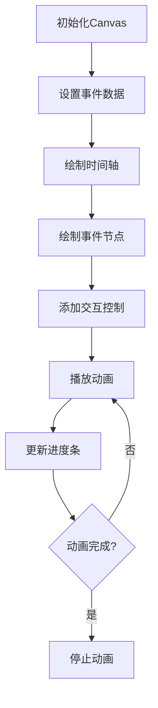

# Canvas 事件流程图

## 简介

Canvas 事件流程图是一个使用 HTML5 Canvas 实现的高颜值事件流程图，展示从**起飞**到**降落**的完整飞行事件时间线。该组件包含播放 / 暂停 / 重置动画控制功能，具有良好的交互性和视觉效果。

## 效果演示

<demo react="react/Canvas/FlightEventFlowchartExample.tsx" 
:reactFiles="['react/Canvas/FlightEventFlowchartExample.tsx', 'react/Canvas/FlightEventFlowchart.tsx']" />

## 流程图说明



核心逻辑说明：

1. 初始化 Canvas 并设置事件数据
2. 绘制时间轴和箭头
3. 根据事件数据绘制节点、连接线和文本标签
4. 添加播放、暂停、重置控制按钮
5. 实现动画播放功能，动态更新进度条和节点颜色
6. 动画循环播放直到完成

## 参数说明

| 参数名         | 类型   | 默认值 | 说明          |
| -------------- | ------ | ------ | ------------- |
| containerWidth | number | 500    | 容器宽度 (px) |

## 核心实现

### TSX 组件代码

```tsx
import React, { useEffect, useRef, useState } from 'react';

interface FlightEvent {
	time: string;
	event: string;
	position: number;
}

interface FlightEventFlowchartProps {
	containerWidth?: number;
}

const FlightEventFlowchart: React.FC<FlightEventFlowchartProps> = ({ containerWidth = 500 }) => {
	const canvasRef = useRef<HTMLCanvasElement>(null);
	const [isAnimating, setIsAnimating] = useState(false);
	const [animationProgress, setAnimationProgress] = useState(0);
	const animationIdRef = useRef<number | null>(null);

	// 初始化事件数据
	const events: FlightEvent[] = [
		{ time: '2025-09-12 11:40', event: '起飞', position: 0.05 },
		{ time: '2025-09-12 11:42', event: '转弯', position: 0.15 }
		// ...更多事件数据
	];

	// 设置Canvas尺寸
	const resizeCanvas = () => {
		if (canvasRef.current) {
			const canvas = canvasRef.current;
			canvas.width = canvas.offsetWidth;
			canvas.height = canvas.offsetHeight;
			drawFlowchart();
		}
	};

	// 绘制流程图
	const drawFlowchart = () => {
		if (!canvasRef.current) return;

		const canvas = canvasRef.current;
		const ctx = canvas.getContext('2d');
		if (!ctx) return;

		const width = canvas.width;
		const height = canvas.height;
		const timelineY = height / 2;
		const nodeRadius = 12;

		// 清除画布
		ctx.clearRect(0, 0, width, height);

		// 绘制时间轴
		ctx.beginPath();
		ctx.moveTo(width * 0.05, timelineY);
		ctx.lineTo(width * 0.95, timelineY);
		ctx.strokeStyle = '#667eea';
		ctx.lineWidth = 3;
		ctx.stroke();

		// 绘制箭头
		ctx.beginPath();
		ctx.moveTo(width * 0.95, timelineY);
		ctx.lineTo(width * 0.93, timelineY - 8);
		ctx.lineTo(width * 0.93, timelineY + 8);
		ctx.closePath();
		ctx.fillStyle = '#667eea';
		ctx.fill();

		// 绘制事件节点和标签
		events.forEach((ev, index) => {
			const x = width * ev.position;
			const isEven = index % 2 === 0;
			const nodeY = isEven ? timelineY - 50 : timelineY + 50;

			// 绘制连接线
			ctx.beginPath();
			ctx.moveTo(x, timelineY);
			ctx.lineTo(x, nodeY);
			ctx.strokeStyle = '#adb5bd';
			ctx.lineWidth = 1.5;
			ctx.setLineDash([5, 3]);
			ctx.stroke();
			ctx.setLineDash([]);

			// 绘制节点
			ctx.beginPath();
			ctx.arc(x, nodeY, nodeRadius, 0, Math.PI * 2);
			ctx.fillStyle = isAnimating && animationProgress >= ev.position ? '#F2050A' : '#667eea';
			ctx.fill();
			ctx.strokeStyle = 'white';
			ctx.lineWidth = 2;
			ctx.stroke();

			// 绘制事件文本
			ctx.font = '14px Segoe UI, sans-serif';
			ctx.textAlign = 'center';
			ctx.textBaseline = 'middle';
			ctx.fillStyle = '#495057';
			ctx.fillText(ev.event, x, nodeY + (isEven ? -30 : 30));

			// 绘制时间文本
			ctx.font = '12px Segoe UI, sans-serif';
			ctx.fillStyle = '#6c757d';
			ctx.fillText(ev.time, x, nodeY + (isEven ? -50 : 50));
		});

		// 绘制动画进度
		if (isAnimating) {
			ctx.beginPath();
			ctx.moveTo(width * 0.05, timelineY);
			ctx.lineTo(width * animationProgress, timelineY);
			ctx.strokeStyle = '#F2050A';
			ctx.lineWidth = 4;
			ctx.stroke();
		}
	};

	// 动画函数
	const animate = () => {
		setAnimationProgress(prev => {
			if (prev < 0.95) {
				const newProgress = prev + 0.005;
				return newProgress;
			} else {
				setIsAnimating(false);
				return prev;
			}
		});

		if (animationProgress < 0.95) {
			animationIdRef.current = requestAnimationFrame(animate);
		}
	};

	// 播放动画
	const playAnimation = () => {
		if (!isAnimating) {
			setIsAnimating(true);
			animationIdRef.current = requestAnimationFrame(animate);
		}
	};

	// 暂停动画
	const pauseAnimation = () => {
		if (isAnimating && animationIdRef.current) {
			cancelAnimationFrame(animationIdRef.current);
			setIsAnimating(false);
		}
	};

	// 重置视图
	const resetView = () => {
		if (isAnimating && animationIdRef.current) {
			cancelAnimationFrame(animationIdRef.current);
		}
		setIsAnimating(false);
		setAnimationProgress(0);
	};

	// 初始化和响应式调整
	useEffect(() => {
		resizeCanvas();
		window.addEventListener('resize', resizeCanvas);

		return () => {
			window.removeEventListener('resize', resizeCanvas);
			if (animationIdRef.current) {
				cancelAnimationFrame(animationIdRef.current);
			}
		};
	}, []);

	// 监听动画进度变化并重新绘制
	useEffect(() => {
		drawFlowchart();
	}, [animationProgress, isAnimating]);

	return (
		<div className="flight-event-flowchart" style={{ width: containerWidth }}>
			<div className="canvas-container">
				<canvas ref={canvasRef} style={{ width: '100%', height: '400px' }}></canvas>
			</div>

			<div className="controls">
				<button onClick={playAnimation}>播放动画</button>
				<button onClick={pauseAnimation}>暂停动画</button>
				<button onClick={resetView}>重置视图</button>
			</div>
		</div>
	);
};

export default FlightEventFlowchart;
```

## 实现原理

### 1. Canvas 初始化

通过 useRef 获取 Canvas 元素引用，并在 useEffect 中初始化尺寸和事件监听器：

```tsx
const canvasRef = useRef<HTMLCanvasElement>(null);

useEffect(() => {
	resizeCanvas();
	window.addEventListener('resize', resizeCanvas);

	return () => {
		window.removeEventListener('resize', resizeCanvas);
	};
}, []);
```

### 2. 数据结构设计

事件数据采用数组形式存储，每个事件包含时间、事件名称和在时间轴上的位置比例：

```tsx
const events: FlightEvent[] = [
	{ time: '2025-09-12 11:40', event: '起飞', position: 0.05 },
	{ time: '2025-09-12 11:42', event: '转弯', position: 0.15 }
	// ...更多事件
];
```

### 3. 绘图逻辑

绘图函数 drawFlowchart 负责绘制所有视觉元素：

1. 清除画布
2. 绘制时间轴和箭头
3. 遍历事件数据绘制节点、连接线和文本
4. 根据动画进度绘制进度条

### 4. 动画控制

通过 requestAnimationFrame 实现流畅动画效果：

```tsx
const animate = () => {
	setAnimationProgress(prev => {
		if (prev < 0.95) {
			const newProgress = prev + 0.005;
			return newProgress;
		} else {
			setIsAnimating(false);
			return prev;
		}
	});

	if (animationProgress < 0.95) {
		animationIdRef.current = requestAnimationFrame(animate);
	}
};
```

## 使用说明

### 基本使用

```tsx
import FlightEventFlowchart from './Canvas/FlightEventFlowchart';

function App() {
	return (
		<div style={{ width: '500px' }}>
			<FlightEventFlowchart />
		</div>
	);
}
```

### 自定义配置

```tsx
import FlightEventFlowchart from './Canvas/FlightEventFlowchart';

function App() {
	return (
		<div style={{ width: '600px' }}>
			<FlightEventFlowchart containerWidth={600} />
		</div>
	);
}
```

## 优化建议

### 1. 性能优化

- 使用 requestAnimationFrame 实现流畅动画
- 合理控制动画帧率，避免过度消耗 CPU 资源
- 在组件卸载时正确清理事件监听器和动画帧

### 2. 响应式设计

```css
@media (max-width: 768px) {
	.canvas-container {
		height: 300px;
	}
}
```

## 结语

Canvas 事件流程图通过 HTML5 Canvas 技术实现了高颜值的事件流程可视化效果。该组件展示了 Canvas 在数据可视化方面的强大能力，通过动画和交互控制提升了用户体验。通过合理的优化和自定义配置，可以将其应用于各种场景，如项目进度展示、用户行为分析等。
