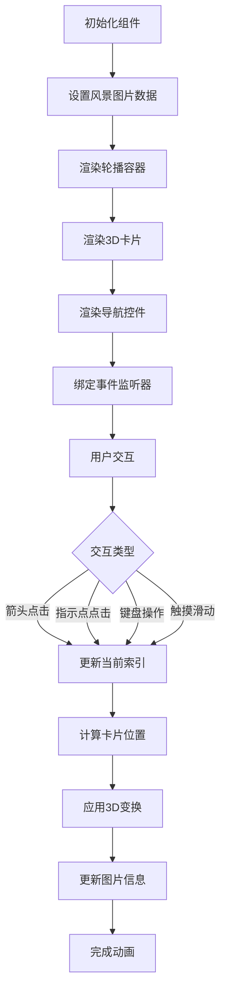

# 3D 风景图片轮播

## 简介

3D 风景图片轮播是一个具有 3D 效果的风景图片展示组件，支持多种交互方式切换图片。该组件通过 CSS 3D 变换和过渡效果，创造出具有深度感的视觉体验。

## 效果演示

<demo react="react/effects/TeamMemberCarousel/example.tsx" 
:reactFiles="['react/effects/TeamMemberCarousel/example.tsx', 'react/effects/TeamMemberCarousel/index.tsx','react/effects/TeamMemberCarousel/index.scss']" />

## 流程图说明



核心逻辑说明：

1. 初始化组件并设置风景图片数据
2. 渲染轮播容器、3D 卡片和导航控件
3. 绑定事件监听器（箭头点击、指示点点击、键盘操作、触摸滑动）
4. 用户交互时更新当前索引
5. 根据当前索引计算每个卡片的位置和 3D 变换
6. 应用 CSS 类名控制卡片的显示状态
7. 更新图片信息显示
8. 动画完成后重置状态

## 参数说明

| 参数名         | 类型                | 默认值       | 说明            |
| -------------- | ------------------- | ------------ | --------------- |
| members        | Scenery[]           | 6 个默认图片 | 风景图片数组    |
| containerWidth | number              | 500          | 容器宽度 (px)   |
| className      | string              | ''           | 自定义 CSS 类名 |
| style          | React.CSSProperties | {}           | 自定义内联样式  |

Scenery 接口定义：

```typescript
interface Scenery {
	name: string; // 图片名称
	role: string; // 图片类型
	imageUrl: string; // 图片URL
	imageAlt: string; // 图片alt属性
}
```

## 核心实现

### TSX 组件代码

```tsx
import React, { useState, useEffect, useCallback } from 'react';
import './index.scss';

interface Scenery {
	name: string;
	role: string;
	imageUrl: string;
	imageAlt: string;
}

interface TeamMemberCarouselProps {
	members?: Scenery[];
	containerWidth?: number;
	className?: string;
	style?: React.CSSProperties;
}

const TeamMemberCarousel: React.FC<TeamMemberCarouselProps> = ({
	members = [
		{
			name: '山川湖泊',
			role: '自然风光',
			imageUrl:
				'https://images.unsplash.com/photo-1506744038136-46273834b3fb?q=80&w=3870&auto=format&fit=crop&ixlib=rb-4.0.3&ixid=M3wxMjA3fDB8MHxwaG90by1wYWdlfHx8fGVufDB8fHx8fA%3D%3D',
			imageAlt: '山川湖泊风景'
		}
		// ...更多图片
	],
	containerWidth = 500,
	className = '',
	style = {}
}) => {
	const [currentIndex, setCurrentIndex] = useState(0);
	const [isAnimating, setIsAnimating] = useState(false);

	// 更新轮播位置
	const updateCarousel = useCallback(
		(newIndex: number) => {
			if (isAnimating) return;
			setIsAnimating(true);

			// 确保索引在有效范围内
			const validIndex = (newIndex + members.length) % members.length;
			setCurrentIndex(validIndex);

			// 动画结束后重置状态
			setTimeout(() => {
				setIsAnimating(false);
			}, 800);
		},
		[isAnimating, members.length]
	);

	// 前一个图片
	const prevMember = () => {
		updateCarousel(currentIndex - 1);
	};

	// 下一个图片
	const nextMember = () => {
		updateCarousel(currentIndex + 1);
	};

	// 跳转到指定图片
	const goToMember = (index: number) => {
		updateCarousel(index);
	};

	// 键盘事件处理
	useEffect(() => {
		const handleKeyDown = (e: KeyboardEvent) => {
			if (e.key === 'ArrowLeft') {
				prevMember();
			} else if (e.key === 'ArrowRight') {
				nextMember();
			}
		};

		document.addEventListener('keydown', handleKeyDown);
		return () => {
			document.removeEventListener('keydown', handleKeyDown);
		};
	}, [currentIndex, isAnimating]);

	// 触摸事件处理
	useEffect(() => {
		let touchStartX = 0;
		let touchEndX = 0;

		const handleTouchStart = (e: TouchEvent) => {
			touchStartX = e.changedTouches[0].screenX;
		};

		const handleTouchEnd = (e: TouchEvent) => {
			touchEndX = e.changedTouches[0].screenX;
			handleSwipe();
		};

		const handleSwipe = () => {
			const swipeThreshold = 50;
			const diff = touchStartX - touchEndX;

			if (Math.abs(diff) > swipeThreshold) {
				if (diff > 0) {
					nextMember();
				} else {
					prevMember();
				}
			}
		};

		document.addEventListener('touchstart', handleTouchStart);
		document.addEventListener('touchend', handleTouchEnd);

		return () => {
			document.removeEventListener('touchstart', handleTouchStart);
			document.removeEventListener('touchend', handleTouchEnd);
		};
	}, [currentIndex, isAnimating]);

	// 获取卡片位置类名
	const getCardPositionClass = (index: number) => {
		const offset = (index - currentIndex + members.length) % members.length;

		if (offset === 0) return 'center';
		if (offset === 1) return 'right-1';
		if (offset === 2) return 'right-2';
		if (offset === members.length - 1) return 'left-1';
		if (offset === members.length - 2) return 'left-2';
		return 'hidden';
	};

	return (
		<div
			className={`team-member-carousel ${className}`}
			style={{ width: containerWidth, ...style }}
		>
			<h1 className="about-title">SCENERY</h1>

			<div className="carousel-container">
				<button className="nav-arrow left" onClick={prevMember}>
					‹
				</button>

				<div className="carousel-track">
					{members.map((member, index) => (
						<div
							key={index}
							className={`card ${getCardPositionClass(index)}`}
							data-index={index}
							onClick={() => goToMember(index)}
						>
							
						</div>
					))}
				</div>

				<button className="nav-arrow right" onClick={nextMember}>
					›
				</button>
			</div>

			<div className="member-info">
				<h2 className="member-name">{members[currentIndex].name}</h2>
				<p className="member-role">{members[currentIndex].role}</p>
			</div>

			<div className="dots">
				{members.map((_, index) => (
					<div
						key={index}
						className={`dot ${index === currentIndex ? 'active' : ''}`}
						data-index={index}
						onClick={() => goToMember(index)}
					/>
				))}
			</div>
		</div>
	);
};

export default TeamMemberCarousel;
```

## 实现原理

### 1. 3D 场景设置

通过以下 CSS 属性创建 3D 场景：

```css
.carousel-container {
	perspective: 1000px;
}

.carousel-track {
	transform-style: preserve-3d;
	transition: transform 0.8s cubic-bezier(0.25, 0.46, 0.45, 0.94);
}
```

- `perspective` 设置透视效果，创造 3D 空间感
- `transform-style: preserve-3d` 保持 3D 空间
- `transition` 设置平滑的过渡动画

### 2. 卡片定位与变换

通过 CSS 类名控制卡片在 3D 空间中的位置：

```css
.card.center {
	z-index: 10;
	transform: scale(1.1) translateZ(0);
}

.card.left-1 {
	z-index: 5;
	transform: translateX(-200px) scale(0.9) translateZ(-100px);
	opacity: 0.9;
}
```

### 3. 交互控制

支持多种交互方式：

1. **箭头导航**：点击左右箭头切换图片
2. **指示点导航**：点击底部指示点跳转到指定图片
3. **键盘操作**：使用左右方向键切换图片
4. **触摸滑动**：在移动设备上滑动切换图片

### 4. 动画效果

通过 CSS 过渡和 JavaScript 状态控制实现流畅动画：

```css
.card {
	transition: all 0.8s cubic-bezier(0.25, 0.46, 0.45, 0.94);
}
```

## 使用说明

### 基本使用

```tsx
import TeamMemberCarousel from './effects/TeamMemberCarousel';

function App() {
	return (
		<div style={{ width: '500px' }}>
			<TeamMemberCarousel />
		</div>
	);
}
```

### 自定义配置

```tsx
import TeamMemberCarousel from './effects/TeamMemberCarousel';

const customSceneries = [
	{
		name: '瀑布飞流',
		role: '水景风光',
		imageUrl: 'path/to/image1.jpg',
		imageAlt: '瀑布飞流风景'
	}
	// ...更多图片
];

function App() {
	return (
		<div style={{ width: '600px' }}>
			<TeamMemberCarousel members={customSceneries} containerWidth={600} />
		</div>
	);
}
```

## 优化建议

### 1. 性能优化

- 使用 `useCallback` 优化函数引用，避免不必要的重渲染
- 合理设置动画持续时间，避免过度消耗 CPU 资源
- 使用 CSS 硬件加速提升动画性能

### 2. 响应式设计

```css
@media (max-width: 768px) {
	.card {
		width: 200px;
		height: 280px;
	}
}
```

## 结语

3D 风景图片轮播通过 CSS 3D 变换和过渡效果，创造出具有深度感的视觉体验。该组件展示了 CSS 在 3D 空间中的强大功能，为风景图片展示提供了新颖的交互方式。通过合理的优化和自定义配置，可以将其应用于各种场景，如旅游宣传、摄影作品展示等。
