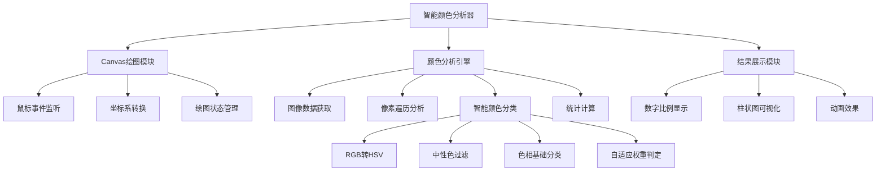

# 智能颜色分析器

## 简介

智能颜色分析器是一个基于 Canvas 的前端组件，能够对图像进行智能颜色分析，自动识别并分类冷暖色调。该组件采用 RGB-HSV 混合模型算法，结合自适应权重调整机制，实现高精度的颜色分类。

## 效果特点

### 核心功能

- **Canvas 绘图**: 支持在 Canvas 上自由绘制图案
- **智能分析**: 基于 RGB-HSV 混合模型的智能颜色分类算法
- **实时统计**: 实时计算并显示冷暖色调占比
- **可视化展示**: 通过动态柱状图直观展示分析结果

### 技术特性

- **高性能**: 针对像素级分析进行性能优化
- **精确分类**: 采用多维度颜色感知模型
- **自适应算法**: 根据颜色特征动态调整权重
- **响应式设计**: 适配不同屏幕尺寸

## 工作原理



## 效果演示

<demo react="react/SmartColorAnalyzer/index.tsx" 
:reactFiles="['react/SmartColorAnalyzer/index.tsx','react/SmartColorAnalyzer/index.scss']" 
/>

## 核心实现原理

### 1. Canvas 绘图功能设计

Canvas 绘图功能采用事件驱动的架构模式，通过监听鼠标的按下、移动、抬起三个关键事件，实现连续的绘图轨迹。

**关键技术点**：

- 坐标系转换：将鼠标在页面上的绝对坐标转换为 Canvas 内的相对坐标
- 绘制状态管理：使用响应式状态控制绘制的开始和结束
- 性能优化：避免在 mousemove 事件中进行复杂计算
- 用户体验：提供多种颜色选择，支持实时颜色切换

### 2. 智能颜色分类算法

这是整个项目的技术核心和亮点，采用了**RGB-HSV 混合模型**的创新方案。HSV 色彩模型更符合人类视觉系统对颜色的感知方式。

```typescript
const classifyColor = (r: number, g: number, b: number) => {
	// RGB-HSV混合模型
	// 转换为HSV
	const cR = r / 255;
	const cG = g / 255;
	const cB = b / 255;
	// 计算HSV中的H(色相)和S(饱和度)
	const max = Math.max(cR, cG, cB);
	const min = Math.min(cR, cG, cB);
	let h = max;

	const d = max - min;
	const s = max === 0 ? 0 : d / max;

	// 计算色相角度(0-360°)
	if (max === min) {
		h = 0; // 无色调(灰度)
	} else {
		switch (max) {
			case cR:
				h = (cG - cB) / d + (cG < cB ? 6 : 0);
				break;
			case cG:
				h = (cB - cR) / d + 2;
				break;
			case cB:
				h = (cR - cG) / d + 4;
				break;
		}
		h *= 60;
	}
	const lightness = (max + min) / 2;
	if ((s < 0.1 && (h < 140 || h > 280)) || lightness < 0.1 || lightness > 0.9) return 'neutral';

	// 自适应权重调整
	const rWeight = 0.5 + (cR - 0.5) * 0.5;
	const gWeight = 0.3 + (cG - 0.5) * 0.3;
	const bWeight = 0.2 + (cB - 0.5) * 0.2;

	// 智能分类算法
	if (h >= 330 || h <= 60) {
		// 红色到黄色范围 - 暖色
		if (s < 0.3) {
			// 低饱和度区域使用加权判断
			return rWeight > bWeight + 0.05 ? 'warm' : 'cold';
		}
		return 'warm';
	} else if (h >= 140 && h <= 280) {
		// 青色到蓝色范围 - 冷色
		if (s < 0.3) {
			// 低饱和度区域使用加权判断
			return bWeight > rWeight + 0.05 ? 'cold' : 'warm';
		}
		return 'cold';
	} else {
		// 中间区域使用RGB加权值判定
		const warmScore = rWeight * 0.7 + gWeight * 0.3;
		const coldScore = bWeight * 0.85 + gWeight * 0.2;

		// 自适应阈值
		const threshold = 0.5 + (s - 0.5) * 0.2;
		return warmScore > coldScore + threshold ? 'warm' : 'cold';
	}
};
```

### 3. 高性能像素分析引擎

像素级分析是整个系统的数据处理核心，通过 getImageData API 获取像素数据，并采用优化策略确保分析过程的流畅性。

```typescript
const analyzeColors = () => {
	if (!ctx.value || !canvas.value) return;

	const imageData = ctx.value.getImageData(0, 0, canvas.value.width, canvas.value.height);
	const data = imageData.data;

	let warmPixels = 0;
	let coolPixels = 0;

	// 高效像素遍历 - 每4个元素为一个RGBA像素
	for (let i = 0; i < data.length; i += 4) {
		const r = data[i];
		const g = data[i + 1];
		const b = data[i + 2];
		// Alpha通道在data[i + 3]，这里我们忽略透明度

		const colorType = classifyColor(r, g, b);
		if (colorType === 'warm') {
			warmPixels++;
		} else if (colorType === 'cold') {
			coolPixels++;
		}
		// 中性色不计入统计
	}

	// 实时计算比例并更新UI
	const colorPixels = warmPixels + coolPixels;
	warmRatio.value = colorPixels > 0 ? Math.round((warmPixels / colorPixels) * 100) : 0;
	coolRatio.value = colorPixels > 0 ? Math.round((coolPixels / colorPixels) * 100) : 0;

	// 触发动画更新
	updateVisualization();
};
```

## 参数配置

### 基础配置

| 参数         | 类型   | 默认值    | 说明            |
| ------------ | ------ | --------- | --------------- |
| canvasWidth  | number | 525       | Canvas 画布宽度 |
| canvasHeight | number | 350       | Canvas 画布高度 |
| initialColor | string | '#000000' | 初始绘图颜色    |

### 高级配置

| 参数              | 类型    | 默认值 | 说明               |
| ----------------- | ------- | ------ | ------------------ |
| enableAnimation   | boolean | true   | 是否启用动画效果   |
| showVisualization | boolean | true   | 是否显示可视化图表 |
| updateInterval    | number  | 1000   | 分析更新间隔(ms)   |

## 使用示例

```jsx
import SmartColorAnalyzer from './SmartColorAnalyzer';

// 基础使用
<SmartColorAnalyzer />

// 自定义配置
<SmartColorAnalyzer
  canvasWidth={600}
  canvasHeight={400}
  initialColor="#ff0000"
  enableAnimation={true}
  showVisualization={true}
  updateInterval={500}
/>
```

## 应用场景

### 1. UI 设计辅助工具

帮助 UI 设计师分析界面配色方案，提供冷暖色调分布数据，辅助设计决策。

### 2. 图像处理应用

在图像编辑软件中集成颜色分析功能，为用户提供专业的色彩统计数据。

### 3. 教育演示工具

用于色彩理论教学，直观展示不同颜色的冷暖属性分类。

### 4. 数据可视化

将颜色分析结果与其他数据结合，创建更丰富的可视化图表。

## 性能优化

### 1. 内存访问优化

ImageData 以一维数组形式存储 RGBA 数据，每 4 个元素代表一个像素。通过优化循环步长和内存访问模式，显著提升了遍历效率。

### 2. 算法复杂度控制

颜色分类算法的时间复杂度控制在 O(1)，确保每个像素的处理时间恒定，避免了性能瓶颈。

### 3. 统计数据实时更新

分析过程中实时更新统计数据，并通过响应式系统自动更新 UI，为用户提供即时反馈。

## 故障排除

### 1. Canvas 无法绘制

**问题**: Canvas 画布上无法正常绘制图案
**解决方案**:

- 检查 Canvas 元素是否正确获取
- 确认绘图上下文是否成功创建
- 验证鼠标事件监听器是否正确绑定

### 2. 颜色分析不准确

**问题**: 颜色分类结果与预期不符
**解决方案**:

- 检查图像数据是否正确获取
- 验证 classifyColor 函数的参数传递
- 调整自适应权重算法的阈值参数

### 3. 性能问题

**问题**: 大尺寸图像分析时出现卡顿
**解决方案**:

- 降低分析频率，增加 updateInterval 值
- 考虑使用 Web Workers 进行后台计算
- 对大图像进行降采样处理

## 相关资源

- [Canvas API 文档](https://developer.mozilla.org/zh-CN/docs/Web/API/Canvas_API)
- [RGB 与 HSV 色彩空间](https://en.wikipedia.org/wiki/HSL_and_HSV)
- [Web 性能优化指南](https://web.dev/fast/)
