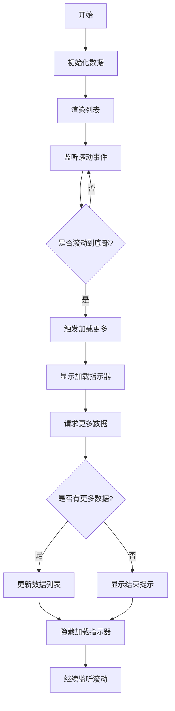

# 无限滚动加载 (Infinite Scroll)

无限滚动加载是一种常见的用户界面模式，当用户滚动到页面底部时自动加载更多内容。这种模式广泛应用于社交媒体、新闻网站和电商网站等场景，能够提供流畅的用户体验。

## 效果特点

- **自动加载**: 滚动到底部时自动加载更多数据
- **无缝体验**: 无需手动点击"加载更多"按钮
- **性能优化**: 只在需要时加载数据
- **灵活配置**: 支持多种自定义参数

## 基础实现

### React 组件实现

<demo react="react/InfiniteScroll/demo.tsx" 
:reactFiles="['react/InfiniteScroll/demo.tsx','react/InfiniteScroll/index.tsx','react/InfiniteScroll/index.scss']" 
/>

**核心原理**：

- 使用 `react-infinite-scroll-component` 库实现无限滚动
- 通过 `dataLength`、`next`、`hasMore` 等属性控制加载行为
- 支持自定义加载指示器和结束提示

**实现要点**：

```typescript
import InfiniteScroll from 'react-infinite-scroll-component';

const InfiniteScrollComponent = () => {
	const [items, setItems] = useState(Array.from({ length: 20 }));
	const [hasMore, setHasMore] = useState(true);

	const fetchMoreData = () => {
		// 模拟异步请求
		setTimeout(() => {
			setItems(prev => [...prev, ...Array.from({ length: 20 })]);

			// 模拟没有更多数据的情况
			if (items.length >= 100) {
				setHasMore(false);
			}
		}, 1500);
	};

	return (
		<InfiniteScroll
			dataLength={items.length}
			next={fetchMoreData}
			hasMore={hasMore}
			loader={<h4>加载中...</h4>}
			endMessage={<p style={{ textAlign: 'center' }}>没有更多了 🎉</p>}
		>
			{items.map((_, index) => (
				<div key={index} className="item">
					Item #{index}
				</div>
			))}
		</InfiniteScroll>
	);
};
```

### 实现流程图



## 参数配置说明

### 核心参数

| 参数               | 类型        | 默认值  | 说明                                         |
| ------------------ | ----------- | ------- | -------------------------------------------- |
| `dataLength`       | `number`    | -       | 当前列表的长度，必须正确设置                 |
| `next`             | `function`  | -       | 加载更多的方法（一般是异步请求接口）         |
| `hasMore`          | `boolean`   | `false` | 是否还有更多数据                             |
| `loader`           | `ReactNode` | -       | 加载时展示的内容                             |
| `endMessage`       | `ReactNode` | -       | 没有更多数据时显示的内容                     |
| `scrollableTarget` | `string`    | -       | 如果滚动容器不是 `window`，需要设置容器的 id |

### 自定义参数

| 参数                         | 类型            | 默认值      | 说明                 |
| ---------------------------- | --------------- | ----------- | -------------------- |
| `height`                     | `number`        | `undefined` | 设置容器固定高度     |
| `scrollThreshold`            | `number/string` | `0.8`       | 触发加载的滚动阈值   |
| `hasChildren`                | `boolean`       | `false`     | 是否有子元素         |
| `inverse`                    | `boolean`       | `false`     | 是否反向滚动         |
| `pullDownToRefresh`          | `boolean`       | `false`     | 是否支持下拉刷新     |
| `pullDownToRefreshThreshold` | `number`        | `50`        | 下拉刷新的阈值       |
| `pullDownToRefreshContent`   | `ReactNode`     | -           | 下拉刷新时显示的内容 |
| `releaseToRefreshContent`    | `ReactNode`     | -           | 释放刷新时显示的内容 |

## 样式自定义

### 基础样式

```scss
.infinite-scroll-container {
	width: 500px;
	margin: 0 auto;

	.item {
		height: 50px;
		border: 1px solid #ccc;
		margin: 6px;
		padding: 8px;
		display: flex;
		align-items: center;
		justify-content: center;
		background-color: #f9f9f9;
		border-radius: 4px;
	}

	.loader {
		text-align: center;
		padding: 10px;
		color: #666;
	}

	.end-message {
		text-align: center;
		padding: 20px;
		color: #999;
	}
}
```

### 主题定制

```scss
// 深色主题
.infinite-scroll-container.dark {
	.item {
		background-color: #2d2d2d;
		border-color: #444;
		color: #fff;
	}

	.loader {
		color: #aaa;
	}

	.end-message {
		color: #777;
	}
}
```

## 技术对比

| 实现方式                            | 优点               | 缺点               | 适用场景       |
| ----------------------------------- | ------------------ | ------------------ | -------------- |
| **react-infinite-scroll-component** | 简单易用，功能完善 | 大数据量时性能较差 | 中小数据量列表 |
| **rc-virtual-list**                 | 高性能，虚拟渲染   | 需要额外配置       | 大数据量列表   |
| **自定义实现**                      | 完全可控           | 开发复杂度高       | 特殊需求场景   |
| **Intersection Observer**           | 原生 API，性能好   | 兼容性需考虑       | 现代浏览器环境 |

## 常用库推荐

### react-infinite-scroll-component

- **特点**: 功能完善，配置简单
- **GitHub**: https://github.com/ankeetmaini/react-infinite-scroll-component

### react-window

- **特点**: 虚拟滚动，高性能
- **GitHub**: https://github.com/bvaughn/react-window

### react-virtualized

- **特点**: 功能丰富，支持多种布局
- **GitHub**: https://github.com/bvaughn/react-virtualized

## 设计建议

### 用户体验

- **加载提示**: 明确告知用户正在加载数据
- **结束提示**: 清楚表明没有更多内容
- **加载速度**: 优化数据请求速度
- **错误处理**: 处理网络异常情况

### 视觉设计

- **加载动画**: 使用合适的加载指示器
- **间距统一**: 保持列表项间距一致
- **颜色搭配**: 确保文本与背景对比度足够
- **响应式**: 适配不同屏幕尺寸

### 性能优化

- **数据分页**: 合理设置每次加载的数据量
- **防抖处理**: 避免频繁触发加载
- **内存管理**: 及时清理无用数据
- **懒加载**: 图片等资源懒加载

## 进阶应用

### 自定义滚动容器

```typescript
const CustomScrollContainer = () => {
	return (
		<div id="scrollableDiv" style={{ height: 400, overflow: 'auto' }}>
			<InfiniteScroll
				dataLength={items.length}
				next={fetchMoreData}
				hasMore={true}
				loader={<h4>Loading...</h4>}
				scrollableTarget="scrollableDiv"
			>
				{items.map((item, index) => (
					<div key={index}>{item}</div>
				))}
			</InfiniteScroll>
		</div>
	);
};
```

### 下拉刷新功能

```typescript
const PullToRefreshExample = () => {
	return (
		<InfiniteScroll
			dataLength={items.length}
			next={fetchMoreData}
			hasMore={true}
			loader={<h4>Loading...</h4>}
			pullDownToRefresh
			pullDownToRefreshThreshold={50}
			pullDownToRefreshContent={<h3 style={{ textAlign: 'center' }}>&#8595; 下拉刷新</h3>}
			releaseToRefreshContent={<h3 style={{ textAlign: 'center' }}>&#8593; 释放刷新</h3>}
			refreshFunction={refreshData}
		>
			{items.map((item, index) => (
				<div key={index}>{item}</div>
			))}
		</InfiniteScroll>
	);
};
```

### 虚拟列表集成

```typescript
import { FixedSizeList as List } from 'react-window';

const VirtualizedInfiniteScroll = () => {
	return (
		<InfiniteScroll
			dataLength={items.length}
			next={fetchMoreData}
			hasMore={hasMore}
			loader={<h4>Loading...</h4>}
			endMessage={<p>No more items</p>}
		>
			<List height={600} itemCount={items.length} itemSize={50} width="100%">
				{({ index, style }) => (
					<div style={style} className="item">
						Item #{index}
					</div>
				)}
			</List>
		</InfiniteScroll>
	);
};
```

## 核心实现细节

### 基础实现

```typescript
import React, { useState, useEffect } from 'react';
import InfiniteScroll from 'react-infinite-scroll-component';
import './index.scss';

interface Item {
	id: number;
	name: string;
}

const InfiniteScrollDemo: React.FC = () => {
	const [items, setItems] = useState<Item[]>([]);
	const [hasMore, setHasMore] = useState(true);
	const [loading, setLoading] = useState(false);

	// 初始化数据
	useEffect(() => {
		fetchData();
	}, []);

	const fetchData = () => {
		setLoading(true);

		// 模拟 API 请求
		setTimeout(() => {
			const newItems = Array.from({ length: 20 }, (_, i) => ({
				id: items.length + i,
				name: `Item #${items.length + i}`
			}));

			setItems(prev => [...prev, ...newItems]);
			setLoading(false);

			// 模拟没有更多数据
			if (items.length + newItems.length >= 100) {
				setHasMore(false);
			}
		}, 1500);
	};

	const fetchMoreData = () => {
		if (!loading) {
			fetchData();
		}
	};

	return (
		<div className="infinite-scroll-demo">
			<InfiniteScroll
				dataLength={items.length}
				next={fetchMoreData}
				hasMore={hasMore}
				loader={<div className="loader">加载中...</div>}
				endMessage={
					<p className="end-message">
						<b>没有更多数据了</b>
					</p>
				}
			>
				<div className="items-container">
					{items.map(item => (
						<div key={item.id} className="item">
							{item.name}
						</div>
					))}
				</div>
			</InfiniteScroll>
		</div>
	);
};

export default InfiniteScrollDemo;
```

### 完整示例实现

```typescript
import { useState, useCallback } from 'react';
import InfiniteScroll from 'react-infinite-scroll-component';
import './index.scss';

interface Item {
	id: number;
	name: string;
	description: string;
}

interface InfiniteScrollExampleProps {
	// 容器宽度
	width?: number;
	// 容器高度
	height?: number;
	// 初始数据量
	initialCount?: number;
	// 每次加载数据量
	loadCount?: number;
	// 最大数据量
	maxCount?: number;
	// 主题
	theme?: 'light' | 'dark';
}

const InfiniteScrollExample: React.FC<InfiniteScrollExampleProps> = ({
	width = 500,
	height = undefined,
	initialCount = 20,
	loadCount = 10, // 默认每次加载10条数据
	maxCount = 100,
	theme = 'light'
}) => {
	const [items, setItems] = useState<Item[]>(
		Array.from({ length: initialCount }, (_, i) => ({
			id: i,
			name: `数据项 #${i}`,
			description: `这是第 ${i + 1} 个数据项的描述信息，包含一些示例文本内容。`
		}))
	);
	const [hasMore, setHasMore] = useState(true);

	const fetchMoreData = useCallback(() => {
		// 模拟异步请求
		setTimeout(() => {
			setItems(prevItems => {
				const currentLength = prevItems.length;
				const newItems = Array.from({ length: loadCount }, (_, i) => ({
					id: currentLength + i,
					name: `数据项 #${currentLength + i}`,
					description: `这是第 ${currentLength + i + 1} 个数据项的描述信息，包含一些示例文本内容。`
				}));

				// 检查是否达到最大数据量
				if (currentLength + newItems.length >= maxCount) {
					setHasMore(false);
				}

				return [...prevItems, ...newItems];
			});
		}, 1000);
	}, [loadCount, maxCount]);

	return (
		<div className={`infinite-scroll-example ${theme}`} style={{ width: `${width}px` }}>
			<InfiniteScroll
				dataLength={items.length}
				next={fetchMoreData}
				hasMore={hasMore}
				loader={
					<div className="scroll-loader">
						<div className="loading-spinner"></div>
						<span>加载中...</span>
					</div>
				}
				endMessage={
					<p className="scroll-end-message">
						<b>🎉 没有更多数据了</b>
					</p>
				}
				height={height}
			>
				<div className="items-container">
					{items.map(item => (
						<div key={item.id} className="item">
							<div className="item-content">
								<div className="item-icon">📄</div>
								<div className="item-text">
									<div className="item-title">{item.name}</div>
									<div className="item-description">{item.description}</div>
								</div>
							</div>
						</div>
					))}
				</div>
			</InfiniteScroll>
		</div>
	);
};

export default InfiniteScrollExample;
```

## 最佳实践

### 1. 性能优化建议

- 合理设置每次加载的数据量，避免一次性加载过多数据
- 使用 `React.memo` 优化列表项组件
- 对于大量数据，考虑使用虚拟滚动技术
- 及时清理定时器和事件监听器

### 2. 可访问性考虑

- 为加载状态提供屏幕阅读器支持
- 确保键盘导航的可用性
- 提供跳过重复内容的选项

### 3. 响应式设计

- 根据屏幕尺寸调整容器宽度
- 在移动设备上优化触摸体验
- 考虑不同设备的性能差异

### 4. 错误处理

- 处理网络请求失败的情况
- 提供重试机制
- 显示友好的错误提示

## 性能分析

不同实现方式的性能对比：

| 实现方式                        | 性能 | 复杂度 | 兼容性 |
| ------------------------------- | ---- | ------ | ------ |
| react-infinite-scroll-component | 中   | 低     | 高     |
| rc-virtual-list                 | 高   | 中     | 中     |
| 自定义实现                      | 可控 | 高     | 可控   |
| Intersection Observer           | 高   | 中     | 中     |

## 安全考虑

1. **数据验证**: 对加载的数据进行验证和清理
2. **XSS 防护**: 当渲染用户生成内容时，确保进行适当的转义
3. **资源限制**: 限制加载的数据量，防止内存溢出
4. **错误边界**: 使用 React 错误边界处理组件异常

## 应用场景

1. **社交媒体**: 微博、朋友圈等信息流
2. **电商平台**: 商品列表、搜索结果
3. **新闻网站**: 文章列表、评论区
4. **图片浏览**: 相册、图库
5. **聊天应用**: 消息记录

---

_无限滚动加载是提升用户体验的重要技术，合理使用能让用户更流畅地浏览内容。但也要注意性能和可访问性问题。_
