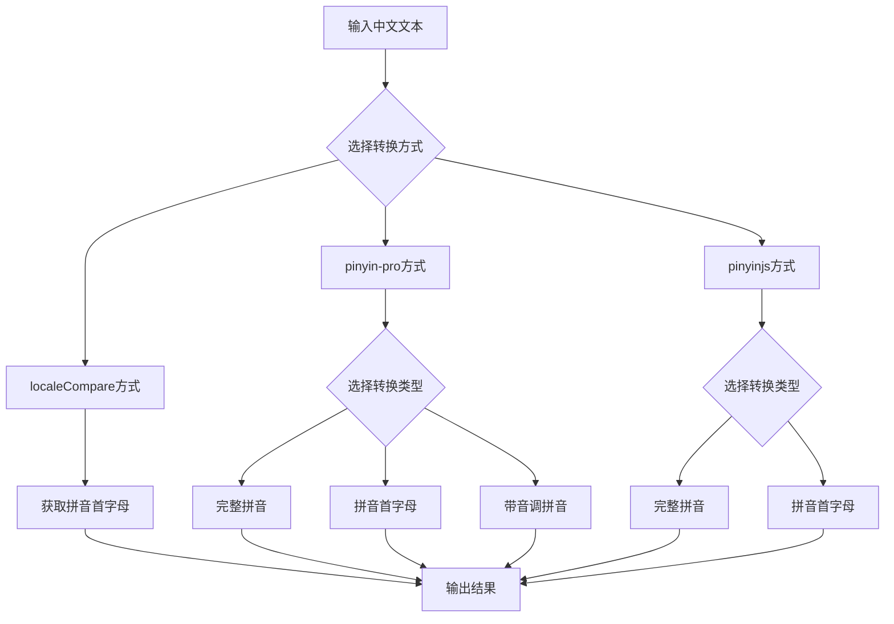

# 拼音转换组件

## 简介

在中文应用开发中，拼音转换是一个常见的需求，特别是在联系人列表排序、城市选择器、拼音搜索等场景中。本文介绍了三种实现拼音转换的方法：

1. 使用 `localeCompare` API 实现基础的拼音首字母获取
2. 使用 `pinyin-pro` 库实现完整的拼音转换功能
3. 使用 `pinyinjs` 库实现拼音转换功能

通过对比这三种方案的功能和性能，帮助开发者选择最适合项目需求的方案。

## 故障排除

### "\_\_dirname is not defined" 错误

如果您在使用 pinyinjs 库时遇到 `__dirname is not defined` 错误，这是因为 pinyinjs 依赖于 Node.js 环境中的 segment 包，该包使用了 Node.js 特定的 `__dirname` 变量。在浏览器环境中会出现此错误。

**解决方案**：

1. 优先使用 `pinyin-pro` 库，它专为浏览器环境设计
2. 如果必须使用 pinyinjs，需要配置构建工具（如 Webpack）来提供 Node.js 兼容层

## 效果演示

<demo react="react/PinyinConverter/example.tsx" 
:reactFiles="['react/PinyinConverter/index.tsx','react/PinyinConverter/pinyin-converter.scss']" 
/>

## 核心实现

### 1. 使用 localeCompare API 实现拼音首字母获取

```typescript
/**
 * 获取汉字的拼音首字母
 * @param chineseChar 中文字符串，若传入多字符则只取第一个字符
 * @param useUpperCase 是否返回大写字母，默认为false（小写）
 * @returns 拼音首字母，若无法识别则返回空字符串
 */
export const getTheFirstLetterForPinyin = (
	chineseChar: string = '',
	useUpperCase: boolean = false
): string => {
	// 兼容性检查：确保浏览器支持 localeCompare 方法
	if (!String.prototype.localeCompare) {
		return '';
	}

	// 参数验证：确保输入为有效字符串
	if (typeof chineseChar !== 'string' || !chineseChar.length) {
		return '';
	}

	// 准备用于比较的字母表和基准汉字
	// 注：这些基准汉字分别对应A、B、C...等拼音首字母的起始位置
	const letters = 'ABCDEFGHJKLMNOPQRSTWXYZ'.split('');
	const zh = '阿八嚓哒妸发旮哈讥咔垃痳拏噢妑七呥扨它穵夕丫帀'.split('');

	let firstLetter = '';
	const firstChar = chineseChar[0];

	// 处理字母和数字：直接返回原字符
	if (/^\w/.test(firstChar)) {
		firstLetter = firstChar;
	} else {
		// 处理汉字：通过比较确定拼音首字母范围
		letters.some((item, index) => {
			// 检查当前字符是否在当前基准汉字与下一个基准汉字之间
			if (
				firstChar.localeCompare(zh[index]) >= 0 &&
				(index === letters.length - 1 || firstChar.localeCompare(zh[index + 1]) < 0)
			) {
				firstLetter = item;
				return true;
			}
			return false;
		});
	}

	// 根据参数决定返回大写还是小写字母
	return useUpperCase ? firstLetter.toUpperCase() : firstLetter.toLowerCase();
};
```

### 2. 使用 pinyin-pro 库实现拼音转换

```typescript
import { pinyin } from 'pinyin-pro';

// 获取完整拼音
const getPinyinWithPinyinPro = (text: string) => {
	return pinyin(text, { toneType: 'none' });
};

// 获取拼音首字母
const getPinyinInitialsWithPinyinPro = (text: string) => {
	return pinyin(text, { pattern: 'first', toneType: 'none' });
};

// 获取带音调的拼音
const getPinyinWithToneWithPinyinPro = (text: string) => {
	return pinyin(text, { toneType: 'symbol' });
};
```

### 3. 使用 pinyinjs 库实现拼音转换

```typescript
// 动态导入 pinyinjs，避免在模块加载时就执行可能导致错误的代码
let pinyinjs: any = null;
try {
	pinyinjs = require('pinyinjs');
} catch (e) {
	console.warn('pinyinjs 加载失败:', e);
}

// 获取完整拼音
const getPinyinWithPinyinjs = (text: string) => {
	if (!pinyinjs) return 'pinyinjs库加载失败';
	return pinyinjs.getFullChars(text);
};

// 获取拼音首字母
const getPinyinInitialsWithPinyinjs = (text: string) => {
	if (!pinyinjs) return 'pinyinjs库加载失败';
	return pinyinjs.getCamelChars(text);
};
```

## 功能对比

| 功能特性     | localeCompare  | pinyin-pro | pinyinjs            |
| ------------ | -------------- | ---------- | ------------------- |
| 实现方式     | 浏览器原生 API | 第三方库   | 第三方库            |
| 多音字支持   | ❌             | ✅         | ✅                  |
| 音调标注     | ❌             | ✅         | ❌                  |
| 首字母获取   | ✅             | ✅         | ✅                  |
| 完整拼音转换 | ❌             | ✅         | ✅                  |
| 文件大小     | 无额外依赖     | 中等       | 较小                |
| 性能         | 快             | 中等       | 快                  |
| 准确性       | 一般           | 高         | 高                  |
| 浏览器兼容性 | IE11+          | 现代浏览器 | 需要 Node.js 兼容层 |
| 错误风险     | 低             | 低         | 高                  |

## 流程图说明



## 参数说明

| 参数名       | 类型                                          | 默认值       | 说明                               |
| ------------ | --------------------------------------------- | ------------ | ---------------------------------- |
| text         | string                                        | ''           | 需要转换的中文文本                 |
| mode         | 'initial' \| 'full' \| 'tone'                 | 'initial'    | 转换模式：首字母、完整拼音、带音调 |
| library      | 'localeCompare' \| 'pinyin-pro' \| 'pinyinjs' | 'pinyin-pro' | 使用的库                           |
| useUpperCase | boolean                                       | false        | 是否返回大写字母                   |

## 应用场景

1. **联系人列表排序**：按拼音首字母对联系人进行分组排序
2. **城市选择器**：按首字母索引快速定位城市
3. **拼音搜索**：将拼音首字母存储到数据库中，用户输入拼音首字母即可检索相关内容
4. **数据分类展示**：将中文数据按拼音首字母进行分类展示

## 核心优势

1. **多种实现方式**：提供三种不同的拼音转换实现方案，满足不同需求
2. **功能对比**：通过表格清晰对比各方案的功能差异和适用场景
3. **性能优化**：针对不同场景推荐最优方案，平衡功能和性能
4. **错误处理**：提供完善的错误处理机制，提高组件稳定性
5. **易于集成**：提供完整的 React 组件实现，可直接在项目中使用
