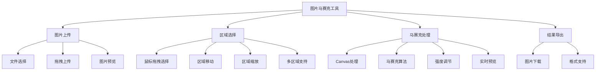

# 图片马赛克处理工具实现与使用

图片马赛克是一种常见的图像处理技术，用于保护隐私或隐藏敏感信息。本文将详细介绍如何实现一个功能完善的前端图片马赛克处理工具。

## 工具作用与意义

### 主要用途

- **隐私保护**: 隐藏图片中的敏感信息（如人脸、车牌等）
- **内容审核**: 对不当内容进行遮盖处理
- **版权保护**: 部分展示图片内容，防止直接盗用
- **用户体验**: 提供可视化操作界面，方便用户自定义处理区域

### 应用场景

- **社交平台**: 用户上传图片时的隐私保护
- **电商平台**: 商品展示时的水印处理
- **新闻媒体**: 敏感信息的遮盖处理
- **在线教育**: 学生作业或考试图片的处理
- **医疗系统**: 患者信息的隐私保护

## 工作原理



## 技术实现方案

### 方案对比

| 实现方式        | 优点               | 缺点                   | 适用场景     |
| --------------- | ------------------ | ---------------------- | ------------ |
| **Canvas 绘制** | 灵活度高，效果丰富 | 性能开销大，不支持 SEO | 复杂图像处理 |
| **CSS 滤镜**    | 性能好，实现简单   | 功能有限，效果单一     | 简单模糊效果 |
| **SVG 实现**    | 矢量图形，缩放清晰 | 兼容性问题             | 图形遮盖     |
| **WebGL 渲染**  | 性能极佳           | 开发复杂度高           | 大图处理     |

## 核心实现

### React 马赛克组件

<demo react="react/ImageMosaic/index.tsx" 
:reactFiles="['react/ImageMosaic/index.tsx','react/ImageMosaic/index.scss']" 
/>

### 基础实现原理

```typescript
interface ImageMosaicProps {
	// 马赛克强度
	mosaicStrength?: number;
	// 选择区域样式
	selectionStyle?: React.CSSProperties;
	// 马赛克区域样式
	mosaicStyle?: React.CSSProperties;
	// 容器类名
	className?: string;
	// 容器样式
	style?: React.CSSProperties;
}

const ImageMosaic: React.FC<ImageMosaicProps> = ({
	mosaicStrength = 15,
	selectionStyle = {},
	mosaicStyle = {},
	className = '',
	style = {}
}) => {
	// 实现逻辑...
};
```

### Canvas 马赛克算法

```javascript
/**
 * 应用马赛克效果到指定区域
 * @param canvas Canvas元素
 * @param ctx Canvas上下文
 * @param x 区域左上角x坐标
 * @param y 区域左上角y坐标
 * @param width 区域宽度
 * @param height 区域高度
 * @param blockSize 马赛克块大小
 */
function applyMosaic(canvas, ctx, x, y, width, height, blockSize) {
	// 获取指定区域的图像数据
	const imageData = ctx.getImageData(x, y, width, height);
	const data = imageData.data;

	// 遍历每个马赛克块
	for (let i = 0; i < height; i += blockSize) {
		for (let j = 0; j < width; j += blockSize) {
			// 计算当前块的平均颜色
			const avgColor = calculateAverageColor(
				data,
				j,
				i,
				Math.min(blockSize, width - j),
				Math.min(blockSize, height - i),
				width
			);

			// 用平均颜色填充整个块
			fillBlockWithColor(
				ctx,
				x + j,
				y + i,
				Math.min(blockSize, width - j),
				Math.min(blockSize, height - i),
				avgColor
			);
		}
	}
}

/**
 * 计算指定区域的平均颜色
 */
function calculateAverageColor(data, x, y, width, height, rowWidth) {
	let r = 0,
		g = 0,
		b = 0;
	let count = 0;

	for (let i = 0; i < height; i++) {
		for (let j = 0; j < width; j++) {
			const idx = ((y + i) * rowWidth + (x + j)) * 4;
			r += data[idx];
			g += data[idx + 1];
			b += data[idx + 2];
			count++;
		}
	}

	return {
		r: Math.floor(r / count),
		g: Math.floor(g / count),
		b: Math.floor(b / count)
	};
}

/**
 * 用指定颜色填充矩形区域
 */
function fillBlockWithColor(ctx, x, y, width, height, color) {
	ctx.fillStyle = `rgb(${color.r}, ${color.g}, ${color.b})`;
	ctx.fillRect(x, y, width, height);
}
```

## 参数配置说明

### 核心参数

| 参数名           | 类型            | 默认值 | 描述                           |
| ---------------- | --------------- | ------ | ------------------------------ |
| `mosaicStrength` | `number`        | `15`   | 马赛克强度，值越大马赛克块越大 |
| `selectionStyle` | `CSSProperties` | `{}`   | 选择区域的样式配置             |
| `mosaicStyle`    | `CSSProperties` | `{}`   | 马赛克区域的样式配置           |
| `className`      | `string`        | `''`   | 容器的 CSS 类名                |
| `style`          | `CSSProperties` | `{}`   | 容器的内联样式                 |

### 事件回调

| 回调名           | 参数                                | 描述                     |
| ---------------- | ----------------------------------- | ------------------------ |
| `onSelectStart`  | `(x: number, y: number) => void`    | 开始选择区域时触发       |
| `onSelectEnd`    | `(region: MosaicRegion) => void`    | 完成区域选择时触发       |
| `onRegionMove`   | `(region: MosaicRegion) => void`    | 移动马赛克区域时触发     |
| `onRegionResize` | `(region: MosaicRegion) => void`    | 调整马赛克区域大小时触发 |
| `onMosaicApply`  | `(regions: MosaicRegion[]) => void` | 应用马赛克效果时触发     |

## 交互操作说明

### 区域选择

1. **选择区域**: 按住鼠标左键并拖拽选择需要打马赛克的区域
2. **移动区域**: 点击并拖拽已创建的马赛克区域来调整位置
3. **调整大小**: 拖拽马赛克区域的角落控制点来调整大小
4. **删除区域**: 点击区域上的删除按钮移除马赛克区域

### 参数调节

- **马赛克强度**: 通过滑块调整马赛克颗粒大小，范围 5-50px
- **实时预览**: 调整参数时实时查看效果变化
- **多区域处理**: 支持同时处理图片中的多个区域

## 安全防护机制

### 防篡改保护

```javascript
class MosaicProtector {
	constructor(container, mosaicElement) {
		this.container = container;
		this.mosaicElement = mosaicElement;
		this.observer = null;
		this.init();
	}

	init() {
		// 使用 MutationObserver 监控 DOM 变化
		this.observer = new MutationObserver(mutations => {
			mutations.forEach(mutation => {
				// 检测马赛克元素是否被删除
				if (mutation.type === 'childList') {
					const removedNodes = Array.from(mutation.removedNodes);
					if (removedNodes.includes(this.mosaicElement)) {
						this.restoreMosaic();
					}
				}

				// 检测样式是否被修改
				if (mutation.type === 'attributes' && mutation.target === this.mosaicElement) {
					this.restoreMosaic();
				}
			});
		});

		// 开始监控
		this.observer.observe(this.container, {
			childList: true,
			attributes: true,
			subtree: true
		});
	}

	restoreMosaic() {
		// 重新创建马赛克
		console.warn('马赛克被篡改，正在恢复...');
		this.createMosaic();
	}
}
```

### 数据安全

```javascript
// 图片数据安全处理
function processImageSecurely(file) {
	return new Promise((resolve, reject) => {
		const reader = new FileReader();

		reader.onload = function (e) {
			// 在客户端处理图片，不上传到服务器
			const img = new Image();
			img.onload = function () {
				resolve(img);
			};
			img.onerror = reject;
			img.src = e.target.result;
		};

		reader.onerror = reject;
		reader.readAsDataURL(file);
	});
}
```

## 移动端适配

### 触摸事件处理

```javascript
// 支持触摸选择区域
function handleTouchStart(e) {
	const touch = e.touches[0];
	const rect = canvas.getBoundingClientRect();
	const x = touch.clientX - rect.left;
	const y = touch.clientY - rect.top;

	// 开始选择区域
	startSelection(x, y);
}

function handleTouchMove(e) {
	e.preventDefault();
	const touch = e.touches[0];
	const rect = canvas.getBoundingClientRect();
	const x = touch.clientX - rect.left;
	const y = touch.clientY - rect.top;

	// 更新选择区域
	updateSelection(x, y);
}

function handleTouchEnd() {
	// 完成选择区域
	finishSelection();
}
```

### 响应式设计

```css
/* 响应式容器 */
.mosaic-container {
	max-width: 100%;
	overflow: auto;
}

.mosaic-canvas {
	max-width: 100%;
	height: auto;
}

/* 移动端控制面板 */
@media (max-width: 768px) {
	.control-panel {
		flex-direction: column;
		gap: 10px;
	}

	.slider-container {
		width: 100%;
	}
}
```

## 性能优化

### Canvas 优化

```javascript
// 使用 willReadFrequently 优化 Canvas 性能
const ctx = canvas.getContext('2d', { willReadFrequently: true });

// 离屏 Canvas 绘制提高性能
function createOffscreenMosaic(canvas, options) {
	const offscreen = document.createElement('canvas');
	offscreen.width = canvas.width;
	offscreen.height = canvas.height;

	const offscreenCtx = offscreen.getContext('2d');
	// 在离屏 Canvas 上进行复杂绘制操作

	// 将结果绘制回主 Canvas
	canvas.getContext('2d').drawImage(offscreen, 0, 0);
}
```

### 内存管理

```javascript
// 及时释放图像资源
function cleanupImageResources() {
	if (originalImage) {
		originalImage.src = '';
		originalImage = null;
	}

	if (previewCanvas) {
		const ctx = previewCanvas.getContext('2d');
		ctx.clearRect(0, 0, previewCanvas.width, previewCanvas.height);
	}
}

// 组件卸载时清理资源
useEffect(() => {
	return () => {
		cleanupImageResources();
	};
}, []);
```

## 故障排除

### 1. 图片加载失败

**问题**: 选择图片后无法正常显示或处理
**解决方案**:

- 检查文件格式是否支持（JPG、PNG、GIF 等）
- 确认图片大小不超过浏览器限制
- 验证图片 URL 是否正确

### 2. 马赛克效果异常

**问题**: 马赛克效果显示不正确或位置偏移
**解决方案**:

- 检查 Canvas 尺寸与显示尺寸是否一致
- 确认设备像素比处理是否正确
- 验证坐标计算逻辑

### 3. 性能问题

**问题**: 处理大图片时出现卡顿
**解决方案**:

- 启用离屏 Canvas 绘制
- 降低马赛克处理频率（使用防抖）
- 限制处理区域大小

## 技术要点

### 1. Canvas 图像处理

- 使用 `getImageData` 获取像素数据
- 通过算法计算平均颜色实现马赛克效果
- 使用 `putImageData` 或 `fillRect` 应用处理结果

### 2. 交互事件处理

- 鼠标事件：mousedown, mousemove, mouseup
- 触摸事件：touchstart, touchmove, touchend
- 键盘事件：支持快捷键操作

### 3. 响应式设计

- 使用相对单位适配不同屏幕
- 媒体查询优化移动端显示
- 触摸友好的交互设计

## 最佳实践

### 设计原则

1. **用户友好**: 提供直观的操作界面和实时预览
2. **性能优先**: 优化算法和渲染性能
3. **兼容性考虑**: 支持主流浏览器和移动设备
4. **安全性**: 纯前端处理，保护用户隐私

### 实施建议

1. **渐进增强**: 从基础功能开始，逐步添加高级特性
2. **用户体验**: 提供清晰的操作指引和反馈
3. **错误处理**: 完善的异常处理和用户提示
4. **性能监控**: 监控处理时间和内存使用情况

### 使用建议

1. **合理强度**: 根据实际需求选择合适的马赛克强度
2. **区域精确**: 精确选择需要处理的区域
3. **多次处理**: 支持对同一图片进行多次处理
4. **格式支持**: 支持常见图片格式的导入和导出

---

_图片马赛克处理工具是保护数字内容隐私的重要技术，合理使用可以有效保护个人信息和敏感内容。记住，技术手段只是辅助，完善的隐私保护意识同样重要。_ 🔒
