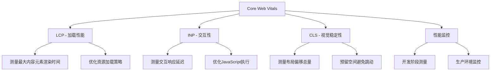

# Core Web Vitals 核心指标详解

## 简介

Core Web Vitals（核心网页指标）是 Google 推出的一套衡量网页用户体验的官方标准。它包含三个核心指标：

- **LCP**（最大内容绘制）- 衡量页面加载性能
- **INP**（交互到下次绘制）- 衡量页面交互性（已替代 FID）
- **CLS**（累积布局偏移）- 衡量页面视觉稳定性

这三个指标已被纳入 Google 搜索排名算法，直接影响网站的 SEO 表现。

## 效果特点

### 核心指标说明

| 指标    | 全称                      | 衡量什么           | 良好值  |
| ------- | ------------------------- | ------------------ | ------- |
| **LCP** | Largest Contentful Paint  | 最大内容块渲染时间 | ≤ 2.5s  |
| **INP** | Interaction to Next Paint | 用户交互响应延迟   | ≤ 200ms |
| **CLS** | Cumulative Layout Shift   | 页面布局稳定性     | ≤ 0.1   |

### 技术特性

- **标准化测量**：使用官方 web-vitals 库进行准确测量
- **实时监控**：可在开发阶段和生产环境持续监控
- **优化指导**：提供具体的优化策略和代码示例
- **SEO 友好**：提升网站搜索排名和转化率

## 工作原理



## 效果演示

<demo react="react/CoreWebVitals/index.tsx" 
:reactFiles="['react/CoreWebVitals/index.tsx','react/CoreWebVitals/index.scss']" 
/>

## 核心实现原理

### LCP（最大内容绘制）优化

LCP 衡量页面最大内容元素何时对用户可见，常见问题包括：

1. 图片未预加载
2. 关键资源阻塞渲染
3. 服务器响应慢

#### 优化策略

**1. 预加载关键资源**

```html
<!-- 预加载首屏大图 -->
<link rel="preload" as="image" href="/hero-banner.jpg" />

<!-- 预加载关键字体 -->
<link rel="preload" as="font" href="/font.woff2" type="font/woff2" crossorigin />
```

**2. 合理使用图片懒加载**

```html
<!-- 首屏图：不懒加载 -->


<!-- 非首屏图：懒加载 -->

```

**3. 优化服务器响应**

```typescript
// Next.js示例：服务端渲染提升LCP
export async function getServerSideProps() {
	const data = await fetch('/api/hero-content');
	return { props: { data } }; // 提前注入数据
}
```

### INP（交互到下次绘制）优化

INP 衡量用户与页面交互到浏览器下次绘制的时间，已替代 FID 成为 Core Web Vitals 指标，常见问题包括：

1. 主线程被长任务阻塞
2. JavaScript 打包过大
3. 复杂计算未优化

#### 优化策略

**1. 拆分长任务**

```typescript
// ❌ 错误：长任务阻塞主线程
function heavyCalculation() {
	for (let i = 0; i < 1e7; i++) {
		// 复杂计算
	}
}

// ✅ 正确：分片执行，释放主线程
function chunkedCalculation(data: any[], callback: () => void) {
	let index = 0;
	function processChunk() {
		const end = Math.min(index + 1000, data.length);
		for (; index < end; index++) {
			// 处理部分数据
		}
		if (index < data.length) {
			setTimeout(processChunk, 0); // 释放主线程
		} else {
			callback();
		}
	}
	processChunk();
}
```

**2. 代码分割**

```typescript
// 动态导入，按需加载
const Chart = await import('./ChartComponent.vue');
```

**3. 使用 Web Worker 处理复杂逻辑**

```typescript
// worker.js
self.onmessage = function (e) {
	const result = heavyCalc(e.data);
	self.postMessage(result);
};

// main.js
const worker = new Worker('worker.js');
worker.postMessage(data);
worker.onmessage = e => {
	console.log('计算完成:', e.data);
};
```

### CLS（累积布局偏移）优化

CLS 衡量页面在加载过程中发生的意外布局偏移总量，常见问题包括：

1. 图片/广告未设置尺寸
2. 动态插入内容
3. 字体闪烁（FOIT/FOUT）

#### 优化策略

**1. 为图片和视频设置宽高**

```html
<!-- ❌ 错误：无尺寸 -->


<!-- ✅ 正确：设置宽高，保持占位 -->

```

```css
/* 推荐：使用aspect-ratio保持比例 */
.aspect-box {
	aspect-ratio: 16 / 9;
	background: #eee;
}
```

**2. 预留广告或动态内容空间**

```html
<div class="ad-container" style="height: 250px;">
	<!-- 广告加载后填充 -->
</div>
```

**3. 优化字体加载**

```css
/* 使用font-display: swap，避免文字长时间不可见 */
@font-face {
	font-family: 'CustomFont';
	src: url('font.woff2') format('woff2');
	font-display: swap; /* 先用系统字体，再替换 */
}
```

## 参数配置说明

组件支持以下自定义参数配置：

| 参数               | 类型     | 默认值 | 说明               |
| ------------------ | -------- | ------ | ------------------ |
| **width**          | number   | 500    | 组件宽度           |
| **height**         | number   | 300    | 组件高度           |
| **lcpValue**       | number   | 2.1    | LCP 指标值（秒）   |
| **inpValue**       | number   | 85     | INP 指标值（毫秒） |
| **clsValue**       | number   | 0.08   | CLS 指标值         |
| **onMetricChange** | function | -      | 指标变化回调函数   |

## 性能监控实现

### 开发阶段测量

使用 Chrome DevTools 的 Lighthouse 面板生成报告，查看 LCP、INP、CLS 得分。

### 线上监控

使用`web-vitals`库进行实时监控：

```typescript
import { onLCP, onINP, onCLS } from 'web-vitals';

// 上报LCP
onLCP(console.log);

// 上报INP（替代了FID）
onINP(console.log);

// 上报CLS
onCLS(console.log);

// 实际项目中，发送到分析平台
function sendToAnalytics(metric: any) {
	// 发送到GA、自建监控系统等
	console.log(metric.name, metric.value);
}
onLCP(sendToAnalytics);
onINP(sendToAnalytics);
onCLS(sendToAnalytics);
```

## 优化效果对比

| 指标    | 优化前 | 优化后 | 结果        |
| ------- | ------ | ------ | ----------- |
| **LCP** | 4.2s   | 1.8s   | ✅ 提升 57% |
| **INP** | 320ms  | 60ms   | ✅ 提升 81% |
| **CLS** | 0.35   | 0.05   | ✅ 提升 86% |

> 📈 用户停留时间提升 40%，跳出率下降 25%。

## 故障排除

### 1. 指标测量不准确

**问题**: 测量值与实际体验不符
**解决方案**:

- 确保在真实设备和网络环境下测试
- 使用多个工具交叉验证（Lighthouse、WebPageTest 等）
- 检查是否存在测量代码冲突

### 2. 优化后指标无改善

**问题**: 实施优化策略后指标未提升
**解决方案**:

- 检查优化策略是否正确实施
- 分析性能瓶颈是否已转移
- 考虑其他影响因素（第三方脚本、服务器响应等）

### 3. 移动端表现差异

**问题**: 桌面端和移动端指标差异较大
**解决方案**:

- 针对移动端进行专门优化
- 考虑网络条件和设备性能差异
- 使用响应式设计适配不同屏幕

## 应用场景

### 1. 网站性能优化

```typescript
// 在网站中集成Core Web Vitals监控
import CoreWebVitalsMonitor from './components/CoreWebVitals';

const App = () => (
	<div>
		<CoreWebVitalsMonitor
			width={500}
			height={300}
			onMetricChange={metric => {
				// 发送到分析平台
				analytics.track('web_vitals', metric);
			}}
		/>
	</div>
);
```

### 2. 开发工具集成

```typescript
// 在开发工具中实时显示指标
const DevTools = () => {
	const [metrics, setMetrics] = useState({
		lcp: 0,
		inp: 0,
		cls: 0
	});

	return (
		<div className="dev-tools">
			<CoreWebVitalsMonitor
				lcpValue={metrics.lcp}
				inpValue={metrics.inp}
				clsValue={metrics.cls}
				onMetricChange={setMetrics}
			/>
		</div>
	);
};
```

## 最佳实践

### 1. 持续监控

- 在开发阶段定期检查指标
- 在生产环境持续监控
- 设置告警阈值

### 2. 渐进优化

- 从影响最大的问题开始优化
- 一次专注于一个指标的改进
- 验证优化效果后再进行下一步

### 3. 用户体验优先

- 不要为了指标而牺牲功能
- 平衡性能和功能需求
- 关注真实用户反馈

## 相关资源

- [Google Core Web Vitals 官方文档](https://web.dev/vitals/)
- [web-vitals npm 包](https://www.npmjs.com/package/web-vitals)
- [Lighthouse 官方文档](https://developers.google.com/web/tools/lighthouse)
- [WebPageTest 性能测试工具](https://www.webpagetest.org/)

---

_通过理解和优化 Core Web Vitals 指标，您可以显著提升网站的用户体验和搜索引擎排名。持续监控和优化这些指标是现代前端开发的重要组成部分。_ 🚀
