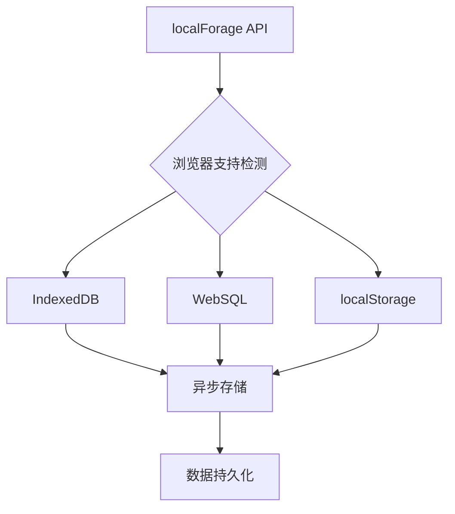
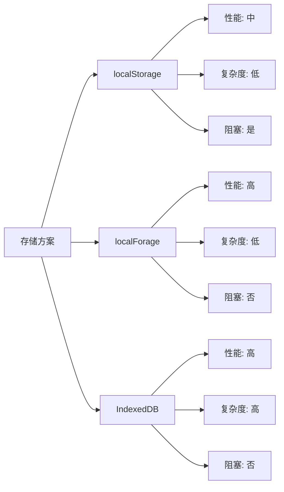

# localForage 本地存储库

## 简介

localForage 是一个轻量且高效的 JavaScript 存储库，核心目标是优化 Web 应用的离线体验。它通过封装异步存储方案（IndexedDB 或 WebSQL），提供了与 `localStorage` 一致的简洁 API，同时解决了 `localStorage` 同步阻塞、存储容量有限、仅支持字符串类型的痛点。

在兼容性方面，localForage 具备自动降级能力：若浏览器不支持 IndexedDB 或 WebSQL，会自动 fallback 到 `localStorage`，确保在各类浏览器环境中稳定运行。

## 效果特点

### 存储特性

- **异步非阻塞**: 所有操作都是异步的，避免阻塞 UI 线程
- **多类型支持**: 直接存储对象、数组、Blob 等多种数据类型
- **自动降级**: 在不支持的浏览器中自动降级到 localStorage
- **高性能**: 使用 IndexedDB/WebSQL 提供更好的性能

### 技术特性

- **简洁 API**: 与 localStorage 一致的 API 设计
- **Promise 支持**: 原生支持 Promise 和 async/await
- **TypeScript 支持**: 提供完整的 TypeScript 类型定义
- **多实例支持**: 可创建多个独立的存储实例

## 工作原理



localForage 通过检测浏览器对不同存储技术的支持情况，优先使用 IndexedDB，其次是 WebSQL，最后降级到 localStorage。所有操作都是异步的，避免阻塞主线程。

## 效果演示

<demo react="react/LocalForageDemo/index.tsx" 
:reactFiles="['react/LocalForageDemo/index.tsx','react/LocalForageDemo/index.scss']" 
/>

## 核心实现原理

### 基础使用

localForage 的 API 设计与 `localStorage` 高度一致，但全部为**异步操作**，支持「回调函数」「Promise」「async/await」三种调用方式，推荐优先使用 Promise 或 async/await。

#### 存储数据

```typescript
import localforage from 'localforage';

// async/await 方式（推荐）
async function saveData() {
	try {
		await localforage.setItem('user', { id: 1, name: '张三' });
		console.log('数据存储成功');
	} catch (err) {
		console.error('存储失败：', err);
	}
}
```

#### 读取数据

```typescript
async function getData() {
	try {
		const user = await localforage.getItem('user');
		console.log('用户信息：', user); // 输出：{ id: 1, name: '张三' }
	} catch (err) {
		console.error('读取失败：', err);
	}
}
```

#### 删除数据

```typescript
async function deleteData() {
	try {
		await localforage.removeItem('user');
		console.log('数据已删除');
	} catch (err) {
		console.error('删除失败：', err);
	}
}
```

#### 清空所有数据

```typescript
async function clearAll() {
	try {
		await localforage.clear();
		console.log('所有数据已清空');
	} catch (err) {
		console.error('清空失败：', err);
	}
}
```

### 高级功能

#### 自定义配置

通过 `config()` 方法可设置数据库的基础信息（如驱动类型、数据库名、存储容量等），**需在所有数据操作前调用**。

```typescript
// 配置需在数据操作前调用
localforage.config({
	driver: localforage.INDEXEDDB, // 强制指定存储驱动
	name: 'myAppDB', // 数据库名称
	version: 1.0,
	size: 4980736, // 数据库容量（仅 WebSQL 支持）
	storeName: 'key-value-pairs', // 存储对象名称
	description: '存储我的应用数据'
});
```

配置项说明：

| 配置项        | 说明                         | 可选值                                          |
| ------------- | ---------------------------- | ----------------------------------------------- |
| `driver`      | 强制指定存储驱动             | `localforage.INDEXEDDB`/`WEBSQL`/`LOCALSTORAGE` |
| `name`        | 数据库名称                   | 字符串（默认：`localforage`）                   |
| `version`     | 数据库版本号                 | 数字（默认：1.0）                               |
| `size`        | 数据库容量（仅 WebSQL 支持） | 数字（单位：字节，默认：4980736）               |
| `storeName`   | 存储对象名称（类似表名）     | 字符串（默认：`key-value-pairs`）               |
| `description` | 数据库描述                   | 字符串（默认：空）                              |

#### 多实例隔离

通过 `createInstance()` 可创建多个独立的 localForage 实例，不同实例的存储数据完全隔离（避免键名冲突），每个实例可单独配置。

```typescript
// 创建实例1：存储用户数据
const userStore = localforage.createInstance({
	name: 'userDB',
	storeName: 'userInfo'
});

// 创建实例2：存储应用配置
const configStore = localforage.createInstance({
	name: 'configDB',
	storeName: 'appConfig'
});

// 实例1 存储数据
await userStore.setItem('name', '王五');

// 实例2 存储数据（键名相同但不冲突）
await configStore.setItem('name', '我的应用');
```

## 参数配置

### 基础参数

| 参数          | 类型   | 默认值            | 说明                 |
| ------------- | ------ | ----------------- | -------------------- |
| `driver`      | string | 自动检测          | 存储驱动类型         |
| `name`        | string | 'localforage'     | 数据库名称           |
| `version`     | number | 1.0               | 数据库版本           |
| `size`        | number | 4980736           | 数据库容量（WebSQL） |
| `storeName`   | string | 'key-value-pairs' | 存储对象名称         |
| `description` | string | ''                | 数据库描述           |

### 自定义参数

在演示组件中，可以通过以下参数进行配置：

| 参数        | 类型   | 默认值            | 说明         |
| ----------- | ------ | ----------------- | ------------ |
| `dbName`    | string | 'localforage'     | 数据库名称   |
| `storeName` | string | 'key-value-pairs' | 存储对象名称 |
| `driver`    | string | 自动检测          | 存储驱动类型 |
| `width`     | number | 500               | 组件宽度     |
| `height`    | number | 400               | 组件高度     |

## 实现方案对比

| 方案             | 优点                             | 缺点                           | 适用场景     |
| ---------------- | -------------------------------- | ------------------------------ | ------------ |
| **localStorage** | 简单易用，兼容性好               | 同步阻塞，容量小，仅支持字符串 | 简单数据存储 |
| **localForage**  | 异步非阻塞，多类型支持，自动降级 | 增加少量体积                   | 复杂数据存储 |
| **IndexedDB**    | 高性能，大容量                   | API 复杂                       | 大量数据存储 |
| **WebSQL**       | SQL 查询                         | 已废弃                         | 历史项目     |

## 最佳实践

### 1. 错误处理

```typescript
async function safeStorage(key: string, value: any) {
	try {
		await localforage.setItem(key, value);
		return { success: true };
	} catch (error) {
		console.error('存储失败:', error);
		return { success: false, error };
	}
}
```

### 2. 数据序列化

localForage 自动处理数据序列化，可直接存储复杂对象：

```typescript
const userData = {
  id: 1,
  name: '张三',
  preferences: {
    theme: 'dark',
    language: 'zh-CN'
  },
  avatar: new Blob([...], { type: 'image/png' })
};

await localforage.setItem('user', userData);
```

### 3. 性能优化

```typescript
// 批量操作
async function batchSet(items: Record<string, any>) {
	const promises = Object.entries(items).map(([key, value]) => localforage.setItem(key, value));
	return Promise.all(promises);
}
```

## 故障排除

### 1. 存储失败

**问题**: 数据存储失败或抛出异常
**解决方案**:

- 检查存储空间是否已满
- 确认数据类型是否支持
- 验证浏览器是否支持所选驱动

### 2. 读取异常

**问题**: 读取数据时返回 undefined 或抛出异常
**解决方案**:

- 确认键名是否正确
- 检查数据是否已过期或被清除
- 验证存储驱动是否正常工作

### 3. 兼容性问题

**问题**: 在某些浏览器中无法正常工作
**解决方案**:

- 确保 localForage 已正确加载
- 检查浏览器是否支持至少一种存储技术
- 使用自动降级功能确保兼容性

## 应用场景

### 1. 离线应用数据存储

```typescript
// 缓存用户数据
const cacheUserData = async (user: User) => {
	await localforage.setItem('cachedUser', user);
};

// 获取缓存数据
const getCachedUser = async (): Promise<User | null> => {
	return await localforage.getItem('cachedUser');
};
```

### 2. 表单数据持久化

```typescript
// 保存表单数据
const saveFormData = async (formData: FormData) => {
	await localforage.setItem('formData', formData);
};

// 恢复表单数据
const restoreFormData = async (): Promise<FormData | null> => {
	return await localforage.getItem('formData');
};
```

### 3. 用户偏好设置

```typescript
// 保存用户偏好
const savePreferences = async (preferences: UserPreferences) => {
	await localforage.setItem('userPreferences', preferences);
};

// 加载用户偏好
const loadPreferences = async (): Promise<UserPreferences> => {
	return (await localforage.getItem('userPreferences')) || defaultPreferences;
};
```

## 技术要点

### 1. 驱动优先级

localForage 按以下优先级选择存储驱动：

1. IndexedDB (推荐)
2. WebSQL (已废弃)
3. localStorage (降级方案)

### 2. TypeScript 支持

```typescript
import localForage from 'localforage';

interface User {
	id: number;
	name: string;
}

async function saveUser() {
	const user: User = { id: 1, name: '张三' };
	await localForage.setItem<User>('user', user);
}
```

### 3. 事件监听

```typescript
// 监听存储变化
window.addEventListener('storage', e => {
	if (e.key === 'localforage') {
		console.log('数据发生变化');
	}
});
```

## 安全考虑

### 1. 数据加密

敏感数据应加密后存储：

```typescript
// 简单加密示例（实际项目中应使用更安全的加密库）
const encrypt = (data: string) => btoa(data);
const decrypt = (data: string) => atob(data);

const saveSecureData = async (key: string, value: string) => {
	const encrypted = encrypt(value);
	await localforage.setItem(key, encrypted);
};
```

### 2. 数据清理

定期清理过期数据：

```typescript
const clearExpiredData = async () => {
	const keys = await localforage.keys();
	for (const key of keys) {
		const data = await localforage.getItem(key);
		// 检查数据是否过期并清理
	}
};
```

## 性能分析

不同存储方案的性能对比：



## 相关资源

- [localForage 官方文档](https://localforage.github.io/localForage/)
- [IndexedDB MDN 文档](https://developer.mozilla.org/zh-CN/docs/Web/API/IndexedDB_API)
- [Web Storage API](https://developer.mozilla.org/zh-CN/docs/Web/API/Web_Storage_API)
