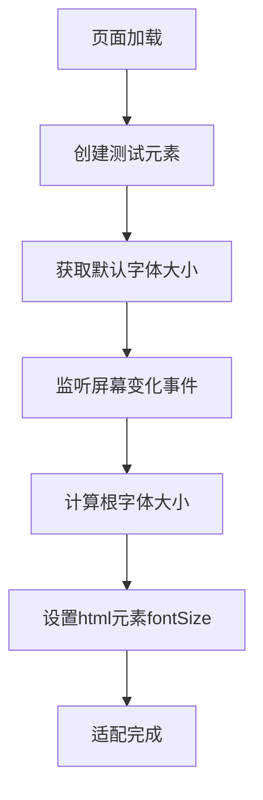

# 移动端适配方案

移动端适配的核心目标是让同一网站在不同尺寸、不同分辨率的移动设备上都能提供良好的视觉和交互体验。

## 效果特点

- **响应式布局**: 适配不同尺寸的移动设备
- **高保真还原**: 保证设计稿在各种设备上的还原度
- **性能优化**: 减少重绘重排，提升页面性能
- **开发效率**: 提供统一的适配方案，降低开发成本

## REM 适配方案

### 核心实现原理

<demo react="react/MobileAdaptation/RemSolution/index.tsx" 
:reactFiles="['react/MobileAdaptation/RemSolution/index.tsx','react/MobileAdaptation/RemSolution/index.scss']" 
/>

```javascript
function adapt(designWidth, rem2px) {
	var d = window.document.createElement('p');
	d.style.width = '1rem'; // 创建一个宽度为1rem的元素
	d.style.display = 'none'; // 隐藏该元素，不影响页面显示
	var head = window.document.getElementsByTagName('head')[0];
	head.appendChild(d); // 将元素添加到head中
	var defaultFontSize = parseFloat(window.getComputedStyle(d, null).getPropertyValue('width'));
	return defaultFontSize; // 返回浏览器默认的1rem对应的像素值
}

!(function (doc, win, designWidth, rem2px) {
	// 参数说明：
	// doc = document, win = window
	// designWidth = 750 (设计稿宽度)
	// rem2px = 100 (1rem应该等于多少设计稿像素)
	var docEl = doc.documentElement, // html根元素
		defaultFontSize = adapt(designWidth, rem2px), // 调用adapt获取默认字体大小
		resizeEvt = 'orientationchange' in window ? 'orientationchange' : 'resize', // 判断设备支持的事件
		recalc = function () {
			var clientWidth = win.innerWidth || doc.documentElement.clientWidth || doc.body.clientWidth; // 获取视口宽度

			if (!clientWidth) return; // 如果获取失败则退出

			if (clientWidth < 750) {
				// 核心计算公式：
				docEl.style.fontSize =
					(((clientWidth / designWidth) * rem2px) / defaultFontSize) * 100 + '%';
			} else {
				// 屏幕宽度≥750px时，固定根字体大小为625%
				docEl.style.fontSize = '625%';
			}
		};

	if (!doc.addEventListener) return;
	win.addEventListener(resizeEvt, recalc, false);
	doc.addEventListener('DOMContentLoaded', recalc, false);
})(document, window, 750, 100);
```

### 实现流程图



## VW 适配方案

### 纯 CSS 方案（推荐）

<demo react="react/MobileAdaptation/VwSolution/index.tsx" 
:reactFiles="['react/MobileAdaptation/VwSolution/index.tsx','react/MobileAdaptation/VwSolution/index.scss']" 
/>

**核心原理**：

- 使用 vw 单位直接设置根字体大小
- 通过媒体查询限制最大和最小字体大小
- 无需 JavaScript，纯 CSS 实现

**实现要点**：

```css
/* 移动端REM适配 - vw方案 */
html {
	/* 设计稿750px，1rem = 100px 的换算公式 */
	font-size: 13.333333vw; /* 100 / 750 * 100 = 13.333333 */
}

/* 大屏限制 - 超过750px时固定根字体大小 */
@media screen and (min-width: 750px) {
	html {
		font-size: 100px; /* 750px宽度时，13.333333vw = 100px */
	}
}

/* 可选：小屏最小字体限制，避免过小 */
@media screen and (max-width: 320px) {
	html {
		font-size: 42.666667px; /* 320px宽度时，13.333333vw ≈ 42.67px */
	}
}

body {
	/* 设置最大宽度，居中显示 */
	max-width: 750px;
	margin: 0 auto;
}
```

### CSS + JS 兼容方案

<demo react="react/MobileAdaptation/VwJsSolution/index.tsx" 
:reactFiles="['react/MobileAdaptation/VwJsSolution/index.tsx','react/MobileAdaptation/VwJsSolution/index.scss']" 
/>

**核心原理**：

- 现代浏览器使用 CSS vw 单位
- 老旧浏览器使用 JavaScript 计算
- 提供降级兼容方案

**实现要点**：

```javascript
!(function (doc, win) {
	var docEl = doc.documentElement,
		resizeEvt = 'orientationchange' in win ? 'orientationchange' : 'resize',
		recalc = function () {
			var clientWidth = docEl.clientWidth || win.innerWidth;
			if (!clientWidth) return;

			// 使用vw单位，JS作为fallback
			if (clientWidth < 750) {
				// vw方案：13.333333vw
				docEl.style.fontSize = (clientWidth / 750) * 100 + 'px';
			} else {
				// 大屏固定
				docEl.style.fontSize = '100px';
			}
		};

	// 现代浏览器直接使用CSS vw，老旧浏览器使用JS计算
	if (!win.CSS || !CSS.supports || !CSS.supports('width', '1vw')) {
		if (!doc.addEventListener) return;
		win.addEventListener(resizeEvt, recalc, false);
		doc.addEventListener('DOMContentLoaded', recalc, false);
	}
})(document, window);
```

## PostCSS 插件方案

### 配置说明

```javascript
// postcss.config.js
module.exports = {
	plugins: {
		'postcss-px-to-viewport': {
			viewportWidth: 750, // 设计稿宽度
			viewportHeight: 1334, // 设计稿高度
			unitPrecision: 6, // 转换精度
			viewportUnit: 'vw', // 转换单位
			selectorBlackList: ['.ignore', '.hairlines'], // 忽略选择器
			minPixelValue: 1, // 最小转换值
			mediaQuery: false // 媒体查询中的px是否转换
		}
	}
};
```

### 使用示例

```scss
// 编写时使用px单位
.container {
	width: 750px; // 会自动转换为 100vw
	height: 200px; // 会自动转换为 26.666667vw
	padding: 20px; // 会自动转换为 2.666667vw
}

// 特殊类名不会被转换
.ignore {
	width: 200px; // 保持px单位
}
```

## 参数配置说明

### REM 方案配置参数

| 参数        | 说明              | 默认值 | 可选值     |
| ----------- | ----------------- | ------ | ---------- |
| designWidth | 设计稿宽度        | 750    | 任何正整数 |
| rem2px      | 1rem 对应的像素值 | 100    | 任何正数   |

### VW 方案配置参数

| 参数        | 说明         | 默认值 | 可选值     |
| ----------- | ------------ | ------ | ---------- |
| designWidth | 设计稿宽度   | 750    | 任何正整数 |
| maxWidth    | 最大宽度限制 | 750    | 任何正整数 |
| minWidth    | 最小宽度限制 | 320    | 任何正整数 |

### PostCSS 插件配置参数

| 参数              | 说明         | 默认值                    |
| ----------------- | ------------ | ------------------------- |
| viewportWidth     | 设计稿宽度   | 750                       |
| viewportHeight    | 设计稿高度   | 1334                      |
| unitPrecision     | 转换精度     | 6                         |
| viewportUnit      | 转换单位     | vw                        |
| selectorBlackList | 忽略选择器   | ['.ignore', '.hairlines'] |
| minPixelValue     | 最小转换值   | 1                         |
| mediaQuery        | 媒体查询转换 | false                     |

## 方案对比

| 方案         | 优点                 | 缺点                   | 适用场景           |
| ------------ | -------------------- | ---------------------- | ------------------ |
| REM 适配     | 兼容性好，控制精确   | 需要 JS 计算，复杂度高 | 需要兼容老旧浏览器 |
| VW 适配      | 纯 CSS 实现，性能好  | 部分老旧浏览器不支持   | 现代移动端项目     |
| PostCSS 插件 | 开发效率高，自动转换 | 需要构建工具支持       | 工程化项目         |

## 设计建议

### 1. 设计稿规范

- 统一设计稿宽度（推荐 750px）
- 使用偶数像素值，便于计算
- 考虑安全区域，重要内容不贴边

### 2. 布局建议

- 使用弹性布局（Flexbox）
- 合理使用媒体查询
- 注意文字大小的可读性

### 3. 图片处理

- 使用 2 倍图保证清晰度
- 采用响应式图片方案
- 合理压缩图片大小

## 进阶应用

### 1. 横屏适配

```css
@media screen and (orientation: landscape) {
	html {
		font-size: 8.888889vw; /* 100 / 1125 * 100 = 8.888889 */
	}
}
```

### 2. 高分辨率屏幕适配

```css
@media (-webkit-min-device-pixel-ratio: 2), (min-resolution: 2dppx) {
	/* 高分辨率屏幕特殊处理 */
}
```

### 3. 主题切换适配

```scss
// 深色主题适配
@media (prefers-color-scheme: dark) {
	.container {
		background: #1a1a1a;
	}
}
```

## 最佳实践

### 1. 性能优化

- 避免频繁触发重排重绘
- 合理使用 transform 和 opacity
- 减少 DOM 操作

### 2. 可访问性

- 保证文字大小符合可访问性标准
- 提供足够的对比度
- 支持系统字体大小设置

### 3. 测试建议

- 在多种设备上测试效果
- 使用浏览器开发者工具模拟不同屏幕
- 关注页面加载性能

## 兼容性说明

### 浏览器支持情况

| 浏览器  | REM 适配 | VW 适配   | PostCSS 插件 |
| ------- | -------- | --------- | ------------ |
| Chrome  | ✅ 支持  | ✅ 支持   | ✅ 支持      |
| Safari  | ✅ 支持  | ✅ 支持   | ✅ 支持      |
| Firefox | ✅ 支持  | ✅ 支持   | ✅ 支持      |
| IE      | ✅ 支持  | ❌ 不支持 | ✅ 支持      |

## 应用场景

1. **移动端网站**: 电商、资讯、社交等各类移动端网站
2. **Hybrid 应用**: Cordova、Ionic 等混合应用
3. **小程序**: 微信小程序、支付宝小程序等
4. **PWA 应用**: 渐进式 Web 应用

---

_移动端适配是现代前端开发的重要技能，选择合适的方案能有效提升开发效率和用户体验。_
