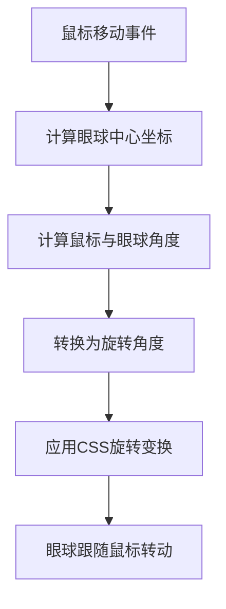

# 眼球追踪鼠标效果

## 简介

实现网页中眼球跟随鼠标移动的交互动画效果，通过计算鼠标位置与眼球中心的角度，使眼球"看向"鼠标位置，营造出网页在"注视"用户的有趣效果。

## 效果特点

### 视觉特性

- **生动交互**: 眼球会跟随鼠标移动，营造生动的交互体验
- **自然动画**: 通过角度计算实现自然的眼球旋转效果
- **视觉吸引**: 强烈的视觉吸引力，提升用户参与度

### 技术特性

- **数学计算**: 使用 `Math.atan2()` 函数计算角度
- **实时响应**: 鼠标移动时实时更新眼球位置
- **组件化设计**: 提供完整的 React 组件实现
- **可配置参数**: 支持自定义眼睛大小、颜色等属性

## 工作原理



当鼠标在页面上移动时，系统会：

1. 获取每个眼球元素的中心坐标
2. 计算鼠标位置与眼球中心的角度（使用 Math.atan2 函数）
3. 将弧度转换为角度并调整方向
4. 应用 CSS 的 transform: rotate() 属性使眼球旋转

## 效果演示

<demo react="react/EyeTracking/index.tsx" 
:reactFiles="['react/EyeTracking/index.tsx','react/EyeTracking/index.scss']" 
/>

## 核心实现原理

### 基础实现方案

**核心思路**：

- 创建眼球 HTML 结构，使用伪元素创建瞳孔
- 监听鼠标移动事件
- 计算鼠标位置与眼球中心的角度
- 使用 CSS transform 属性旋转眼球元素

**优点**：

- 实现简单，性能良好
- 视觉效果生动有趣
- 代码量少，易于理解和维护

**适用场景**：

- 网页趣味性增强
- 交互动画效果
- 游戏化界面设计

### 数学原理

眼球追踪效果的核心在于计算瞳孔在眼球内的位置：

1. **获取眼球中心坐标**：

   ```javascript
   const eyeRect = eye.getBoundingClientRect();
   const eyeCenterX = eyeRect.left + eyeRect.width / 2;
   const eyeCenterY = eyeRect.top + eyeRect.height / 2;
   ```

2. **计算鼠标位置与眼球中心的偏移**：

   ```javascript
   const deltaX = e.pageX - eyeCenterX;
   const deltaY = e.pageY - eyeCenterY;
   ```

3. **限制瞳孔移动范围**：

   ```javascript
   const distance = Math.sqrt(deltaX * deltaX + deltaY * deltaY);
   const eyeRadius = eyeRect.width / 2;
   const pupilRadius = pupil.offsetWidth / 2;
   const maxDistance = eyeRadius - pupilRadius - 5;

   let moveX = deltaX;
   let moveY = deltaY;

   if (distance > maxDistance) {
   	moveX = (deltaX / distance) * maxDistance;
   	moveY = (deltaY / distance) * maxDistance;
   }
   ```

4. **应用移动变换**：
   ```javascript
   pupil.style.transform = `translate(calc(-50% + ${moveX}px), calc(-50% + ${moveY}px))`;
   ```

## 参数配置

### 基础参数

| 参数名          | 类型   | 默认值    | 说明         |
| --------------- | ------ | --------- | ------------ |
| **eyeSize**     | number | 120       | 眼球直径(px) |
| **pupilSize**   | number | 45        | 瞳孔直径(px) |
| **eyeColor**    | string | '#ffffff' | 眼球背景颜色 |
| **pupilColor**  | string | '#000000' | 瞳孔颜色     |
| **borderColor** | string | '#f2761e' | 眼球边框颜色 |

### 高级参数

| 参数名               | 类型   | 默认值            | 说明             |
| -------------------- | ------ | ----------------- | ---------------- |
| **pupilBorderWidth** | number | 10                | 瞳孔边框宽度(px) |
| **pupilBorderColor** | string | '#2196f3'         | 瞳孔边框颜色     |
| **shadowColor**      | string | 'rgba(0,0,0,0.2)' | 眼球阴影颜色     |
| **containerClass**   | string | ''                | 容器自定义类名   |

## 实现方案对比

| 方案            | 优点                   | 缺点         | 适用场景         |
| --------------- | ---------------------- | ------------ | ---------------- |
| **纯 CSS+JS**   | 简单易懂，兼容性好     | 功能相对简单 | 基础眼球追踪效果 |
| **React 组件**  | 组件化，易复用，可配置 | 需要框架支持 | 现代前端项目     |
| **Canvas 绘制** | 性能好，功能强大       | 开发复杂度高 | 复杂图形动画     |
| **SVG 实现**    | 矢量图形，可缩放       | 代码相对复杂 | 响应式设计       |

## 核心代码实现

```typescript
import React, { useEffect, useRef } from 'react';
import './index.scss';

interface EyeTrackingProps {
	eyeSize?: number;
	pupilSize?: number;
	eyeColor?: string;
	pupilColor?: string;
	borderColor?: string;
	pupilBorderWidth?: number;
	pupilBorderColor?: string;
	shadowColor?: string;
	containerClass?: string;
}

const EyeTracking: React.FC<EyeTrackingProps> = ({
	eyeSize = 120,
	pupilSize = 45,
	eyeColor = '#ffffff',
	pupilColor = '#000000',
	borderColor = '#f2761e',
	pupilBorderWidth = 10,
	pupilBorderColor = '#2196f3',
	shadowColor = 'rgba(0,0,0,0.2)',
	containerClass = ''
}) => {
	const containerRef = useRef<HTMLDivElement>(null);

	useEffect(() => {
		const handleMouseMove = (e: MouseEvent) => {
			if (!containerRef.current) return;

			const eyes = containerRef.current.querySelectorAll('.eye');
			eyes.forEach(eye => {
				const pupil = eye.querySelector('.eye-pupil') as HTMLElement;
				if (!pupil) return;

				// 计算眼球中心点坐标
				const eyeRect = eye.getBoundingClientRect();
				const eyeCenterX = eyeRect.left + eyeRect.width / 2;
				const eyeCenterY = eyeRect.top + eyeRect.height / 2;

				// 计算鼠标位置与眼球中心的偏移
				const deltaX = e.pageX - eyeCenterX;
				const deltaY = e.pageY - eyeCenterY;

				// 计算距离
				const distance = Math.sqrt(deltaX * deltaX + deltaY * deltaY);

				// 计算眼球半径（考虑瞳孔大小）
				const eyeRadius = eyeRect.width / 2;
				const pupilRadius = pupil.offsetWidth / 2;
				const maxDistance = eyeRadius - pupilRadius - 8; // 调整边距

				// 限制瞳孔移动范围
				let moveX = deltaX;
				let moveY = deltaY;

				if (distance > maxDistance) {
					moveX = (deltaX / distance) * maxDistance;
					moveY = (deltaY / distance) * maxDistance;
				}

				// 应用移动变换
				pupil.style.transform = `translate(calc(-50% + ${moveX}px), calc(-50% + ${moveY}px))`;
			});
		};

		const container = containerRef.current;
		container?.addEventListener('mousemove', handleMouseMove);

		return () => {
			container?.removeEventListener('mousemove', handleMouseMove);
		};
	}, []);

	return (
		<div ref={containerRef} className={`eye-tracking-container ${containerClass}`}>
			<div className="eye-box">
				<div
					className="eye"
					style={{
						width: `${eyeSize}px`,
						height: `${eyeSize}px`,
						backgroundColor: eyeColor,
						borderColor: borderColor,
						boxShadow: `0 5px 45px ${shadowColor},
                        inset 0 0 15px ${borderColor},
                        inset 0 0 25px ${borderColor}`
					}}
				>
					<div
						className="eye-pupil"
						style={{
							width: `${pupilSize}px`,
							height: `${pupilSize}px`,
							backgroundColor: pupilColor,
							border: `${pupilBorderWidth}px solid ${pupilBorderColor}`
						}}
					></div>
				</div>
				<div
					className="eye"
					style={{
						width: `${eyeSize}px`,
						height: `${eyeSize}px`,
						backgroundColor: eyeColor,
						borderColor: borderColor,
						boxShadow: `0 5px 45px ${shadowColor},
                        inset 0 0 15px ${borderColor},
                        inset 0 0 25px ${borderColor}`
					}}
				>
					<div
						className="eye-pupil"
						style={{
							width: `${pupilSize}px`,
							height: `${pupilSize}px`,
							backgroundColor: pupilColor,
							border: `${pupilBorderWidth}px solid ${pupilBorderColor}`
						}}
					></div>
				</div>
			</div>
		</div>
	);
};

export default EyeTracking;
```

## 样式实现

```scss
.eye-tracking-container {
	display: flex;
	justify-content: center;
	align-items: center;
	min-height: 100vh;
	background: radial-gradient(#f2761e, #ef4921);

	.eye-box {
		display: flex;
	}

	.eye {
		position: relative;
		display: block;
		margin: 0 20px;
		border-radius: 50%;
		border: 2px solid #333;

		.eye-pupil {
			position: absolute;
			top: 50%;
			left: 50%;
			transform: translate(-50%, -50%);
			border-radius: 50%;
			box-sizing: border-box;
			transition: transform 0.1s ease-out;
		}
	}
}
```

## 最佳实践

### 设计原则

1. **性能优化**: 使用 CSS transform 而不是改变布局属性
2. **用户体验**: 确保效果不会干扰页面主要内容
3. **响应式**: 在不同屏幕尺寸下保持良好效果
4. **可访问性**: 考虑动画对某些用户可能造成的不适

### 实施建议

1. **适度使用**: 眼球追踪效果适合用作页面点缀，不宜过多使用
2. **性能监控**: 监控鼠标移动事件处理的性能影响
3. **样式定制**: 提供丰富的样式配置选项
4. **兼容性测试**: 在不同浏览器中测试效果

## 应用场景

### 1. 个性化主页

```typescript
// 在个性化主页中使用眼球追踪效果
import EyeTracking from './components/EyeTracking';

const PersonalHomepage = () => (
	<div className="homepage">
		<header>
			<h1>欢迎来到我的个人空间</h1>
		</header>
		<EyeTracking eyeSize={100} pupilSize={35} />
		<main>{/* 其他页面内容 */}</main>
	</div>
);
```

### 2. 游戏化界面

```typescript
// 在游戏化界面中使用
const GameInterface = () => (
	<div className="game-interface">
		<EyeTracking eyeSize={80} pupilSize={30} eyeColor="#ffff00" pupilColor="#0000ff" />
		<div className="game-content">{/* 游戏内容 */}</div>
	</div>
);
```

### 3. 教学演示

```typescript
// 用于教学演示的交互式示例
const DemoPage = () => {
	const [config, setConfig] = useState({
		eyeSize: 120,
		pupilSize: 45,
		eyeColor: '#ffffff'
	});

	return (
		<div className="demo-page">
			<EyeTracking {...config} />
			<div className="controls">{/* 控制面板用于实时调整参数 */}</div>
		</div>
	);
};
```

## 故障排除

### 1. 眼球不跟随鼠标

**问题**: 眼球没有正确跟随鼠标移动
**解决方案**:

- 检查事件监听器是否正确添加
- 确认眼球元素的选择器是否正确
- 验证坐标计算逻辑是否正确

### 2. 旋转角度不正确

**问题**: 眼球旋转角度与鼠标位置不匹配
**解决方案**:

- 检查角度计算公式是否正确
- 确认坐标系转换是否正确处理
- 验证旋转偏移值是否合适

### 3. 性能问题

**问题**: 鼠标移动时页面卡顿
**解决方案**:

- 使用节流函数限制事件处理频率
- 优化角度计算逻辑
- 减少不必要的 DOM 操作

## 相关资源

### 推荐工具

- **Math.atan2()**: 计算角度的核心函数
- **CSS Transform**: 实现元素旋转
- **React Hooks**: 管理组件状态和副作用
- **Event Listeners**: 监听鼠标移动事件

### 参考文档

- [MDN Math.atan2()](https://developer.mozilla.org/zh-CN/docs/Web/JavaScript/Reference/Global_Objects/Math/atan2)
- [CSS Transform](https://developer.mozilla.org/zh-CN/docs/Web/CSS/transform)
- [React useEffect Hook](https://reactjs.org/docs/hooks-effect.html)
- [Element.getBoundingClientRect()](https://developer.mozilla.org/zh-CN/docs/Web/API/Element/getBoundingClientRect)
