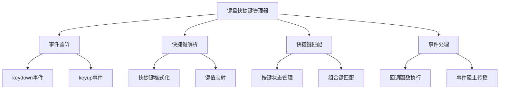

# React 键盘快捷键管理器

在现代 Web 应用中，键盘快捷键是提升用户体验的重要功能。通过合理的快捷键设计，用户可以更高效地操作应用，特别是在需要频繁执行某些操作的场景下。本文将介绍如何在 React 中实现一个功能完整的键盘快捷键管理器。

## 核心特性

### 功能特点

- **灵活配置**: 支持自定义快捷键组合和处理函数
- **实时监控**: 实时显示当前按下的按键
- **动态管理**: 支持运行时添加、移除和更新快捷键
- **全局监听**: 可配置全局或局部快捷键监听
- **响应式设计**: 适配不同屏幕尺寸

### 技术特性

- **TypeScript 支持**: 完整的类型定义和接口
- **Hooks 实现**: 使用 React Hooks 实现核心逻辑
- **性能优化**: 避免不必要的重渲染
- **易于集成**: 简单的 API 设计，易于在项目中集成

## 工作原理



## 效果演示

<demo react="react/KeyboardManager/KeyboardManagerDemo.tsx" 
:reactFiles="['react/KeyboardManager/KeyboardManagerDemo.tsx','react/KeyboardManager/KeyboardManager.tsx','react/KeyboardManager/KeyboardManager.scss']" 
/>

## 核心实现原理

### 组件架构

键盘快捷键管理器采用模块化设计，主要包括以下几个核心部分：

1. **事件监听模块**: 负责监听键盘事件
2. **快捷键解析模块**: 解析和格式化快捷键组合
3. **匹配引擎**: 判断当前按键是否匹配已注册的快捷键
4. **状态管理**: 管理当前按键状态和已注册的快捷键列表

### 核心代码实现

#### 键盘快捷键管理器组件

```typescript
import React, { useState, useEffect, useCallback, useMemo, useRef } from 'react';

/**
 * 键盘快捷键管理器组件属性
 */
export interface KeyboardManagerProps {
	/** 快捷键配置 */
	shortcuts?: ShortcutConfig[];
	/** 是否启用快捷键 */
	enabled?: boolean;
	/** 全局快捷键前缀 */
	prefix?: string;
	/** 快捷键触发时的回调 */
	onShortcutTrigger?: (shortcut: ShortcutConfig) => void;
	/** 自定义样式类名 */
	className?: string;
	/** 自定义样式 */
	style?: React.CSSProperties;
}

/**
 * 快捷键配置
 */
export interface ShortcutConfig {
	/** 快捷键组合，如 'ctrl+k' 或 'cmd+shift+p' */
	key: string;
	/** 快捷键描述 */
	description: string;
	/** 快捷键处理函数 */
	handler: (event: KeyboardEvent) => void;
	/** 是否启用 */
	enabled?: boolean;
	/** 是否全局监听 */
	global?: boolean;
}

/**
 * 键盘快捷键管理器组件
 */
export const KeyboardManager: React.FC<KeyboardManagerProps> = ({
	shortcuts = [],
	enabled = true,
	prefix = '',
	onShortcutTrigger,
	className = '',
	style = {}
}) => {
	const [activeShortcuts, setActiveShortcuts] = useState<ShortcutConfig[]>(shortcuts);
	const [pressedKeys, setPressedKeys] = useState<string[]>([]);
	const pressedKeysRef = useRef<string[]>([]);

	// 格式化快捷键显示
	const formatKeyDisplay = useCallback((key: string): string => {
		const keyMap: Record<string, string> = {
			ctrl: 'Ctrl',
			cmd: 'Cmd',
			shift: 'Shift',
			alt: 'Alt',
			enter: 'Enter',
			escape: 'Esc',
			space: 'Space',
			arrowup: '↑',
			arrowdown: '↓',
			arrowleft: '←',
			arrowright: '→',
			backspace: '⌫',
			tab: 'Tab',
			capslock: 'Caps',
			meta: 'Meta'
		};

		return keyMap[key.toLowerCase()] || key.toUpperCase();
	}, []);

	// 解析快捷键组合
	const parseShortcut = useCallback((shortcut: string): string[] => {
		return shortcut
			.toLowerCase()
			.split('+')
			.map(key => key.trim());
	}, []);

	// 检查快捷键是否匹配
	const isShortcutMatch = useCallback((shortcutKeys: string[], pressed: string[]): boolean => {
		// 检查是否包含所有必需的键
		return (
			shortcutKeys.every(key => pressed.includes(key)) && shortcutKeys.length === pressed.length
		);
	}, []);

	// 处理键盘按下事件
	const handleKeyDown = useCallback(
		(event: KeyboardEvent) => {
			if (!enabled) return;

			const key = event.key.toLowerCase();

			// 避免重复添加
			if (!pressedKeysRef.current.includes(key)) {
				pressedKeysRef.current = [...pressedKeysRef.current, key];
				setPressedKeys([...pressedKeysRef.current]);
			}

			// 检查是否有匹配的快捷键
			activeShortcuts.forEach(shortcut => {
				if (shortcut.enabled === false) return;

				const shortcutKeys = parseShortcut(shortcut.key);

				if (isShortcutMatch(shortcutKeys, pressedKeysRef.current)) {
					event.preventDefault();
					shortcut.handler(event);
					onShortcutTrigger?.(shortcut);
				}
			});
		},
		[enabled, activeShortcuts, parseShortcut, isShortcutMatch, onShortcutTrigger]
	);

	// 处理键盘释放事件
	const handleKeyUp = useCallback((event: KeyboardEvent) => {
		const key = event.key.toLowerCase();
		pressedKeysRef.current = pressedKeysRef.current.filter(k => k !== key);
		setPressedKeys([...pressedKeysRef.current]);
	}, []);

	// 添加新的快捷键
	const addShortcut = useCallback((shortcut: ShortcutConfig) => {
		setActiveShortcuts(prev => [...prev, shortcut]);
	}, []);

	// 移除快捷键
	const removeShortcut = useCallback((key: string) => {
		setActiveShortcuts(prev => prev.filter(s => s.key !== key));
	}, []);

	// 更新快捷键
	const updateShortcut = useCallback((key: string, updates: Partial<ShortcutConfig>) => {
		setActiveShortcuts(prev =>
			prev.map(shortcut => (shortcut.key === key ? { ...shortcut, ...updates } : shortcut))
		);
	}, []);

	// 清空所有快捷键
	const clearShortcuts = useCallback(() => {
		setActiveShortcuts([]);
	}, []);

	// 获取当前激活的快捷键列表
	const getActiveShortcuts = useCallback(() => {
		return activeShortcuts.filter(s => s.enabled !== false);
	}, [activeShortcuts]);

	// 监听键盘事件
	useEffect(() => {
		if (!enabled) return;

		window.addEventListener('keydown', handleKeyDown);
		window.addEventListener('keyup', handleKeyUp);

		return () => {
			window.removeEventListener('keydown', handleKeyDown);
			window.removeEventListener('keyup', handleKeyUp);
		};
	}, [enabled, handleKeyDown, handleKeyUp]);

	// 提供给外部使用的API
	const api = useMemo(
		() => ({
			addShortcut,
			removeShortcut,
			updateShortcut,
			clearShortcuts,
			getActiveShortcuts
		}),
		[addShortcut, removeShortcut, updateShortcut, clearShortcuts, getActiveShortcuts]
	);

	// 通过ref暴露API给父组件
	const ref = useRef<HTMLDivElement>(null);
	useEffect(() => {
		if (ref.current) {
			(ref.current as any).__keyboardManager = api;
		}
	}, [api]);

	return (
		<div ref={ref} className={`keyboard-manager ${className}`} style={style}>
			<div className="keyboard-manager-content">
				{/* 快捷键管理器内容 */}
				<div className="shortcut-list">
					{activeShortcuts
						.filter(s => s.enabled !== false)
						.map((shortcut, index) => (
							<div key={index} className="shortcut-item">
								<div className="shortcut-keys">
									{parseShortcut(shortcut.key).map((key, keyIndex) => (
										<span key={keyIndex} className="key-chip">
											{formatKeyDisplay(key)}
										</span>
									))}
								</div>
								<div className="shortcut-description">{shortcut.description}</div>
							</div>
						))}
				</div>

				{/* 当前按下的键显示 */}
				{pressedKeys.length > 0 && (
					<div className="pressed-keys">
						<div className="pressed-keys-label">当前按键:</div>
						<div className="pressed-keys-list">
							{pressedKeys.map((key, index) => (
								<span key={index} className="key-chip active">
									{formatKeyDisplay(key)}
								</span>
							))}
						</div>
					</div>
				)}
			</div>
		</div>
	);
};

export default KeyboardManager;
```

## 参数说明

### KeyboardManagerProps 属性

| 属性名            | 类型                                 | 默认值      | 描述                   |
| ----------------- | ------------------------------------ | ----------- | ---------------------- |
| shortcuts         | `ShortcutConfig[]`                   | `[]`        | 快捷键配置数组         |
| enabled           | `boolean`                            | `true`      | 是否启用快捷键功能     |
| prefix            | `string`                             | `''`        | 全局快捷键前缀         |
| onShortcutTrigger | `(shortcut: ShortcutConfig) => void` | `undefined` | 快捷键触发时的回调函数 |
| className         | `string`                             | `''`        | 自定义样式类名         |
| style             | `React.CSSProperties`                | `{}`        | 自定义样式对象         |

### ShortcutConfig 配置项

| 属性名      | 类型                             | 必需 | 描述                          |
| ----------- | -------------------------------- | ---- | ----------------------------- |
| key         | `string`                         | 是   | 快捷键组合，如 'ctrl+k'       |
| description | `string`                         | 是   | 快捷键描述信息                |
| handler     | `(event: KeyboardEvent) => void` | 是   | 快捷键处理函数                |
| enabled     | `boolean`                        | 否   | 是否启用该快捷键，默认为 true |
| global      | `boolean`                        | 否   | 是否全局监听，默认为 false    |

## 使用示例

### 基础使用

```jsx
import KeyboardManager from './KeyboardManager';

const App = () => {
	const shortcuts = [
		{
			key: 'ctrl+k',
			description: '打开搜索面板',
			handler: event => {
				event.preventDefault();
				console.log('打开搜索面板');
			}
		},
		{
			key: 'ctrl+s',
			description: '保存当前内容',
			handler: event => {
				event.preventDefault();
				console.log('保存当前内容');
			}
		}
	];

	return (
		<div>
			<h1>我的应用</h1>
			<KeyboardManager shortcuts={shortcuts} />
		</div>
	);
};
```

### 动态管理快捷键

```jsx
import React, { useRef } from 'react';
import KeyboardManager from './KeyboardManager';

const DynamicShortcutDemo = () => {
	const keyboardManagerRef = useRef(null);

	const addNewShortcut = () => {
		if (keyboardManagerRef.current) {
			const manager = keyboardManagerRef.current.__keyboardManager;
			if (manager) {
				manager.addShortcut({
					key: 'ctrl+d',
					description: '删除选中项',
					handler: event => {
						event.preventDefault();
						console.log('删除选中项');
					}
				});
			}
		}
	};

	const removeShortcut = () => {
		if (keyboardManagerRef.current) {
			const manager = keyboardManagerRef.current.__keyboardManager;
			if (manager) {
				manager.removeShortcut('ctrl+s');
			}
		}
	};

	return (
		<div>
			<button onClick={addNewShortcut}>添加新快捷键</button>
			<button onClick={removeShortcut}>移除保存快捷键</button>
			<KeyboardManager ref={keyboardManagerRef} />
		</div>
	);
};
```

### 高级配置

```jsx
import KeyboardManager from './KeyboardManager';

const AdvancedDemo = () => {
	const shortcuts = [
		{
			key: 'ctrl+shift+n',
			description: '新建项目',
			handler: event => {
				event.preventDefault();
				console.log('新建项目');
			},
			enabled: true,
			global: true
		},
		{
			key: 'f5',
			description: '刷新页面',
			handler: event => {
				event.preventDefault();
				window.location.reload();
			}
		}
	];

	return (
		<KeyboardManager
			shortcuts={shortcuts}
			enabled={true}
			onShortcutTrigger={shortcut => {
				console.log(`触发了快捷键: ${shortcut.description}`);
			}}
			className="custom-keyboard-manager"
			style={{ marginTop: '20px' }}
		/>
	);
};
```

## 样式定制

### SCSS 样式文件

```scss
.keyboard-manager {
	width: 600px;
	max-width: 100%;
	margin: 0 auto;
	padding: 20px;
	border-radius: 8px;
	background: #f8f9fa;
	box-shadow: 0 2px 10px rgba(0, 0, 0, 0.1);
	font-family: -apple-system, BlinkMacSystemFont, 'Segoe UI', Roboto, sans-serif;

	&-content {
		display: flex;
		flex-direction: column;
		gap: 20px;
	}

	.shortcut-list {
		display: flex;
		flex-direction: column;
		gap: 12px;
	}

	.shortcut-item {
		display: flex;
		align-items: center;
		justify-content: space-between;
		padding: 12px 16px;
		background: white;
		border-radius: 6px;
		box-shadow: 0 1px 3px rgba(0, 0, 0, 0.05);
		transition: all 0.2s ease;

		&:hover {
			box-shadow: 0 2px 6px rgba(0, 0, 0, 0.1);
			transform: translateY(-1px);
		}
	}

	.shortcut-keys {
		display: flex;
		gap: 6px;
	}

	.shortcut-description {
		color: #495057;
		font-size: 14px;
	}

	.key-chip {
		display: inline-flex;
		align-items: center;
		justify-content: center;
		min-width: 32px;
		height: 32px;
		padding: 0 8px;
		background: #e9ecef;
		border: 1px solid #dee2e6;
		border-radius: 4px;
		font-size: 12px;
		font-weight: 500;
		color: #495057;
		text-transform: uppercase;

		&.active {
			background: #007bff;
			color: white;
			border-color: #007bff;
			box-shadow: 0 0 0 2px rgba(0, 123, 255, 0.25);
		}
	}

	.pressed-keys {
		display: flex;
		flex-direction: column;
		gap: 8px;
		padding: 16px;
		background: white;
		border-radius: 6px;
		box-shadow: 0 1px 3px rgba(0, 0, 0, 0.05);

		&-label {
			font-weight: 600;
			color: #212529;
			font-size: 14px;
		}

		&-list {
			display: flex;
			flex-wrap: wrap;
			gap: 6px;
		}
	}

	// 响应式设计
	@media (max-width: 768px) {
		width: 100%;
		padding: 16px;

		.shortcut-item {
			flex-direction: column;
			align-items: flex-start;
			gap: 8px;
		}

		.shortcut-keys {
			order: 1;
		}

		.shortcut-description {
			order: 2;
		}
	}
}
```

## 最佳实践

### 1. 快捷键设计原则

- **一致性**: 保持与操作系统或流行应用的快捷键一致
- **简洁性**: 使用简单易记的组合键
- **避免冲突**: 避免与浏览器或操作系统的默认快捷键冲突
- **可发现性**: 在 UI 中明确标示可用的快捷键

### 2. 性能优化建议

- **事件节流**: 对于高频触发的快捷键，考虑使用节流或防抖
- **条件监听**: 只在需要时启用快捷键监听
- **内存管理**: 及时清理事件监听器，避免内存泄漏

### 3. 用户体验优化

- **反馈机制**: 快捷键触发时提供视觉或听觉反馈
- **可配置性**: 允许用户自定义快捷键
- **帮助文档**: 提供快捷键列表和使用说明

## 故障排除

### 1. 快捷键不触发

**问题**: 设置的快捷键没有响应
**解决方案**:

- 检查组件是否已启用(`enabled属性`)
- 确认快捷键格式是否正确
- 检查是否有其他组件阻止了事件传播

### 2. 快捷键冲突

**问题**: 快捷键与浏览器默认行为冲突
**解决方案**:

- 使用`event.preventDefault()`阻止默认行为
- 选择不常用的组合键
- 提供用户自定义选项

### 3. 移动端兼容性

**问题**: 移动端设备无法使用键盘快捷键
**解决方案**:

- 在移动端隐藏快捷键相关 UI
- 提供触摸友好的替代操作
- 使用响应式设计适配不同设备

## 扩展功能

### 1. 快捷键帮助面板

```typescript
const ShortcutHelpPanel: React.FC<{ shortcuts: ShortcutConfig[] }> = ({ shortcuts }) => {
	return (
		<div className="shortcut-help-panel">
			<h3>快捷键列表</h3>
			<ul>
				{shortcuts.map((shortcut, index) => (
					<li key={index}>
						<kbd>{shortcut.key}</kbd>: {shortcut.description}
					</li>
				))}
			</ul>
		</div>
	);
};
```

### 2. 快捷键录制功能

```typescript
const ShortcutRecorder: React.FC<{
	onRecorded: (shortcut: string) => void;
}> = ({ onRecorded }) => {
	const [isRecording, setIsRecording] = useState(false);
	const [recordedKeys, setRecordedKeys] = useState<string[]>([]);

	useEffect(() => {
		if (!isRecording) return;

		const handleKeyDown = (event: KeyboardEvent) => {
			event.preventDefault();
			const key = event.key.toLowerCase();

			if (!recordedKeys.includes(key)) {
				const newKeys = [...recordedKeys, key];
				setRecordedKeys(newKeys);

				// 当用户按下Enter时完成录制
				if (key === 'enter') {
					onRecorded(newKeys.filter(k => k !== 'enter').join('+'));
					setIsRecording(false);
					setRecordedKeys([]);
				}
			}
		};

		window.addEventListener('keydown', handleKeyDown);
		return () => window.removeEventListener('keydown', handleKeyDown);
	}, [isRecording, recordedKeys, onRecorded]);

	return (
		<button onClick={() => setIsRecording(true)} className={isRecording ? 'recording' : ''}>
			{isRecording ? '按下快捷键组合...' : '录制快捷键'}
		</button>
	);
};
```

## 相关资源

- [MDN KeyboardEvent](https://developer.mozilla.org/zh-CN/docs/Web/API/KeyboardEvent)
- [React Hooks 文档](https://reactjs.org/docs/hooks-intro.html)
- [键盘快捷键设计指南](https://developer.mozilla.org/zh-CN/docs/Web/Accessibility/Understanding_WCAG/Keyboard)

通过以上实现，我们创建了一个功能完整、易于使用的 React 键盘快捷键管理器，可以显著提升 Web 应用的用户体验。
