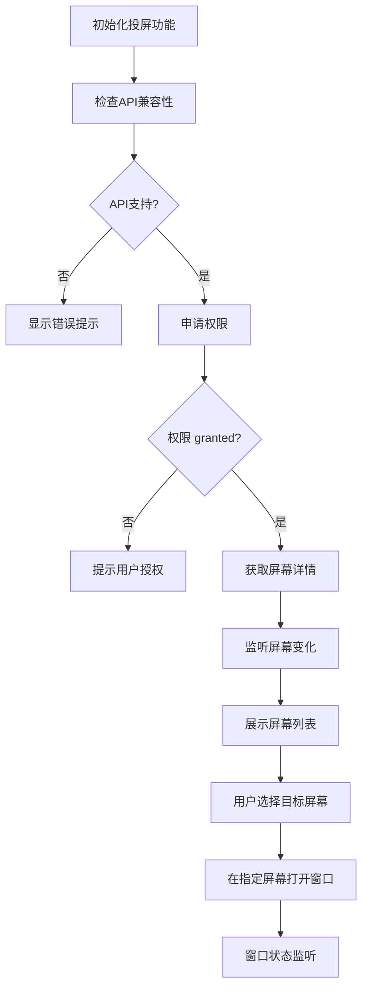
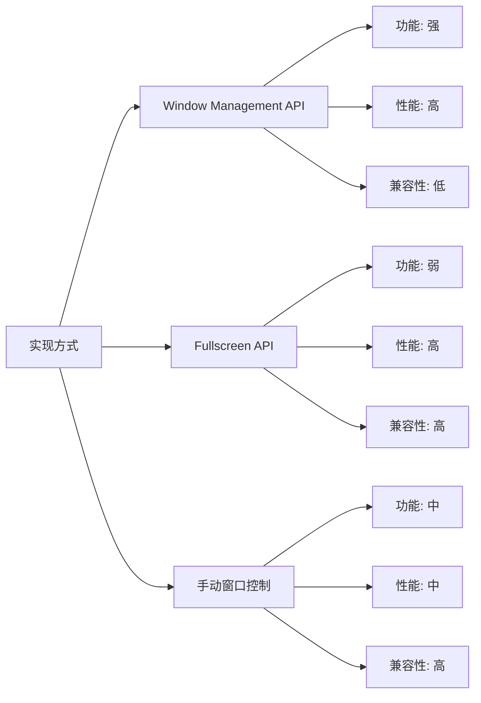

# Vue3 大屏投屏功能开发：多显示器适配实践

## 简介

在大屏项目开发中，有时需要在不同显示器上展示项目的不同页面。本文介绍如何使用 Window Management API 项目中实现多显示器投屏功能，实现在指定屏幕上打开新窗口展示特定内容。

## 效果特点

### 功能特性

- **多屏幕支持**: 能够识别并获取所有连接的显示器信息
- **权限管理**: 自动申请和监听窗口管理权限
- **屏幕监听**: 实时监听屏幕状态变化（新增/断开显示器、分辨率修改）
- **窗口控制**: 在指定屏幕位置和尺寸打开新窗口
- **兼容性处理**: 提供降级方案和错误处理

### 技术特性

- **现代化 API**: 基于 Window Management API 实现
- **响应式设计**: 适配不同屏幕分辨率
- **状态管理**: 完善的权限和屏幕状态管理
- **错误处理**: 完善的异常处理和用户提示

## 工作原理



## 效果演示

<demo react="react/ScreenProjection/index.tsx" 
:reactFiles="['react/ScreenProjection/index.tsx','react/ScreenProjection/index.scss']" 
/>

## 核心实现原理

### 1. 权限申请与监听

```typescript
let permissionStatus = null; // 存储权限状态
let screenDetails = null; // 存储屏幕详情

// 初始化权限监听
const initPermission = async () => {
	permissionStatus = await navigator.permissions.query({ name: 'window-management' });
	// 监听权限变化
	permissionStatus.addEventListener('change', e => {
		permissionStatus = e;
		updateScreens(false); // 权限变化后更新屏幕信息
	});
};
```

### 2. 屏幕信息获取与更新

```typescript
// 更新屏幕信息
const updateScreens = async (requestPermission = true) => {
	const screens = await getScreenDetailsWithFallback(requestPermission);
	return {
		screenList: screens,
		currentScreen: await getCurrentScreen() // 获取当前窗口所在屏幕
	};
};

// 获取屏幕详情（含兼容性兜底）
const getScreenDetailsWithFallback = async (requestPermission = false) => {
	if (!('getScreenDetails' in self)) return [window.screen];

	try {
		// 检查权限，无权限且允许申请时尝试获取
		if (
			!screenDetails &&
			(permissionStatus?.state === 'granted' ||
				(permissionStatus?.state === 'prompt' && requestPermission))
		) {
			screenDetails = await window.getScreenDetails().catch(e => {
				console.error('获取屏幕信息失败', e);
				if (
					window.location.hostname !== 'localhost' &&
					!window.location.protocol.includes('https')
				) {
					ElMessage.warning('投屏功能仅支持localhost或HTTPS环境');
				}
				return null;
			});

			// 监听屏幕配置变化（如接入新显示器）
			if (screenDetails) {
				screenDetails.addEventListener('screenchange', () => {
					updateScreens(false);
					setScreenChangeListeners(); // 绑定单个屏幕的变化监听
				});
				setScreenChangeListeners();
			}
		}

		// 提示单屏幕情况
		if (screenDetails?.screens.length === 1) {
			ElMessage.warning('请连接多个显示器以使用完整投屏功能');
		}

		return screenDetails?.screens || [window.screen];
	} catch (error) {
		console.error('处理屏幕信息出错', error);
		return [window.screen];
	}
};
```

### 3. 指定屏幕打开窗口

```typescript
let popup = null; // 存储当前打开的窗口引用

const openPopup = async screenIndex => {
	const screens = await getScreenDetailsWithFallback(true);
	const currentScreen = await getCurrentScreen();

	// 检查目标屏幕是否存在
	const targetScreen = screens[screenIndex];
	if (!targetScreen) {
		ElMessage.error('无法获取指定屏幕信息，请检查环境或权限');
		return null;
	}

	// 避免在当前屏幕重复打开
	if (currentScreen.label === targetScreen.label) {
		ElMessage.warning('当前屏幕已打开窗口，无需重复操作');
		return null;
	}

	// 配置新窗口参数（全屏适配目标屏幕）
	const windowOptions = {
		url: window.origin, // 投屏页面地址（可替换为具体页面路径）
		x: targetScreen.availLeft || 0, // 窗口左上角x坐标（适配屏幕可用区域）
		y: targetScreen.availTop || 0, // 窗口左上角y坐标
		width: targetScreen.availWidth || 800, // 窗口宽度（屏幕可用宽度）
		height: targetScreen.availHeight || 600, // 窗口高度（屏幕可用高度）
		left: targetScreen.availLeft || 0, // 兼容部分浏览器的left参数
		top: targetScreen.availTop || 0 // 兼容部分浏览器的top参数
	};

	// 打开新窗口并存储引用
	popup = window.open(
		windowOptions.url,
		`screen-${screenIndex}`,
		`width=${windowOptions.width},height=${windowOptions.height},left=${windowOptions.left},top=${windowOptions.top}`
	);

	return popup;
};
```

## 参数配置

### 自定义参数选项

| 参数名           | 类型   | 默认值            | 说明         |
| ---------------- | ------ | ----------------- | ------------ |
| `screenIndex`    | number | 0                 | 目标屏幕索引 |
| `windowUrl`      | string | window.origin     | 投屏页面地址 |
| `windowName`     | string | `screen-${index}` | 窗口名称     |
| `windowFeatures` | string | 自动计算          | 窗口特性参数 |

### 配置示例

```typescript
const screenProjectionConfig = {
	screenIndex: 1,
	windowUrl: '/projection-screen',
	windowName: 'projection-window'
	// 窗口特性会根据目标屏幕自动计算
};
```

## 实现方案对比

| 实现方式                  | 优点                 | 缺点               | 适用场景       |
| ------------------------- | -------------------- | ------------------ | -------------- |
| **Window Management API** | 功能强大，可精确控制 | 浏览器兼容性限制   | 现代浏览器环境 |
| **Fullscreen API**        | 兼容性好             | 功能有限，只能全屏 | 简单全屏需求   |
| **手动窗口控制**          | 灵活性高             | 需要用户手动操作   | 特殊场景需求   |

## 高级功能

### 1. 屏幕状态监听

```typescript
// 绑定单个屏幕的变化监听
const setScreenChangeListeners = () => {
	const screens = screenDetails?.screens || [window.screen];
	screens.forEach(screen => {
		screen.onchange = () => updateScreens(false);
	});
};
```

### 2. 窗口状态管理

```typescript
// 监听窗口状态变化
const monitorWindowStatus = popupWindow => {
	const interval = setInterval(() => {
		if (popupWindow.closed) {
			console.log('投屏窗口已关闭');
			clearInterval(interval);
			// 执行清理逻辑
		}
	}, 1000);

	return interval;
};
```

### 3. 权限状态处理

```typescript
// 处理权限状态变化
const handlePermissionChange = status => {
	switch (status.state) {
		case 'granted':
			console.log('已获得窗口管理权限');
			break;
		case 'denied':
			console.log('窗口管理权限被拒绝');
			break;
		case 'prompt':
			console.log('需要用户授权窗口管理权限');
			break;
	}
};
```

## 响应式设计

### 屏幕适配

```typescript
// 根据目标屏幕分辨率调整窗口尺寸
const calculateWindowFeatures = targetScreen => {
	const { availWidth, availHeight, availLeft, availTop } = targetScreen;
	return `width=${availWidth},height=${availHeight},left=${availLeft},top=${availTop}`;
};
```

### 设备检测

```typescript
// 检测设备类型
const detectDeviceType = () => {
	const width = window.innerWidth;
	if (width < 768) return 'mobile';
	if (width < 1024) return 'tablet';
	return 'desktop';
};
```

## 性能优化

### 1. 权限缓存

```typescript
// 缓存权限状态避免重复申请
class PermissionCache {
	private cache: Map<string, PermissionStatus> = new Map();

	async get(name: string): Promise<PermissionStatus> {
		if (this.cache.has(name)) {
			return this.cache.get(name)!;
		}

		const status = await navigator.permissions.query({ name: name as any });
		this.cache.set(name, status);
		return status;
	}
}
```

### 2. 屏幕信息缓存

```typescript
// 缓存屏幕信息避免重复获取
class ScreenCache {
	private cache: ScreenDetails | null = null;
	private timestamp: number = 0;
	private readonly TTL = 5000; // 5秒缓存

	async get(): Promise<ScreenDetails> {
		const now = Date.now();
		if (this.cache && now - this.timestamp < this.TTL) {
			return this.cache;
		}

		this.cache = await window.getScreenDetails();
		this.timestamp = now;
		return this.cache;
	}
}
```

## 故障排除

### 1. API 不支持

**问题**: 浏览器不支持 Window Management API
**解决方案**:

- 检查浏览器版本和类型
- 提供降级方案（如提示用户手动操作）
- 建议使用支持的浏览器

### 2. 权限被拒绝

**问题**: 用户拒绝了窗口管理权限
**解决方案**:

- 提示用户重新授权
- 提供手动操作指引
- 记录用户选择避免重复提示

### 3. 窗口打开失败

**问题**: window.open 返回 null
**解决方案**:

- 检查弹窗拦截设置
- 提示用户允许弹窗
- 提供手动打开链接

## 技术要点

### 1. API 兼容性检测

```typescript
// 检查API支持情况
const checkAPICompatibility = () => {
	return 'getScreenDetails' in self && 'isExtended' in screen && 'onchange' in screen;
};
```

### 2. 权限状态处理

```typescript
// 处理权限状态
const handlePermissionState = (state: PermissionState) => {
	switch (state) {
		case 'granted':
			// 权限已授予
			break;
		case 'denied':
			// 权限被拒绝
			break;
		case 'prompt':
			// 需要用户授权
			break;
	}
};
```

### 3. 错误处理

```typescript
// 统一错误处理
const handleError = (error: Error, context: string) => {
	console.error(`[${context}] 错误:`, error);
	// 根据错误类型显示不同提示
	if (error.name === 'NotAllowedError') {
		ElMessage.error('权限不足，请检查浏览器设置');
	} else {
		ElMessage.error('操作失败，请重试');
	}
};
```

## 应用场景

### 1. 大屏展示系统

```typescript
// 大屏展示系统中的投屏功能
const BigScreenProjection = () => {
	const [screens, setScreens] = useState([]);
	const [selectedScreen, setSelectedScreen] = useState(0);

	// 获取屏幕列表
	useEffect(() => {
		updateScreens().then(result => {
			setScreens(result.screenList);
		});
	}, []);

	// 投屏到指定屏幕
	const handleProjection = () => {
		openPopup(selectedScreen);
	};

	return (
		<div className="big-screen-projection">
			<h2>大屏投屏控制</h2>
			<select value={selectedScreen} onChange={e => setSelectedScreen(Number(e.target.value))}>
				{screens.map((screen, index) => (
					<option key={index} value={index}>
						屏幕 {index + 1} ({screen.availWidth}x{screen.availHeight})
					</option>
				))}
			</select>
			<button onClick={handleProjection}>开始投屏</button>
		</div>
	);
};
```

### 2. 多显示器办公应用

```typescript
// 办公应用中的多屏协作
const MultiScreenOffice = () => {
	const [isProjected, setIsProjected] = useState(false);
	const popupRef = useRef(null);

	const startProjection = async () => {
		const popup = await openPopup(1); // 投屏到第二屏幕
		if (popup) {
			popupRef.current = popup;
			setIsProjected(true);
		}
	};

	const stopProjection = () => {
		if (popupRef.current && !popupRef.current.closed) {
			popupRef.current.close();
			setIsProjected(false);
		}
	};

	return (
		<div className="multi-screen-office">
			<h2>多屏办公</h2>
			{isProjected ? (
				<button onClick={stopProjection}>停止投屏</button>
			) : (
				<button onClick={startProjection}>开始投屏</button>
			)}
		</div>
	);
};
```

### 3. 教学演示系统

```typescript
// 教学演示中的屏幕分享
const TeachingProjection = () => {
	const [projectionMode, setProjectionMode] = useState('content');

	const handleProjection = async mode => {
		setProjectionMode(mode);
		// 根据模式打开不同内容的投屏页面
		const url = mode === 'content' ? '/teaching-content' : '/teaching-notes';
		// 实现投屏逻辑
	};

	return (
		<div className="teaching-projection">
			<h2>教学演示</h2>
			<div className="projection-controls">
				<button
					className={projectionMode === 'content' ? 'active' : ''}
					onClick={() => handleProjection('content')}
				>
					内容展示
				</button>
				<button
					className={projectionMode === 'notes' ? 'active' : ''}
					onClick={() => handleProjection('notes')}
				>
					备注展示
				</button>
			</div>
		</div>
	);
};
```

## 性能分析

不同实现方式的性能对比：



## 安全考虑

### 1. 权限安全

```typescript
// 安全的权限申请
const requestPermissionSafely = async () => {
	try {
		const permission = await navigator.permissions.query({
			name: 'window-management'
		});
		return permission.state === 'granted';
	} catch (error) {
		console.warn('权限申请失败:', error);
		return false;
	}
};
```

### 2. 窗口安全

```typescript
// 安全的窗口操作
const openWindowSafely = (url, name, features) => {
	// 验证URL安全性
	if (!isValidUrl(url)) {
		throw new Error('无效的URL');
	}

	// 打开窗口
	const popup = window.open(url, name, features);

	// 检查是否被拦截
	if (!popup) {
		throw new Error('窗口被拦截，请允许弹窗');
	}

	return popup;
};
```

### 3. 数据安全

```typescript
// 安全的数据传输
const transferDataSecurely = (targetWindow, data) => {
	// 验证目标窗口
	if (!targetWindow || targetWindow.closed) {
		throw new Error('目标窗口无效');
	}

	// 发送数据
	targetWindow.postMessage(data, window.location.origin);
};
```

## 注意事项

1. **环境限制**: Window Management API 仅支持 localhost 或 HTTPS 环境，HTTP 环境下无法正常获取屏幕信息
2. **浏览器兼容性**: 目前仅 Chrome、Edge 等 Chromium 内核浏览器支持该 API，Firefox、Safari 暂不兼容
3. **权限管理**: 需用户主动授予窗口管理权限，否则无法获取多屏幕信息
4. **窗口监听**: 可添加定时器监听打开窗口的状态（如是否被关闭），避免内存泄漏或无效引用

---

通过 Window Management API 实现的多显示器投屏功能，能为大屏项目和多屏演示场景提供优质的功能体验。开发时需注意兼容性兜底与用户体验提示，确保功能稳定可用。
