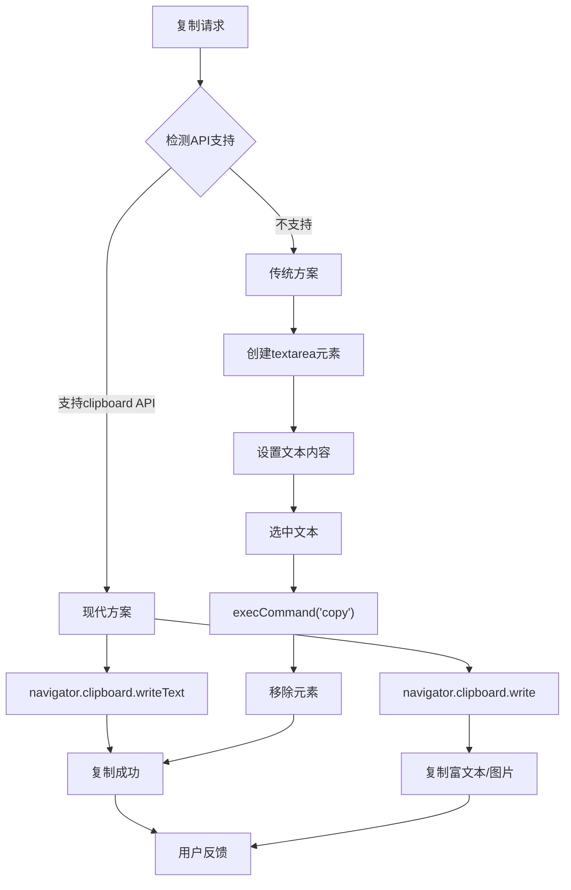

# 前端复制功能实现方案

## 简介

本文介绍前端实现复制功能的三种主要方案，从传统的 `document.execCommand` 到现代的 `navigator.clipboard` API，再到支持图片和富文本的高级复制功能。每种方案都有其适用场景和特点，开发者可以根据项目需求选择合适的实现方式。

## 效果特点

### 功能特性

- **多种方案**: 支持三种不同的复制实现方式
- **兼容性考虑**: 从传统方案到现代 API 的完整覆盖
- **格式支持**: 支持纯文本、HTML 和图片复制
- **用户体验**: 提供即时反馈和错误处理

### 技术特性

- **渐进增强**: 优先使用现代 API，降级到传统方案
- **类型安全**: 完整的 TypeScript 类型定义
- **性能优化**: 避免不必要的 DOM 操作
- **错误处理**: 完善的异常捕获和用户提示

## 工作原理



## 效果演示

<demo react="react/CopyFunctionality/index.tsx" 
:reactFiles="['react/CopyFunctionality/index.tsx','react/CopyFunctionality/index.scss']" 
/>

## 核心实现原理

### 方案一：传统 execCommand 方案

**核心思路**：

- 创建隐藏的 `<textarea>` 元素
- 设置文本内容并选中
- 使用 `document.execCommand('copy')` 执行复制
- 清理 DOM 元素

```typescript
function copyTextFallback(text: string): Promise<boolean> {
	return new Promise(resolve => {
		const textarea = document.createElement('textarea');
		textarea.value = text;
		textarea.style.position = 'fixed';
		textarea.style.opacity = '0';
		textarea.style.left = '-9999px';

		document.body.appendChild(textarea);
		textarea.select();

		try {
			const success = document.execCommand('copy');
			resolve(success);
		} catch (err) {
			console.error('复制失败', err);
			resolve(false);
		} finally {
			document.body.removeChild(textarea);
		}
	});
}
```

**优点**：

- 兼容性最好，支持所有浏览器
- 实现简单，代码量少
- 不需要 HTTPS 环境

**缺点**：

- API 已废弃，不推荐使用
- 只能复制纯文本
- 需要操作 DOM 元素

### 方案二：现代 clipboard API

**核心思路**：

- 使用 `navigator.clipboard.writeText()` 直接复制文本
- 基于 Promise 的现代 API 设计
- 无需额外 DOM 操作

```typescript
async function copyText(text: string): Promise<boolean> {
	try {
		await navigator.clipboard.writeText(text);
		return true;
	} catch (err) {
		console.error('复制失败：', err);
		return false;
	}
}
```

**优点**：

- 简洁优雅，无需 DOM 操作
- 现代 Promise 风格
- 更好的安全性

**缺点**：

- 需要 HTTPS 环境
- 需要用户交互触发
- 浏览器兼容性相对较新

### 方案三：富文本和图片复制

**核心思路**：

- 使用 `navigator.clipboard.write()` API
- 支持多种 MIME 类型
- 可复制 HTML、图片等富媒体内容

```typescript
// 复制HTML内容
async function copyHtml(html: string): Promise<boolean> {
	try {
		const blob = new Blob([html], { type: 'text/html' });
		const data = [new ClipboardItem({ 'text/html': blob })];
		await navigator.clipboard.write(data);
		return true;
	} catch (err) {
		console.error('复制HTML失败：', err);
		return false;
	}
}

// 复制图片
async function copyImage(imageUrl: string): Promise<boolean> {
	try {
		const response = await fetch(imageUrl);
		const blob = await response.blob();
		await navigator.clipboard.write([new ClipboardItem({ [blob.type]: blob })]);
		return true;
	} catch (err) {
		console.error('复制图片失败：', err);
		return false;
	}
}
```

## 实现方案对比

| 方案                    | 兼容性 | 功能支持 | 安全要求 | 推荐度     |
| ----------------------- | ------ | -------- | -------- | ---------- |
| **execCommand**         | 最好   | 仅文本   | 无       | ⭐⭐       |
| **clipboard.writeText** | 较好   | 仅文本   | HTTPS    | ⭐⭐⭐⭐   |
| **clipboard.write**     | 一般   | 富媒体   | HTTPS    | ⭐⭐⭐⭐⭐ |

## 参数配置

### 基础配置

| 参数           | 类型    | 默认值 | 说明                 |
| -------------- | ------- | ------ | -------------------- |
| `text`         | string  | -      | 要复制的文本内容     |
| `fallback`     | boolean | true   | 是否启用降级方案     |
| `showFeedback` | boolean | true   | 是否显示复制反馈     |
| `timeout`      | number  | 3000   | 反馈消息显示时长(ms) |

### 高级配置

| 参数           | 类型     | 默认值 | 说明               |
| -------------- | -------- | ------ | ------------------ |
| `supportHtml`  | boolean  | false  | 是否支持 HTML 复制 |
| `supportImage` | boolean  | false  | 是否支持图片复制   |
| `onSuccess`    | function | -      | 复制成功回调       |
| `onError`      | function | -      | 复制失败回调       |

## 高级功能

### 智能降级策略

```typescript
class CopyManager {
	private static async detectSupport(): Promise<'modern' | 'legacy' | 'none'> {
		if (navigator.clipboard && window.isSecureContext) {
			try {
				await navigator.clipboard.writeText('');
				return 'modern';
			} catch {
				return 'legacy';
			}
		}
		return document.execCommand ? 'legacy' : 'none';
	}

	static async copy(text: string): Promise<boolean> {
		const support = await this.detectSupport();

		switch (support) {
			case 'modern':
				return this.modernCopy(text);
			case 'legacy':
				return this.legacyCopy(text);
			default:
				console.warn('当前环境不支持复制功能');
				return false;
		}
	}
}
```

### 批量复制功能

```typescript
interface CopyItem {
	type: 'text' | 'html' | 'image';
	content: string;
	label?: string;
}

const copyMultiple = async (items: CopyItem[]): Promise<boolean[]> => {
	const results = await Promise.allSettled(
		items.map(item => {
			switch (item.type) {
				case 'text':
					return copyText(item.content);
				case 'html':
					return copyHtml(item.content);
				case 'image':
					return copyImage(item.content);
				default:
					return Promise.resolve(false);
			}
		})
	);

	return results.map(result => (result.status === 'fulfilled' ? result.value : false));
};
```

## 性能优化

### 1. 避免重复 DOM 操作

```typescript
// 复用textarea元素
let sharedTextarea: HTMLTextAreaElement | null = null;

const getSharedTextarea = (): HTMLTextAreaElement => {
	if (!sharedTextarea) {
		sharedTextarea = document.createElement('textarea');
		sharedTextarea.style.position = 'fixed';
		sharedTextarea.style.opacity = '0';
		sharedTextarea.style.left = '-9999px';
		document.body.appendChild(sharedTextarea);
	}
	return sharedTextarea;
};
```

### 2. 异步处理优化

```typescript
const copyWithQueue = (() => {
	const queue: Array<() => Promise<boolean>> = [];
	let processing = false;

	const processQueue = async () => {
		if (processing || queue.length === 0) return;

		processing = true;
		while (queue.length > 0) {
			const task = queue.shift()!;
			await task();
			await new Promise(resolve => setTimeout(resolve, 100)); // 防止过快操作
		}
		processing = false;
	};

	return (copyFn: () => Promise<boolean>) => {
		queue.push(copyFn);
		processQueue();
	};
})();
```

## 故障排除

### 1. HTTPS 环境问题

**问题**: 在 HTTP 环境下 clipboard API 不可用
**解决方案**:

- 开发环境使用 localhost（被视为安全上下文）
- 生产环境部署 HTTPS
- 提供 execCommand 降级方案

### 2. 用户权限问题

**问题**: 浏览器阻止 clipboard 访问
**解决方案**:

- 确保在用户交互事件中调用
- 提供明确的用户提示
- 实现权限检测和降级

### 3. 跨域图片复制

**问题**: 跨域图片无法复制
**解决方案**:

- 使用代理服务器
- 设置正确的 CORS 头
- 转换为 base64 格式

## 应用场景

### 1. 代码片段复制

```typescript
const CodeCopyButton: React.FC<{ code: string }> = ({ code }) => {
	const [copied, setCopied] = useState(false);

	const handleCopy = async () => {
		const success = await copyText(code);
		if (success) {
			setCopied(true);
			setTimeout(() => setCopied(false), 2000);
		}
	};

	return (
		<button onClick={handleCopy} className="copy-btn">
			{copied ? '已复制' : '复制代码'}
		</button>
	);
};
```

### 2. 分享链接复制

```typescript
const ShareButton: React.FC<{ url: string; title: string }> = ({ url, title }) => {
	const handleShare = async () => {
		const shareText = `${title} - ${url}`;
		await copyText(shareText);
		// 显示分享成功提示
	};

	return <button onClick={handleShare}>分享链接</button>;
};
```

### 3. 表格数据复制

```typescript
const TableCopyButton: React.FC<{ data: any[][] }> = ({ data }) => {
	const handleCopy = async () => {
		// 转换为制表符分隔的文本
		const text = data.map(row => row.join('\t')).join('\n');
		await copyText(text);
	};

	return <button onClick={handleCopy}>复制表格</button>;
};
```
