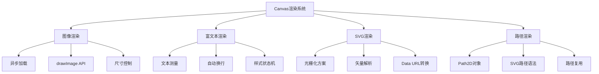

# Canvas 高级渲染技术：富文本、图像、SVG 与路径渲染

## 简介

Canvas 是一个基于命令的绘图表面，与 HTML DOM 的声明式模型完全不同。它不"记住"绘制内容，只响应绘图指令并直接写入像素缓冲区。本文将系统解析如何在 Canvas 中实现富文本、图像、SVG 元素及其路径数据的高级渲染技术。

## 效果特点

### 核心能力

- **图像渲染**: 支持多种图像源的像素级复制
- **富文本渲染**: 手动布局与样式拼接实现复杂文本效果
- **SVG 渲染**: 光栅化与矢量解析两种方案
- **路径渲染**: SVG Path 字符串到 Canvas 路径对象的转换

### 技术特性

- **命令式绘图**: 基于绘图指令的底层渲染控制
- **性能优化**: 利用 Path2D 对象和对象池技术
- **跨平台兼容**: 支持现代浏览器的 Canvas API
- **实时交互**: 支持动态参数配置和实时预览

## 工作原理



## 效果演示

<demo react="react/CanvasAdvancedRenderer/index.tsx" 
:reactFiles="['react/CanvasAdvancedRenderer/index.tsx','react/CanvasAdvancedRenderer/index.scss']" 
/>

## 核心实现原理

### 1. 图像渲染：像素级复制

**核心思路**：

- 图像必须先由 JavaScript 加载完成，再通过`drawImage()`方法绘制
- 支持多种图像源：``、`<video>`、`<canvas>`、`ImageBitmap`
- 提供三种调用形式：原尺寸、缩放、裁剪缩放

```typescript
// 异步加载保护
const loadImage = (src: string): Promise<HTMLImageElement> => {
	return new Promise((resolve, reject) => {
		const image = new Image();
		image.crossOrigin = 'anonymous';
		image.onload = () => resolve(image);
		image.onerror = reject;
		image.src = src;
	});
};

// 绘制图像
const drawImage = async (
	ctx: CanvasRenderingContext2D,
	src: string,
	x: number,
	y: number,
	width?: number,
	height?: number
) => {
	try {
		const image = await loadImage(src);
		if (width && height) {
			ctx.drawImage(image, x, y, width, height);
		} else {
			ctx.drawImage(image, x, y);
		}
	} catch (error) {
		console.error('图像加载失败:', error);
	}
};
```

### 2. 富文本渲染：手动布局与样式拼接

**核心思路**：

- Canvas 文本绘制是纯状态驱动的
- 需要手动实现自动换行和混合样式
- 使用`measureText()`测量文本宽度

```typescript
// 自动换行实现
const wrapText = (
	ctx: CanvasRenderingContext2D,
	text: string,
	maxWidth: number,
	x: number,
	y: number,
	lineHeight: number
) => {
	const words = text.split(' ');
	let line = '';
	let currentY = y;

	for (const word of words) {
		const testLine = line + (line ? ' ' : '') + word;
		const metrics = ctx.measureText(testLine);

		if (metrics.width > maxWidth && line) {
			ctx.fillText(line, x, currentY);
			line = word;
			currentY += lineHeight;
		} else {
			line = testLine;
		}
	}

	if (line) {
		ctx.fillText(line, x, currentY);
	}
};

// 混合样式实现
const drawStyledText = (
	ctx: CanvasRenderingContext2D,
	segments: Array<{ text: string; style: any }>,
	x: number,
	y: number
) => {
	let currentX = x;

	segments.forEach(segment => {
		ctx.font = segment.style.font || '16px Arial';
		ctx.fillStyle = segment.style.color || '#000';
		ctx.fillText(segment.text, currentX, y);
		currentX += ctx.measureText(segment.text).width;
	});
};
```

### 3. SVG 渲染：光栅化与矢量解析

**方案一：光栅化（推荐用于图标、静态图形）**

```typescript
// SVG字符串转Data URL
const svgToDataUrl = (svgContent: string): string => {
	return 'data:image/svg+xml;base64,' + btoa(unescape(encodeURIComponent(svgContent)));
};

// 绘制SVG
const drawSVG = async (
	ctx: CanvasRenderingContext2D,
	svgContent: string,
	x: number,
	y: number,
	width: number,
	height: number
) => {
	const dataUrl = svgToDataUrl(svgContent);
	const image = await loadImage(dataUrl);
	ctx.drawImage(image, x, y, width, height);
};
```

**方案二：矢量解析（保留可缩放性）**

```typescript
// 简单的SVG元素解析
const parseSVGRect = (element: Element, ctx: CanvasRenderingContext2D) => {
	const x = parseFloat(element.getAttribute('x') || '0');
	const y = parseFloat(element.getAttribute('y') || '0');
	const width = parseFloat(element.getAttribute('width') || '0');
	const height = parseFloat(element.getAttribute('height') || '0');
	const fill = element.getAttribute('fill') || '#000';

	ctx.fillStyle = fill;
	ctx.fillRect(x, y, width, height);
};
```

### 4. SVG Path 渲染：Path2D 对象

**现代方案：Path2D 构造函数**

```typescript
// 使用Path2D渲染SVG路径
const drawSVGPath = (
	ctx: CanvasRenderingContext2D,
	pathData: string,
	style: { strokeStyle?: string; fillStyle?: string; lineWidth?: number } = {}
) => {
	const path = new Path2D(pathData);

	if (style.fillStyle) {
		ctx.fillStyle = style.fillStyle;
		ctx.fill(path);
	}

	if (style.strokeStyle) {
		ctx.strokeStyle = style.strokeStyle;
		ctx.lineWidth = style.lineWidth || 1;
		ctx.stroke(path);
	}
};

// 路径复用示例
const reusePath = (ctx: CanvasRenderingContext2D, pathData: string) => {
	const path = new Path2D(pathData);

	// 第一次绘制
	ctx.save();
	ctx.translate(0, 0);
	ctx.strokeStyle = '#0066cc';
	ctx.stroke(path);
	ctx.restore();

	// 第二次绘制（不同位置和样式）
	ctx.save();
	ctx.translate(250, 0);
	ctx.scale(1.5, 1.5);
	ctx.strokeStyle = '#ff6b6b';
	ctx.stroke(path);
	ctx.restore();
};
```

## 实现方案对比

| 渲染类型     | 渲染策略             | 核心机制                                | 适用场景           |
| ------------ | -------------------- | --------------------------------------- | ------------------ |
| **图像**     | 光栅化复制           | `drawImage()`                           | 照片、图标、视频帧 |
| **富文本**   | 分段绘制 + 手动布局  | `fillText()` + `measureText()`          | 复杂文本排版       |
| **SVG**      | 转图像 或 解析为指令 | `Image` + `drawImage` / 手动转译        | 矢量图形、图标     |
| **SVG Path** | 路径对象转换         | `new Path2D(d)` + `stroke()` / `fill()` | 复杂路径、图形     |

## 参数配置选项

### 图像渲染配置

```typescript
interface ImageRenderConfig {
	src: string; // 图像源地址
	x: number; // X坐标
	y: number; // Y坐标
	width?: number; // 宽度（可选）
	height?: number; // 高度（可选）
	crossOrigin?: string; // 跨域设置
	onLoad?: () => void; // 加载完成回调
	onError?: (error: Error) => void; // 加载失败回调
}
```

### 富文本渲染配置

```typescript
interface RichTextConfig {
	text: string; // 文本内容
	x: number; // X坐标
	y: number; // Y坐标
	maxWidth?: number; // 最大宽度
	lineHeight?: number; // 行高
	font?: string; // 字体
	fillStyle?: string; // 填充颜色
	strokeStyle?: string; // 描边颜色
	textAlign?: CanvasTextAlign; // 文本对齐
	textBaseline?: CanvasTextBaseline; // 文本基线
}
```

### SVG 渲染配置

```typescript
interface SVGRenderConfig {
	content: string; // SVG内容
	x: number; // X坐标
	y: number; // Y坐标
	width: number; // 宽度
	height: number; // 高度
	preserveAspectRatio?: boolean; // 保持宽高比
	method: 'rasterize' | 'parse'; // 渲染方法
}
```

### 路径渲染配置

```typescript
interface PathRenderConfig {
	pathData: string; // SVG路径数据
	fillStyle?: string; // 填充样式
	strokeStyle?: string; // 描边样式
	lineWidth?: number; // 线宽
	lineCap?: CanvasLineCap; // 线帽样式
	lineJoin?: CanvasLineJoin; // 线连接样式
	transform?: {
		// 变换配置
		translateX?: number;
		translateY?: number;
		scaleX?: number;
		scaleY?: number;
		rotation?: number;
	};
}
```

## 性能优化

### 1. 高 DPI 显示优化

```typescript
// 解决Canvas在高DPI屏幕上模糊的问题
const setupHighDPICanvas = (canvas: HTMLCanvasElement, width: number, height: number) => {
	const ctx = canvas.getContext('2d');
	if (!ctx) return null;

	const devicePixelRatio = window.devicePixelRatio || 1;

	// 设置实际大小（考虑设备像素比）
	canvas.width = width * devicePixelRatio;
	canvas.height = height * devicePixelRatio;

	// 设置显示大小
	canvas.style.width = width + 'px';
	canvas.style.height = height + 'px';

	// 缩放绘图上下文以匹配设备像素比
	ctx.scale(devicePixelRatio, devicePixelRatio);

	// 启用抗锯齿
	ctx.imageSmoothingEnabled = true;
	ctx.imageSmoothingQuality = 'high';

	return ctx;
};
```

### 2. 对象池技术

```typescript
class Path2DPool {
	private pool: Path2D[] = [];

	get(): Path2D {
		return this.pool.pop() || new Path2D();
	}

	release(path: Path2D) {
		// 重置路径
		path = new Path2D();
		this.pool.push(path);
	}
}
```

### 3. 图像缓存

```typescript
class ImageCache {
	private cache = new Map<string, HTMLImageElement>();

	async get(src: string): Promise<HTMLImageElement> {
		if (this.cache.has(src)) {
			return this.cache.get(src)!;
		}

		const image = await loadImage(src);
		this.cache.set(src, image);
		return image;
	}
}
```

### 4. 渲染批处理

```typescript
class RenderBatch {
	private operations: Array<() => void> = [];

	add(operation: () => void) {
		this.operations.push(operation);
	}

	execute(ctx: CanvasRenderingContext2D) {
		ctx.save();
		this.operations.forEach(op => op());
		ctx.restore();
		this.operations.length = 0;
	}
}
```

## 应用场景

### 1. 数据可视化

```typescript
// 图表渲染中的文本标签
const drawChartLabels = (
	ctx: CanvasRenderingContext2D,
	data: Array<{ label: string; value: number; x: number; y: number }>
) => {
	data.forEach(item => {
		ctx.font = '12px Arial';
		ctx.fillStyle = '#666';
		ctx.textAlign = 'center';
		ctx.fillText(item.label, item.x, item.y);
		ctx.fillText(item.value.toString(), item.x, item.y + 15);
	});
};
```

### 2. 游戏开发

```typescript
// 游戏中的精灵渲染
class Sprite {
	constructor(private image: HTMLImageElement, private x: number, private y: number) {}

	render(ctx: CanvasRenderingContext2D) {
		ctx.drawImage(this.image, this.x, this.y);
	}

	update(deltaTime: number) {
		// 更新精灵位置
	}
}
```

### 3. 图像编辑器

```typescript
// 图像滤镜应用
const applyFilter = (ctx: CanvasRenderingContext2D, filter: string) => {
	ctx.filter = filter;
	// 重新绘制图像以应用滤镜
};
```

## 技术要点

### 1. Canvas 状态管理

- 使用`save()`和`restore()`管理绘图状态
- 合理使用变换矩阵进行坐标转换
- 避免频繁的状态切换影响性能

### 2. 内存管理

- 及时清理不再使用的图像资源
- 使用对象池避免频繁创建销毁
- 监控 Canvas 内存使用情况

### 3. 错误处理

- 图像加载失败的降级处理
- SVG 解析错误的容错机制
- 路径数据格式验证

Canvas 的本质是绘图指令的执行器，掌握这一"命令式思维"是高效使用 Canvas 的关键。通过系统学习图像、富文本、SVG 和路径渲染技术，可以构建出功能强大的 Canvas 应用。
