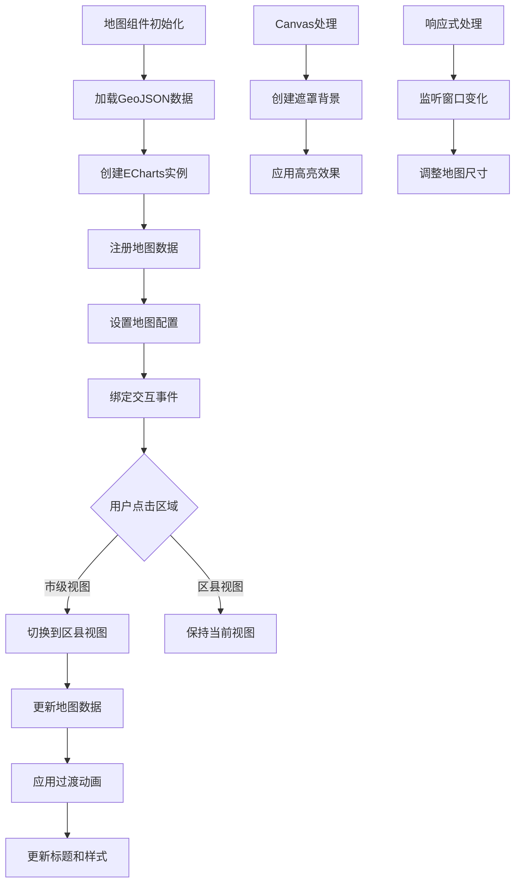
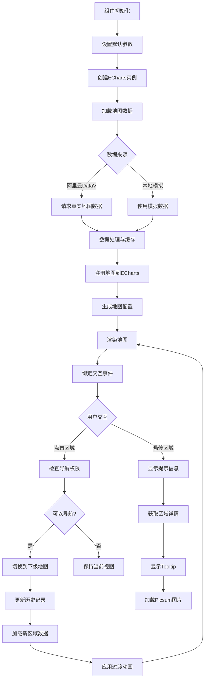
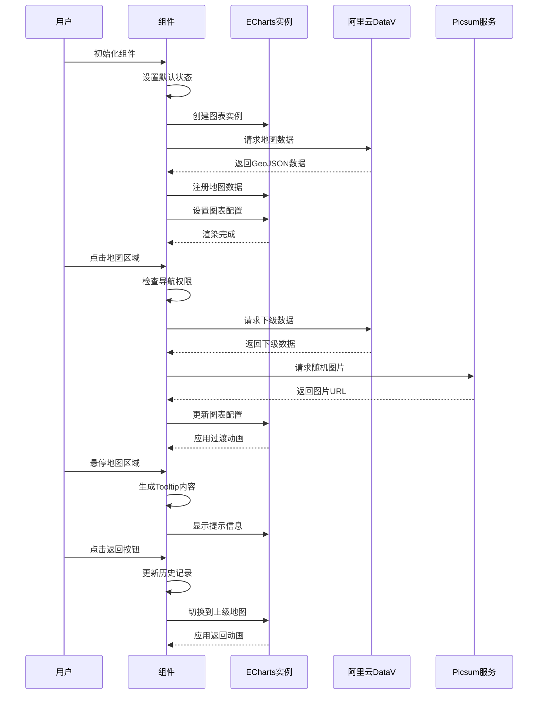

# ECharts 动态地图切换与平滑过渡动画

## 简介

如何使用 ECharts 实现动态地图展示功能，支持地图区域切换时的平滑过渡动画效果。通过 Canvas 动态处理图像实现区域高亮，设计响应式布局确保地图适应不同屏幕尺寸，实现层级导航和交互反馈提升用户体验。

## 效果特点

### 视觉特性

- **平滑切换**: 地图区域切换时带有流畅的过渡动画
- **区域高亮**: 鼠标悬停和选中状态的视觉反馈
- **层级导航**: 支持从市级视图进入区县级视图
- **响应式设计**: 适应不同屏幕尺寸的自动调整

### 技术特性

- **universalTransition**: 利用 ECharts 5 的强大动画功能
- **Canvas 图像处理**: 动态生成带遮罩的背景图
- **组件化设计**: 提供完整的 Vue3 组件实现
- **性能优化**: 避免不必要的重绘和内存泄漏

## 工作原理



## 效果演示

<demo react="react/DynamicMapTransition/DynamicMapTransitionDemo.tsx" 
:reactFiles="['react/DynamicMapTransition/index.tsx','react/DynamicMapTransition/index.scss','react/DynamicMapTransition/DynamicMapTransitionDemo.tsx']" 
/>

## 核心实现原理

### 基础实现方案

**核心思路**：

- 使用 ECharts 的`universalTransition`实现地图切换动画
- 通过 Canvas 动态处理图像实现区域高亮效果
- 采用 GeoJSON 数据格式存储地理信息
- 实现层级导航控制用户交互深度

**优点**：

- 动画效果流畅自然，用户体验良好
- 支持自定义样式和交互效果
- 响应式设计适应不同设备
- 代码结构清晰，易于维护和扩展

**适用场景**：

- 行政区划展示系统
- 数据可视化大屏
- 地理信息管理平台
- 区域数据分析工具

### 动态遮罩背景生成

```typescript
// 创建带遮罩的背景图像（用于高亮区域）
function createMaskedBgImg(src: string, maskColor = 'rgba(0,0,0,0.1)'): Promise<string> {
	return new Promise(resolve => {
		const img = new Image();
		img.src = src;
		const canvas = document.createElement('canvas');

		img.onload = () => {
			canvas.width = img.width;
			canvas.height = img.height;
			const ctx = canvas.getContext('2d')!;

			// 绘制原始图像
			ctx.drawImage(img, 0, 0);

			// 添加遮罩层
			ctx.fillStyle = maskColor;
			ctx.fillRect(0, 0, img.width, img.height);

			resolve(canvas.toDataURL());
		};

		img.onerror = () => resolve(src); // 失败时返回原图
	});
}
```

### 地图配置生成器

```typescript
// 生成ECharts地图配置
const getMapOption = (mapType = 'china', maskedBgImg = mapBgImgSrc) => {
	// 从GeoJSON数据中提取当前区域
	const feature = geoData.features.find((f: any) => f.properties.name === mapType);

	const mapGeoData =
		mapType === 'china'
			? geoData
			: {
					type: 'FeatureCollection',
					features: feature ? [feature] : []
			  };

	// 注册地图数据
	echarts.registerMap('currentMap', mapGeoData as any);

	return {
		// 动画配置
		animation: true,
		animationDuration: 800,
		animationEasing: 'cubicOut' as any,
		animationDurationUpdate: 800,
		animationEasingUpdate: 'cubicOut' as any,

		// 关键：启用通用过渡动画
		universalTransition: {
			enabled: true,
			divideShape: 'clone'
		},

		// 地图系列配置
		series: [
			{
				type: 'map',
				map: 'currentMap',
				zoom: 1.2,
				itemStyle: {
					areaColor: { image: mapBgImgSrc, repeat: 'repeat' },
					borderColor: '#80AACC',
					borderWidth: 2
				},
				emphasis: {
					itemStyle: {
						areaColor: { image: maskedBgImg, repeat: 'repeat' }
					}
				}
			}
		]
	};
};
```

### 地图初始化与交互

```typescript
// 初始化地图
const initMap = async () => {
	if (!mapChartRef.value) return;

	// 创建ECharts实例
	myChart = echarts.init(mapChartRef.value);

	// 创建遮罩背景图
	const maskedBgImg = await createMaskedBgImg(mapBgImgSrc, 'rgba(0,0,0,0.1)');

	// 设置初始配置
	myChart.setOption(getMapOption('china', maskedBgImg), false);

	// 添加点击事件处理
	myChart.on('click', function (e: any) {
		if (!e.name || typeof e.name !== 'string') return;

		// 只有在上级视图时才能点击进入下级
		if (canNavigateToNext(selectDistrictVal.value)) {
			myChart.setOption(getMapOption(e.name, maskedBgImg), false);
			selectDistrictVal.value = e.name;
		}
	});
};
```

## 实现方案对比

| 方案             | 优点               | 缺点         | 适用场景     |
| ---------------- | ------------------ | ------------ | ------------ |
| **ECharts**      | 功能强大，动画流畅 | 学习成本较高 | 复杂地图应用 |
| **纯 CSS + SVG** | 轻量级，兼容性好   | 功能相对简单 | 简单地图展示 |
| **Canvas 绘制**  | 性能好，自由度高   | 开发复杂度高 | 自定义地图   |
| **第三方地图库** | 功能完善，开箱即用 | 依赖外部服务 | 快速开发需求 |

## 高级功能

### 功能 1：动态数据加载

```typescript
interface MapDataConfig {
	apiUrl: string;
	regionCode: string;
	dataType: 'geojson' | 'topojson';
}

const useMapData = (config: MapDataConfig) => {
	const [mapData, setMapData] = useState(null);
	const [loading, setLoading] = useState(false);

	const loadMapData = async () => {
		setLoading(true);
		try {
			const response = await fetch(`${config.apiUrl}/${config.regionCode}`);
			const data = await response.json();
			setMapData(data);
		} catch (error) {
			console.error('地图数据加载失败:', error);
		} finally {
			setLoading(false);
		}
	};

	return { mapData, loading, loadMapData };
};
```

### 功能 2：区域数据统计

```typescript
interface RegionStatistics {
	name: string;
	population: number;
	area: number;
	gdp: number;
}

const useRegionStats = () => {
	const [statistics, setStatistics] = useState<RegionStatistics[]>([]);

	const updateStatistics = (regionName: string) => {
		// 模拟API调用获取区域统计数据
		const mockData: RegionStatistics = {
			name: regionName,
			population: Math.floor(Math.random() * 1000000),
			area: Math.floor(Math.random() * 10000),
			gdp: Math.floor(Math.random() * 100000)
		};
		setStatistics(prev => [...prev, mockData]);
	};

	return { statistics, updateStatistics };
};
```

### 功能 3：地图主题切换

```typescript
interface MapTheme {
	backgroundColor: string;
	areaColor: string;
	borderColor: string;
	textColor: string;
	emphasisColor: string;
}

const mapThemes: Record<string, MapTheme> = {
	light: {
		backgroundColor: '#ffffff',
		areaColor: '#e6f3ff',
		borderColor: '#4a90e2',
		textColor: '#333333',
		emphasisColor: '#ff6b6b'
	},
	dark: {
		backgroundColor: '#1a1a1a',
		areaColor: '#2d3748',
		borderColor: '#4fd1c7',
		textColor: '#ffffff',
		emphasisColor: '#ffd700'
	}
};

const useMapTheme = (themeName: string) => {
	const [currentTheme, setCurrentTheme] = useState(mapThemes[themeName]);

	const switchTheme = (newTheme: string) => {
		if (mapThemes[newTheme]) {
			setCurrentTheme(mapThemes[newTheme]);
		}
	};

	return { currentTheme, switchTheme };
};
```

## 响应式设计

### 设备适配

```typescript
const useResponsive = () => {
	const [deviceType, setDeviceType] = useState<'mobile' | 'tablet' | 'desktop'>('desktop');

	useEffect(() => {
		const updateDeviceType = () => {
			const width = window.innerWidth;
			if (width < 768) {
				setDeviceType('mobile');
			} else if (width < 1024) {
				setDeviceType('tablet');
			} else {
				setDeviceType('desktop');
			}
		};

		updateDeviceType();
		window.addEventListener('resize', updateDeviceType);

		return () => window.removeEventListener('resize', updateDeviceType);
	}, []);

	return deviceType;
};
```

### 地图尺寸自适应

```typescript
// 响应式调整地图尺寸
const setMapView = async () => {
	await nextTick();
	if (mapChartRef.value?.parentNode) {
		const parentHeight = mapChartRef.value.parentNode.offsetHeight;
		const siblingHeight = mapChartRef.value.previousSibling?.offsetHeight || 0;
		mapChartRef.value.style.height = `${parentHeight - siblingHeight - 16}px`;
	}

	// 窗口大小变化时重绘
	window.addEventListener('resize', () => {
		myChart?.resize();
	});
};
```

## 性能优化

### 1. 内存管理

```typescript
// 组件卸载时清理资源
onUnmounted(() => {
	if (myChart) {
		myChart.dispose();
		myChart = null;
	}

	// 移除事件监听器
	window.removeEventListener('resize', handleResize);
});
```

### 2. 渲染优化

```typescript
// 使用防抖优化窗口大小变化处理
const debouncedResize = debounce(() => {
	myChart?.resize();
}, 300);

window.addEventListener('resize', debouncedResize);
```

### 3. 数据缓存

```typescript
// 缓存地图数据避免重复加载
const mapDataCache = new Map<string, any>();

const getMapData = async (regionCode: string) => {
	if (mapDataCache.has(regionCode)) {
		return mapDataCache.get(regionCode);
	}

	const data = await fetchMapData(regionCode);
	mapDataCache.set(regionCode, data);
	return data;
};
```

## 参数配置

### 基础配置选项

| 参数名              | 类型   | 默认值     | 说明             |
| ------------------- | ------ | ---------- | ---------------- |
| `width`             | number | 600        | 地图容器宽度(px) |
| `height`            | number | 400        | 地图容器高度(px) |
| `animationDuration` | number | 800        | 动画持续时间(ms) |
| `animationEasing`   | string | 'cubicOut' | 动画缓动函数     |
| `borderColor`       | string | '#80AACC'  | 区域边框颜色     |
| `borderWidth`       | number | 2          | 区域边框宽度(px) |
| `emphasisColor`     | string | '#409eff'  | 高亮区域颜色     |
| `maskOpacity`       | number | 0.1        | 遮罩透明度(0-1)  |

### 高级配置选项

| 参数名             | 类型              | 默认值  | 说明             |
| ------------------ | ----------------- | ------- | ---------------- |
| `enableTransition` | boolean           | true    | 是否启用过渡动画 |
| `allowNavigation`  | boolean           | true    | 是否允许层级导航 |
| `showLabel`        | boolean           | true    | 是否显示区域标签 |
| `theme`            | 'light' \| 'dark' | 'light' | 地图主题模式     |
| `className`        | string            | ''      | 自定义 CSS 类名  |
| `style`            | CSSProperties     | {}      | 自定义内联样式   |

### 事件回调配置

| 参数名           | 类型                      | 说明         |
| ---------------- | ------------------------- | ------------ |
| `onRegionChange` | (region: string) => void  | 区域切换回调 |
| `onRegionClick`  | (regionData: any) => void | 区域点击回调 |

### 数据源配置

```typescript
interface DataSourceConfig {
	// 阿里云DataV API配置
	datavApiBase: string; // 默认: 'https://geo.datav.aliyun.com/areas_v3/bound'

	// Picsum图片配置
	picsumApiBase: string; // 默认: 'https://picsum.photos'
	imageWidth: number; // 默认: 200
	imageHeight: number; // 默认: 150

	// 缓存配置
	enableCache: boolean; // 默认: true
	cacheTimeout: number; // 默认: 300000 (5分钟)
}
```

### 动画配置详解

```typescript
interface AnimationConfig {
	// 基础动画
	animationDuration: number; // 动画时长
	animationEasing: string; // 缓动函数
	animationDelay: number; // 动画延迟

	// 过渡动画
	universalTransition: {
		enabled: boolean; // 是否启用
		divideShape: 'clone' | 'split'; // 形状分割方式
		delay: number; // 过渡延迟
	};

	// 交互动画
	hoverAnimation: boolean; // 悬停动画
	clickAnimation: boolean; // 点击动画
	loadingAnimation: boolean; // 加载动画
}
```

### 主题配置详解

```typescript
interface ThemeConfig {
	light: {
		backgroundColor: string; // 背景色
		areaColor: string; // 区域填充色
		borderColor: string; // 边框色
		textColor: string; // 文字色
		emphasisColor: string; // 高亮色
	};
	dark: {
		backgroundColor: string;
		areaColor: string;
		borderColor: string;
		textColor: string;
		emphasisColor: string;
	};
}
```

## 数据流程图



## 组件生命周期



## 故障排除

### 1. 地图不显示

**问题**: 地图容器为空或显示异常
**解决方案**:

- 检查 GeoJSON 数据格式是否正确
- 确认 ECharts 实例是否正确初始化
- 验证容器 DOM 元素是否存在
- 检查地图数据是否成功注册

### 2. 动画效果异常

**问题**: 地图切换时动画不流畅或无动画
**解决方案**:

- 确认`universalTransition`配置是否正确
- 检查动画参数设置是否合理
- 验证浏览器是否支持相关动画特性
- 优化数据更新频率

### 3. 内存泄漏

**问题**: 长时间使用后内存占用持续增加
**解决方案**:

- 正确清理 ECharts 实例和事件监听器
- 使用组件卸载钩子清理资源
- 避免在组件中创建不必要的闭包
- 及时释放不再使用的地图数据

## 应用场景

### 1. 行政区划展示

```typescript
// 用于政府部门的行政区划管理系统
const AdminDivisionMap = () => {
	const [currentRegion, setCurrentRegion] = useState('china');

	return (
		<div className="admin-division-container">
			<h1>行政区划管理系统</h1>
			<DynamicMapTransition
				region={currentRegion}
				onRegionChange={setCurrentRegion}
				showStatistics={true}
			/>
		</div>
	);
};
```

### 2. 数据可视化大屏

```typescript
// 用于数据可视化大屏展示
const DataVisualizationScreen = () => {
	return (
		<div className="data-screen">
			<div className="map-section">
				<DynamicMapTransition width={800} height={600} theme="dark" showDataOverlay={true} />
			</div>
		</div>
	);
};
```

### 3. 业务数据分析

```typescript
// 用于业务数据的地理分析
const BusinessAnalysis = () => {
	const [selectedMetric, setSelectedMetric] = useState('sales');

	return (
		<div className="business-analysis">
			<DynamicMapTransition
				dataMetric={selectedMetric}
				colorScheme="business"
				enableDataDrilldown={true}
			/>
		</div>
	);
};
```
