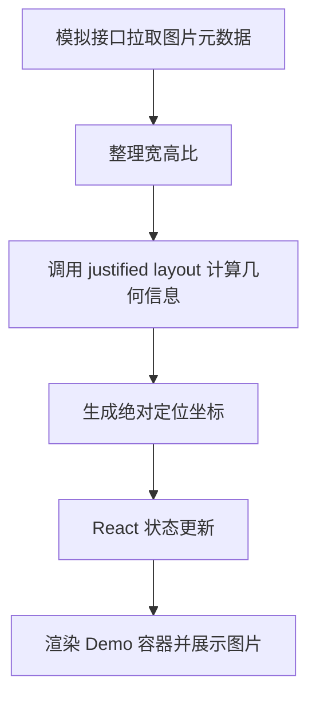

# Justified Layout 图片画廊布局实践

## 背景概述

基于《一款苹果、索尼都在使用的轻量级“灯箱画廊” UI 工具库》一文，本文梳理 `justified-layout` 的核心思路：通过输入图片宽高比自动计算行高与位置，生成类似 Flickr、百度图片的紧凑矩阵式画廊。我们在此复盘作者的实践要点，并补充 React + TypeScript 的运行示例，让参数调优与布局效果能够实时验证。

## 核心亮点

- **零依赖布局算法**：抛弃 jQuery 依赖，直接使用 `justified-layout` 思路进行行宽自适应计算。
- **行高自动缩放**：根据容器宽度动态求解行高，避免图片过度拉伸或留白。
- **实时配置体验**：提供参数滑块，可立即观察行高、间距、容器宽度对布局的影响。
- **模拟异步数据源**：以假接口方式请求 `picsum.photos` 图片，贴近真实业务链路。

## 流程图描述



## Demo 示例

<demo react="react/JustifiedLayoutGallery/index.tsx"
:reactFiles="['react/JustifiedLayoutGallery/index.tsx','react/JustifiedLayoutGallery/layout.ts','react/JustifiedLayoutGallery/index.scss']"
/> 

## 关键实现

### 1. 行高与位置计算（TypeScript）

```ts
const innerWidth = Math.max(containerWidth - padding * 2, 100);
const availableWidth = Math.max(innerWidth - spacingTotal, 40);
const fittedHeight = availableWidth / ratioSum;

let rowHeight = clamp(fittedHeight, targetRowHeight * minScale, targetRowHeight * maxScale);
if (force && showWidows) {
  rowHeight = clamp(
    Math.min(targetRowHeight, fittedHeight),
    targetRowHeight * minScale,
    targetRowHeight * maxScale
  );
}

currentRow.forEach(item => {
  const width = rowHeight * item.aspectRatio;
  boxes.push({ id: item.id, width, height: rowHeight, left, top, meta: item.meta });
  left += width + boxSpacing;
});
```

> 思路：以行内所有图片宽高比之和推算最优行高，配合 `minScale` / `maxScale` 限制缩放幅度，保证视觉比例稳定。

### 2. React 配置面板核心逻辑（TypeScript）

```ts
const [settings, setSettings] = useState({
  containerWidth: 600,
  containerPadding: 16,
  boxSpacing: 12,
  targetRowHeight: 160,
  showWidows: true
});

const layoutResult = useMemo(() => {
  if (!images.length) {
    return { boxes: [], rows: [], containerHeight: settings.containerPadding * 2 };
  }

  return calculateJustifiedLayout(
    images.map(img => ({ id: img.id, aspectRatio: img.width / img.height, meta: img })),
    settings
  );
}, [images, settings]);

const handleNumberChange = (key: keyof GallerySettings) => (event: ChangeEvent<HTMLInputElement>) => {
  const value = Number(event.target.value);
  setSettings(prev => ({ ...prev, [key]: Number.isNaN(value) ? prev[key] : value }));
};
```

> 通过 `useMemo` 拆分布局计算，滑块/复选框的改动会立刻驱动渲染，同时保持计算开销可控。

### 3. 模拟接口返回数据（TypeScript）

```ts
const fetchMockGallery = (): Promise<GalleryItem[]> => {
  return new Promise(resolve => {
    setTimeout(() => resolve(createMockImages()), 380);
  });
};

useEffect(() => {
  let mounted = true;
  setIsLoading(true);
  fetchMockGallery().then(list => {
    if (mounted) {
      setImages(list);
      setIsLoading(false);
    }
  });
  return () => {
    mounted = false;
  };
}, []);
```

> 通过 `Promise + setTimeout` 模拟远程请求，便于演示加载状态与真实数据流的结合。

## 参数说明

| 参数 | 类型 | 调整范围 | 作用与说明 |
| ---- | ---- | -------- | ---------- |
| `containerWidth` | `number` | 420 - 600 | 控制画廊可视宽度，直接影响每行可容纳图片数量 |
| `containerPadding` | `number` | 8 - 32 | 画廊内边距，避免图片贴边并为阴影留出空间 |
| `boxSpacing` | `number` | 6 - 28 | 行内与行间间距，越大越显得呼吸感强 |
| `targetRowHeight` | `number` | 100 - 240 | 目标行高，算法会围绕该值缩放以保证填满容器 |
| `showWidows` | `boolean` | `true/false` | 是否保留最后一行原始宽高比，不强制铺满整行 |

界面直接暴露上述控制项，拖动滑块或切换选项即可即时观察布局变化，便于快速确定理想参数组合。

## 实践建议

1. **数据准备**：预先存储图片原始宽高，避免运行时获取导致的性能损耗。
2. **性能优化**：图片较多时可结合虚拟滚动或 Intersection Observer 做懒加载。
3. **主题扩展**：将当前组件外层的隔离类（`justified-layout-demo`）替换为自定义主题类即可快速套用不同 UI 风格。
4. **业务落地**：配合 Lightbox / Viewer 等预览组件可扩展出商拍作品库、素材中心等高级场景。

---

通过以上步骤，我们完成了从文章理念到可运行 Demo 的还原与扩展：既保留 justified layout 的经典算法，又补齐 React 场景下的配置化体验，为后续自定义主题、交互与性能优化打下基础。

## 参考
js
- https://github.com/flickr/justified-layout

React 的实现：
- https://github.com/benhowell/react-grid-gallery
- https://github.com/neptunian/react-photo-album-item
- https://github.com/igordanchenko/react-photo-album

Vue 的实现：
- https://github.com/tenthree/vue-photo-album