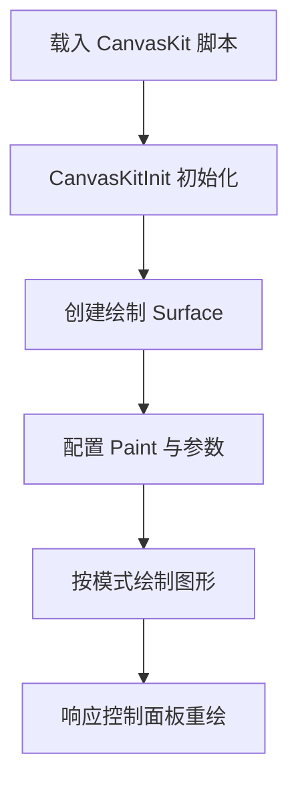

# CanvasKit 基础绘制入门

## 背景概述

基于掘金文章《CanvasKit 入门：用 WASM 版 Skia 绘制基本图形》，本文整理 CanvasKit 的快速上手流程：从加载 `canvaskit-wasm`、创建绘制表面，到分别绘制圆角矩形、线段、路径等基本图形，并补充 React + TypeScript 的实时参数面板，方便在浏览器中立即体验 WASM 版 Skia 的绘制能力。

## 核心亮点

- **WASM 版 Skia**：通过 `CanvasKitInit` 加载 wasm 资源，获得比原生 Canvas 2D 更丰富的绘制接口。
- **统一 Surface 接入**：优先创建 WebGL 表面，自动回退到 Software Surface，保证在多数设备上都能运行。
- **多形状抽象**：封装圆角矩形、圆、椭圆弧、点集/路径等绘制逻辑，可按模式一键切换。
- **参数实时调节**：提供线宽、颜色、圆角/半径、弧度、填充模式等控制项，改动后立即重绘。

## 流程图



## Demo 示例

<demo react="react/CanvasKitPrimer/index.tsx"
:reactFiles="['react/CanvasKitPrimer/index.tsx','react/CanvasKitPrimer/index.scss']"
/> 

## 核心实现

### 1. 动态加载 CanvasKit（TypeScript）

```ts
const CANVASKIT_CDN = 'https://unpkg.com/canvaskit-wasm@0.38.0/bin';

const loadCanvasKit = async () => {
  if (window.__canvasKitPromise) return window.__canvasKitPromise;
  window.__canvasKitPromise = new Promise((resolve, reject) => {
    const handleReady = () => {
      if (!window.CanvasKitInit) {
        reject(new Error('CanvasKitInit 未找到'));
        return;
      }
      window
        .CanvasKitInit({ locateFile: file => `${CANVASKIT_CDN}/${file}` })
        .then(resolve)
        .catch(reject);
    };

    if (window.CanvasKitInit) {
      handleReady();
      return;
    }

    const script = document.createElement('script');
    script.src = `${CANVASKIT_CDN}/canvaskit.js`;
    script.dataset.canvaskit = 'true';
    script.async = true;
    script.crossOrigin = 'anonymous';
    script.addEventListener('load', handleReady);
    script.addEventListener('error', () => reject(new Error('CanvasKit 脚本加载失败')));
    document.head.appendChild(script);
  });

  return window.__canvasKitPromise;
};
```

> 通过缓存 `Promise` 避免重复下载，同时使用 `locateFile` 指定 wasm 所在 CDN 路径。

### 2. 根据模式绘制多种几何对象（TypeScript）

```ts
surface.drawOnce(canvas => {
  canvas.clear(CanvasKit.WHITE);
  const paint = new CanvasKit.Paint();
  paint.setAntiAlias(true);
  paint.setColor(color4f);
  paint.setStrokeWidth(strokeWidth);
  paint.setStyle(useFill ? CanvasKit.PaintStyle.Fill : CanvasKit.PaintStyle.Stroke);

  switch (mode) {
    case 'roundRect': {
      const rect = CanvasKit.XYWHRect(80, 70, 320, 200);
      const rrect = CanvasKit.RRectXY(rect, radius, radius);
      canvas.drawRRect(rrect, paint);
      break;
    }
    case 'arc': {
      const oval = CanvasKit.XYWHRect(120, 90, 260, 180);
      canvas.drawArc(oval, 0, arcSweep, useFill, paint);
      break;
    }
    case 'points': {
      const modeType = useFill ? CanvasKit.PointMode.Polygon : CanvasKit.PointMode.Lines;
      canvas.drawPoints(modeType, defaultPoints, paint);
      break;
    }
    case 'path': {
      const path = new CanvasKit.Path();
      path.moveTo(80, 240).lineTo(180, 110).cubicTo(220, 60, 320, 140, 340, 220).close();
      canvas.drawPath(path, paint);
      path.delete();
      break;
    }
    default:
      // 矩形、圆、椭圆、直线等分支
      break;
  }

  paint.delete();
});
```

> 按文章中的接口调用方式封装绘制逻辑，兼顾描边/填充与参数清理（`delete`）。

### 3. 控制面板状态驱动重绘（TypeScript）

```ts
const [mode, setMode] = useState<DrawMode>('roundRect');
const [strokeWidth, setStrokeWidth] = useState(4);
const [radius, setRadius] = useState(32);
const [arcSweep, setArcSweep] = useState(140);
const [useFill, setUseFill] = useState(false);

const drawScene = useCallback(() => {
  if (!canvasKitRef.current || !surfaceRef.current) return;
  // ...调用 surface.drawOnce 并绘制
}, [mode, strokeWidth, radius, arcSweep, useFill, color4f]);

useEffect(() => {
  if (status === 'ready') {
    drawScene();
  }
}, [drawScene, status]);
```

> `useCallback` 搭配状态驱动重新绘制，确保所有参数变动都能即时反馈在画布上。

## 参数说明

| 参数 | 类型/范围 | 作用 |
| ---- | --------- | ---- |
| `mode` | `roundRect` / `rect` / `oval` / `circle` / `line` / `arc` / `points` / `path` | 切换待绘制的几何图形类型 |
| `strokeWidth` | `1-12` | 控制描边宽度，在填充模式下仍保留轮廓厚度 |
| `color` | `#RRGGBB` | 设置 `Paint` 颜色，可实时通过 `CanvasKit.parseColorString` 转换 |
| `radius` | `8-80` | 用于调整圆角矩形的圆角半径或圆的半径 |
| `arcSweep` | `30-320` | 椭圆弧的扫过角度，配合 `useFill` 决定是否闭合到圆心 |
| `useFill` | `boolean` | 切换描边/填充模式，点集模式下用于决定是否连线形成多边形 |

## 实践建议

1. **资源托管**：生产环境建议将 wasm 与脚本托管在 CDN 或站点自身，以降低首次加载时延。
2. **内存管理**：对 `Paint`、`Path`、`Typeface` 等对象需显式调用 `delete/ dispose`，避免 wasm 内存泄漏。
3. **性能优化**：复杂绘制可将 `surface.drawOnce` 换成 `surface.requestAnimationFrame`，或结合 OffscreenCanvas、WebGL 配置提高帧率。
4. **字体加载**：渲染文字需额外请求字体二进制数据，可按需缓存或提前打包。

---

通过上述步骤，即可在 React 项目中加载 CanvasKit 并搭建互动式绘制面板，快速体验 WASM 版 Skia 的基础能力，为后续深入图形学开发（混合模式、布尔运算、文字排版等）奠定基础。

