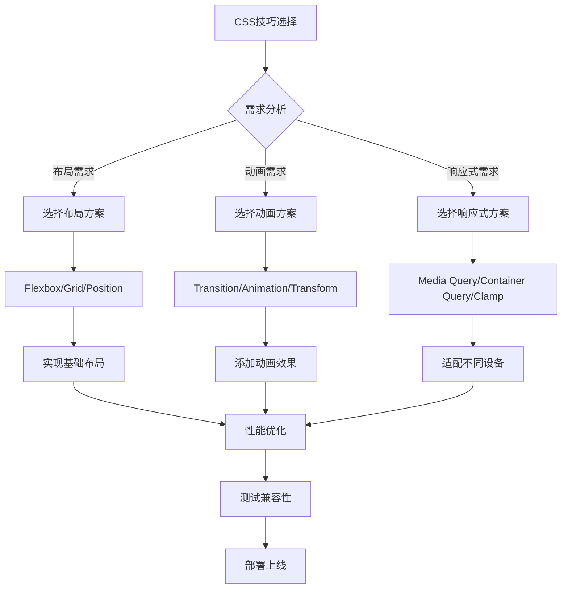

# 现代 CSS 技巧清单与实战应用

## 简介

本文基于《高效强悍的 CSS 技巧清单》，总结了现代 CSS 开发中最实用的技巧和方法。这些技巧涵盖了布局、动画、响应式设计、性能优化等多个方面，能够帮助开发者写出更高效、更优雅的 CSS 代码。

## 核心技巧分类

### 布局技巧

#### 1. Flexbox 高级应用

```css
/* 完美居中 */
.center-container {
	display: flex;
	justify-content: center;
	align-items: center;
	min-height: 100vh;
}

/* 自适应卡片布局 */
.card-grid {
	display: flex;
	flex-wrap: wrap;
	gap: 1rem;
}

.card {
	flex: 1 1 300px; /* 最小宽度300px，自动伸缩 */
}
```

#### 2. Grid 网格布局

```css
/* 响应式网格 */
.grid-container {
	display: grid;
	grid-template-columns: repeat(auto-fit, minmax(250px, 1fr));
	gap: 2rem;
}

/* 复杂布局 */
.layout {
	display: grid;
	grid-template-areas:
		'header header header'
		'sidebar main aside'
		'footer footer footer';
	grid-template-rows: auto 1fr auto;
	min-height: 100vh;
}
```

### 动画与过渡

#### 1. CSS 变量动画

```css
:root {
	--primary-color: #3498db;
	--animation-duration: 0.3s;
}

.animated-button {
	background: var(--primary-color);
	transition: all var(--animation-duration) ease;
}

.animated-button:hover {
	--primary-color: #2980b9;
	transform: translateY(-2px);
}
```

#### 2. 关键帧动画

```css
@keyframes fadeInUp {
	from {
		opacity: 0;
		transform: translateY(30px);
	}
	to {
		opacity: 1;
		transform: translateY(0);
	}
}

.fade-in-element {
	animation: fadeInUp 0.6s ease-out;
}
```

### 响应式设计

#### 1. 容器查询

```css
.card-container {
	container-type: inline-size;
}

@container (min-width: 400px) {
	.card {
		display: flex;
		flex-direction: row;
	}
}
```

#### 2. 流体排版

```css
.fluid-text {
	font-size: clamp(1rem, 4vw, 2.5rem);
	line-height: 1.4;
}
```

## 效果演示

<demo react="react/ModernCSSShowcase/ModernCSSShowcaseDemo.tsx" 
:reactFiles="['react/ModernCSSShowcase/index.tsx','react/ModernCSSShowcase/index.scss','react/ModernCSSShowcase/ModernCSSShowcaseDemo.tsx']" 
/>

## 技巧分类表格

| 分类       | 技巧名称     | 应用场景     | 兼容性 |
| ---------- | ------------ | ------------ | ------ |
| **布局**   | Flexbox 居中 | 各种居中需求 | 优秀   |
| **布局**   | Grid 网格    | 复杂布局设计 | 良好   |
| **布局**   | Sticky 定位  | 导航栏固定   | 良好   |
| **动画**   | CSS 变量动画 | 主题切换     | 良好   |
| **动画**   | Transform3D  | 硬件加速     | 优秀   |
| **响应式** | 容器查询     | 组件级响应   | 新特性 |
| **响应式** | 流体排版     | 自适应文字   | 良好   |
| **性能**   | will-change  | 动画优化     | 良好   |
| **性能**   | contain 属性 | 渲染优化     | 新特性 |

## 实现流程图



## 高级技巧详解

### 1. CSS 自定义属性（CSS 变量）

```css
:root {
	/* 颜色系统 */
	--color-primary: #3498db;
	--color-secondary: #2ecc71;
	--color-danger: #e74c3c;

	/* 间距系统 */
	--spacing-xs: 0.25rem;
	--spacing-sm: 0.5rem;
	--spacing-md: 1rem;
	--spacing-lg: 2rem;

	/* 字体系统 */
	--font-size-sm: 0.875rem;
	--font-size-base: 1rem;
	--font-size-lg: 1.25rem;
}

/* 主题切换 */
[data-theme='dark'] {
	--color-primary: #5dade2;
	--color-bg: #2c3e50;
	--color-text: #ecf0f1;
}
```

### 2. 现代伪类选择器

```css
/* :is() 简化选择器 */
:is(h1, h2, h3, h4, h5, h6) {
	font-family: var(--font-heading);
	line-height: 1.2;
}

/* :where() 零特异性选择器 */
:where(ul, ol) :where(ul, ol) {
	margin: 0;
}

/* :has() 父选择器 */
.card:has(img) {
	display: grid;
	grid-template-columns: 200px 1fr;
}
```

### 3. 逻辑属性

```css
.element {
	/* 传统方式 */
	margin-left: 1rem;
	margin-right: 1rem;

	/* 逻辑属性 */
	margin-inline: 1rem; /* 支持RTL布局 */
	padding-block: 2rem; /* 垂直方向内边距 */
}
```

## 性能优化技巧

### 1. 硬件加速

```css
.gpu-accelerated {
	transform: translateZ(0); /* 触发硬件加速 */
	will-change: transform; /* 提示浏览器优化 */
}

.smooth-animation {
	transform: translate3d(0, 0, 0); /* 3D变换触发GPU */
	backface-visibility: hidden; /* 避免闪烁 */
}
```

### 2. 渲染优化

```css
.optimized-container {
	contain: layout style paint; /* 限制重排重绘范围 */
	content-visibility: auto; /* 虚拟化长列表 */
}
```

## 参数配置选项

### 基础配置

| 参数名              | 类型   | 默认值    | 说明             |
| ------------------- | ------ | --------- | ---------------- |
| `primaryColor`      | string | '#3498db' | 主色调           |
| `animationDuration` | number | 300       | 动画持续时间(ms) |
| `borderRadius`      | number | 8         | 圆角大小(px)     |
| `spacing`           | number | 16        | 基础间距(px)     |
| `fontSize`          | number | 16        | 基础字体大小(px) |

### 布局配置

| 参数名              | 类型   | 默认值 | 说明             |
| ------------------- | ------ | ------ | ---------------- |
| `gridColumns`       | number | 3      | 网格列数         |
| `gridGap`           | number | 20     | 网格间距(px)     |
| `containerMaxWidth` | number | 1200   | 容器最大宽度(px) |
| `breakpointMobile`  | number | 768    | 移动端断点(px)   |
| `breakpointTablet`  | number | 1024   | 平板端断点(px)   |

### 动画配置

| 参数名               | 类型   | 默认值     | 说明         |
| -------------------- | ------ | ---------- | ------------ |
| `easing`             | string | 'ease-out' | 缓动函数     |
| `hoverScale`         | number | 1.05       | 悬停缩放比例 |
| `transitionDuration` | number | 200        | 过渡时间(ms) |
| `animationDelay`     | number | 0          | 动画延迟(ms) |

## 浏览器支持策略

### 渐进增强

```css
/* 基础样式 */
.button {
	padding: 0.5rem 1rem;
	background: #3498db;
	color: white;
	border: none;
	cursor: pointer;
}

/* 现代浏览器增强 */
@supports (backdrop-filter: blur(10px)) {
	.button {
		backdrop-filter: blur(10px);
		background: rgba(52, 152, 219, 0.8);
	}
}

/* 容器查询支持检测 */
@supports (container-type: inline-size) {
	.responsive-card {
		container-type: inline-size;
	}
}
```

### 特性检测

```css
/* 检测Grid支持 */
@supports (display: grid) {
	.layout {
		display: grid;
		grid-template-columns: repeat(auto-fit, minmax(300px, 1fr));
	}
}

/* 降级方案 */
@supports not (display: grid) {
	.layout {
		display: flex;
		flex-wrap: wrap;
	}
}
```

## 实际应用场景

### 1. 响应式卡片布局

```css
.card-container {
	display: grid;
	grid-template-columns: repeat(auto-fill, minmax(300px, 1fr));
	gap: 2rem;
	padding: 2rem;
}

.card {
	background: white;
	border-radius: 12px;
	box-shadow: 0 4px 6px rgba(0, 0, 0, 0.1);
	overflow: hidden;
	transition: transform 0.3s ease, box-shadow 0.3s ease;
}

.card:hover {
	transform: translateY(-4px);
	box-shadow: 0 8px 25px rgba(0, 0, 0, 0.15);
}
```

### 2. 流体导航栏

```css
.navbar {
	display: flex;
	justify-content: space-between;
	align-items: center;
	padding: 1rem clamp(1rem, 5vw, 3rem);
	background: rgba(255, 255, 255, 0.95);
	backdrop-filter: blur(10px);
	position: sticky;
	top: 0;
	z-index: 100;
}

.nav-links {
	display: flex;
	gap: clamp(1rem, 3vw, 2rem);
	list-style: none;
}
```

### 3. 动态主题切换

```css
:root {
	--bg-color: #ffffff;
	--text-color: #333333;
	--accent-color: #3498db;
}

[data-theme='dark'] {
	--bg-color: #1a1a1a;
	--text-color: #ffffff;
	--accent-color: #5dade2;
}

body {
	background-color: var(--bg-color);
	color: var(--text-color);
	transition: background-color 0.3s ease, color 0.3s ease;
}
```

## 调试与工具

### 1. CSS 调试技巧

```css
/* 布局调试 */
* {
	outline: 1px solid red !important;
}

/* 网格可视化 */
.debug-grid {
	background-image: linear-gradient(rgba(255, 0, 0, 0.1) 1px, transparent 1px), linear-gradient(90deg, rgba(
					255,
					0,
					0,
					0.1
				) 1px, transparent 1px);
	background-size: 20px 20px;
}
```

### 2. 性能监控

```css
/* 监控重排重绘 */
.performance-monitor {
	will-change: transform;
	transform: translateZ(0);
}

/* 避免布局抖动 */
.stable-layout {
	aspect-ratio: 16 / 9; /* 预设宽高比 */
	content-visibility: auto; /* 虚拟化 */
}
```

## 最佳实践总结

1. **优先使用现代布局方案**：Flexbox 和 Grid 能解决大部分布局需求
2. **合理使用 CSS 变量**：建立设计系统，便于维护和主题切换
3. **注重性能优化**：使用硬件加速，避免不必要的重排重绘
4. **渐进增强策略**：确保基础功能在所有浏览器中可用
5. **语义化命名**：使用 BEM 或其他命名规范，提高代码可读性
6. **模块化组织**：将 CSS 按功能模块组织，便于复用和维护

通过掌握这些现代 CSS 技巧，开发者可以创建出更加优雅、高效和可维护的样式代码，提升用户体验和开发效率。
