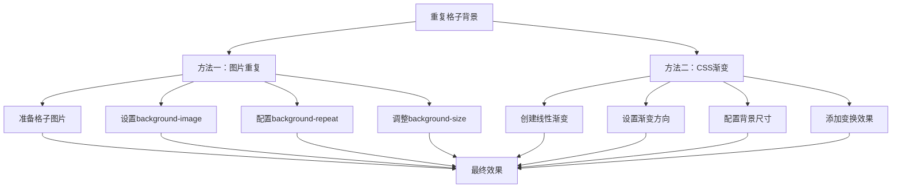

# CSS重复格子背景实现技巧

## 简介

重复格子背景是现代网站设计中常见的视觉元素，主要用于在大量留白的设计风格下避免页面过于空旷，增加视觉丰富性。本文介绍两种主要的实现方法：局部格子图片+背景重复和CSS渐变+背景重复。

## 效果特点

### 视觉特性

- **增强质感**: 为简洁的页面设计增加视觉层次
- **避免空旷**: 在大量留白设计中提供视觉支撑
- **现代感**: 符合当前流行的设计趋势
- **低干扰**: 不会影响主要内容的阅读体验

### 技术特性

- **轻量级**: CSS实现，无需额外JavaScript
- **高性能**: 利用浏览器原生背景重复机制
- **可定制**: 支持多种参数配置和样式调整
- **兼容性**: 支持所有现代浏览器

## 工作原理



## 效果演示

<demo react="react/GridBackground/index.tsx" 
:reactFiles="['react/GridBackground/index.tsx','react/GridBackground/index.scss']" 
/>

## 核心实现原理

### 方法一：局部格子图片 + 背景重复

**核心思路**：

使用预制的格子图片，通过CSS背景属性实现重复平铺效果。

**关键代码**：

```css
.grid-background-image {
  background-image: url('data:image/svg+xml,<svg xmlns="http://www.w3.org/2000/svg" width="40" height="40" viewBox="0 0 40 40"><rect width="40" height="40" fill="none" stroke="%23e5e7eb" stroke-width="1"/></svg>');
  background-size: 40px 40px;
  background-repeat: repeat;
  background-position: left top;
}
```

**优点**：
- 实现简单，容易理解
- 可以使用复杂的图案设计
- 兼容性好，支持所有浏览器

**缺点**：
- 需要额外的图片资源
- 修改样式需要重新制作图片
- 可能增加HTTP请求

### 方法二：CSS渐变 + 背景重复（推荐）

**核心思路**：

使用CSS线性渐变创建1px宽度的线条，通过背景重复形成格子效果。

**关键代码**：

```css
.grid-background-gradient {
  background-image:
    linear-gradient(to right, rgba(59, 130, 246, 0.08) 1px, transparent 1px),
    linear-gradient(to bottom, rgba(59, 130, 246, 0.08) 1px, transparent 1px);
  background-size: 40px 40px;
  transform: rotate(-3deg) scale(1.2);
}
```

**优点**：
- 无需外部资源，加载更快
- 可以通过CSS变量动态调整
- 支持透明度和颜色变化
- 可以添加变换效果

**适用场景**：
- 现代前端项目
- 需要动态调整样式的场景
- 追求性能优化的项目
- 响应式设计需求

## 实现方案对比

| 方案特性 | 图片重复 | CSS渐变 | Canvas绘制 |
|---------|---------|---------|-----------|
| **实现难度** | 简单 | 简单 | 复杂 |
| **性能表现** | 中等 | 高 | 高 |
| **资源占用** | 需要图片 | 无额外资源 | 需要JavaScript |
| **定制灵活性** | 低 | 高 | 极高 |
| **兼容性** | 优秀 | 优秀 | 良好 |
| **维护成本** | 中等 | 低 | 高 |

## 高级功能

### 功能 1：动态颜色调整

```typescript
interface GridConfig {
  color: string;
  opacity: number;
  size: number;
  rotation: number;
}

const updateGridStyle = (config: GridConfig) => {
  const { color, opacity, size, rotation } = config;
  const rgba = hexToRgba(color, opacity);
  
  return {
    backgroundImage: `
      linear-gradient(to right, ${rgba} 1px, transparent 1px),
      linear-gradient(to bottom, ${rgba} 1px, transparent 1px)
    `,
    backgroundSize: `${size}px ${size}px`,
    transform: `rotate(${rotation}deg)`
  };
};
```

### 功能 2：响应式格子大小

```typescript
const useResponsiveGrid = () => {
  const [gridSize, setGridSize] = useState(40);
  
  useEffect(() => {
    const updateGridSize = () => {
      const width = window.innerWidth;
      if (width < 768) {
        setGridSize(20); // 移动端使用较小格子
      } else if (width < 1024) {
        setGridSize(30); // 平板端使用中等格子
      } else {
        setGridSize(40); // 桌面端使用标准格子
      }
    };
    
    updateGridSize();
    window.addEventListener('resize', updateGridSize);
    return () => window.removeEventListener('resize', updateGridSize);
  }, []);
  
  return gridSize;
};
```

### 功能 3：动画效果

```css
.animated-grid {
  background-image:
    linear-gradient(to right, rgba(59, 130, 246, 0.08) 1px, transparent 1px),
    linear-gradient(to bottom, rgba(59, 130, 246, 0.08) 1px, transparent 1px);
  background-size: 40px 40px;
  animation: gridMove 20s linear infinite;
}

@keyframes gridMove {
  0% {
    background-position: 0 0;
  }
  100% {
    background-position: 40px 40px;
  }
}
```

## 参数配置选项

### 基础参数

| 参数名 | 类型 | 默认值 | 说明 |
|--------|------|--------|------|
| `gridSize` | number | 40 | 格子大小（像素） |
| `color` | string | '#e5e7eb' | 格子线条颜色 |
| `opacity` | number | 0.5 | 透明度 (0-1) |
| `lineWidth` | number | 1 | 线条宽度（像素） |

### 高级参数

| 参数名 | 类型 | 默认值 | 说明 |
|--------|------|--------|------|
| `rotation` | number | 0 | 旋转角度（度） |
| `scale` | number | 1 | 缩放比例 |
| `animated` | boolean | false | 是否启用动画 |
| `responsive` | boolean | true | 是否响应式调整 |

### 使用示例

```typescript
// 基础使用
<GridBackground 
  gridSize={30}
  color="#3b82f6"
  opacity={0.1}
/>

// 高级配置
<GridBackground 
  gridSize={50}
  color="#ef4444"
  opacity={0.15}
  rotation={-5}
  scale={1.1}
  animated={true}
/>
```

## 响应式设计

### 设备适配策略

```css
/* 桌面端 */
@media (min-width: 1024px) {
  .grid-background {
    background-size: 40px 40px;
  }
}

/* 平板端 */
@media (min-width: 768px) and (max-width: 1023px) {
  .grid-background {
    background-size: 30px 30px;
  }
}

/* 移动端 */
@media (max-width: 767px) {
  .grid-background {
    background-size: 20px 20px;
  }
}
```

### 动态密度调整

```typescript
const calculateGridDensity = (screenWidth: number): number => {
  if (screenWidth < 768) return 20;
  if (screenWidth < 1024) return 30;
  if (screenWidth < 1440) return 40;
  return 50;
};
```

## 性能优化

### 1. CSS变量优化

```css
:root {
  --grid-size: 40px;
  --grid-color: rgba(59, 130, 246, 0.08);
  --grid-opacity: 0.08;
}

.optimized-grid {
  background-image:
    linear-gradient(to right, var(--grid-color) 1px, transparent 1px),
    linear-gradient(to bottom, var(--grid-color) 1px, transparent 1px);
  background-size: var(--grid-size) var(--grid-size);
}
```

### 2. GPU加速

```css
.gpu-accelerated-grid {
  transform: translateZ(0); /* 启用硬件加速 */
  will-change: transform; /* 提示浏览器优化 */
}
```

### 3. 减少重绘

```typescript
// 使用防抖优化参数更新
const debouncedUpdateGrid = useMemo(
  () => debounce((config: GridConfig) => {
    setGridStyle(updateGridStyle(config));
  }, 100),
  []
);
```

## 故障排除

### 1. 格子显示不清晰

**问题**: 格子线条模糊或显示不完整
**解决方案**:
- 确保格子大小为整数像素值
- 检查设备像素比，考虑使用0.5px线条
- 避免使用过小的格子尺寸

### 2. 性能问题

**问题**: 页面滚动卡顿或动画不流畅
**解决方案**:
- 启用CSS硬件加速
- 减少同时使用的背景图层
- 优化动画帧率和持续时间

### 3. 移动端适配问题

**问题**: 移动设备上格子过密或过稀
**解决方案**:
- 实现响应式格子大小
- 考虑设备像素密度差异
- 测试不同屏幕尺寸的显示效果

## 技术要点

### 1. CSS背景属性详解

- `background-image`: 定义背景图像或渐变
- `background-size`: 控制背景图像的尺寸
- `background-repeat`: 设置背景重复方式
- `background-position`: 调整背景起始位置

### 2. 线性渐变技巧

- 使用`to right`和`to bottom`创建垂直和水平线条
- 通过透明度控制线条的可见性
- 利用渐变停止点精确控制线条宽度

### 3. 变换效果应用

- `rotate()`: 创建倾斜的格子效果
- `scale()`: 调整格子的整体大小
- `translate()`: 实现格子移动动画

## 应用场景

### 1. 首页背景装饰

```typescript
const HomePage = () => (
  <div className="home-page">
    <GridBackground 
      gridSize={60}
      color="#f3f4f6"
      opacity={0.3}
      className="page-background"
    />
    <div className="content">
      <h1>欢迎来到我们的网站</h1>
      <p>这里是主要内容区域</p>
    </div>
  </div>
);
```

### 2. 卡片容器背景

```typescript
const CardContainer = ({ children }: { children: React.ReactNode }) => (
  <div className="card-container">
    <GridBackground 
      gridSize={20}
      color="#e5e7eb"
      opacity={0.2}
      className="card-background"
    />
    <div className="card-content">
      {children}
    </div>
  </div>
);
```

### 3. 设计工具界面

```typescript
const DesignCanvas = () => (
  <div className="design-canvas">
    <GridBackground 
      gridSize={25}
      color="#6b7280"
      opacity={0.15}
      className="canvas-grid"
    />
    <div className="design-elements">
      {/* 设计元素 */}
    </div>
  </div>
);
```

## 浏览器兼容性

### 支持情况

- **现代浏览器**: 完全支持（Chrome 26+, Firefox 16+, Safari 7+）
- **IE浏览器**: 部分支持（IE 10+支持线性渐变）
- **移动浏览器**: 完全支持

### 兼容性处理

```css
/* 渐变前缀兼容 */
.grid-background {
  background-image:
    -webkit-linear-gradient(to right, rgba(59, 130, 246, 0.08) 1px, transparent 1px),
    -webkit-linear-gradient(to bottom, rgba(59, 130, 246, 0.08) 1px, transparent 1px);
  background-image:
    linear-gradient(to right, rgba(59, 130, 246, 0.08) 1px, transparent 1px),
    linear-gradient(to bottom, rgba(59, 130, 246, 0.08) 1px, transparent 1px);
}
```

## 总结

CSS重复格子背景是一种简单而有效的视觉设计技巧，能够显著提升页面的质感和现代感。推荐使用CSS渐变方法实现，因为它具有更好的性能、更高的灵活性和更低的维护成本。通过合理的参数配置和响应式设计，可以在各种设备和场景下获得理想的视觉效果。