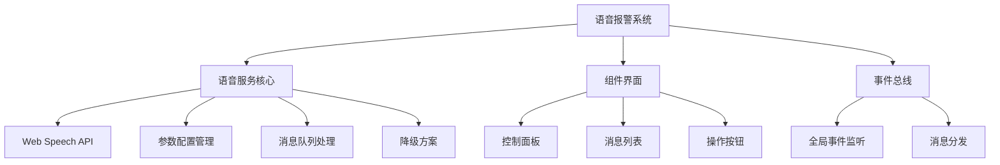

# 语音报警功能实现

## 简介

本文档介绍了一个完整的 消息语音报警实现方案，基于 Web Speech API 实现，包含多种语音播报方式和自定义配置。该方案提供了完整的语音报警功能，支持音量、语速、音调调节，消息历史记录管理，以及优先级处理等功能。

## 效果演示

<demo react="react/VoiceAlert/demo.tsx" 
:reactFiles="['react/VoiceAlert/demo.tsx','react/VoiceAlert/index.tsx','react/VoiceAlert/index.scss']" 
/>

## 工作原理



## 核心实现

### 1. 语音服务类实现

```typescript
// src/utils/voiceAlert.js (转换为TypeScript)
class VoiceAlert {
	private synth: SpeechSynthesis | null = null;
	private isSupported: boolean = false;
	private isSpeaking: boolean = false;
	private utterance: SpeechSynthesisUtterance | null = null;
	private volume: number = 1;
	private rate: number = 1;
	private pitch: number = 1;
	private voice: SpeechSynthesisVoice | null = null;
	private voices: SpeechSynthesisVoice[] = [];

	constructor() {
		this.synth = window.speechSynthesis;
		this.isSupported = !!this.synth;
		this.init();
	}

	private init() {
		if (!this.isSupported) {
			console.warn('浏览器不支持语音合成API');
			return;
		}

		// 加载可用语音列表
		this.loadVoices();

		// 语音列表加载事件
		this.synth.addEventListener('voiceschanged', () => {
			this.loadVoices();
		});
	}

	private loadVoices() {
		this.voices = this.synth.getVoices();
		// 优先选择中文语音
		const chineseVoice = this.voices.find(
			voice => voice.lang.includes('zh') || voice.lang.includes('CN')
		);
		this.voice = chineseVoice || this.voices[0];
	}

	// 播报警报消息
	alert(message: string, options: any = {}) {
		if (!this.isSupported) return false;

		// 停止当前播报
		this.stop();

		this.utterance = new SpeechSynthesisUtterance(message);

		// 设置参数
		this.utterance.volume = options.volume || this.volume;
		this.utterance.rate = options.rate || this.rate;
		this.utterance.pitch = options.pitch || this.pitch;
		this.utterance.voice = options.voice || this.voice;
		this.utterance.lang = options.lang || 'zh-CN';

		// 事件监听
		this.utterance.onstart = () => {
			this.isSpeaking = true;
			options.onStart && options.onStart();
		};

		this.utterance.onend = () => {
			this.isSpeaking = false;
			options.onEnd && options.onEnd();
		};

		this.utterance.onerror = error => {
			this.isSpeaking = false;
			console.error('语音播报错误:', error);
			options.onError && options.onError(error);

			// 降级方案：尝试使用音频文件
			if (options.fallbackAudio) {
				this.playAudioFallback(options.fallbackAudio);
			}
		};

		this.synth.speak(this.utterance);
		return true;
	}

	// 播放音频文件降级方案
	private playAudioFallback(audioUrl: string) {
		const audio = new Audio(audioUrl);
		audio.play().catch(error => {
			console.error('音频播放失败:', error);
		});
	}

	// 停止播报
	stop() {
		if (this.isSpeaking) {
			this.synth.cancel();
			this.isSpeaking = false;
		}
	}

	// 暂停播报
	pause() {
		if (this.isSpeaking) {
			this.synth.pause();
		}
	}

	// 恢复播报
	resume() {
		if (this.synth.paused) {
			this.synth.resume();
		}
	}

	// 设置语音参数
	setVoiceParams(params: any) {
		if (params.volume !== undefined) this.volume = params.volume;
		if (params.rate !== undefined) this.rate = params.rate;
		if (params.pitch !== undefined) this.pitch = params.pitch;
		if (params.voice !== undefined) this.voice = params.voice;
	}

	// 获取可用语音列表
	getVoices() {
		return this.voices || [];
	}

	// 检查浏览器支持情况
	checkSupport() {
		return this.isSupported;
	}
}
```

### 2. React 组件实现

```typescript
// VoiceAlert组件核心逻辑
interface VoiceAlertProps {
	maxAlerts?: number; // 最大保存消息数量
	autoSpeak?: boolean; // 自动播报新消息
	showControlPanel?: boolean; // 显示控制面板
}

interface AlertMessage {
	id: number;
	message: string;
	type: 'info' | 'warning' | 'error' | 'success';
	timestamp: Date;
	priority: number;
}

const VoiceAlert: React.FC<VoiceAlertProps> = ({
	maxAlerts = 50,
	autoSpeak = true,
	showControlPanel = false
}) => {
	// 状态管理
	const [isSupported, setIsSupported] = useState(false);
	const [isSpeaking, setIsSpeaking] = useState(false);
	const [showControl, setShowControl] = useState(showControlPanel);
	const [volume, setVolume] = useState(1);
	const [rate, setRate] = useState(1);
	const [pitch, setPitch] = useState(1);
	const [selectedVoice, setSelectedVoice] = useState<SpeechSynthesisVoice | null>(null);
	const [availableVoices, setAvailableVoices] = useState<SpeechSynthesisVoice[]>([]);
	const [recentAlerts, setRecentAlerts] = useState<AlertMessage[]>([]);
	const [alertCounter, setAlertCounter] = useState(0);

	// 引用
	const voiceAlertRef = useRef<any>(null);
	const synthRef = useRef<SpeechSynthesis | null>(null);

	// 初始化
	useEffect(() => {
		// 检查浏览器支持
		const isSupported = 'speechSynthesis' in window;
		setIsSupported(isSupported);

		if (isSupported) {
			synthRef.current = window.speechSynthesis;
			const voices = synthRef.current.getVoices();
			setAvailableVoices(voices);
			setSelectedVoice(voices[0] || null);

			// 语音列表可能异步加载
			if (voices.length === 0) {
				const handleVoicesChanged = () => {
					const newVoices = synthRef.current!.getVoices();
					setAvailableVoices(newVoices);
					setSelectedVoice(newVoices[0] || null);
				};

				synthRef.current.addEventListener('voiceschanged', handleVoicesChanged);

				// 清理事件监听器
				return () => {
					synthRef.current!.removeEventListener('voiceschanged', handleVoicesChanged);
				};
			}
		}

		// 创建语音服务实例
		voiceAlertRef.current = {
			synth: synthRef.current,
			isSupported,
			isSpeaking: false,
			utterance: null,
			volume: 1,
			rate: 1,
			pitch: 1,
			voice: null,

			alert(message: string, options: any = {}) {
				if (!this.isSupported) return false;

				// 停止当前播报
				this.stop();

				this.utterance = new SpeechSynthesisUtterance(message);
				this.utterance.volume = options.volume || this.volume;
				this.utterance.rate = options.rate || this.rate;
				this.utterance.pitch = options.pitch || this.pitch;
				this.utterance.voice = options.voice || this.voice;
				this.utterance.lang = options.lang || 'zh-CN';

				this.utterance.onstart = () => {
					this.isSpeaking = true;
					setIsSpeaking(true);
					options.onStart && options.onStart();
				};

				this.utterance.onend = () => {
					this.isSpeaking = false;
					setIsSpeaking(false);
					options.onEnd && options.onEnd();
				};

				this.utterance.onerror = (error: any) => {
					this.isSpeaking = false;
					setIsSpeaking(false);
					console.error('语音播报错误:', error);
					options.onError && options.onError(error);
				};

				this.synth!.speak(this.utterance);
				return true;
			},

			stop() {
				if (this.isSpeaking && this.synth) {
					this.synth.cancel();
					this.isSpeaking = false;
					setIsSpeaking(false);
				}
			},

			setVoiceParams(params: any) {
				if (params.volume !== undefined) this.volume = params.volume;
				if (params.rate !== undefined) this.rate = params.rate;
				if (params.pitch !== undefined) this.pitch = params.pitch;
				if (params.voice !== undefined) this.voice = params.voice;
			}
		};

		return () => {
			if (voiceAlertRef.current) {
				voiceAlertRef.current.stop();
			}
		};
	}, []);

	// 处理新报警消息
	const handleNewAlert = (alertData: Omit<AlertMessage, 'id' | 'timestamp'>) => {
		const alert: AlertMessage = {
			id: alertCounter + 1,
			message: alertData.message,
			type: alertData.type || 'info',
			timestamp: new Date(),
			priority: alertData.priority || 1
		};

		setAlertCounter(prev => prev + 1);

		// 添加到消息列表
		setRecentAlerts(prev => {
			const newAlerts = [alert, ...prev];
			// 限制消息数量
			return newAlerts.slice(0, maxAlerts);
		});

		// 自动播报
		if (autoSpeak && isSupported) {
			speakAlert(alert);
		}
	};

	// 播报警报消息
	const speakAlert = (alert: AlertMessage) => {
		const message = formatAlertMessage(alert);

		if (voiceAlertRef.current) {
			voiceAlertRef.current.alert(message, {
				volume,
				rate,
				pitch,
				voice: selectedVoice,
				onStart: () => {
					setIsSpeaking(true);
				},
				onEnd: () => {
					setIsSpeaking(false);
				},
				onError: (error: any) => {
					setIsSpeaking(false);
					console.error('语音播报失败:', error);
				}
			});
		}
	};

	// 格式化报警消息
	const formatAlertMessage = (alert: AlertMessage) => {
		const prefixes = {
			error: '紧急报警：',
			warning: '警告：',
			info: '通知：',
			success: '正常：'
		};

		const prefix = prefixes[alert.type] || '';
		return prefix + alert.message;
	};

	// 停止播报
	const stopSpeaking = () => {
		if (voiceAlertRef.current) {
			voiceAlertRef.current.stop();
		}
	};

	// 更新语音参数
	const updateVoiceParams = () => {
		if (voiceAlertRef.current) {
			voiceAlertRef.current.setVoiceParams({
				volume,
				rate,
				pitch,
				voice: selectedVoice
			});
		}
	};

	// 移除报警消息
	const removeAlert = (alertId: number) => {
		setRecentAlerts(prev => prev.filter(alert => alert.id !== alertId));
	};

	// 清空所有消息
	const clearAlerts = () => {
		setRecentAlerts([]);
	};

	// 切换控制面板显示
	const toggleControl = () => {
		setShowControl(!showControl);
	};

	// 测试语音
	const testVoice = () => {
		handleNewAlert({
			message: '这是一条测试语音消息，当前语音设置正常。',
			type: 'info'
		});
	};

	// 格式化时间
	const formatTime = (timestamp: Date) => {
		return timestamp.toLocaleTimeString('zh-CN', {
			hour12: false,
			hour: '2-digit',
			minute: '2-digit',
			second: '2-digit'
		});
	};

	return (
		<div className="voice-alert">
			{/* 语音控制面板 */}
			{showControl && (
				<div className="voice-control-panel">
					<div className="control-item">
						<label>音量:</label>
						<input
							type="range"
							min="0"
							max="1"
							step="0.1"
							value={volume}
							onChange={e => setVolume(parseFloat(e.target.value))}
						/>
						<span>{(volume * 100).toFixed(0)}%</span>
					</div>

					<div className="control-item">
						<label>语速:</label>
						<input
							type="range"
							min="0.1"
							max="2"
							step="0.1"
							value={rate}
							onChange={e => setRate(parseFloat(e.target.value))}
						/>
						<span>{rate}</span>
					</div>

					<div className="control-item">
						<label>音调:</label>
						<input
							type="range"
							min="0.1"
							max="2"
							step="0.1"
							value={pitch}
							onChange={e => setPitch(parseFloat(e.target.value))}
						/>
						<span>{pitch}</span>
					</div>

					<div className="control-item">
						<label>语音:</label>
						<select
							value={selectedVoice?.name || ''}
							onChange={e => {
								const voice = availableVoices.find(v => v.name === e.target.value);
								setSelectedVoice(voice || null);
							}}
						>
							{availableVoices.map(voice => (
								<option key={voice.name} value={voice.name}>
									{voice.name} ({voice.lang})
								</option>
							))}
						</select>
					</div>
				</div>
			)}

			{/* 报警消息列表 */}
			<div className="alert-list">
				{recentAlerts.map(alert => (
					<div key={alert.id} className={`alert-item ${alert.type}`}>
						<div className="alert-content">
							<span className="alert-time">{formatTime(alert.timestamp)}</span>
							<span className="alert-message">{alert.message}</span>
						</div>
						<div className="alert-actions">
							<button onClick={() => speakAlert(alert)}>🔊</button>
							<button onClick={() => removeAlert(alert.id)}>×</button>
						</div>
					</div>
				))}
			</div>

			{/* 控制按钮 */}
			<div className="control-buttons">
				<button onClick={toggleControl}>{showControl ? '隐藏设置' : '语音设置'}</button>
				<button onClick={stopSpeaking} disabled={!isSpeaking}>
					停止播报
				</button>
				<button onClick={clearAlerts}>清空消息</button>
				<button onClick={testVoice}>测试语音</button>
			</div>

			{/* 浏览器支持提示 */}
			{!isSupported && (
				<div className="browser-warning">
					⚠️ 您的浏览器不支持语音合成功能，请使用Chrome、Edge等现代浏览器
				</div>
			)}
		</div>
	);
};
```

## 参数配置说明

### 1. 组件属性配置

| 参数             | 类型    | 默认值 | 说明                 |
| ---------------- | ------- | ------ | -------------------- |
| maxAlerts        | number  | 50     | 最大保存消息数量     |
| autoSpeak        | boolean | true   | 是否自动播报新消息   |
| showControlPanel | boolean | false  | 是否默认显示控制面板 |

### 2. 语音参数配置

| 参数   | 类型                 | 默认值 | 说明         |
| ------ | -------------------- | ------ | ------------ |
| volume | number               | 1      | 音量 (0-1)   |
| rate   | number               | 1      | 语速 (0.1-2) |
| pitch  | number               | 1      | 音调 (0.1-2) |
| voice  | SpeechSynthesisVoice | null   | 语音类型     |

### 3. 消息类型配置

| 类型    | 前缀       | 颜色 |
| ------- | ---------- | ---- |
| error   | 紧急报警： | 红色 |
| warning | 警告：     | 橙色 |
| info    | 通知：     | 蓝色 |
| success | 正常：     | 绿色 |

## 实现方案对比

| 方案               | 优点                   | 缺点             | 适用场景       |
| ------------------ | ---------------------- | ---------------- | -------------- |
| **Web Speech API** | 原生支持，无需额外依赖 | 浏览器兼容性限制 | 现代浏览器环境 |
| **第三方 TTS 库**  | 功能丰富，兼容性好     | 增加项目体积     | 复杂语音需求   |
| **音频文件播放**   | 兼容性最好             | 需要预录制音频   | 简单提示音场景 |

## 应用场景

1. **系统监控报警**：服务器状态监控、性能指标异常提醒
2. **IoT 设备报警**：传感器数据超限、设备故障提醒
3. **业务系统通知**：订单状态变更、任务完成提醒
4. **安全系统报警**：入侵检测、异常行为提醒
5. **医疗监护系统**：生命体征异常、紧急情况提醒

## 最佳实践

### 1. 性能优化建议

- 合理控制消息队列长度，避免内存占用过高
- 对于高频报警，增加防抖处理避免语音播放冲突
- 提供批量处理功能，支持一次播报多条消息

### 2. 用户体验优化

- 提供语音参数调节界面，满足不同用户需求
- 支持消息分类显示和过滤
- 添加消息优先级处理，重要消息优先播报

### 3. 兼容性处理

- 检测浏览器支持情况，提供降级方案
- 对于不支持语音的环境，使用系统通知替代
- 提供音频文件作为备用播报方式

## 故障排除

### 1. 语音无法播放

**问题**: 点击播报按钮无声音输出
**解决方案**:

- 检查浏览器是否支持 Web Speech API
- 确认系统音量和浏览器音量设置
- 验证语音参数是否正确配置

### 2. 语音播放卡顿

**问题**: 语音播放不流畅或中断
**解决方案**:

- 降低语速参数值
- 检查网络连接状态
- 减少同时播放的语音数量

### 3. 语音识别错误

**问题**: 语音播报内容与预期不符
**解决方案**:

- 检查文本编码格式
- 验证语音库选择是否正确
- 确认语言设置是否匹配

## 总结

本文实现的 语音报警功能提供了完整的语音播报解决方案，具有以下特点：

1. **多浏览器支持**: 基于 Web Speech API，支持现代浏览器
2. **可配置参数**: 音量、语速、音调、语音选择
3. **消息管理**: 历史消息记录和清理
4. **优先级处理**: 支持不同级别的报警消息
5. **降级方案**: 语音合成失败时可使用音频文件
6. **易于集成**: 可与 MQTT、WebSocket 等实时消息系统结合

该实现方案可根据实际需求进行调整和扩展，适用于各种需要语音报警功能的场景。
