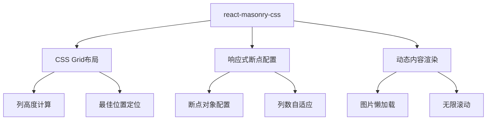

# react-masonry-css 瀑布流实现

react-masonry-css 是一个轻量级、无依赖的 React 瀑布流组件，基于 CSS Grid 和 Flexbox 实现，具有响应式友好、性能优异等特点。

## 效果特点

### 视觉特性

- **轻量高效**：包体积仅几 KB，无额外依赖
- **响应式原生支持**：通过配置即可实现不同屏幕尺寸下的列数自适应
- **灵活可控**：支持自定义间距、排序、动画过渡等
- **兼容性良好**：基于现代 CSS 特性，兼容主流浏览器

### 技术特性

- **无依赖实现**：不依赖 jQuery 或其他重型库
- **性能优化**：利用 CSS 原生能力减少 JS 计算开销
- **动态加载支持**：可轻松集成滚动加载更多功能
- **配置灵活**：提供丰富的配置选项满足不同需求

## 工作原理



## 效果演示

<demo react="react/MasonryCSS/MasonryDemo.tsx" 
:reactFiles="['react/MasonryCSS/MasonryDemo.tsx','react/MasonryCSS/MasonryInfinite.tsx']" 
/>

## 核心实现原理

### 基础实现方案

**核心思路**：

- 使用 CSS Grid 实现瀑布流布局
- 通过 `breakpointCols` 配置响应式列数
- 利用 `className` 和 `columnClassName` 控制样式
- 支持图片懒加载和无限滚动

**优点**：

- 实现简单，代码量少
- 性能优异，基于原生 CSS
- 响应式支持良好
- 易于扩展和定制

**适用场景**：

- 图片画廊展示
- 文章列表展示
- 产品展示页面
- 社交媒体内容展示

### 核心属性配置

| 属性名            | 类型          | 说明                                                                         |
| ----------------- | ------------- | ---------------------------------------------------------------------------- |
| `breakpointCols`  | Object/Number | 响应式列数配置： - 数字：固定列数； - 对象：键为屏幕宽度（px），值为对应列数 |
| `className`       | String        | 瀑布流容器的类名，用于设置 `gap`、`display` 等样式                           |
| `columnClassName` | String        | 每列容器的类名，用于设置列的间距、内边距等                                   |
| `children`        | ReactNode     | 瀑布流的子元素，通常是动态渲染的列表项                                       |

## 实现方案对比

| 方案                        | 优点                     | 缺点                | 适用场景         |
| --------------------------- | ------------------------ | ------------------- | ---------------- |
| **react-masonry-css**       | 轻量、无依赖、响应式友好 | 功能相对简单        | 大多数瀑布流需求 |
| **react-masonry-component** | 功能完善、可定制性强     | 依赖 jQuery，体积大 | 复杂交互需求     |
| **CSS Grid**                | 性能好、原生支持         | 需手动实现响应式    | 现代浏览器项目   |
| **CSS Flexbox**             | 兼容性好                 | 实现复杂            | 简单布局需求     |

## 高级功能

### 无限滚动实现

通过结合 `react-intersection-observer` 可以轻松实现无限滚动功能：

```typescript
import React, { useState, useEffect } from 'react';
import Masonry from 'react-masonry-css';
import { useInView } from 'react-intersection-observer';

const MasonryInfinite = () => {
	const [imageData, setImageData] = useState([]);
	const [page, setPage] = useState(1);
	const [isLoading, setIsLoading] = useState(false);

	// 配置 Intersection Observer
	const { ref, inView } = useInView({
		threshold: 0.1,
		triggerOnce: false
	});

	// 模拟请求数据
	const fetchImages = async pageNum => {
		setIsLoading(true);
		try {
			// 模拟接口延迟
			await new Promise(resolve => setTimeout(resolve, 1000));
			// 生成新图片数据
			const newImages = Array.from({ length: 6 }, (_, i) => ({
				id: (pageNum - 1) * 6 + i + 1,
				url: `https://picsum.photos/800/${(400 + Math.random() * 300) | 0}?random=${
					(pageNum - 1) * 6 + i + 1
				}`,
				alt: `图片${(pageNum - 1) * 6 + i + 1}`
			}));
			// 合并数据
			setImageData(prev => [...prev, ...newImages]);
		} catch (error) {
			console.error('加载图片失败：', error);
		} finally {
			setIsLoading(false);
		}
	};

	// 初始加载第一页数据
	useEffect(() => {
		fetchImages(1);
	}, []);

	// 当"加载更多"元素进入视口时，加载下一页
	useEffect(() => {
		if (inView && !isLoading) {
			setPage(prev => prev + 1);
		}
	}, [inView, isLoading]);

	// 页面更新时加载对应页数据
	useEffect(() => {
		if (page > 1) {
			fetchImages(page);
		}
	}, [page]);

	// 响应式列数配置
	const breakpointColumnsObj = {
		default: 1,
		768: 2,
		1024: 3
	};

	return (
		<div className="masonry-infinite-container">
			<h2>无限滚动瀑布流</h2>
			<Masonry
				breakpointCols={breakpointColumnsObj}
				className="my-masonry-grid"
				columnClassName="my-masonry-grid_column"
			>
				{imageData.map(image => (
					<div key={image.id} className="masonry-item">
						
					</div>
				))}
			</Masonry>
			{/* 加载更多提示框 */}
			<div ref={ref} className="loading-more">
				{isLoading ? '加载中...' : '下拉加载更多'}
			</div>
		</div>
	);
};

export default MasonryInfinite;
```

### 性能优化策略

1. **图片懒加载**：使用原生 `loading="lazy"` 或第三方库
2. **限制单次加载数量**：避免一次性加载过多数据
3. **图片尺寸预处理**：根据列数提供适配的图片尺寸
4. **避免频繁重排**：合理使用 CSS 属性减少重排重绘

## 参数配置说明

### 基础参数

| 参数名            | 类型          | 默认值           | 说明           |
| ----------------- | ------------- | ---------------- | -------------- |
| `breakpointCols`  | Object/Number | `{ default: 2 }` | 响应式列数配置 |
| `className`       | String        | `''`             | 瀑布流容器类名 |
| `columnClassName` | String        | `''`             | 列容器类名     |

### 配置示例

```typescript
// 固定列数
const fixedColumns = 3;

// 响应式列数配置
const responsiveColumns = {
	default: 1, // 默认1列
	576: 2, // 屏幕宽度>=576px时2列
	768: 3, // 屏幕宽度>=768px时3列
	1024: 4 // 屏幕宽度>=1024px时4列
};

// 使用示例
<Masonry
	breakpointCols={responsiveColumns}
	className="my-masonry-grid"
	columnClassName="my-masonry-grid_column"
>
	{/* 子元素 */}
</Masonry>;
```

### 高级参数

| 参数名                  | 类型    | 默认值  | 说明                           |
| ----------------------- | ------- | ------- | ------------------------------ |
| `disableImagesLoaded`   | Boolean | `false` | 是否禁用图片加载监听           |
| `updateOnEachImageLoad` | Boolean | `true`  | 每张图片加载完成后是否更新布局 |

## 响应式设计

### 断点配置

```css
/* 瀑布流容器 */
.my-masonry-grid {
	display: flex;
	margin-left: -20px; /* 抵消列间距 */
	width: auto;
}

/* 每列样式 */
.my-masonry-grid_column {
	padding-left: 20px; /* 列间距 */
	background-clip: padding-box;
}

/* 瀑布流项样式 */
.masonry-item {
	margin-bottom: 20px; /* 项之间的垂直间距 */
	border-radius: 8px;
	overflow: hidden;
	box-shadow: 0 2px 8px rgba(0, 0, 0, 0.1);
	transition: transform 0.3s ease;
}

.masonry-item:hover {
	transform: translateY(-5px); /* hover 动画效果 */
}

/* 图片自适应 */
.masonry-image {
	width: 100%;
	height: auto;
	display: block;
}
```

### 媒体查询适配

```css
/* 移动端 */
@media (max-width: 575px) {
	.my-masonry-grid {
		margin-left: -10px;
	}

	.my-masonry-grid_column {
		padding-left: 10px;
	}

	.masonry-item {
		margin-bottom: 10px;
	}
}

/* 平板端 */
@media (min-width: 576px) and (max-width: 767px) {
	/* 样式定义 */
}

/* 桌面端 */
@media (min-width: 768px) {
	/* 样式定义 */
}
```

## 故障排除

### 布局错乱问题

**问题**: 图片加载后项高度变化导致列不对齐
**解决方案**:

- 开启 `disableImagesLoaded={false}`（默认值）
- 为图片设置固定的宽高比容器

### 响应式列数不生效

**问题**: `breakpointCols` 配置格式错误
**解决方案**:

- 确保 `breakpointCols` 是对象时，键为数字
- 检查 CSS 中是否有属性覆盖了组件的布局

### 动态添加数据后布局未更新

**问题**: 数据更新时未触发组件重渲染
**解决方案**:

- 确保数据更新时使用 `setState` 触发重渲染
- 若添加的数据包含图片，开启 `updateOnEachImageLoad={true}`

## 技术要点

### 1. CSS Grid 布局原理

react-masonry-css 基于 CSS Grid 实现，通过以下方式实现瀑布流效果：

- 使用 `display: flex` 创建弹性布局容器
- 通过负边距和内边距实现列间距
- 利用 `margin-bottom` 控制项间距

### 2. 响应式实现机制

- 通过 JavaScript 检测窗口宽度
- 根据断点配置动态添加对应的 CSS 类
- 实现不同屏幕尺寸下的列数自适应

### 3. 性能优化策略

- 使用 CSS 硬件加速提升动画性能
- 合理使用 `will-change` 属性
- 避免频繁的 DOM 操作

## 应用场景

### 1. 图片画廊

```typescript
const ImageGallery = ({ images }) => {
	const breakpointColumnsObj = {
		default: 1,
		576: 2,
		768: 3,
		1024: 4
	};

	return (
		<Masonry
			breakpointCols={breakpointColumnsObj}
			className="image-gallery"
			columnClassName="image-gallery-column"
		>
			{images.map(image => (
				<div key={image.id} className="gallery-item">
					
					<div className="image-info">{image.title}</div>
				</div>
			))}
		</Masonry>
	);
};
```

### 2. 文章列表

```typescript
const ArticleList = ({ articles }) => {
	const breakpointColumnsObj = {
		default: 1,
		768: 2
	};

	return (
		<Masonry
			breakpointCols={breakpointColumnsObj}
			className="article-list"
			columnClassName="article-list-column"
		>
			{articles.map(article => (
				<div key={article.id} className="article-card">
					<h3>{article.title}</h3>
					<p>{article.summary}</p>
					<div className="article-meta">
						<span>{article.date}</span>
						<span>{article.author}</span>
					</div>
				</div>
			))}
		</Masonry>
	);
};
```

## 安全考虑

### 1. 图片资源安全

```typescript
// 验证图片URL安全性
const isValidImageUrl = url => {
	try {
		const parsedUrl = new URL(url);
		return parsedUrl.protocol === 'https:';
	} catch (e) {
		return false;
	}
};

// 使用示例
{
	images.map(image =>
		isValidImageUrl(image.url) ? (
			
		) : null
	);
}
```

### 2. 数据验证

```typescript
// 验证组件属性
const validateMasonryProps = props => {
	if (typeof props.breakpointCols !== 'number' && typeof props.breakpointCols !== 'object') {
		console.warn('breakpointCols 必须是数字或对象');
		return false;
	}
	return true;
};
```
