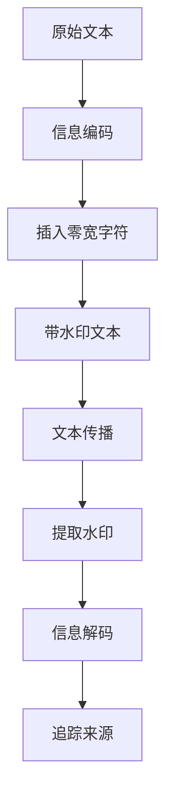

# 零宽字符隐形水印技术

零宽字符（Zero Width Characters）是一类特殊的 Unicode 字符，它们在文本中不占用任何宽度，也不会显示任何像素，因此被称为"隐形"字符。利用这一特性，我们可以将用户信息（如工号、用户名等）编码到正常文本中，实现一种隐蔽的追踪水印技术。

## 零宽字符简介

在 Unicode 字符集中，最常见的零宽字符包括：

- `\u200b` (Zero Width Space)：零宽空格
- `\u200c` (Zero Width Non-Joiner)：零宽非连字符
- `\u200d` (Zero Width Joiner)：零宽连字符

这些字符虽然不可见，但在文本处理过程中会保留下来，当文本被复制粘贴时，这些隐形字符也会一同被复制。

## 工作原理

零宽字符隐形水印的工作原理非常简单，主要包括以下几个步骤：



### 加密（编码）过程

1. 准备密码本：选择两个零宽字符分别代表二进制的 `0` 和 `1`
2. 将需要隐藏的信息（如用户工号）转换为二进制
3. 将二进制中的 0/1 替换为对应的零宽字符
4. 将生成的零宽字符序列插入到正常文本中

### 解密（解码）过程

1. 从文本中提取所有的零宽字符
2. 将零宽字符按规则还原为二进制字符串
3. 将二进制字符串转换回原始信息

## 核心实现

### React 组件示例

<demo react="react/ZeroWidthWatermark/index.tsx" 
:reactFiles="['react/ZeroWidthWatermark/index.tsx']" 
/>

### 编码实现

```typescript
// 零宽字符字典
const zeroWidthMap = {
	'0': '\u200b', // Zero Width Space
	'1': '\u200c' // Zero Width Non-Joiner
};

function textToBinary(text: string): string {
	return text
		.split('')
		.map(
			char => char.charCodeAt(0).toString(2).padStart(8, '0') // 转成8位二进制
		)
		.join('');
}

function encodeWatermark(text: string, secret: string): string {
	const binary = textToBinary(secret);
	const hiddenStr = binary
		.split('')
		.map(b => zeroWidthMap[b])
		.join('');

	// 将隐形字符，插入到文本的第一个字符后面
	// 你也可以随机分散插入，更难被发现
	return text.slice(0, 1) + hiddenStr + text.slice(1);
}
```

### 解码实现

```typescript
// 反向字典
const binaryMap = {
	'\u200b': '0',
	'\u200c': '1'
};

function decodeWatermark(text: string): string {
	// 1. 提取所有零宽字符
	const hiddenChars = text.match(/[\u200b\u200c]/g);
	if (!hiddenChars) return '未发现水印';

	// 2. 转回二进制字符串
	const binaryStr = hiddenChars.map(c => binaryMap[c]).join('');

	// 3. 二进制转文本
	let result = '';
	for (let i = 0; i < binaryStr.length; i += 8) {
		const byte = binaryStr.slice(i, i + 8);
		result += String.fromCharCode(parseInt(byte, 2));
	}

	return result;
}
```

## 参数配置说明

### 编码参数

| 参数名 | 类型   | 默认值 | 说明           |
| ------ | ------ | ------ | -------------- |
| text   | string | -      | 原始文本内容   |
| secret | string | -      | 需要隐藏的信息 |

### 解码参数

| 参数名 | 类型   | 默认值 | 说明               |
| ------ | ------ | ------ | ------------------ |
| text   | string | -      | 包含水印的文本内容 |

## 应用场景

### 1. 内部文档追踪

企业内部的重要文档（如 PRD、合同等）可以通过这种方式添加隐形水印，一旦文档泄露，可以通过解码水印追踪到具体的泄露人员。

### 2. 版权保护

对于原创内容，可以嵌入作者信息，防止内容被盗用后无法追溯来源。

### 3. 敏感信息监控

在发布敏感信息时，可以嵌入访问者身份信息，监控信息的传播路径。

## 安全考虑

### 优点

- **隐蔽性强**：肉眼无法察觉，不影响正常阅读体验
- **传播性好**：随文本复制粘贴而传播
- **实现简单**：核心代码不超过 30 行
- **成本低廉**：无需额外服务器支持

### 局限性

- **可被清除**：了解技术的用户可以通过正则表达式等方式清除
- **容量有限**：不适合嵌入大量信息
- **兼容性**：部分老旧系统可能不支持零宽字符

## 最佳实践

1. **信息编码**：只嵌入必要的标识信息，如用户 ID、时间戳等
2. **插入策略**：可以采用随机插入的方式，增加破解难度
3. **组合使用**：可与其他水印技术结合使用，提高安全性
4. **定期更新**：定期更换编码规则，防止被逆向分析

---
