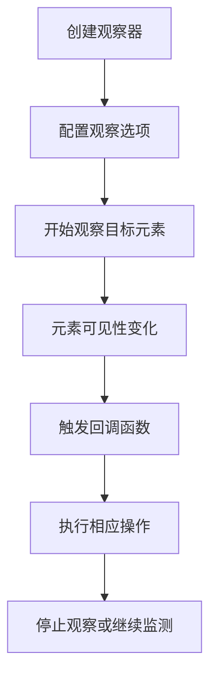

# Intersection Observer API 实现元素可见性监测

Intersection Observer API 是现代浏览器提供的一种高效的元素可见性监测机制。它可以异步观察目标元素与其祖先元素或顶级文档视窗的交叉状态，常用于实现懒加载、无限滚动、广告曝光统计等功能。

## 简介

传统的元素可见性检测通常依赖于 `getBoundingClientRect()` 方法配合滚动事件监听，但这种方式会在主线程上频繁执行，容易造成性能问题。Intersection Observer API 通过异步方式监测元素可见性变化，避免了频繁的同步计算，大大提升了性能。

## 工作原理



## 核心实现

### React 组件示例

<demo react="react/IntersectionObserverDemo/index.tsx" 
:reactFiles="['react/IntersectionObserverDemo/index.tsx','react/IntersectionObserverDemo/index.scss']" 
/>

### 基础用法

```typescript
// 创建观察器
const observer = new IntersectionObserver(entries => {
	entries.forEach(entry => {
		if (entry.isIntersecting) {
			console.log('元素进入可视区域', entry.target);
			// 可以在这里执行懒加载等操作
			entry.target.classList.add('visible');
		} else {
			console.log('元素离开可视区域', entry.target);
			entry.target.classList.remove('visible');
		}
	});
});

// 观察元素
const elements = document.querySelectorAll('.watch-element');
elements.forEach(el => observer.observe(el));
```

### 高级配置

```typescript
const options = {
	// root: 指定根元素，默认为浏览器视窗
	root: null, // 或者指定特定元素，如 document.querySelector('.container')

	// rootMargin: 根的外边距，可以扩大或缩小根的边界框
	rootMargin: '10px 0px -100px 0px', // 上右下左，类似CSS margin

	// threshold: 触发回调的可见比例
	threshold: [0, 0.25, 0.5, 0.75, 1] // 在0%, 25%, 50%, 75%, 100%可见时触发
};

const observer = new IntersectionObserver(entries => {
	entries.forEach(entry => {
		const visiblePercentage = Math.round(entry.intersectionRatio * 100);
		console.log(`元素可见 ${visiblePercentage}%`);

		// 根据可见比例执行不同操作
		if (entry.intersectionRatio > 0.5) {
			// 超过50%可见
			entry.target.classList.add('mostly-visible');
		}
	});
}, options);
```

### 懒加载图片完整实现

```typescript
class LazyImageLoader {
	private observer: IntersectionObserver;
	private loadingImages: Set<HTMLImageElement>;
	private options: {
		rootMargin: string;
		threshold: number;
		loadingClass: string;
		loadedClass: string;
		errorClass: string;
	};

	constructor(options = {}) {
		this.options = {
			rootMargin: '50px',
			threshold: 0.1,
			loadingClass: 'lazy-loading',
			loadedClass: 'lazy-loaded',
			errorClass: 'lazy-error',
			...options
		};

		this.observer = new IntersectionObserver(this.handleIntersection.bind(this), {
			rootMargin: this.options.rootMargin,
			threshold: this.options.threshold
		});

		this.loadingImages = new Set();
	}

	observe(img: HTMLImageElement) {
		if (!(img instanceof HTMLImageElement)) {
			console.warn('LazyImageLoader: 只能观察img元素');
			return;
		}

		if (!img.dataset.src && !img.dataset.srcset) {
			console.warn('LazyImageLoader: 图片缺少data-src或data-srcset属性');
			return;
		}

		this.observer.observe(img);
	}

	handleIntersection(entries: IntersectionObserverEntry[]) {
		entries.forEach(entry => {
			if (entry.isIntersecting) {
				this.loadImage(entry.target as HTMLImageElement);
				this.observer.unobserve(entry.target);
			}
		});
	}

	loadImage(img: HTMLImageElement) {
		if (this.loadingImages.has(img)) return;

		this.loadingImages.add(img);
		img.classList.add(this.options.loadingClass);

		const tempImg = new Image();

		tempImg.onload = () => {
			this.applyImage(img, tempImg);
			img.classList.remove(this.options.loadingClass);
			img.classList.add(this.options.loadedClass);
			this.loadingImages.delete(img);
		};

		tempImg.onerror = () => {
			img.classList.remove(this.options.loadingClass);
			img.classList.add(this.options.errorClass);
			this.loadingImages.delete(img);
		};

		// 支持srcset
		if (img.dataset.srcset) {
			tempImg.srcset = img.dataset.srcset;
		}
		tempImg.src = img.dataset.src;
	}

	applyImage(img: HTMLImageElement, tempImg: HTMLImageElement) {
		if (img.dataset.srcset) {
			img.srcset = img.dataset.srcset;
			delete img.dataset.srcset;
		}
		img.src = tempImg.src;
		delete img.dataset.src;
	}

	destroy() {
		this.observer.disconnect();
		this.loadingImages.clear();
	}
}
```

## 参数配置说明

### IntersectionObserver 配置参数

| 参数名     | 类型               | 默认值 | 说明                                      |
| ---------- | ------------------ | ------ | ----------------------------------------- |
| root       | Element \| null    | null   | 用于检查目标可见性的根元素，null 表示视窗 |
| rootMargin | string             | "0px"  | 根元素的外边距，类似 CSS 的 margin 属性   |
| threshold  | number \| number[] | 0      | 触发回调的可见比例阈值                    |

### LazyImageLoader 配置参数

| 参数名       | 类型   | 默认值         | 说明                      |
| ------------ | ------ | -------------- | ------------------------- |
| rootMargin   | string | "50px"         | 根元素的外边距            |
| threshold    | number | 0.1            | 触发回调的可见比例阈值    |
| loadingClass | string | "lazy-loading" | 加载中时添加的 CSS 类名   |
| loadedClass  | string | "lazy-loaded"  | 加载完成时添加的 CSS 类名 |
| errorClass   | string | "lazy-error"   | 加载失败时添加的 CSS 类名 |

## 应用场景

### 1. 图片懒加载

通过监测图片元素是否进入可视区域，动态加载图片资源，减少初始页面加载时间。

### 2. 无限滚动

监测页面底部元素是否可见，自动加载更多内容，提升用户体验。

### 3. 广告曝光统计

监测广告元素在页面中的可见时间和可见比例，用于广告效果统计。

### 4. 动画触发

当元素进入可视区域时触发动画效果，节省性能并提升用户体验。

## 性能优化

### 1. 虚拟滚动场景

```typescript
class VirtualScrollObserver {
	private container: HTMLElement;
	private itemHeight: number;
	private buffer: number;
	private items: any[];
	private visibleRange: { start: number; end: number };
	private handleScroll: () => void;

	constructor(container: HTMLElement, options = {}) {
		this.container = container;
		this.itemHeight = options.itemHeight || 100;
		this.buffer = options.buffer || 5; // 缓冲区项目数量
		this.items = [];
		this.visibleRange = { start: 0, end: 0 };

		this.handleScroll = this.throttle(this.calculateVisibleRange.bind(this), 16);
		this.container.addEventListener('scroll', this.handleScroll);
	}

	calculateVisibleRange() {
		const scrollTop = this.container.scrollTop;
		const containerHeight = this.container.clientHeight;

		const start = Math.max(0, Math.floor(scrollTop / this.itemHeight) - this.buffer);
		const end = Math.min(
			this.items.length - 1,
			Math.ceil((scrollTop + containerHeight) / this.itemHeight) + this.buffer
		);

		if (start !== this.visibleRange.start || end !== this.visibleRange.end) {
			this.visibleRange = { start, end };
			this.onVisibleRangeChange(this.visibleRange);
		}
	}

	onVisibleRangeChange(range: { start: number; end: number }) {
		// 子类实现或通过回调处理
		console.log('可见范围变化:', range);
	}

	throttle(func: Function, delay: number) {
		let lastTime = 0;
		return function (...args: any[]) {
			const now = Date.now();
			if (now - lastTime >= delay) {
				func.apply(this, args);
				lastTime = now;
			}
		};
	}
}
```

### 2. 兼容性处理

```typescript
// Intersection Observer polyfill检查
function createCompatibleObserver(callback: Function, options: any) {
	if ('IntersectionObserver' in window) {
		return new IntersectionObserver(callback as any, options);
	} else {
		console.warn('IntersectionObserver not supported, falling back to scroll listener');
		return createScrollBasedObserver(callback, options);
	}
}

function createScrollBasedObserver(callback: Function, options = {}) {
	const elements = new Set<HTMLElement>();
	const threshold = options.threshold || 0;

	function checkElements() {
		const entries: any[] = [];

		elements.forEach(element => {
			const info = getVisibilityInfo(element);
			const isIntersecting = info.visibilityRatio >= threshold;

			entries.push({
				target: element,
				isIntersecting,
				intersectionRatio: info.visibilityRatio,
				boundingClientRect: info.rect
			});
		});

		if (entries.length > 0) {
			callback(entries);
		}
	}

	const throttledCheck = throttle(checkElements, 100);

	window.addEventListener('scroll', throttledCheck, { passive: true });
	window.addEventListener('resize', throttledCheck);

	return {
		observe(element: HTMLElement) {
			elements.add(element);
			// 立即检查一次
			setTimeout(() => {
				const info = getVisibilityInfo(element);
				const isIntersecting = info.visibilityRatio >= threshold;
				callback([
					{
						target: element,
						isIntersecting,
						intersectionRatio: info.visibilityRatio,
						boundingClientRect: info.rect
					}
				]);
			}, 0);
		},

		unobserve(element: HTMLElement) {
			elements.delete(element);
		},

		disconnect() {
			window.removeEventListener('scroll', throttledCheck);
			window.removeEventListener('resize', throttledCheck);
			elements.clear();
		}
	};
}
```

## 最佳实践

1. **合理设置 threshold 值**：根据实际需求设置合适的阈值，避免过于频繁的回调触发
2. **及时取消观察**：在组件销毁或不需要监测时，及时调用`unobserve`或`disconnect`方法
3. **使用 rootMargin 优化**：通过设置适当的外边距提前触发回调，提升用户体验
4. **兼容性处理**：在需要支持老浏览器时，提供降级方案
5. **避免内存泄漏**：确保在适当的时候清理观察器和相关资源

---
