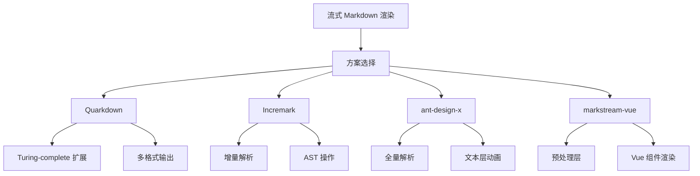
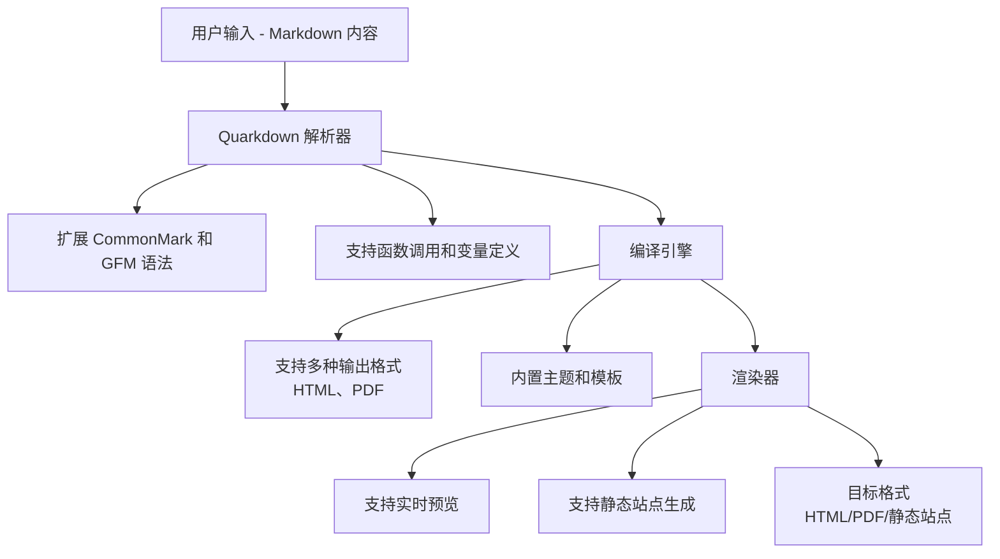
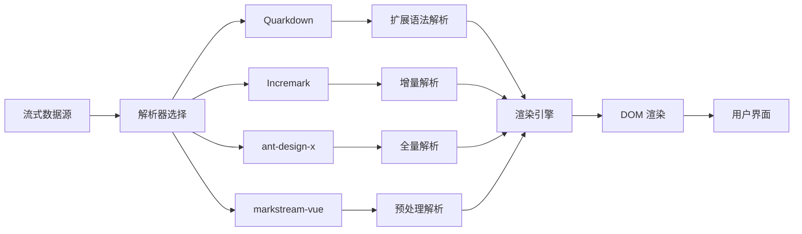
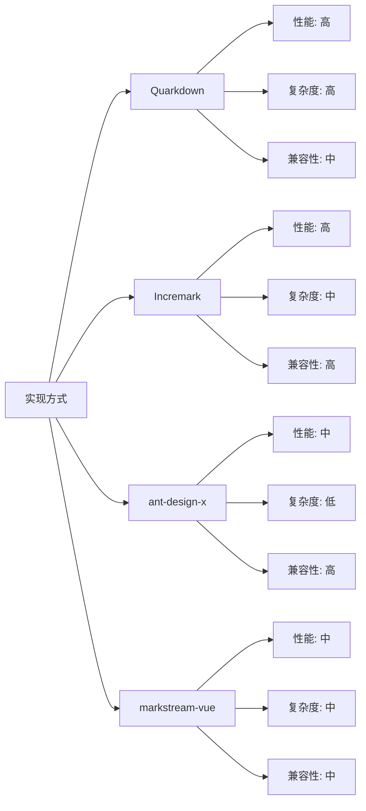

# 流式 Markdown 渲染方案对比

## 简介

本文档对流式 Markdown 渲染方案进行技术对比：Quarkdown、Incremark、ant-design-x 和 markstream-vue。每个方案都有其独特的设计理念和优势。

## 效果特点

### 视觉特性

- **多样化实现**: 不同方案提供了多样化的实现方式
- **渐进式渲染**: 支持内容逐步显示的打字机效果
- **实时预览**: 提供实时预览功能，方便调试
- **跨平台支持**: 支持多种输出格式（HTML、PDF 等）

### 技术特性

- **增量解析**: 高效处理流式数据
- **组件化设计**: 提供完整的组件实现
- **性能优化**: 针对流式场景进行性能优化
- **框架兼容**: 支持多种前端框架

## 工作原理



## 核心实现原理

### 基础实现方案

**核心思路**：

- 分析不同流式 Markdown 渲染库的特点
- 对比解析策略、动画实现和性能表现
- 提供实际可运行的示例代码
- 总结各方案的适用场景

**优点**：

- 全面覆盖主流流式渲染方案
- 提供详细的技术对比
- 包含实际代码示例
- 明确指出各方案优缺点

**适用场景**：

- AI 聊天应用
- 实时文档编辑器
- 技术博客平台
- 在线教育平台

### Quarkdown 全流程



关键特点：

- 扩展的 Markdown 语法，支持函数和变量
- 多种输出格式支持
- 实时预览功能
- 内置主题系统

### Incremark 全流程

```mermaid
graph TD
A[用户输入 - 流式 Markdown chunk] --> B[IncremarkParser.append(chunk)]
B --> B1[增量更新缓冲区<br/>只处理新增部分]
B --> B2[检测稳定边界<br/>空行、标题等]
B --> B3[稳定部分 → completedBlocks<br/>只解析一次]
B --> B4[不稳定部分 → pendingBlocks<br/>重新解析]
B --> C[输出: ParsedBlock[]<br/>mdast AST]
C --> D[BlockTransformer<br/>可选中间件]
D --> D1[打字机效果<br/>sliceAst() 截断 AST]
D --> D2[维护 TextChunk[]<br/>实现渐入动画]
D --> D3[可跳过，直接渲染完整内容]
D --> E[输出: DisplayBlock[]<br/>截断后的 AST]
E --> F[Vue / React 组件渲染]
F --> F1[AST 节点 → 组件映射]
F --> F2[TextChunks 包装渐入动画]
F --> G[Vue / React DOM]

```

关键特点：

- 增量解析：只解析新增的稳定块
- 打字机动画在 AST 节点层操作
- 同时提供 Vue 和 React 适配器

### ant-design-x 全流程

```mermaid
graph TD
    A[用户输入 - 流式 Markdown] --> B[useTyping Hook]
    B --> B1[逐字符消费纯文本]
    B --> B2[输出带 fade-in 标记的文本块]
    B --> C[useStreaming Hook]
    C --> C1[正则检测不完整 token<br/>链接、图片等]
    C --> C2[缓存不完整部分<br/>只输出完整的 Markdown]
    C --> D[Parser (marked.js)]
    D --> D1[全量解析:<br/>content → HTML 字符串]
    D --> E[Renderer (html-react-parser)]
    E --> E1[HTML 字符串 → React 组件]
    E --> F[React DOM]
```

关键特点：

- 每次内容变化时使用 marked.parse() 全量解析
- 打字机动画在纯文本字符串层操作
- 使用 HTML 字符串作为中间格式

### markstream-vue 全流程

```mermaid
graph TD
A[用户输入->Markdown 字符串] --> B[预处理]
B --> B1[正则修复流式边界问题]
B --> B2[裁剪悬空标记等]
B --> C[markdown-it.parse()]
C --> C1[全量解析 → Token 数组]
C --> D[processTokens()]
D --> D1[Token → ParsedNode[]<br/>自定义 AST]
D --> E[Vue 组件渲染]
E --> E1[实现渐入动画]
E --> E2[节点类型 → 组件映射]
E --> F[Vue DOM]

```

关键特点：

- 每次内容变化时使用 markdown-it.parse() 全量解析
- 预处理层处理流式边界情况
- 使用 `Vue <transition>` 实现打字机效果

## 实现方案对比

### 核心差异

| 维度              | Quarkdown     | ant-design-x          | markstream-vue         | Incremark            |
| ----------------- | ------------- | --------------------- | ---------------------- | -------------------- |
| 解析方式          | 扩展 Markdown | 全量解析 (marked.js)  | 全量解析 (markdown-it) | 增量解析 (micromark) |
| 单次 chunk 复杂度 | O(n)          | O(n)                  | O(n)                   | O(k)，k = 新块大小   |
| 总复杂度          | O(n)          | O(n × chunks) ≈ O(n²) | O(n × chunks) ≈ O(n²)  | O(n)                 |
| 边界处理          | 语法扩展      | 正则 token 检测       | 预处理层               | 稳定边界检测         |
| 打字机动画        | 文档层        | 文本字符串层          | Vue Transition         | AST 节点层           |
| 输出格式          | HTML/PDF      | HTML 字符串           | 自定义 AST             | mdast（兼容 remark） |
| 框架支持          | 多种          | React                 | Vue                    | Vue + React          |

### 解析策略

#### 全量解析 vs 增量解析

全量解析（ant-design-x 和 markstream-vue）：

```sh

Chunk 1: "# Hello" → 解析全部内容
Chunk 2: "# Hello\nWorld" → 再次解析全部内容
Chunk 3: "# Hello\nWorld\n\n- item" → 再次解析全部内容

```

每个新 chunk 都触发对所有累积内容的完整解析。

增量解析（Incremark）：

```sh

Chunk 1: "# Hello" → 解析 → Block 1 (heading) ✓ 完成
Chunk 2: "\n\nWorld" → 解析 → Block 2 (paragraph) ← 只处理这部分
Chunk 3: "\n\n- item" → 解析 → Block 3 (list) ← 只处理这部分

```

已完成的块被缓存，不会重新解析。只处理待定部分。

#### 复杂度分析

在多 chunk 流式场景中：

- 全量解析：`O(n) × chunk` 数量
- 增量解析：每个 `chunk O(k)，k `是新块大小

对于典型的 AI 响应（10-50 块），两种方案都能接受。差异在大文档或高频 chunk 到达时更明显。

### 流式边界处理

所有方案都需要处理流式过程中不完整的 Markdown 语法，各自采用不同方案：

| 方案           | 工作原理                 | 权衡                                 |
| -------------- | ------------------------ | ------------------------------------ |
| Quarkdown      | 扩展语法处理             | 学习成本较高，但功能强大             |
| Incremark      | 解析前检测稳定边界       | 结构清晰,可能缓冲部分内容            |
| ant-design-x   | 正则模式检测不完整 token | 立即输出,需要维护正则                |
| markstream-vue | 解析前预处理内容         | 适用于任何解析器；需处理多种边界情况 |

### 打字机动画

| 方案           | 层级       | 机制                                            |
| -------------- | ---------- | ----------------------------------------------- |
| Quarkdown      | 文档层     | 通过编译引擎实现                                |
| Incremark      | AST 节点   | `sliceAst() `截断 `AST`，`TextChunk[]` 追踪渐入 |
| ant-design-x   | 文本字符串 | 逐字符文本切片                                  |
| markstream-vue | 组件       | 组件挂载时 `Vue <transition>`                   |

各方案的权衡：

- AST 层：动画过程中保持结构感知
- 文本层：更简单，与框架无关
- 组件层：与 Vue 响应式系统自然集成
- 文档层：功能强大但复杂度高

## 效果演示

<demo react="react/StreamingMarkdownComparison/index.tsx"
:reactFiles="['react/StreamingMarkdownComparison/index.tsx','react/StreamingMarkdownComparison/index.scss']"
/>

## 流程图描述



## 参数说明

### Quarkdown 配置参数

| 参数名  | 类型    | 默认值    | 说明                           |
| ------- | ------- | --------- | ------------------------------ |
| doctype | string  | 'plain'   | 文档类型（plain/paged/slides） |
| theme   | string  | 'default' | 主题样式                       |
| preview | boolean | false     | 是否启用实时预览               |
| watch   | boolean | false     | 是否监听文件变化               |

### Incremark 配置参数

| 参数名          | 类型    | 默认值 | 说明                        |
| --------------- | ------- | ------ | --------------------------- |
| typingSpeed     | number  | 50     | 打字机效果速度（毫秒/字符） |
| chunkDelay      | number  | 100    | chunk 处理延迟（毫秒）      |
| enableAnimation | boolean | true   | 是否启用动画效果            |

### ant-design-x 配置参数

| 参数名       | 类型    | 默认值 | 说明                        |
| ------------ | ------- | ------ | --------------------------- |
| typingSpeed  | number  | 30     | 打字机效果速度（毫秒/字符） |
| streamDelay  | number  | 50     | 流式处理延迟（毫秒）        |
| enableFadeIn | boolean | true   | 是否启用淡入效果            |

### markstream-vue 配置参数

| 参数名             | 类型    | 默认值 | 说明                 |
| ------------------ | ------- | ------ | -------------------- |
| transitionDuration | number  | 300    | 过渡动画时长（毫秒） |
| batchRender        | boolean | true   | 是否启用批处理渲染   |
| virtualization     | boolean | false  | 是否启用虚拟化       |

## 高级功能

### 功能 1：自定义主题

```typescript
interface ThemeConfig {
	primaryColor: string;
	secondaryColor: string;
	backgroundColor: string;
	fontFamily: string;
}

const useTheme = (config: ThemeConfig) => {
	const [theme, setTheme] = useState(config);

	const updateTheme = (newConfig: Partial<ThemeConfig>) => {
		setTheme(prev => ({ ...prev, ...newConfig }));
	};

	return { theme, updateTheme };
};
```

### 功能 2：动画控制

```typescript
const useAnimation = (duration: number = 1000) => {
	const [isAnimating, setIsAnimating] = useState(false);
	const animationRef = useRef<number>(0);

	const startAnimation = () => {
		setIsAnimating(true);
		// 动画逻辑
	};

	const stopAnimation = () => {
		setIsAnimating(false);
		cancelAnimationFrame(animationRef.current);
	};

	return { isAnimating, startAnimation, stopAnimation };
};
```

### 功能 3：性能监控

```typescript
const usePerformanceMonitor = () => {
	const [metrics, setMetrics] = useState({
		parseTime: 0,
		renderTime: 0,
		memoryUsage: 0
	});

	const measureParse = (fn: () => any) => {
		const start = performance.now();
		const result = fn();
		const end = performance.now();
		setMetrics(prev => ({ ...prev, parseTime: end - start }));
		return result;
	};

	return { metrics, measureParse };
};
```

## 响应式设计

### 设备适配

```typescript
const useResponsive = () => {
	const [deviceType, setDeviceType] = useState<'mobile' | 'tablet' | 'desktop'>('desktop');

	useEffect(() => {
		const updateDeviceType = () => {
			const width = window.innerWidth;
			if (width < 768) {
				setDeviceType('mobile');
			} else if (width < 1024) {
				setDeviceType('tablet');
			} else {
				setDeviceType('desktop');
			}
		};

		updateDeviceType();
		window.addEventListener('resize', updateDeviceType);

		return () => window.removeEventListener('resize', updateDeviceType);
	}, []);

	return deviceType;
};
```

### 媒体查询

```scss
.streaming-markdown-container {
	width: 100%;
	max-width: 800px;
	margin: 0 auto;
	padding: 20px;

	@media (max-width: 768px) {
		padding: 10px;
		font-size: 14px;
	}

	@media (min-width: 1024px) {
		max-width: 1200px;
		padding: 30px;
	}
}
```

## 性能优化

### 1. 内存管理

```typescript
// 使用对象池避免频繁创建销毁
class ObjectPool<T> {
	private pool: T[] = [];
	private createFn: () => T;
	private resetFn: (obj: T) => void;

	constructor(createFn: () => T, resetFn: (obj: T) => void, initialSize = 10) {
		this.createFn = createFn;
		this.resetFn = resetFn;

		for (let i = 0; i < initialSize; i++) {
			this.pool.push(this.createFn());
		}
	}

	get(): T {
		if (this.pool.length > 0) {
			return this.pool.pop()!;
		}
		return this.createFn();
	}

	release(obj: T) {
		this.resetFn(obj);
		this.pool.push(obj);
	}
}
```

### 2. 渲染优化

```typescript
// 使用 React.memo 优化组件渲染
const OptimizedComponent = React.memo<ComponentProps>(
	({ content }) => {
		// 组件实现
	},
	(prevProps, nextProps) => {
		// 自定义比较逻辑
		return prevProps.content === nextProps.content;
	}
);
```

### 3. 事件节流

```typescript
const useThrottle = <T extends (...args: any[]) => any>(fn: T, delay: number): T => {
	const lastCall = useRef(0);

	return useCallback(
		(...args: Parameters<T>) => {
			const now = Date.now();
			if (now - lastCall.current >= delay) {
				lastCall.current = now;
				return fn(...args);
			}
		},
		[fn, delay]
	) as T;
};
```

## 故障排除

### 1. 解析错误

**问题**: Markdown 内容解析失败或显示异常
**解决方案**:

- 检查 Markdown 语法是否符合规范
- 确认特殊字符是否正确转义
- 验证解析器配置是否正确
- 使用调试工具查看解析过程

### 2. 动画卡顿

**问题**: 打字机效果不流畅或出现卡顿
**解决方案**:

- 使用 `requestAnimationFrame` 替代 `setTimeout`
- 启用 CSS 硬件加速 (`transform: translateZ(0)`)
- 减少动画过程中的重排和重绘
- 优化动画的计算复杂度

### 3. 内存泄漏

**问题**: 长时间使用后内存占用持续增加
**解决方案**:

- 正确清理事件监听器和定时器
- 使用 `useEffect` 的清理函数
- 避免在组件中创建不必要的闭包
- 及时释放不再使用的资源

## 技术要点

### 1. React Hooks 最佳实践

- 使用 `useState` 管理组件状态
- 使用 `useEffect` 处理副作用
- 使用 `useRef` 访问 DOM 元素和保存可变值
- 使用 `useCallback` 和 `useMemo` 优化性能

### 2. TypeScript 类型定义

- 为组件 props 定义完整的接口
- 使用泛型提高代码复用性
- 利用联合类型和可选属性增强类型安全
- 为复杂数据结构定义类型别名

### 3. CSS 样式组织

- 使用 BEM 命名规范
- 采用 CSS 变量实现主题定制
- 利用 CSS Grid 和 Flexbox 实现布局
- 使用 CSS 动画和过渡效果

## 应用场景

### 1. AI 聊天界面

```typescript
// 在 AI 聊天界面中使用流式渲染
import { StreamingMarkdown } from '@your-lib/streaming-markdown';

const ChatMessage = ({ content, isStreaming }: { content: string; isStreaming: boolean }) => (
	<div className="chat-message">
		<StreamingMarkdown content={content} isStreaming={isStreaming} typingSpeed={30} />
	</div>
);
```

### 2. 技术文档展示

```typescript
// 在技术文档中展示代码示例
const DocumentationPage = () => {
	const [config, setConfig] = useState({
		theme: 'light',
		typingSpeed: 50
	});

	return (
		<div className="documentation-page">
			<h1>技术文档</h1>
			<StreamingMarkdown
				content={documentContent}
				theme={config.theme}
				typingSpeed={config.typingSpeed}
			/>
		</div>
	);
};
```

### 3. 在线教育平台

```typescript
// 在在线教育平台中使用
const LessonPage = () => {
	const [lessonConfig, setLessonConfig] = useState({
		showAnimations: true,
		typingSpeed: 40
	});

	return (
		<div className="lesson-page">
			<StreamingMarkdown
				content={lessonContent}
				enableAnimation={lessonConfig.showAnimations}
				typingSpeed={lessonConfig.typingSpeed}
			/>
		</div>
	);
};
```

## 性能分析

不同实现方式的性能对比：



## 安全考虑

### 1. XSS 防护

```typescript
// 对用户输入进行转义
const sanitizeInput = (input: string): string => {
	return input
		.replace(/&/g, '&amp;')
		.replace(/</g, '&lt;')
		.replace(/>/g, '&gt;')
		.replace(/"/g, '&quot;')
		.replace(/'/g, '&#x27;');
};
```

### 2. 数据验证

```typescript
// 验证组件属性
const validateProps = (props: StreamingMarkdownProps): boolean => {
	if (props.typingSpeed && (props.typingSpeed < 0 || props.typingSpeed > 1000)) {
		console.warn('打字机速度值超出有效范围');
		return false;
	}
	return true;
};
```

### 3. 错误边界

```typescript
// React 错误边界组件
class ErrorBoundary extends React.Component {
	constructor(props: any) {
		super(props);
		this.state = { hasError: false };
	}

	static getDerivedStateFromError(error: Error) {
		return { hasError: true };
	}

	componentDidCatch(error: Error, errorInfo: React.ErrorInfo) {
		console.error('组件错误:', error, errorInfo);
	}

	render() {
		if ((this.state as any).hasError) {
			return <h1>出现了错误，请刷新页面重试。</h1>;
		}

		return this.props.children;
	}
}
```
