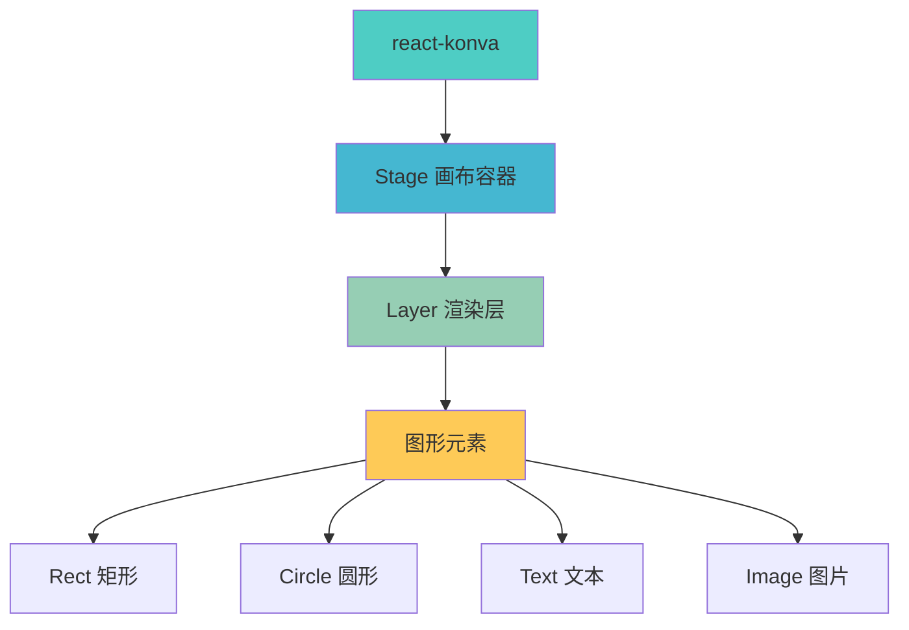

# react-konva 图形绘制与交互指南

react-konva 是 Konva.js 的 React 封装库，将 React 的声明式编程理念与 Konva.js 强大的图形处理能力完美结合，让开发者能够以更直观、高效的方式构建交互式图形应用。

## 效果特点

- **声明式 API**: 通过 React 组件描述图形结构，代码更易读、维护
- **React 生态兼容**: 无缝集成 React 的状态管理和生命周期
- **高性能渲染**: 基于分层渲染机制，仅更新变化的图形元素
- **完善事件系统**: 支持鼠标、触摸等事件，事件检测精度高
- **丰富图形动画**: 内置多种基础图形和动画效果

## 工作原理

react-konva 的核心组件结构为：Stage（画布容器）→ Layer（渲染层）→ 图形元素（Rect、Circle 等）。



## 基础使用

### 安装依赖

```bash
# npm
npm install react-konva konva --save

# yarn
yarn add react-konva konva
```

### 基础示例

<demo react="react/ReactKonva/BasicExample.tsx" 
:reactFiles="['react/ReactKonva/BasicExample.tsx','react/ReactKonva/basic-example.scss']" 
/>

**核心原理**：

- 使用 Stage 组件作为画布容器
- 使用 Layer 组件作为渲染层
- 使用 Rect、Circle 等组件创建图形元素
- 通过 draggable 属性实现拖拽功能
- 使用事件处理函数响应用户交互

**实现要点**：

1. Stage 组件需要指定 width 和 height 属性
2. 所有图形元素必须放在 Layer 组件内
3. 通过状态管理控制图形的位置、大小、颜色等属性
4. 使用事件处理函数响应用户交互

##进阶功能

### 图形动画

#### 基于状态的简单动画

<demo react="react/ReactKonva/AnimatedRect.tsx" 
:reactFiles="['react/ReactKonva/AnimatedRect.tsx','react/ReactKonva/animated-rect.scss']" 
/>

#### Konva 原生动画

<demo react="react/ReactKonva/ComplexAnimation.tsx" 
:reactFiles="['react/ReactKonva/ComplexAnimation.tsx','react/ReactKonva/complex-animation.scss']" 
/>

### 图形变换

#### 旋转控制

<demo react="react/ReactKonva/RotatableRect.tsx" 
:reactFiles="['react/ReactKonva/RotatableRect.tsx','react/ReactKonva/rotatable-rect.scss']" 
/>

### 事件处理

#### 鼠标事件

<demo react="react/ReactKonva/MouseEvents.tsx" 
:reactFiles="['react/ReactKonva/MouseEvents.tsx','react/ReactKonva/mouse-events.scss']" 
/>

## 核心组件

| 组件       | 作用说明                                                       |
| ---------- | -------------------------------------------------------------- |
| `<Stage>`  | 顶层画布容器，对应 Konva.Stage，需指定 width 和 height 属性    |
| `<Layer>`  | 渲染层，对应 Konva.Layer，每个 Layer 包含一个 Canvas 元素      |
| `<Rect>`   | 矩形图形，支持 x、y、width、height、fill 等属性                |
| `<Circle>` | 圆形图形，核心属性为 x、y（圆心坐标）、radius（半径）、fill    |
| `<Text>`   | 文本元素，支持 text（内容）、fontSize、fontFamily、fill 等属性 |
| `<Image>`  | 图片元素，需通过 image 属性传入 Image 对象                     |

## API 说明

### 图形元素核心属性

| 属性名      | 类型    | 说明                 |
| ----------- | ------- | -------------------- |
| x           | number  | 元素的横坐标         |
| y           | number  | 元素的纵坐标         |
| width       | number  | 元素宽度（矩形）     |
| height      | number  | 元素高度（矩形）     |
| radius      | number  | 半径（圆形）         |
| fill        | string  | 填充颜色             |
| stroke      | string  | 边框颜色             |
| strokeWidth | number  | 边框宽度             |
| draggable   | boolean | 是否可拖拽           |
| rotation    | number  | 旋转角度（单位：度） |
| scaleX      | number  | X 轴缩放比例         |
| scaleY      | number  | Y 轴缩放比例         |
| offsetX     | number  | 变换基准点 X         |
| offsetY     | number  | 变换基准点 Y         |

### 常见事件类型

| 事件类型      | 说明         |
| ------------- | ------------ |
| onClick       | 点击事件     |
| onDoubleClick | 双击事件     |
| onMouseDown   | 鼠标按下事件 |
| onMouseUp     | 鼠标抬起事件 |
| onMouseOver   | 鼠标悬停事件 |
| onMouseOut    | 鼠标离开事件 |
| onDragStart   | 拖拽开始事件 |
| onDragEnd     | 拖拽结束事件 |
| onTouchStart  | 触摸开始事件 |
| onTouchEnd    | 触摸结束事件 |

## 参数配置

### 可配置参数

<demo react="react/ReactKonva/ConfigurableDemo.tsx" 
:reactFiles="['react/ReactKonva/ConfigurableDemo.tsx','react/ReactKonva/configurable-demo.scss']" 
/>

| 参数名      | 类型    | 默认值  | 说明       |
| ----------- | ------- | ------- | ---------- |
| width       | number  | 600     | 画布宽度   |
| height      | number  | 400     | 画布高度   |
| rectCount   | number  | 5       | 矩形数量   |
| fillColor   | string  | #4169e1 | 填充颜色   |
| strokeColor | string  | #333    | 边框颜色   |
| strokeWidth | number  | 2       | 边框宽度   |
| draggable   | boolean | true    | 是否可拖拽 |

## 性能优化

### 分层渲染

建议将"频繁更新的元素"与"静态元素"分属不同 Layer 以优化性能：

```jsx
<Stage width={600} height={400}>
	{/* 静态背景层 */}
	<Layer>
		<Rect x={0} y={0} width={600} height={400} fill="#f0f0f0" />
	</Layer>

	{/* 动态元素层 */}
	<Layer>
		{/* 频繁更新的元素 */}
		{dynamicElements.map((element, index) => (
			<Rect key={index} {...element} />
		))}
	</Layer>
</Stage>
```

### 事件优化

使用事件委托减少事件监听器数量：

```jsx
// 不推荐：为每个元素单独绑定事件
{
	elements.map((element, index) => (
		<Rect key={index} {...element} onClick={() => handleClick(index)} />
	));
}

// 推荐：在父级处理事件
<Layer onClick={handleLayerClick}>
	{elements.map((element, index) => (
		<Rect key={index} {...element} id={index} />
	))}
</Layer>;
```

## 应用场景

### 数据可视化

- 图表绘制
- 仪表盘
- 数据图形展示

### 设计工具

- 画板应用
- 图形编辑器
- 布局设计器

### 游戏开发

- 2D 游戏
- 交互式动画
- 物理模拟

### 教育应用

- 几何图形教学
- 物理实验模拟
- 交互式课件

## 故障排除

常见问题及解决方案：

1. **图形不显示**：

   - 检查 Stage 的 width 和 height 是否正确设置
   - 确保所有图形元素都在 Layer 内
   - 检查图形的坐标和尺寸是否在可视范围内

2. **事件不响应**：

   - 确保图形元素设置了正确的事件处理函数
   - 检查是否被其他元素遮挡
   - 确认 draggable 属性是否正确设置

3. **性能问题**：
   - 使用分层渲染优化性能
   - 避免频繁的状态更新
   - 合理使用事件监听器

## 相关资源

- [react-konva 官方文档](https://konvajs.org/docs/react/index.html)
- [Konva.js 官方文档](https://konvajs.org/docs/index.html)
- [Canvas API 参考](https://developer.mozilla.org/zh-CN/docs/Web/API/Canvas_API)

---

_react-konva 为 React 开发者提供了强大的图形绘制和交互能力，通过声明式的方式让复杂的 Canvas 操作变得简单直观。_
