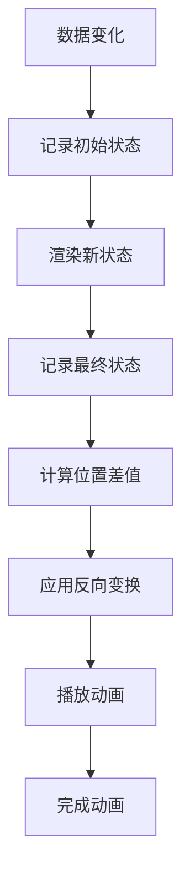

# Vue Flip Motion 动画库

Vue Flip Motion 是一个基于 FLIP (First Last Invert Play) 动画技术封装的 Vue 组件，让您的动画效果如德芙般丝滑流畅！

## 🌟 特性

- **简单易用**：通过数据驱动的方式触发动画
- **性能优化**：使用 FLIP 技术减少布局抖动
- **高度可定制**：支持多种动画参数配置
- **跨版本支持**：同时支持 Vue 2.x 和 Vue 3.x
- **嵌套动画**：支持多层嵌套实现复杂动画效果

## 📦 安装

```bash
npm install vue-flip-motion
# 或
yarn add vue-flip-motion
```

## 基础用法

### 基本示例

<demo vue="vue/FlipMotion/example.vue" :vueFiles='["vue/FlipMotion/example.vue","vue/FlipMotion/index.vue"]' />

## 高级用法

### 高级示例

<demo vue="vue/FlipMotion/advanced-example.vue" :vueFiles='["vue/FlipMotion/advanced-example.vue","vue/FlipMotion/index.vue"]' />

### 嵌套动画

FlipMotion 组件支持嵌套使用，可以实现更复杂的动画效果。外层 Flip 组件处理位置变化动画，内层 Flip 组件处理其他样式属性变化动画。

```vue
<template>
	<Flip
		:mutation="list"
		:animate-option="{ duration: 800 }"
		styles="['position-x','position-y']"
		selector=".item"
	>
		<div class="container">
			<div v-for="item in list" :key="item.id" class="item">
				<Flip :mutation="item" :styles="['backgroundColor']" :animate-option="{ duration: 500 }">
					<div :style="{ backgroundColor: item.color }">
						{{ item.name }}
					</div>
				</Flip>
			</div>
		</div>
	</Flip>
</template>
```

### 自定义选择器

通过 `selector` 属性可以精确控制需要动画的元素，适用于复杂的 DOM 结构。

```vue
<template>
	<Flip :mutation="list" selector=".animated-item" :animate-option="{ duration: 500 }">
		<div class="wrapper">
			<div class="animated-item" v-for="item in list" :key="item.id">
				{{ item.text }}
			</div>
		</div>
	</Flip>
</template>
```

### 列表过滤动画

在列表过滤场景中，FlipMotion 可以自动处理元素的进入和离开动画。

```vue
<template>
	<Flip
		:mutation="filteredList"
		:animate-option="{ duration: 500 }"
		:styles="['position-x', 'position-y', 'opacity']"
	>
		<div class="list-container">
			<div v-for="item in filteredList" :key="item.id" :style="{ opacity: 1 }">
				{{ item.name }}
			</div>
		</div>
	</Flip>
</template>
```

## 应用场景

FlipMotion 动画组件适用于多种用户界面场景：

### 1. 数据可视化

- 图表元素重排动画
- 数据点位置变换
- 动态数据更新效果

### 2. 用户界面交互

- 列表重排和排序
- 卡片位置交换
- 表单字段动态添加/删除

### 3. 电商应用

- 购物车项目管理
- 商品列表过滤
- 产品比较界面

### 4. 仪表板和管理界面

- 小部件重新排列
- 数据面板切换
- 通知列表更新

## 🎨 动画参数详解

### styles 属性配置

| 样式属性          | 说明         | 示例效果         |
| ----------------- | ------------ | ---------------- |
| `position-x`      | X 轴位置动画 | 元素左右移动     |
| `position-y`      | Y 轴位置动画 | 元素上下移动     |
| `width`           | 宽度变化动画 | 元素宽度调整     |
| `height`          | 高度变化动画 | 元素高度调整     |
| `backgroundColor` | 背景色变化   | 背景色渐变过渡   |
| `color`           | 文字颜色变化 | 文字颜色渐变过渡 |
| `opacity`         | 透明度变化   | 元素淡入淡出     |
| `borderRadius`    | 圆角变化     | 元素圆角调整     |
| `transform`       | 变换属性     | 缩放、旋转等变换 |

### animateOption 配置详解

| 选项         | 类型            | 默认值   | 说明                     |
| ------------ | --------------- | -------- | ------------------------ |
| `duration`   | Number          | 200      | 动画持续时间(ms)         |
| `easing`     | String          | "linear" | 缓动函数                 |
| `delay`      | Number          | 0        | 动画延迟时间(ms)         |
| `iterations` | Number/Infinity | 1        | 动画重复次数             |
| `direction`  | String          | "normal" | 动画播放方向             |
| `fill`       | String          | "none"   | 动画填充模式             |
| `endDelay`   | Number          | 0        | 动画结束后的延迟时间(ms) |

## 🎨 核心 API

### Flip 组件 Props

| 参数            | 类型                                     | 必填 | 默认值                                       | 说明                                                   |
| --------------- | ---------------------------------------- | ---- | -------------------------------------------- | ------------------------------------------------------ |
| `mutation`      | [Array, Object, Number, String, Boolean] | 是   | -                                            | 触发动画的响应式数据                                   |
| `selector`      | String                                   | 否   | -                                            | 默认使用 flip 组件的直接子元素为动画对象，自定义选择器 |
| `styles`        | Array                                    | 否   | ['position-x','position-y','width','height'] | styles 数组指定参与动画的样式属性                      |
| `animateOption` | Object                                   | 否   | {}                                           | 动画配置选项                                           |

### 动画配置选项 (animateOption)

| 选项                 | 类型            | 默认值    | 说明                     |
| -------------------- | --------------- | --------- | ------------------------ |
| `delay`              | Number          | 0         | 动画开始前的延迟时间(ms) |
| `duration`           | Number          | 200       | 单次动画周期时长(ms)     |
| `easing`             | String          | "linear"  | 动画缓动函数             |
| `direction`          | String          | "normal"  | 动画播放方向             |
| `iterations`         | Number/Infinity | 1         | 动画重复次数             |
| `fill`               | String          | "none"    | 动画填充模式             |
| `endDelay`           | Number          | 0         | 动画结束后的延迟时间(ms) |
| `iterationStart`     | Number          | 0.0       | 动画开始的迭代进度点     |
| `composite`          | String          | "replace" | 多动画叠加方式           |
| `iterationComposite` | String          | "replace" | 跨迭代累积方式           |
| `pseudoElement`      | String          | -         | 目标伪元素选择器         |

## 工作原理



### 核心逻辑说明

1. **First（初始状态）**：在数据变化前记录元素的位置和尺寸
2. **Last（最终状态）**：在数据变化后记录元素的新位置和尺寸
3. **Invert（反转）**：计算位置差值，并应用反向变换使元素回到初始位置
4. **Play（播放）**：移除反向变换，让元素自然过渡到最终位置

## 🛠️ 高级用法

### 自定义选择器

``vue
<template>
<Flip :mutation="state" selector=".animated-item" :animate-option="{ duration: 500 }">

<div>
<div class="animated-item" v-for="item in list" :key="item.id">
{{ item.text }}
</div>
</div>
</Flip>
</template>

````

### 嵌套动画

```vue
<template>
	<Flip
		:mutation="roll"
		:animate-option="{ duration: 3000 }"
		:styles="['position-x', 'position-y']"
		name="roll"
		selector=".box"
	>
		<Flip :mutation="active" :styles="['backgroundColor']" :animate-option="{ duration: 2000 }">
			<div class="box" :class="{ active, roll }" @click="handleClick"></div>
		</Flip>
	</Flip>
</template>
````

### 自定义选择器获取动画元素终态

```vue
<template>
	<Flip
		class="wrapper"
		:mutation="[left, right]"
		selector=".item"
		:animate-option="{ duration: 500 }"
		:styles="['position-x', 'position-y']"
	>
		<div class="left">
			<div
				v-for="item in left"
				:key="item.id"
				class="item"
				@click="clickLeft(item)"
				:id="item.id"
				:data-flip-selector="`#${item.id}`"
			></div>
		</div>
		<div class="right">
			<div
				v-for="item in right"
				:key="item.id"
				class="item"
				@click="clickRight(item)"
				:id="item.id"
				:data-flip-selector="`#${item.id}`"
			></div>
		</div>
	</Flip>
</template>
```

### 事件处理

```vue
<template>
	<Flip :mutation="state" :animate-option="{ duration: 500 }" @finish="handleFinish">
		<div class="animated-item" v-for="item in list" :key="item.id">
			{{ item.text }}
		</div>
	</Flip>
</template>
```

## 自定义参数配置

通过 [animateOption](#动画配置选项-animateoption) 参数可以配置动画的各种属性，实现实时效果调整：

- **duration**：控制动画持续时间
- **easing**：设置缓动函数（如 ease-in-out, cubic-bezier 等）
- **delay**：设置动画延迟时间
- **iterations**：设置动画重复次数

## 最佳实践

### 性能优化建议

1. **合理使用 selector**：避免选择器过于复杂导致性能问题
2. **限制 styles 数组**：只包含需要动画的样式属性
3. **避免频繁触发**：合理控制数据变化频率
4. **使用 will-change**：对复杂动画元素添加 will-change 提示

### 使用注意事项

1. `mutation` 参数是必须的，它是触发动画的关键
2. 默认会将元素尺寸和位置作为动画效果
3. 可以通过 `styles` 数组指定需要的动画样式
4. 嵌套使用时会产生叠加动画效果
5. 确保选择器能正确匹配到目标元素

## 相关资源

- **GitHub**: https://github.com/qianyuanjia/vue-flip-motion
- **NPM**: https://www.npmjs.com/package/vue-flip-motion

---

_Vue Flip Motion 让复杂的 FLIP 动画变得简单易用，通过合理的配置可以实现流畅的用户界面动画效果。_
