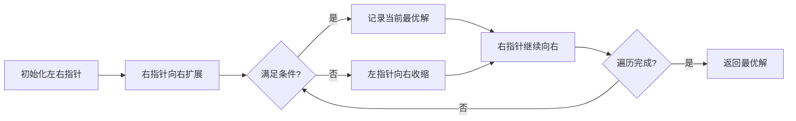
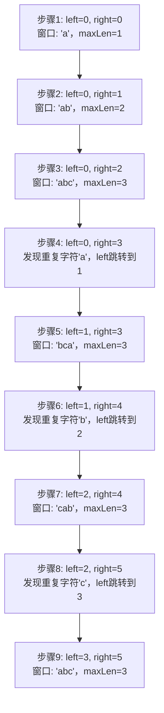

# 滑动窗口算法详解

在解决字符串和数组问题时，滑动窗口算法是提升性能的关键技巧。本文将从前端视角深入解析这一算法，结合 JavaScript 实现和实际应用场景，助你掌握这一高效解题方法。

## 什么是滑动窗口算法？

滑动窗口算法是一种通过维护数据子集来优化计算效率的算法。它通过动态调整窗口的边界（起始点和结束点），避免重复计算，将时间复杂度从 O(n²) 优化到 O(n)。

### 核心思想

滑动窗口算法的核心思想包括以下步骤：

1. 初始化左右指针定义窗口边界
2. 右指针扩展窗口直到满足条件
3. 左指针收缩窗口直到打破条件
4. 在移动过程中记录最优解

```javascript
// 滑动窗口通用模板
function slidingWindow(s) {
  let left = 0;
  const map = new Map(); // 存储窗口状态

  for (let right = 0; right < s.length; right++) {
    // 1. 扩展右边界
    const char = s[right];
    map.set(char, (map.get(char) || 0) + 1);

    // 2. 满足条件时收缩左边界
    while (/* 收缩条件 */) {
      const leftChar = s[left];
      map.set(leftChar, map.get(leftChar) - 1);
      left++;
    }

    // 3. 更新结果
    max = Math.max(max, right - left + 1);
  }

  return max;
}
```

## 滑动窗口的工作流程

为了更好地理解滑动窗口算法的工作原理，我们通过一个可视化流程图来展示：



## 为什么前端需要掌握滑动窗口算法？

在复杂的现代前端应用中，我们经常面临以下场景：

- 实时分析用户输入内容
- 监控页面性能指标变化
- 处理 WebSocket 数据流
- 优化界面渲染性能

这些场景的共同特点是：需要高效处理连续数据序列。滑动窗口算法正是为此而生，它能以 O(n) 时间复杂度解决许多看似复杂的问题。

## 经典例题：无重复字符的最长子串

### 问题描述

给定字符串 `s`，找出其中不含有重复字符的最长子串的长度。

### 解题思路

1. 使用左右指针定义窗口边界
2. 右指针不断向右扩展
3. 当遇到重复字符时，左指针向右收缩
4. 使用 Map 记录字符最后出现的位置

```javascript
function lengthOfLongestSubstring(s) {
	let maxLen = 0;
	let left = 0;
	const charMap = new Map(); // 存储字符最后出现的位置

	for (let right = 0; right < s.length; right++) {
		const currentChar = s[right];

		// 如果字符已存在且位置在窗口内
		if (charMap.has(currentChar) && charMap.get(currentChar) >= left) {
			// 跳跃到重复字符的下一位
			left = charMap.get(currentChar) + 1;
		}

		// 更新字符位置
		charMap.set(currentChar, right);

		// 更新最大长度
		maxLen = Math.max(maxLen, right - left + 1);
	}

	return maxLen;
}

// 测试
console.log(lengthOfLongestSubstring('abcabcbb')); // 3 ("abc")
console.log(lengthOfLongestSubstring('bbbbb')); // 1 ("b")
console.log(lengthOfLongestSubstring('pwwkew')); // 3 ("wke")
```

### 算法执行过程可视化

让我们通过一个具体的例子来可视化算法的执行过程：

假设输入字符串为 "abcabcbb"，我们将逐步展示窗口的变化：



### 时间复杂度分析

- 最优情况：O(n) - 每个元素仅访问一次
- 空间复杂度：O(min(m, n)) - m 为字符集大小

### 实际应用场景

- 验证用户输入的密码复杂度
- 检测文本编辑器中的重复内容
- 分析用户输入习惯

## 前端业务场景实践

### 1. 性能监控 - 计算 FCP 最长持续时间

```javascript
function calculateLongestFCP(performanceEntries, maxDuration) {
	let left = 0;
	let maxPeriod = 0;

	for (let right = 0; right < performanceEntries.length; right++) {
		// 当窗口内 FCP 总时长超过阈值
		while (performanceEntries[right].startTime - performanceEntries[left].startTime > maxDuration) {
			left++;
		}

		// 更新最长稳定时间段
		maxPeriod = Math.max(maxPeriod, right - left + 1);
	}

	return maxPeriod;
}
```

### 2. 实时数据流 - 检测异常波动

```javascript
function detectAnomaly(dataStream, threshold) {
	let left = 0;
	let sum = 0;
	const anomalies = [];

	for (let right = 0; right < dataStream.length; right++) {
		sum += dataStream[right];

		// 窗口大小固定为 60 个数据点（1 分钟）
		if (right >= 60) {
			sum -= dataStream[left];
			left++;
		}

		// 检测异常平均值
		if (right >= 60 && sum / 60 > threshold) {
			anomalies.push({ start: left, end: right });
		}
	}

	return anomalies;
}
```

### 3. 用户行为分析 - 寻找高频操作序列

```javascript
function findCommonPattern(eventLog, sequenceLength) {
	let left = 0;
	const patternMap = new Map();
	let maxPattern = null;
	let maxCount = 0;

	for (let right = 0; right < eventLog.length; right++) {
		// 窗口达到目标序列长度
		if (right - left + 1 === sequenceLength) {
			const sequence = eventLog.slice(left, right + 1).join('-');
			const count = (patternMap.get(sequence) || 0) + 1;

			patternMap.set(sequence, count);

			if (count > maxCount) {
				maxCount = count;
				maxPattern = sequence;
			}

			left++;
		}
	}

	return { pattern: maxPattern, frequency: maxCount };
}
```

## 滑动窗口的变体与应用

### 1. 固定大小窗口

```javascript
// 大小为 k 的最大子数组和
function maxSubarraySum(nums, k) {
	let maxSum = 0;
	let currentSum = 0;

	// 初始化第一个窗口
	for (let i = 0; i < k; i++) {
		currentSum += nums[i];
	}

	maxSum = currentSum;

	// 滑动窗口
	for (let i = k; i < nums.length; i++) {
		currentSum += nums[i] - nums[i - k];
		maxSum = Math.max(maxSum, currentSum);
	}

	return maxSum;
}
```

### 2. 计数型窗口

```javascript
// 包含最多 k 个 0 的最长子数组
function longestOnes(nums, k) {
	let left = 0;
	let zeroCount = 0;
	let maxLen = 0;

	for (let right = 0; right < nums.length; right++) {
		if (nums[right] === 0) zeroCount++;

		while (zeroCount > k) {
			if (nums[left] === 0) zeroCount--;
			left++;
		}

		maxLen = Math.max(maxLen, right - left + 1);
	}

	return maxLen;
}
```

### 3. 多指针窗口

```javascript
// 最小覆盖子串
function minWindow(s, t) {
	const targetMap = new Map();
	for (const char of t) {
		targetMap.set(char, (targetMap.get(char) || 0) + 1);
	}

	let left = 0;
	let count = t.length;
	let minLen = Infinity;
	let start = 0;

	for (let right = 0; right < s.length; right++) {
		const char = s[right];
		if (targetMap.has(char)) {
			targetMap.set(char, targetMap.get(char) - 1);
			if (targetMap.get(char) >= 0) count--;
		}

		while (count === 0) {
			if (right - left + 1 < minLen) {
				minLen = right - left + 1;
				start = left;
			}

			const leftChar = s[left];
			if (targetMap.has(leftChar)) {
				targetMap.set(leftChar, targetMap.get(leftChar) + 1);
				if (targetMap.get(leftChar) > 0) count++;
			}

			left++;
		}
	}

	return minLen === Infinity ? '' : s.substr(start, minLen);
}
```

## 性能优化技巧

### 1. 边界跳跃优化

当发现重复字符时，直接跳到重复位置的下一位：

```javascript
// ASCII 优化版（仅适用于小写字母）
function lengthOfLongestSubstringOpt(s) {
	let maxLen = 0;
	let left = 0;
	const charIndex = new Array(128).fill(-1); // ASCII 映射

	for (let right = 0; right < s.length; right++) {
		const code = s.charCodeAt(right);

		// 直接跳跃到重复字符的下一位
		left = Math.max(left, charIndex[code] + 1);

		charIndex[code] = right;
		maxLen = Math.max(maxLen, right - left + 1);
	}

	return maxLen;
}
```

### 2. 空间压缩

使用 ASCII 数组代替 Map，适用于小字符集。

### 3. 延迟更新

只在必要时更新结果，减少计算次数。

### 4. 并行处理

对大数据集分割后并行处理窗口。

## 总结

滑动窗口算法是前端开发者解决字符串和数组问题的利器，其核心价值在于：

1. **时间复杂度优化**：将 O(n²) 问题降为 O(n)
2. **空间效率**：仅需常数或线性额外空间
3. **代码简洁**：逻辑清晰易于维护
4. **应用广泛**：从算法题到业务场景无缝衔接

掌握滑动窗口的关键在于：

- 准确识别窗口收缩条件
- 合理选择数据结构存储窗口状态
- 正确处理边界情况
- 根据业务需求调整窗口大小

在实际开发中，滑动窗口算法可用于：

- 用户行为模式识别
- 性能监控数据分析
- 实时流数据处理
- 界面渲染优化

通过本文的详细解析和代码示例，相信你已经掌握了滑动窗口算法的精髓。下次遇到子串或子数组问题时，不妨尝试使用这一高效算法！
