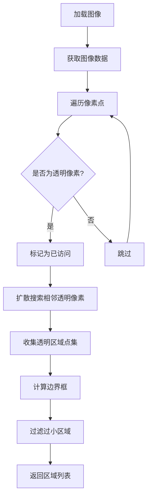

# 图像透明区域检测

## 简介

图像透明区域检测是一种用于识别图像中透明像素区域的技术，通过分析图像的 Alpha 通道来确定透明区域的位置和尺寸。该技术在图像编辑器、模板设计、自动布局等场景中具有重要应用价值。

该技术的核心思想是将图像中的每个像素点表示为二维数组中的元素，透明像素用 1 表示，不透明像素用 0 表示，然后使用类似于 LeetCode 中"最大岛屿数量"问题的算法来识别和计算各个透明区域的边界框。

## 效果演示

<demo react="react/tools/TransparentAreaDetection/example.tsx" 
:reactFiles="['react/tools/TransparentAreaDetection/example.tsx', 'react/tools/TransparentAreaDetection/index.tsx']" />

## 调试示例

<demo react="react/tools/TransparentAreaDetection/debug.tsx" 
:reactFiles="['react/tools/TransparentAreaDetection/debug.tsx', 'react/tools/TransparentAreaDetection/index.tsx']" />

## 核心实现

### 流程图



### 核心逻辑说明

1. **图像加载**：通过 Canvas API 加载并绘制图像
2. **数据提取**：获取图像的 RGBA 像素数据
3. **透明检测**：检查每个像素的 Alpha 通道值是否小于阈值
4. **区域扩散**：使用栈结构实现深度优先搜索，找到相连的透明像素区域
5. **边界计算**：计算每个区域的最小外接矩形
6. **过滤处理**：过滤掉面积过小的区域，避免噪声干扰

## React 组件实现

### 主组件

```typescript
import * as React from 'react';

interface Rect {
	x: number;
	y: number;
	w: number;
	h: number;
}

interface TransparentAreaDetectionProps {
	imageUrl: string;
	minWidth?: number;
	minHeight?: number;
	alphaThreshold?: number; // 透明度阈值 (0-255)
	onAreasDetected?: (areas: Rect[]) => void;
	className?: string;
	style?: React.CSSProperties;
}

const TransparentAreaDetection: React.FC<TransparentAreaDetectionProps> = ({
	imageUrl,
	minWidth = 10,
	minHeight = 10,
	alphaThreshold = 10, // 默认阈值
	onAreasDetected,
	className = '',
	style = {}
}) => {
	const canvasRef = React.useRef<HTMLCanvasElement>(null);
	const [areas, setAreas] = React.useState<Rect[]>([]);
	const [loading, setLoading] = React.useState(false);
	const [error, setError] = React.useState<string | null>(null);
	const onAreasDetectedRef = React.useRef(onAreasDetected);

	// 更新回调函数引用
	React.useEffect(() => {
		onAreasDetectedRef.current = onAreasDetected;
	}, [onAreasDetected]);

	// 检查像素是否透明 (Alpha 通道小于阈值的视为透明)
	const isEmptyPixel = (data: Uint8ClampedArray, x: number, y: number, width: number): boolean => {
		const index = (y * width + x) * 4;
		return data[index + 3] < alphaThreshold;
	};

	// 扩散搜索透明区域
	const findEmptyArea = (
		data: Uint8ClampedArray,
		visited: boolean[],
		startX: number,
		startY: number,
		width: number,
		height: number
	): { x: number; y: number }[] => {
		const area: { x: number; y: number }[] = [];
		const stack: { x: number; y: number }[] = [{ x: startX, y: startY }];

		while (stack.length > 0) {
			const { x, y } = stack.pop()!;

			// 越界判断
			if (x < 0 || x >= width || y < 0 || y >= height) continue;
			// 是否已经访问过
			if (visited[y * width + x]) continue;

			// 标记为已访问
			visited[y * width + x] = true;

			// 是否是透明像素
			if (!isEmptyPixel(data, x, y, width)) continue;

			// 收集扩散到的点
			area.push({ x, y });
			// 扩散到相邻的点
			stack.push({ x: x + 1, y });
			stack.push({ x: x - 1, y });
			stack.push({ x, y: y + 1 });
			stack.push({ x, y: y - 1 });
		}

		return area;
	};

	// 将点集转换为矩形
	const pointsToRect = (
		points: { x: number; y: number }[],
		width: number,
		height: number
	): Rect | null => {
		// 如果点集为空，则返回 null
		if (points.length === 0) return null;

		// 调整过滤条件，使更敏感
		if (points.length < 5) return null; // 至少5个像素点才认为是有效区域

		let minX = Infinity;
		let minY = Infinity;
		let maxX = -Infinity;
		let maxY = -Infinity;

		for (const point of points) {
			minX = Math.min(minX, point.x);
			minY = Math.min(minY, point.y);
			maxX = Math.max(maxX, point.x);
			maxY = Math.max(maxY, point.y);
		}

		return {
			x: minX,
			y: minY,
			w: maxX - minX + 1,
			h: maxY - minY + 1
		};
	};

	// 检测透明区域
	React.useEffect(() => {
		if (!imageUrl) return;

		setLoading(true);
		setError(null);

		const detectAreas = async () => {
			try {
				const img = new Image();
				img.crossOrigin = 'Anonymous';
				img.src = imageUrl;

				img.onload = () => {
					console.log('图像加载成功:', img.width, 'x', img.height);
					const canvas = canvasRef.current;
					if (!canvas) {
						console.error('Canvas 未找到');
						setError('Canvas 未找到');
						setLoading(false);
						return;
					}

					const ctx = canvas.getContext('2d', { willReadFrequently: true });
					if (!ctx) {
						console.error('无法获取 Canvas 上下文');
						setError('无法获取 Canvas 上下文');
						setLoading(false);
						return;
					}

					canvas.width = img.width;
					canvas.height = img.height;
					ctx.drawImage(img, 0, 0);
					const imageData = ctx.getImageData(0, 0, img.width, img.height);
					const data = imageData.data;
					console.log('图像数据获取成功，像素总数:', data.length / 4);
					const visited = new Array(img.width * img.height).fill(false);
					const emptyRects: Rect[] = [];

					// 遍历每个像素点
					let transparentPixelCount = 0;
					for (let y = 0; y < img.height; y++) {
						for (let x = 0; x < img.width; x++) {
							// 如果这个像素点已经访问过，则跳过
							// 如果这个像素点是透明像素，则进行扩散
							if (!visited[y * img.width + x] && isEmptyPixel(data, x, y, img.width)) {
								transparentPixelCount++;
								// 进行扩散
								const area = findEmptyArea(data, visited, x, y, img.width, img.height);
								// 将扩散到的点集转换为矩形
								const rect = pointsToRect(area, img.width, img.height);
								if (rect && rect.w >= minWidth && rect.h >= minHeight) {
									emptyRects.push(rect);
								}
							}
						}
					}

					console.log('透明像素数量:', transparentPixelCount);
					console.log('检测到的区域数量:', emptyRects.length);
					console.log('检测到的区域:', emptyRects);

					setAreas(emptyRects);
					onAreasDetectedRef.current?.(emptyRects);
					setLoading(false);
				};

				img.onerror = err => {
					console.error('图像加载失败:', err);
					setError('图像加载失败');
					setLoading(false);
				};
			} catch (err) {
				console.error('检测过程中发生错误:', err);
				setError('检测过程中发生错误: ' + (err as Error).message);
				setLoading(false);
			}
		};

		detectAreas();
	}, [imageUrl, minWidth, minHeight, alphaThreshold]);

	return (
		<div className={`transparent-area-detection ${className}`} style={style}>
			<canvas ref={canvasRef} style={{ display: 'none' }} />
			{loading && <div>正在检测透明区域...</div>}
			{error && <div style={{ color: 'red' }}>{error}</div>}
			<div>
				<h3>检测到 {areas.length} 个透明区域：</h3>
				{areas.length > 0 ? (
					<ul>
						{areas.map((area, index) => (
							<li key={index}>
								区域 {index + 1}: x={area.x}, y={area.y}, 宽={area.w}, 高={area.h}
							</li>
						))}
					</ul>
				) : (
					<p>未检测到符合条件的透明区域</p>
				)}
			</div>
		</div>
	);
};

export default TransparentAreaDetection;
```

### 示例组件

```typescript
import * as React from 'react';
import TransparentAreaDetection from './index';

const TransparentAreaDetectionExample: React.FC = () => {
	const [imageUrl, setImageUrl] = React.useState('');
	const [minWidth, setMinWidth] = React.useState(10);
	const [minHeight, setMinHeight] = React.useState(10);
	const [alphaThreshold, setAlphaThreshold] = React.useState(10);
	const [detectedAreas, setDetectedAreas] = React.useState<any[]>([]);

	const handleAreasDetected = (areas: any[]) => {
		setDetectedAreas(areas);
	};

	const handleImageUpload = (e: React.ChangeEvent<HTMLInputElement>) => {
		const file = e.target.files?.[0];
		if (file) {
			const reader = new FileReader();
			reader.onload = event => {
				setImageUrl(event.target?.result as string);
			};
			reader.readAsDataURL(file);
		}
	};

	return (
		<div style={{ padding: '20px', backgroundColor: '#f5f5f5', borderRadius: '8px' }}>
			<h1 style={{ textAlign: 'center', marginBottom: '30px' }}>图像透明区域检测演示</h1>

			<div
				style={{
					marginBottom: '30px',
					padding: '20px',
					backgroundColor: '#fff',
					borderRadius: '8px'
				}}
			>
				<h2 style={{ marginBottom: '15px' }}>配置参数</h2>
				<div style={{ display: 'grid', gridTemplateColumns: '1fr 1fr', gap: '20px' }}>
					<div>
						<label style={{ display: 'block', marginBottom: '5px' }}>最小宽度: {minWidth}px</label>
						<input
							type="range"
							min="1"
							max="100"
							value={minWidth}
							onChange={e => setMinWidth(Number(e.target.value))}
							style={{ width: '100%' }}
						/>
					</div>

					<div>
						<label style={{ display: 'block', marginBottom: '5px' }}>最小高度: {minHeight}px</label>
						<input
							type="range"
							min="1"
							max="100"
							value={minHeight}
							onChange={e => setMinHeight(Number(e.target.value))}
							style={{ width: '100%' }}
						/>
					</div>
				</div>

				<div style={{ marginTop: '20px' }}>
					<label style={{ display: 'block', marginBottom: '5px' }}>
						透明度阈值: {alphaThreshold}
					</label>
					<input
						type="range"
						min="0"
						max="255"
						value={alphaThreshold}
						onChange={e => setAlphaThreshold(Number(e.target.value))}
						style={{ width: '100%' }}
					/>
					<small>值越小，检测越敏感（0=完全透明，255=完全不透明）</small>
				</div>

				<div style={{ marginTop: '20px' }}>
					<label style={{ display: 'block', marginBottom: '5px' }}>上传图像文件:</label>
					<input
						type="file"
						accept="image/*"
						onChange={handleImageUpload}
						style={{ width: '100%' }}
					/>
				</div>
			</div>

			<div
				style={{
					marginBottom: '30px',
					padding: '20px',
					backgroundColor: '#fff',
					borderRadius: '8px'
				}}
			>
				<h2 style={{ marginBottom: '15px' }}>检测结果</h2>
				{imageUrl ? (
					<TransparentAreaDetection
						imageUrl={imageUrl}
						minWidth={minWidth}
						minHeight={minHeight}
						alphaThreshold={alphaThreshold}
						onAreasDetected={handleAreasDetected}
					/>
				) : (
					<div style={{ textAlign: 'center', color: '#666' }}>
						请上传一张包含透明区域的图像进行检测
					</div>
				)}
			</div>

			{detectedAreas.length > 0 && (
				<div style={{ padding: '20px', backgroundColor: '#fff', borderRadius: '8px' }}>
					<h2 style={{ marginBottom: '15px' }}>区域详情</h2>
					<div style={{ overflowX: 'auto' }}>
						<table style={{ width: '100%', borderCollapse: 'collapse' }}>
							<thead>
								<tr style={{ backgroundColor: '#f0f0f0' }}>
									<th style={{ border: '1px solid #ddd', padding: '8px' }}>序号</th>
									<th style={{ border: '1px solid #ddd', padding: '8px' }}>X坐标</th>
									<th style={{ border: '1px solid #ddd', padding: '8px' }}>Y坐标</th>
									<th style={{ border: '1px solid #ddd', padding: '8px' }}>宽度</th>
									<th style={{ border: '1px solid #ddd', padding: '8px' }}>高度</th>
									<th style={{ border: '1px solid #ddd', padding: '8px' }}>面积</th>
								</tr>
							</thead>
							<tbody>
								{detectedAreas.map((area, index) => (
									<tr key={index} style={{ backgroundColor: index % 2 === 0 ? '#fff' : '#f9f9f9' }}>
										<td style={{ border: '1px solid #ddd', padding: '8px', textAlign: 'center' }}>
											{index + 1}
										</td>
										<td style={{ border: '1px solid #ddd', padding: '8px', textAlign: 'center' }}>
											{area.x}
										</td>
										<td style={{ border: '1px solid #ddd', padding: '8px', textAlign: 'center' }}>
											{area.y}
										</td>
										<td style={{ border: '1px solid #ddd', padding: '8px', textAlign: 'center' }}>
											{area.w}
										</td>
										<td style={{ border: '1px solid #ddd', padding: '8px', textAlign: 'center' }}>
											{area.h}
										</td>
										<td style={{ border: '1px solid #ddd', padding: '8px', textAlign: 'center' }}>
											{area.w * area.h}
										</td>
									</tr>
								))}
							</tbody>
						</table>
					</div>
				</div>
			)}

			<div
				style={{ marginTop: '30px', padding: '20px', backgroundColor: '#fff', borderRadius: '8px' }}
			>
				<h2 style={{ marginBottom: '15px' }}>技术说明</h2>
				<ul style={{ paddingLeft: '20px' }}>
					<li style={{ margin: '10px 0' }}>基于 Canvas API 实现图像像素级分析</li>
					<li style={{ margin: '10px 0' }}>使用深度优先搜索算法识别连续透明区域</li>
					<li style={{ margin: '10px 0' }}>支持自定义最小区域尺寸过滤</li>
					<li style={{ margin: '10px 0' }}>提供详细的区域坐标和尺寸信息</li>
					<li style={{ margin: '10px 0' }}>使用 TypeScript 编写，具有完整的类型定义</li>
				</ul>

				<h3 style={{ marginTop: '20px', marginBottom: '10px' }}>使用说明</h3>
				<p>
					图像透明区域检测组件通过分析图像的 Alpha 通道来识别透明区域。
					用户可以通过调整参数来过滤掉过小的区域，获得更精确的检测结果。
				</p>
				<p style={{ marginTop: '10px' }}>
					<strong>Props 说明：</strong>
					<br />
					• imageUrl: 图像 URL 地址
					<br />
					• minWidth: 最小区域宽度，默认 10px
					<br />
					• minHeight: 最小区域高度，默认 10px
					<br />
					• alphaThreshold: 透明度阈值 (0-255)，默认 10
					<br />
					• onAreasDetected: 区域检测完成回调函数
					<br />
					• className: 自定义 CSS 类名
					<br />• style: 自定义内联样式
				</p>
			</div>
		</div>
	);
};

export default TransparentAreaDetectionExample;
```

### 调试组件

```typescript
import * as React from 'react';
import TransparentAreaDetection from './index';

const DebugTransparentAreaDetection: React.FC = () => {
	const [imageUrl, setImageUrl] = React.useState('');
	const [minWidth, setMinWidth] = React.useState(5);
	const [minHeight, setMinHeight] = React.useState(5);
	const [alphaThreshold, setAlphaThreshold] = React.useState(30);
	const [detectedAreas, setDetectedAreas] = React.useState<any[]>([]);

	const handleAreasDetected = (areas: any[]) => {
		console.log('检测到的区域:', areas);
		setDetectedAreas(areas);
	};

	// 测试图像URL
	const testImageUrl =
		'https://upload.wikimedia.org/wikipedia/commons/4/47/PNG_transparency_demonstration_1.png';

	React.useEffect(() => {
		// 组件加载后自动设置测试图像
		setImageUrl(testImageUrl);
	}, []);

	return (
		<div style={{ padding: '20px', backgroundColor: '#f5f5f5', borderRadius: '8px' }}>
			<h1 style={{ textAlign: 'center', marginBottom: '30px' }}>图像透明区域检测调试</h1>

			<div
				style={{
					marginBottom: '30px',
					padding: '20px',
					backgroundColor: '#fff',
					borderRadius: '8px'
				}}
			>
				<h2 style={{ marginBottom: '15px' }}>配置参数</h2>
				<div style={{ display: 'grid', gridTemplateColumns: '1fr 1fr', gap: '20px' }}>
					<div>
						<label style={{ display: 'block', marginBottom: '5px' }}>最小宽度: {minWidth}px</label>
						<input
							type="range"
							min="1"
							max="100"
							value={minWidth}
							onChange={e => setMinWidth(Number(e.target.value))}
							style={{ width: '100%' }}
						/>
					</div>

					<div>
						<label style={{ display: 'block', marginBottom: '5px' }}>最小高度: {minHeight}px</label>
						<input
							type="range"
							min="1"
							max="100"
							value={minHeight}
							onChange={e => setMinHeight(Number(e.target.value))}
							style={{ width: '100%' }}
						/>
					</div>
				</div>

				<div style={{ marginTop: '20px' }}>
					<label style={{ display: 'block', marginBottom: '5px' }}>
						透明度阈值: {alphaThreshold}
					</label>
					<input
						type="range"
						min="0"
						max="255"
						value={alphaThreshold}
						onChange={e => setAlphaThreshold(Number(e.target.value))}
						style={{ width: '100%' }}
					/>
					<small>值越小，检测越敏感（0=完全透明，255=完全不透明）</small>
				</div>

				<div style={{ marginTop: '20px' }}>
					<label style={{ display: 'block', marginBottom: '5px' }}>测试图像:</label>
					
				</div>
			</div>

			<div
				style={{
					marginBottom: '30px',
					padding: '20px',
					backgroundColor: '#fff',
					borderRadius: '8px'
				}}
			>
				<h2 style={{ marginBottom: '15px' }}>检测结果</h2>
				<TransparentAreaDetection
					imageUrl={imageUrl}
					minWidth={minWidth}
					minHeight={minHeight}
					alphaThreshold={alphaThreshold}
					onAreasDetected={handleAreasDetected}
				/>
			</div>

			{detectedAreas.length > 0 && (
				<div style={{ padding: '20px', backgroundColor: '#fff', borderRadius: '8px' }}>
					<h2 style={{ marginBottom: '15px' }}>区域详情</h2>
					<div style={{ overflowX: 'auto' }}>
						<table style={{ width: '100%', borderCollapse: 'collapse' }}>
							<thead>
								<tr style={{ backgroundColor: '#f0f0f0' }}>
									<th style={{ border: '1px solid #ddd', padding: '8px' }}>序号</th>
									<th style={{ border: '1px solid #ddd', padding: '8px' }}>X坐标</th>
									<th style={{ border: '1px solid #ddd', padding: '8px' }}>Y坐标</th>
									<th style={{ border: '1px solid #ddd', padding: '8px' }}>宽度</th>
									<th style={{ border: '1px solid #ddd', padding: '8px' }}>高度</th>
									<th style={{ border: '1px solid #ddd', padding: '8px' }}>面积</th>
								</tr>
							</thead>
							<tbody>
								{detectedAreas.map((area, index) => (
									<tr key={index} style={{ backgroundColor: index % 2 === 0 ? '#fff' : '#f9f9f9' }}>
										<td style={{ border: '1px solid #ddd', padding: '8px', textAlign: 'center' }}>
											{index + 1}
										</td>
										<td style={{ border: '1px solid #ddd', padding: '8px', textAlign: 'center' }}>
											{area.x}
										</td>
										<td style={{ border: '1px solid #ddd', padding: '8px', textAlign: 'center' }}>
											{area.y}
										</td>
										<td style={{ border: '1px solid #ddd', padding: '8px', textAlign: 'center' }}>
											{area.w}
										</td>
										<td style={{ border: '1px solid #ddd', padding: '8px', textAlign: 'center' }}>
											{area.h}
										</td>
										<td style={{ border: '1px solid #ddd', padding: '8px', textAlign: 'center' }}>
											{area.w * area.h}
										</td>
									</tr>
								))}
							</tbody>
						</table>
					</div>
				</div>
			)}
		</div>
	);
};

export default DebugTransparentAreaDetection;
```

## 参数说明

### 基础参数

| 参数           | 类型   | 默认值 | 说明               |
| -------------- | ------ | ------ | ------------------ |
| imageUrl       | string | ''     | 图像 URL 地址      |
| minWidth       | number | 10     | 最小区域宽度(px)   |
| minHeight      | number | 10     | 最小区域高度(px)   |
| alphaThreshold | number | 10     | 透明度阈值 (0-255) |

### 事件参数

| 参数            | 类型                    | 默认值 | 说明                 |
| --------------- | ----------------------- | ------ | -------------------- |
| onAreasDetected | (areas: Rect[]) => void | -      | 区域检测完成回调函数 |

### 样式参数

| 参数      | 类型                | 默认值 | 说明            |
| --------- | ------------------- | ------ | --------------- |
| className | string              | ''     | 自定义 CSS 类名 |
| style     | React.CSSProperties | {}     | 自定义内联样式  |

## 使用说明

### 基本使用

```typescript
import TransparentAreaDetection from './tools/TransparentAreaDetection';

function App() {
	return (
		<TransparentAreaDetection
			imageUrl="https://example.com/image.png"
			minWidth={20}
			minHeight={20}
			alphaThreshold={15}
			onAreasDetected={areas => console.log('检测到区域:', areas)}
		/>
	);
}
```

### 高级配置

```typescript
import TransparentAreaDetection from './tools/TransparentAreaDetection';

function App() {
	const handleAreasDetected = areas => {
		// 处理检测到的区域
		areas.forEach((area, index) => {
			console.log(`区域 ${index + 1}:`, area);
		});
	};

	return (
		<TransparentAreaDetection
			imageUrl="https://example.com/image.png"
			minWidth={15}
			minHeight={15}
			alphaThreshold={5}
			onAreasDetected={handleAreasDetected}
			className="custom-detection"
			style={{ maxWidth: '500px' }}
		/>
	);
}
```

## 实现原理

### 1. 图像处理流程

图像透明区域检测通过以下步骤实现：

1. **图像加载**：使用 Image 对象加载图像资源
2. **Canvas 绘制**：将图像绘制到 Canvas 上以获取像素数据
3. **数据提取**：通过 `getImageData` 获取 RGBA 像素数组
4. **透明检测**：检查每个像素的 Alpha 通道值是否小于阈值
5. **区域识别**：使用深度优先搜索算法识别连续透明区域
6. **边界计算**：计算每个区域的最小外接矩形
7. **结果过滤**：根据面积和尺寸过滤掉无关区域

### 2. 算法核心

该算法借鉴了 LeetCode 中"最大岛屿数量"问题的解法：

```javascript
// 扩散搜索核心逻辑
function findEmptyArea(data, visited, startX, startY, width, height) {
	const area = [];
	const stack = [{ x: startX, y: startY }];

	while (stack.length > 0) {
		const { x, y } = stack.pop();

		// 边界和访问检查
		if (x < 0 || x >= width || y < 0 || y >= height) continue;
		if (visited[y * width + x]) continue;

		// 标记访问
		visited[y * width + x] = true;

		// 透明性检查
		if (!isEmptyPixel(data, x, y, width)) continue;

		// 收集点并继续扩散
		area.push({ x, y });
		stack.push({ x: x + 1, y });
		stack.push({ x: x - 1, y });
		stack.push({ x, y: y + 1 });
		stack.push({ x, y: y - 1 });
	}

	return area;
}
```

### 3. 性能优化

- 使用 `willReadFrequently: true` 优化 Canvas 上下文
- 通过访问标记数组避免重复处理像素点
- 使用栈结构实现高效的深度优先搜索
- 过滤掉面积过小的区域以减少计算量

## 应用场景

### 1. 图像编辑器

在图像编辑器中自动识别模板中的透明区域，用于智能填充和布局：

```typescript
// 识别模板中的可填充区域
const templateAreas = detectTransparentAreas(templateImageUrl);
templateAreas.forEach(area => {
	// 自动调整用户上传图片的尺寸和位置
	adjustImageToArea(userImage, area);
});
```

### 2. 游戏开发

识别游戏精灵图像中的透明区域，用于精确碰撞检测：

```typescript
// 获取游戏角色的可视区域
const spriteAreas = detectTransparentAreas(spriteImageUrl);
const collisionBounds = spriteAreas[0]; // 使用主要区域作为碰撞边界
```

### 3. UI 设计工具

自动识别图标和按钮图像中的透明区域，用于精确布局和对齐：

```typescript
// 分析图标设计中的透明边距
const iconMargins = detectTransparentAreas(iconImageUrl);
const actualIconArea = iconMargins[0];
// 去除透明边距后的实际图标尺寸
const contentWidth = actualIconArea.w;
const contentHeight = actualIconArea.h;
```

## 优化建议

### 1. 性能优化

- 对于大尺寸图像，可先进行降采样处理
- 使用 Web Workers 在后台线程进行计算
- 缓存已处理图像的结果避免重复计算

### 2. 精度优化

- 调整透明度阈值以适应不同需求
- 支持多级透明度分析
- 提供区域合并功能处理复杂形状

### 3. 用户体验优化

- 提供实时预览功能
- 支持区域手动调整
- 添加可视化边界框显示

## 结语

图像透明区域检测技术通过将图像处理问题转化为图论中的连通区域识别问题，提供了一种高效且准确的解决方案。该技术不仅解决了实际工作中的棘手问题，也展现了算法在前端开发中的强大应用价值。通过合理的优化和扩展，可以广泛应用于图像编辑、游戏开发、UI 设计等多个领域。
