# 动态生成多层表头表格算法

动态生成多层表头表格算法是一种用于创建具有复杂表头结构的表格的技术。该算法可以根据配置动态生成具有多层级表头的表格，适用于各种数据展示场景。

## 🎯 效果特点

- **动态生成**: 根据配置动态生成多层级表头
- **灵活配置**: 支持任意层级的表头嵌套
- **自动计算**: 自动计算行合并和列合并属性
- **数据绑定**: 支持与表格数据的自动绑定

## 🔄 工作原理

动态生成多层表头表格算法的工作流程如下：

```mermaid
flowchart TD
    A[配置表头结构] --> B[计算表头层级]
    B --> C[处理表头合并属性]
    C --> D[计算叶子节点]
    D --> E[生成表头HTML]
    E --> F[生成表格内容HTML]
    F --> G[组合完整表格]
    G --> H[渲染到页面]
```



## 💻 核心实现

### 算法核心代码

```javascript
/**
 * 动态生成多层表头表格
 * @param {Object} options - 表格配置
 * @param {Array} options.headers - 表头配置数组
 * @param {Array} options.data - 表格数据数组
 * @param {string} options.containerId - 容器ID
 */
function generateMultiHeaderTable(options) {
	const { headers, data, containerId } = options;
	const container = document.getElementById(containerId);
	if (!container) return;

	// 1. 计算表头层级和每个单元格的合并属性
	const headerLevels = calculateHeaderLevels(headers);
	const processedHeaders = processHeaders(headers, headerLevels);

	// 2. 生成表头HTML
	const theadHtml = generateThead(processedHeaders, headerLevels);

	// 3. 生成表格内容HTML
	const tbodyHtml = generateTbody(data, processedHeaders);

	// 4. 组合成完整表格并渲染
	const tableHtml = `
    <table border="1" cellpadding="8" cellspacing="0">
      ${theadHtml}
      ${tbodyHtml}
    </table>
  `;
	container.innerHTML = tableHtml;
}

/**
 * 计算表头的最大层级
 */
function calculateHeaderLevels(headers) {
	let maxLevel = 1;

	function traverse(header, currentLevel) {
		if (currentLevel > maxLevel) {
			maxLevel = currentLevel;
		}
		if (header.children && header.children.length) {
			header.children.forEach(child => traverse(child, currentLevel + 1));
		}
	}

	headers.forEach(header => traverse(header, 1));
	return maxLevel;
}

/**
 * 处理表头，计算每个单元格的rowspan和colspan
 */
function processHeaders(headers, totalLevels) {
	const result = [];

	function traverse(headers, currentLevel, parent) {
		headers.forEach(header => {
			// 标记当前层级
			header.level = currentLevel;

			// 没有子项的单元格需要跨越多行
			if (!header.children || !header.children.length) {
				header.rowspan = totalLevels - currentLevel + 1;
				header.colspan = 1;
				result.push(header);
			} else {
				// 有子项的单元格只占当前行
				header.rowspan = 1;
				// 计算需要横跨的列数（子项总数量）
				header.colspan = countLeafNodes(header.children);
				result.push(header);

				// 递归处理子项
				traverse(header.children, currentLevel + 1, header);
			}
		});
	}

	traverse(headers, 1, null);
	return result;
}

/**
 * 计算叶子节点数量（用于确定colspan）
 */
function countLeafNodes(headers) {
	let count = 0;

	function traverse(headers) {
		headers.forEach(header => {
			if (!header.children || !header.children.length) {
				count++;
			} else {
				traverse(header.children);
			}
		});
	}

	traverse(headers);
	return count;
}

/**
 * 生成表头HTML
 */
function generateThead(headers, totalLevels) {
	let thead = '<thead>';

	// 为每个层级生成一行
	for (let level = 1; level <= totalLevels; level++) {
		const levelHeaders = headers.filter(header => header.level === level);
		thead += '<tr>';

		levelHeaders.forEach(header => {
			thead += `<th rowspan="${header.rowspan}" colspan="${header.colspan}">${header.name}</th>`;
		});

		thead += '</tr>';
	}

	thead += '</thead>';
	return thead;
}

/**
 * 生成表格内容HTML
 */
function generateTbody(data, headers) {
	// 获取所有叶子节点（最终列）
	const leafHeaders = headers.filter(header => !header.children || !header.children.length);

	let tbody = '<tbody>';

	data.forEach(row => {
		tbody += '<tr>';

		leafHeaders.forEach(header => {
			tbody += `<td>${row[header.key] !== undefined ? row[header.key] : ''}</td>`;
		});

		tbody += '</tr>';
	});

	tbody += '</tbody>';
	return tbody;
}
```

### 使用示例

```javascript
// 1. 定义表头结构
const headers = [
	{
		name: '日期',
		key: 'date'
		// 没有children表示这是叶子节点
	},
	{
		name: '产品A',
		children: [
			{ name: '销量', key: 'a_sales' },
			{ name: '销售额', key: 'a_revenue' }
		]
	},
	{
		name: '产品B',
		children: [
			{ name: '销量', key: 'b_sales' },
			{ name: '销售额', key: 'b_revenue' },
			{
				name: '增长率',
				children: [
					{ name: '周环比', key: 'b_week_growth' },
					{ name: '月环比', key: 'b_month_growth' }
				]
			}
		]
	},
	{
		name: '总计',
		key: 'total'
	}
];

// 2. 定义表格数据
const tableData = [
	{
		date: '2023-01-01',
		a_sales: 120,
		a_revenue: 6000,
		b_sales: 80,
		b_revenue: 4000,
		b_week_growth: '12%',
		b_month_growth: '8%',
		total: 10000
	},
	{
		date: '2023-01-02',
		a_sales: 150,
		a_revenue: 7500,
		b_sales: 95,
		b_revenue: 4750,
		b_week_growth: '8%',
		b_month_growth: '5%',
		total: 12250
	}
];

// 3. 生成表格
window.onload = () => {
	generateMultiHeaderTable({
		headers: headers,
		data: tableData,
		containerId: 'tableContainer'
	});
};
```

## ⚛️ React 组件实现

<demo react="react/MultiHeaderTable/example.tsx" 
:reactFiles="['react/MultiHeaderTable/index.tsx','react/MultiHeaderTable/example.tsx']" 
/>

## ⚙️ 参数配置选项

### 表头配置 (headers)

| 属性名   | 类型   | 必填 | 说明                       |
| -------- | ------ | ---- | -------------------------- |
| name     | string | 是   | 表头显示名称               |
| key      | string | 否   | 数据字段名（叶子节点必填） |
| children | array  | 否   | 子表头配置                 |

### 数据配置 (data)

| 属性名 | 类型  | 必填 | 说明         |
| ------ | ----- | ---- | ------------ |
| -      | array | 是   | 表格数据数组 |

### 容器配置 (containerId)

| 属性名      | 类型   | 必填 | 说明        |
| ----------- | ------ | ---- | ----------- |
| containerId | string | 是   | 容器元素 ID |

## 🛠️ 技术对比

| 实现方式        | 优点               | 缺点         | 适用场景     |
| --------------- | ------------------ | ------------ | ------------ |
| 原生 JavaScript | 简单易懂，兼容性好 | 功能相对简单 | 基础表格展示 |
| React 组件      | 组件化，易复用     | 需要框架支持 | 现代前端项目 |
| 第三方库        | 功能完善，开箱即用 | 增加项目体积 | 快速开发需求 |

## 🎨 设计建议

### 用户体验

- **层级清晰**: 合理设计表头层级，避免过于复杂
- **对齐准确**: 确保表头与数据列准确对齐
- **响应式**: 考虑在小屏幕上的显示效果

### 视觉设计

- **边框样式**: 使用清晰的边框区分表头和数据
- **背景色**: 使用不同的背景色区分表头层级
- **字体大小**: 合理设置不同层级表头的字体大小

### 性能优化

- **虚拟滚动**: 对于大数据量表格考虑虚拟滚动
- **缓存计算**: 缓存表头层级和合并属性计算结果
- **按需渲染**: 只渲染可视区域内的表格内容

## 🚀 进阶应用

### 动态表头

- 支持运行时动态修改表头结构
- 提供 API 接口用于添加/删除表头

### 数据排序

- 支持按列排序功能
- 提供自定义排序规则

## 🔧 故障排除

常见问题及解决方案：

1. **表头对齐问题**：

   - 检查表头配置是否正确
   - 确保 rowspan 和 colspan 计算准确

2. **数据绑定错误**：

   - 确认数据字段名与表头 key 匹配
   - 检查数据格式是否正确

3. **渲染异常**：
   - 确保容器元素存在且 ID 正确
   - 检查浏览器控制台错误信息

---

_动态生成多层表头表格算法为复杂数据展示提供了灵活的解决方案，能够满足各种业务场景下的表格需求。_
