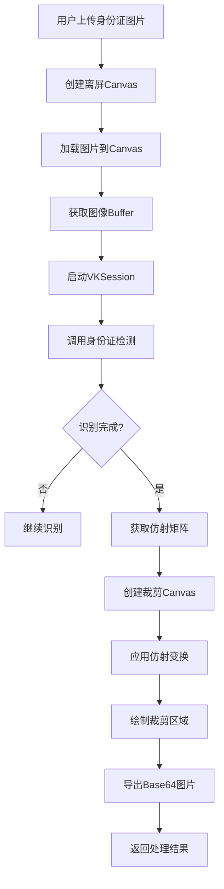

# 微信小程序 VisionKit 身份证识别与裁剪

## 简介

在小程序的实名认证场景中，我们常常需要用户上传身份证照片。但光靠上传还不够，我们希望自动检测身份证是否有效、自动识别身份证区域、自动裁剪、返回标准化图片。

过去，这类需求要么依赖服务端 OCR，要么需要接第三方识别 SDK。现在，微信官方在小程序中提供了 VisionKit (VK) 视觉能力，让我们能在前端就完成这一系列操作。

本文将带你一步步实现：📷 身份证自动识别 → 🎯 自动裁剪 → 🖼 返回标准化 Base64 图片。

## 效果特点

### 视觉特性

- **自动识别**：前端本地识别身份证区域
- **透视矫正**：自动矫正倾斜的身份证图像
- **标准化输出**：返回标准比例的身份证图片
- **高效处理**：基于 WebGL 的 GPU 加速处理

### 技术特性

- **本地处理**：无需服务端支持，前端直接完成识别
- **高精度识别**：基于微信官方 VisionKit 能力
- **仿射变换**：利用仿射矩阵实现精准裁剪
- **Base64 输出**：直接返回处理后的图片数据

## 工作原理



## 核心实现原理

### 1. 初始化 VKSession

```javascript
/**
 * 初始化 VKSession
 */
function createVKSession(gl) {
	const session = wx.createVKSession({
		track: {
			IDCard: { mode: 2 } // 照片模式
		},
		version: 'v1',
		gl
	});
	return session;
}
```

- `gl` 是 WebGL 上下文对象
- VK 会基于 WebGL 加速图像分析与识别
- 指定 `track: { IDCard: { mode: 2 } }` 表示识别模式为「身份证照片识别」

### 2. 注册识别事件

VK 的识别结果以"锚点（Anchor）"形式返回：

```javascript
session.on("updateAnchors", async (anchors) => { ... })
```

每个 anchor 就是识别到的一个身份证对象。重点关注 `isComplete` 字段：

```javascript
const anchor = anchors[0];
const isComplete = anchor.isComplete;
if (!isComplete) return resolve(false);
```

只有 `isComplete` 为 true 时，身份证识别才算完成。

### 3. 获取仿射矩阵并裁剪图像

识别完成后，会得到以下关键信息：

```javascript
const { affineImgWidth, affineImgHeight, affineMat, box } = anchor;
```

字段含义：

| 字段                             | 含义                     |
| -------------------------------- | ------------------------ |
| affineMat                        | 身份证的透视变换矩阵     |
| affineImgWidth / affineImgHeight | 透视矫正后的图像尺寸     |
| box                              | 身份证在原图中的矩形边界 |

利用这些信息，通过 `cropIDCard()` 对图像进行仿射变换和裁剪：

```javascript
/**
 * 根据仿射矩阵裁剪身份证区域
 * @param {Image} img 原始图片对象
 * @param {number} width 原图宽度
 * @param {number} height 原图高度
 * @param {Array<number>} affineMat 仿射矩阵（6个数值）
 * @param {number} affineImgWidth 目标图宽
 * @param {number} affineImgHeight 目标图高
 * @returns {string} 裁剪后的 base64 图片
 */
function cropIDCard(img, width, height, affineMat, affineImgWidth, affineImgHeight) {
	// 创建离屏 canvas
	const canvas = wx.createOffscreenCanvas({
		type: '2d',
		width: affineImgWidth,
		height: affineImgHeight
	});
	const ctx = canvas.getContext('2d');

	// 清空画布
	ctx.clearRect(0, 0, affineImgWidth, affineImgHeight);

	/**
	 * setTransform(a, b, c, d, e, f)
	 * 对绘制内容应用仿射矩阵：
	 * [ a  c  e ]
	 * [ b  d  f ]
	 * [ 0  0  1 ]
	 *
	 * affineMat 数组中存的就是这个 3x3 矩阵的前 6 个元素：
	 * [a, c, e, b, d, f]
	 */
	ctx.setTransform(
		Number(affineMat[0]), // a：水平缩放
		Number(affineMat[3]), // b：垂直倾斜
		Number(affineMat[1]), // c：水平倾斜
		Number(affineMat[4]), // d：垂直缩放
		Number(affineMat[2]), // e：水平位移
		Number(affineMat[5]) // f：垂直位移
	);

	// 绘制原图 —— 经过矩阵变换后会只显示身份证区域
	ctx.drawImage(img, 0, 0, width, height);

	// 将裁剪后的区域导出为 base64
	return canvas.toDataURL();
}
```

#### 透视矫正的原理

假设用户拍照时身份证倾斜了，那么原图中的身份证矩形其实是一个"四边形"。VK 通过图像检测算法，推算出该四边形与标准矩形之间的映射关系（仿射矩阵）。你可以把 `affineMat` 理解为一个"变换模板"：

- 它能让一个倾斜的矩形被"拉平"
- 同时保持宽高比
- 输出为标准身份证比例的图像

矫正过程示意：

```
原图（倾斜）           →      矫正后（拉平）
┌────────┐               ┌────────┐
│ \      │               │        │
│  \     │   变换矩阵     │  身份证 │
│   \    │  ─────────▶   │        │
└────\───┘               └────────┘
```

#### 为什么用 setTransform() 而不是手动计算？

因为 `CanvasRenderingContext2D.setTransform()` 本身就能直接接收一个仿射矩阵并自动完成坐标变换。这意味着我们不需要自己计算透视点映射或三角形插值，微信的底层 Canvas 渲染器会直接完成 GPU 加速的几何变换。

换句话说：`affineMat` 就像一把钥匙，告诉 Canvas："把身份证这块区域拉平、居中、输出。"最终生成的 Base64 图片就是裁剪+透视矫正后的身份证标准图。

### 4. 构建原始图像 buffer

在调用识别前，需先将原图加载进离屏 canvas：

```javascript
const canvas = wx.createOffscreenCanvas({ type: '2d', width, height });
const ctx = canvas.getContext('2d');
const img = canvas.createImage();
await new Promise(r => {
	img.onload = r;
	img.src = imgUrl;
});
ctx.drawImage(img, 0, 0, width, height);
const imgData = ctx.getImageData(0, 0, width, height);
```

这样就能得到识别所需的 `frameBuffer`。

### 5. 启动身份证检测

最后，通过 `session.start()` 启动识别：

```javascript
session.start(() => {
	session.detectIDCard({
		frameBuffer: imgData.data.buffer,
		width,
		height,
		getAffineImg: true
	});
});
```

VK 会在后台自动分析图像，当识别到身份证后触发 `updateAnchors` 回调。

## 完整代码实现

```javascript
/**
 * 初始化 VKSession
 */
function createVKSession(gl) {
  const session = wx.createVKSession({
    track: {
      IDCard: { mode: 2 }, // 照片模式
    },
    version: "v1",
    gl,
  })
  return session
}

/**
 * 根据仿射矩阵裁剪身份证区域
 * @param {Image} img 原始图片对象
 * @param {number} width 原图宽度
 * @param {number} height 原图高度
 * @param {Array<number>} affineMat 仿射矩阵（6个数值）
 * @param {number} affineImgWidth 目标图宽
 * @param {number} affineImgHeight 目标图高
 * @returns {string} 裁剪后的 base64 图片
 */
function cropIDCard(img, width, height, affineMat, affineImgWidth, affineImgHeight) {
  // 创建离屏 canvas
  const canvas = wx.createOffscreenCanvas({
    type: "2d",
    width: affineImgWidth,
    height: affineImgHeight,
  })
  const ctx = canvas.getContext("2d")

  // 清空画布
  ctx.clearRect(0, 0, affineImgWidth, affineImgHeight)

  /**
   * setTransform(a, b, c, d, e, f)
   * 对绘制内容应用仿射矩阵：
   * [ a  c  e ]
   * [ b  d  f ]
   * [ 0  0  1 ]
   *
   * affineMat 数组中存的就是这个 3x3 矩阵的前 6 个元素：
   * [a, c, e, b, d, f]
   */
  ctx.setTransform(
    Number(affineMat[0]), // a：水平缩放
    Number(affineMat[3]), // b：垂直倾斜
    Number(affineMat[1]), // c：水平倾斜
    Number(affineMat[4]), // d：垂直缩放
    Number(affineMat[2]), // e：水平位移
    Number(affineMat[5])  // f：垂直位移
  )

  // 绘制原图 —— 经过矩阵变换后会只显示身份证区域
  ctx.drawImage(img, 0, 0, width, height)

  // 将裁剪后的区域导出为 base64
  return canvas.toDataURL()
}

/**
 * 将 base64 转为小程序临时文件路径
 */
function base64ToTempFilePath(base64Data) {
  const base64 = base64Data
  const time = new Date().getTime()
  const imgPath = wx.env.USER_DATA_PATH + "/poster" + time + "share" + ".png"
  const imageData = base64.replace(/^data:image/\w+;base64,/, "")
  const file = wx.getFileSystemManager()
  file.writeFileSync(imgPath, imageData, "base64")
  return imgPath
}

/**
 * 识别身份证并返回裁剪后的 base64
 * @param {Object} options
 * @param {string} options.imgUrl 图片路径
 * @param {number} options.width 原图宽
 * @param {number} options.height 原图高
 * @param {*} options.gl 小程序 gl 对象
 * @returns {Promise<string>} base64
 */
function detectIDCard({ imgUrl, width, height, gl }) {
  return new Promise(async (resolve, reject) => {
    try {
      const session = createVKSession(gl)

      // 监听识别结果
      session.on("updateAnchors", async (anchors) => {
        if (anchors && anchors[0]) {
          const anchor = anchors[0]
          const isComplete = anchor.isComplete
          if (!isComplete) return resolve(false)
          const { affineImgWidth, affineImgHeight, affineMat, box } = anchor
          if (affineImgWidth && affineImgHeight && affineMat) {
            const cropImg = cropIDCard(
              img,
              width,
              height,
              affineMat,
              affineImgWidth,
              affineImgHeight
            )
            resolve({
              cropImg: base64ToTempFilePath(cropImg),
              affineImgWidth,
              affineImgHeight,
              box,
            })
          } else {
            resolve(false)
          }
        } else {
          resolve(false)
        }
      })

      // 未识别到身份证
      session.on("removeAnchors", () => {
        resolve(false)
      })

      // 准备图片 buffer
      const canvas = wx.createOffscreenCanvas({
        type: "2d",
        width,
        height,
      })
      const ctx = canvas.getContext("2d")
      const img = canvas.createImage()
      await new Promise((r) => {
        img.onload = r
        img.src = imgUrl
      })
      ctx.drawImage(img, 0, 0, width, height)
      const imgData = ctx.getImageData(0, 0, width, height)

      // 启动识别
      session.start(() => {
        session.detectIDCard({
          frameBuffer: imgData.data.buffer,
          width,
          height,
          getAffineImg: true,
        })
      })
    } catch (err) {
      reject(err)
    }
  })
}

module.exports = {
  detectIDCard,
}
```

## VisionKit 原理概述

`createVKSession(gl)` 是微信小程序内置的 AR/视觉识别接口。它的核心能力包括：

- 📷 图像对象检测（如身份证、人脸、名片）
- 🧠 GPU 加速的矩阵计算与透视变换
- 🧩 返回锚点对象（Anchor），包含识别区域、矩阵、完整度状态等

常用事件如下：

| 事件名        | 含义                             |
| ------------- | -------------------------------- |
| updateAnchors | 检测到新身份证或识别进度更新     |
| removeAnchors | 识别结果被移除（未检测到身份证） |

## 自定义参数说明

在实际使用中，可以根据需求调整以下参数：

### 1. 识别模式配置

```javascript
const session = wx.createVKSession({
	track: {
		IDCard: { mode: 2 } // 照片模式
	},
	version: 'v1',
	gl
});
```

- `mode: 2` 表示照片模式，适用于静态图片识别
- `mode: 1` 表示视频流模式，适用于实时摄像头识别

### 2. 图像质量参数

```javascript
session.detectIDCard({
	frameBuffer: imgData.data.buffer,
	width,
	height,
	getAffineImg: true
});
```

- `getAffineImg: true` 表示需要获取仿射变换矩阵，用于图像裁剪
- 可以根据需要调整图像尺寸以平衡识别精度和性能

## 应用场景

### 1. 实名认证流程

```javascript
// 用户上传身份证后自动处理
wx.chooseImage({
	count: 1,
	success: async res => {
		const imgUrl = res.tempFilePaths[0];
		// 获取图片信息
		const { width, height } = await getImageInfo(imgUrl);
		// 初始化 WebGL 上下文
		const gl = createWebGLContext();
		// 识别并裁剪身份证
		const result = await detectIDCard({ imgUrl, width, height, gl });
		if (result) {
			// 上传处理后的身份证图片
			uploadIDCardImage(result.cropImg);
		}
	}
});
```

### 2. 身份证信息提取

结合 OCR 技术，可以进一步提取身份证上的文字信息：

```javascript
// 在裁剪后的身份证图片上进行 OCR 识别
const idCardInfo = await ocrIDCard(result.cropImg);
console.log('姓名:', idCardInfo.name);
console.log('身份证号:', idCardInfo.idNumber);
console.log('出生日期:', idCardInfo.birthDate);
```

## 性能优化建议

### 1. 图像尺寸优化

```javascript
// 限制图像尺寸以提高处理速度
const MAX_WIDTH = 1000;
const scale = Math.min(1, MAX_WIDTH / originalWidth);
const width = Math.floor(originalWidth * scale);
const height = Math.floor(originalHeight * scale);
```

### 2. 异常处理

```javascript
try {
	const result = await detectIDCard({ imgUrl, width, height, gl });
	if (!result) {
		wx.showToast({ title: '未识别到身份证', icon: 'none' });
	}
} catch (error) {
	wx.showToast({ title: '识别失败，请重试', icon: 'none' });
}
```

## 安全考虑

### 1. 用户隐私保护

- 身份证识别在本地完成，不上传用户图片到服务器
- 处理后的图片数据也应妥善保管，避免泄露

### 2. 数据验证

```javascript
// 验证识别结果的完整性
if (result && result.box && result.affineMat) {
	// 进一步验证身份证信息
	validateIDCardInfo(result);
}
```

## 故障排除

### 1. 识别失败

**问题**: 无法识别身份证或识别结果不准确
**解决方案**:

- 检查图片质量，确保清晰度足够
- 确认身份证完整显示在图片中
- 验证 WebGL 环境是否正常初始化

### 2. 裁剪异常

**问题**: 裁剪后的图片变形或不完整
**解决方案**:

- 检查仿射矩阵参数是否正确传递
- 验证 Canvas 尺寸设置是否正确
- 确认图片加载是否完成

## 总结

通过微信小程序的 VisionKit，我们可以在前端本地完成身份证识别与裁剪的完整流程：

1. **图像加载**：将用户上传的身份证图片加载到离屏 Canvas
2. **特征识别**：利用 VK 的身份证检测能力识别身份证区域
3. **透视矫正**：通过仿射变换矩阵矫正倾斜的身份证图像
4. **图像裁剪**：提取标准化的身份证图片
5. **结果输出**：返回处理后的 Base64 图片数据

这一方案相比传统的服务端 OCR 方案有以下优势：

- **响应速度快**：本地处理，无需网络传输
- **成本低**：无需额外的服务端资源
- **隐私保护**：用户图片不离开设备
- **用户体验好**：实时反馈识别结果

随着微信小程序能力的不断完善，基于 VisionKit 的图像识别方案将在更多场景中发挥重要作用。
