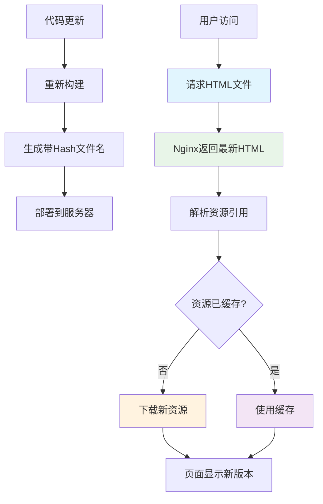
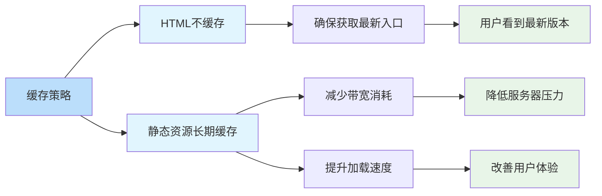

# 前端项目生产环境缓存更新终极方案

## 简介

在前端项目部署到生产环境后，经常会遇到浏览器缓存导致用户看不到最新版本的问题。本文介绍了一种基于"Hash + 差异化缓存"策略的终极解决方案，通过文件名 Hash 实现精准更新，确保用户刷新页面即可看到最新版本，无需强制刷新（Ctrl+F5）。

## 效果特点

### 视觉特性

- **自动更新**：用户刷新页面即可看到最新版本
- **无感知体验**：后台静默更新，用户无感知
- **精准控制**：只更新变更的文件，未变更文件继续使用缓存

### 技术特性

- **Hash 策略**：通过文件名 Hash 实现精准更新
- **差异化缓存**：HTML 文件禁用缓存，静态资源长期缓存
- **自动化管理**：无需手动维护版本号
- **兼容性强**：支持现代浏览器和 CDN 部署

## 工作原理



## 核心实现原理

### 1. Hash + 差异化缓存策略

本方案采用业界经典的"Hash + 差异化缓存"策略：

- **核心思路**：通过文件名 Hash 实现精准更新，而非依赖 HTTP 缓存头
- **实施方法**：
  - 构建时给每个文件添加 Hash 值
  - HTML 文件禁用缓存（确保用户总是获取最新的入口文件）
  - 静态资源长期缓存（因为文件名包含 Hash，内容变化文件名就变化）

### 2. 构建工具配置

不同的构建工具都有相应的 Hash 配置方式：

#### Vite 配置

```typescript
// vite.config.ts
export default defineConfig({
	build: {
		// 启用文件hash，确保每次构建生成不同的文件名
		rollupOptions: {
			output: {
				// 为chunk文件添加hash
				chunkFileNames: 'assets/js/[name]-[hash].js',
				entryFileNames: 'assets/js/[name]-[hash].js',
				assetFileNames: 'assets/[ext]/[name]-[hash].[ext]'
			}
		},
		// 生成manifest文件，用于版本控制
		manifest: true
	}
});
```

#### Webpack 配置

```javascript
// webpack.config.js
module.exports = {
	output: {
		filename: 'js/[name].[contenthash:8].js',
		chunkFilename: 'js/[name].[contenthash:8].chunk.js',
		assetModuleFilename: 'assets/[hash][ext][query]'
	}
};
```

#### Rollup 配置

```javascript
// rollup.config.js
export default {
	output: {
		file: 'dist/bundle-[hash].js',
		format: 'iife'
	}
};
```

配置说明：

- `contenthash`: 基于文件内容生成的 hash，内容变化时 hash 才会变化
- `chunkFileNames`: 为代码分割产生的 chunk 文件添加 hash
- `entryFileNames`: 为入口文件添加 hash
- `assetFileNames`: 为静态资源（CSS、图片等）添加 hash
- `manifest: true`: 生成 manifest.json 文件，记录文件名映射关系

### 3. Hash 策略的工作原理

假设项目初始构建：

```
assets/js/main-a1b2c3d4.js  (main.ts打包后的文件)
assets/css/index-5e6f7g8h.css
assets/png/logo-9i0j1k2l.png
```

当修改了 main.ts 文件后重新构建：

```
assets/js/main-x9y8z7w6.js  (hash变化了)
assets/css/index-5e6f7g8h.css  (hash不变，因为内容没变)
assets/png/logo-9i0j1k2l.png  (hash不变，因为内容没变)
```

这样，只有变更的文件会生成新的文件名，浏览器会自动下载新文件，未变更的文件继续使用缓存。

### 4. Manifest 文件的作用

`manifest.json` 记录了源文件到构建后文件的映射关系：

```json
{
	"src/main.ts": {
		"file": "assets/js/main-a1b2c3d4.js",
		"imports": ["index.html"]
	},
	"src/style.css": {
		"file": "assets/css/style-5e6f7g8h.css"
	}
}
```

这个文件可以用于：

- 精确的版本控制
- 实现增量更新
- 统计分析文件变化

## Nginx 缓存配置

### 1. HTML 文件不缓存

```nginx
# HTML文件不缓存
location ~* \.html$ {
    root   /usr/share/nginx/html;
    add_header Cache-Control "no-cache, no-store, must-revalidate";
    add_header Pragma "no-cache";
    add_header Expires "0";
}
```

配置说明：

- `Cache-Control: no-cache`: 浏览器必须先向服务器验证缓存的有效性
- `Cache-Control: no-store`: 禁止缓存
- `Cache-Control: must-revalidate`: 缓存过期后必须重新验证
- `Pragma: no-cache`: HTTP/1.0 兼容的头，用于向后兼容
- `Expires: 0`: 立即过期

为什么 HTML 文件不缓存？

因为 HTML 文件引用了所有资源（通过 `<script>` 和 `<link>` 标签）。如果 HTML 被缓存了，即使后端部署了新版本，浏览器仍然会加载旧的 HTML，HTML 中引用的资源文件名还是旧的，导致用户看不到更新。

具体流程：

1. 用户访问页面 → 服务器返回最新的 HTML（包含新的资源文件名）
2. HTML 加载 → 解析到 `<script src="assets/js/main-x9y8z7w6.js">`
3. 浏览器检查缓存 → 发现没有 `main-x9y8z7w6.js` 的缓存
4. 请求新文件 → 下载新的 JS 文件
5. 之前缓存的文件（如 `main-a1b2c3d4.js`）不再被引用，自动废弃

### 2. 静态资源长期缓存

```nginx
# 静态资源缓存（JS、CSS、图片等）
location ~* \.(js|css|png|jpg|jpeg|gif|ico|svg|woff|woff2|ttf|eot)$ {
    root   /usr/share/nginx/html;
    expires 1y;
    add_header Cache-Control "public";
}
```

配置说明：

- `expires 1y`: 设置缓存过期时间为 1 年
- `Cache-Control: public`: 允许 CDN 等中间代理缓存

为什么静态资源可以长期缓存？

因为文件名包含了 Hash 值。内容一旦变化，Hash 就会变化，文件名也随之变化。浏览器将新文件名视为一个全新的资源，不会受到旧缓存的影响。

示例：

- 用户 A 访问：HTML 引用 `main-a1b2c3d4.js` → 浏览器缓存该文件
- 部署新版本：HTML 引用 `main-x9y8z7w6.js`
- 用户 A 刷新页面：
  - HTML 不缓存，重新获取 → 发现引用变成了 `main-x9y8z7w6.js`
  - JS 文件不缓存 → 下载新的 `main-x9y8z7w6.js`
  - 旧的 `main-a1b2c3d4.js` 不再被使用，保持在缓存中（占用空间很小）

## 完整工作流程

### 1. 首次部署

```
构建产物：
├── index.html
├── assets/js/main-a1b2c3d4.js
├── assets/css/index-5e6f7g8h.css
└── manifest.json

用户访问：
1. 请求 index.html → Nginx返回，不缓存
2. 请求 main-a1b2c3d4.js → Nginx返回，缓存1年
3. 请求 index-5e6f7g8h.css → Nginx返回，缓存1年
```

### 2. 更新代码后重新部署

```
修改了 main.ts，重新构建：
├── index.html (更新引用)
├── assets/js/main-x9y8z7w6.js (新hash)
├── assets/css/index-5e6f7g8h.css (hash不变)
└── manifest.json (更新映射)

index.html 内容变化：
<script src="/assets/js/main-x9y8z7w6.js"></script>

用户刷新页面：
1. 请求 index.html → 获取最新版本，引用变成 main-x9y8z7w6.js
2. 请求 main-x9y8z7w6.js → 浏览器无缓存，下载新文件
3. 旧的 main-a1b2c3d4.js 不再被引用，自然淘汰
```

### 3. 只更新样式

```
修改了 style.css，重新构建：
├── index.html (引用不变)
├── assets/js/main-a1b2c3d4.js (hash不变)
├── assets/css/index-new123456.css (新hash)
└── manifest.json

用户刷新页面：
1. 请求 index.html → 发现CSS引用变成了 index-new123456.css
2. 请求 index-new123456.css → 下载新CSS
3. 旧的 index-5e6f7g8h.css 不再被使用
4. main-a1b2c3d4.js 继续使用缓存（性能最优）
```

## 自定义参数说明

在实际使用中，可以根据需求调整以下参数：

### 1. Hash 长度配置

```typescript
// vite.config.ts
export default defineConfig({
	build: {
		rollupOptions: {
			output: {
				// 可以调整hash长度
				chunkFileNames: 'assets/js/[name]-[hash:8].js',
				entryFileNames: 'assets/js/[name]-[hash:8].js',
				assetFileNames: 'assets/[ext]/[name]-[hash:8].[ext]'
			}
		}
	}
});
```

```javascript
// webpack.config.js
module.exports = {
	output: {
		filename: 'js/[name].[contenthash:8].js',
		chunkFilename: 'js/[name].[contenthash:8].chunk.js'
	}
};
```

### 2. 缓存时间配置

```nginx
# 可以根据需要调整缓存时间
location ~* \.(js|css)$ {
    expires 1y;  # JS/CSS缓存1年
}

location ~* \.(png|jpg|jpeg|gif)$ {
    expires 30d;  # 图片缓存30天
}

location ~* \.(woff|woff2|ttf|eot)$ {
    expires 1y;  # 字体文件缓存1年
}
```

### 3. CDN 配置

```nginx
# CDN节点配置
location ~* \.(js|css|png|jpg|jpeg|gif|ico|svg)$ {
    proxy_pass http://cdn.example.com;
    expires 1y;
    add_header Cache-Control "public";
}
```

## 方案优势

### 1. 用户体验优化

- ✅ 自动更新：用户刷新页面即可看到最新版本，无需强制刷新
- ✅ 加载速度快：未变更的资源继续使用缓存，提升加载速度
- ✅ 无感知更新：后台静默更新，用户无感知

### 2. 性能优化

- ✅ 减少带宽消耗：只下载变更的文件
- ✅ 降低服务器压力：通过长期缓存减少请求次数
- ✅ 充分利用 CDN：CDN 可以缓存静态资源，加速全球访问

### 3. 开发友好

- ✅ 自动版本管理：不需要手动维护版本号
- ✅ 避免缓存问题：开发时不用担心浏览器缓存
- ✅ 易于调试：文件名包含 hash，便于追踪问题

## 注意事项

### 1. HTML 必须不缓存

关键配置：HTML 文件必须设置不缓存，否则整个方案失效。

```nginx
# ✅ 正确
location ~* \.html$ {
    add_header Cache-Control "no-cache, no-store, must-revalidate";
}

# ❌ 错误 - 会导致用户看不到更新
location ~* \.html$ {
    expires 1y;  # HTML缓存会导致问题
}
```

### 2. 确保文件 Hash 生成

检查配置：确保构建工具确实生成了 hash。

```bash
# 检查构建产物
ls dist/assets/js/
# 应该看到类似 main-a1b2c3d4.js 的带hash文件名

# 如果看到 main.js (无hash)，说明配置有问题
```

### 3. HTTPS 要求

生产环境：建议使用 HTTPS，确保 CDN 和浏览器缓存策略正常工作。

```nginx
listen 9727 ssl;
ssl_certificate /etc/nginx/ssl/server.crt;
ssl_certificate_key /etc/nginx/ssl/server.key;
```

### 4. 浏览器兼容性

✅ 支持情况：现代浏览器均支持，包括：

- Chrome/Edge (latest)
- Firefox (latest)
- Safari (latest)
- 移动端浏览器

## 验证方案

### 1. 验证 HTML 不缓存

```bash
# 查看HTTP响应头
curl -I https://your-domain.com/index.html

# 应该看到：
Cache-Control: no-cache, no-store, must-revalidate
Pragma: no-cache
Expires: 0
```

### 2. 验证静态资源缓存

```bash
# 查看JS文件响应头
curl -I https://your-domain.com/assets/js/main-a1b2c3d4.js

# 应该看到：
Cache-Control: public
Expires: Wed, 26 Jan 2025 10:00:00 GMT
```

### 3. 测试更新流程

1. 部署旧版本 → 访问页面，记录文件名
2. 修改代码 → 重新构建部署
3. 刷新页面 → 检查文件名是否变化
4. 对比缓存 → 新文件下载，旧文件不再被引用

## 扩展优化

### 1. 版本号追踪

可以结合 manifest.json 实现版本号追踪：

```typescript
// src/utils/version.ts
import manifest from '../../dist/manifest.json';

export function getCurrentVersion() {
	// 从manifest中获取版本信息
	return Object.keys(manifest).map(key => manifest[key].file);
}

export function checkResourceChanged(resourceName: string) {
	// 检查特定资源是否发生变化
	return manifest[resourceName] !== undefined;
}
```

### 2. 渐进式更新

对于大型应用，可以实现渐进式更新：

```typescript
// 检查是否有新版本
async function checkForUpdates() {
	const response = await fetch('/manifest.json');
	const newManifest = await response.json();

	// 对比当前manifest和新manifest
	const hasUpdates = compareManifests(currentManifest, newManifest);

	if (hasUpdates) {
		// 提示用户有新版本
		showUpdateNotification();
	}
}
```

## 应用场景

### 1. React 项目部署

```javascript
// webpack.config.js
module.exports = {
	mode: 'production',
	output: {
		filename: 'static/js/[name].[contenthash:8].js',
		chunkFilename: 'static/js/[name].[contenthash:8].chunk.js',
		assetModuleFilename: 'static/media/[name].[hash][ext]'
	}
};
```

### 2. Vue 项目部署

```typescript
// vite.config.ts
import { defineConfig } from 'vite';
import vue from '@vitejs/plugin-vue';

export default defineConfig({
	plugins: [vue()],
	build: {
		rollupOptions: {
			output: {
				chunkFileNames: 'assets/js/[name]-[hash].js',
				entryFileNames: 'assets/js/[name]-[hash].js',
				assetFileNames: 'assets/[ext]/[name]-[hash].[ext]'
			}
		},
		manifest: true
	}
});
```

### 3. 多页面应用

对于多页面应用，可以为不同页面设置不同的缓存策略：

```nginx
# 主页面不缓存
location = /index.html {
    add_header Cache-Control "no-cache, no-store, must-revalidate";
}

# 应用页面不缓存
location ~* ^/(app|dashboard|profile)/.*\.html$ {
    add_header Cache-Control "no-cache, no-store, must-revalidate";
}

# 静态资源长期缓存
location ~* \.(js|css|png|jpg|jpeg|gif|ico|svg)$ {
    expires 1y;
    add_header Cache-Control "public";
}
```

## 性能分析



## 故障排除

### 1. 用户仍看到旧版本

**问题**: 用户刷新页面后仍然看到旧版本
**解决方案**:

- 检查 Nginx 配置，确保 HTML 文件设置了不缓存
- 验证构建产物是否正确生成了 Hash 文件名
- 检查 CDN 缓存是否需要手动刷新

### 2. 资源 404 错误

**问题**: 页面报错找不到某些资源文件
**解决方案**:

- 检查 HTML 文件中引用的资源路径是否正确
- 验证构建产物中是否存在对应的 Hash 文件
- 确认 Nginx 配置正确指向了静态资源目录

### 3. 缓存策略未生效

**问题**: 静态资源仍然被频繁请求
**解决方案**:

- 检查 Nginx 响应头是否正确设置了缓存策略
- 使用浏览器开发者工具验证缓存是否生效
- 确认文件名确实包含了 Hash 值

## 最佳实践

### 1. 部署流程

1. 代码提交到版本控制系统
2. CI/CD 自动构建生成带 Hash 的文件
3. 部署到服务器，覆盖旧文件
4. 验证缓存策略是否正确应用

### 2. 监控与日志

```nginx
# 添加访问日志用于监控
log_format cache_status '$remote_addr - $remote_user [$time_local] '
                       '"$request" $status $body_bytes_sent '
                       '"$http_referer" "$http_user_agent" '
                       'Cache: $upstream_cache_status';

access_log /var/log/nginx/access.log cache_status;
```

### 3. 安全考虑

- 确保 manifest.json 文件不包含敏感信息
- 对静态资源设置适当的安全头
- 定期清理过期的缓存文件

## 总结

通过"Hash + 差异化缓存"策略，我们可以完美解决前端项目生产环境的缓存更新问题：

1. **构建时添加 Hash**：确保文件内容变化时文件名也变化
2. **HTML 不缓存**：确保用户总是获取最新的入口文件
3. **静态资源长期缓存**：利用文件名 Hash 实现精准缓存控制
4. **自动化管理**：无需手动维护版本号，构建工具自动处理

这一方案相比传统的版本号管理方案有以下优势：

- **自动化程度高**：构建工具自动处理文件名和引用更新
- **精准控制**：只更新变更的文件，最大化利用缓存
- **用户体验好**：用户无需强制刷新即可看到最新版本
- **性能优化**：减少带宽消耗和服务器压力

通过合理的 Nginx 配置和构建工具设置，我们可以为前端应用提供一个高效、可靠的缓存更新机制，彻底告别 Ctrl+F5 的时代。
