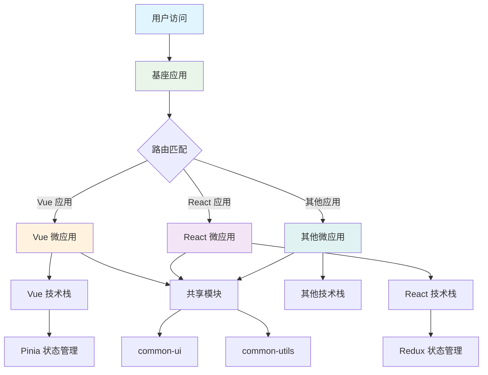
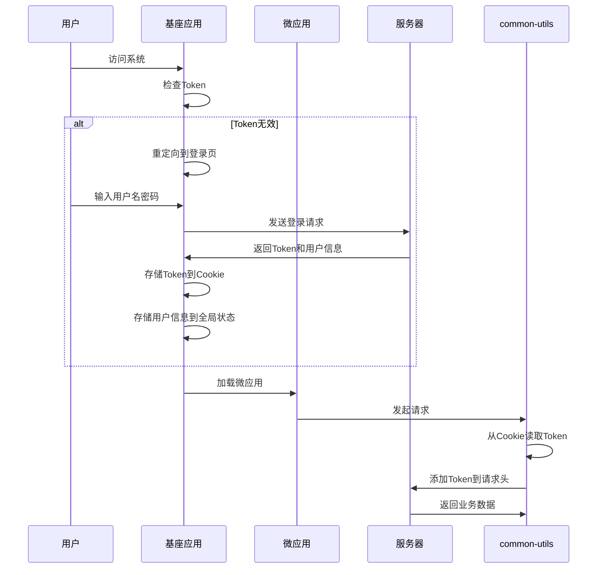
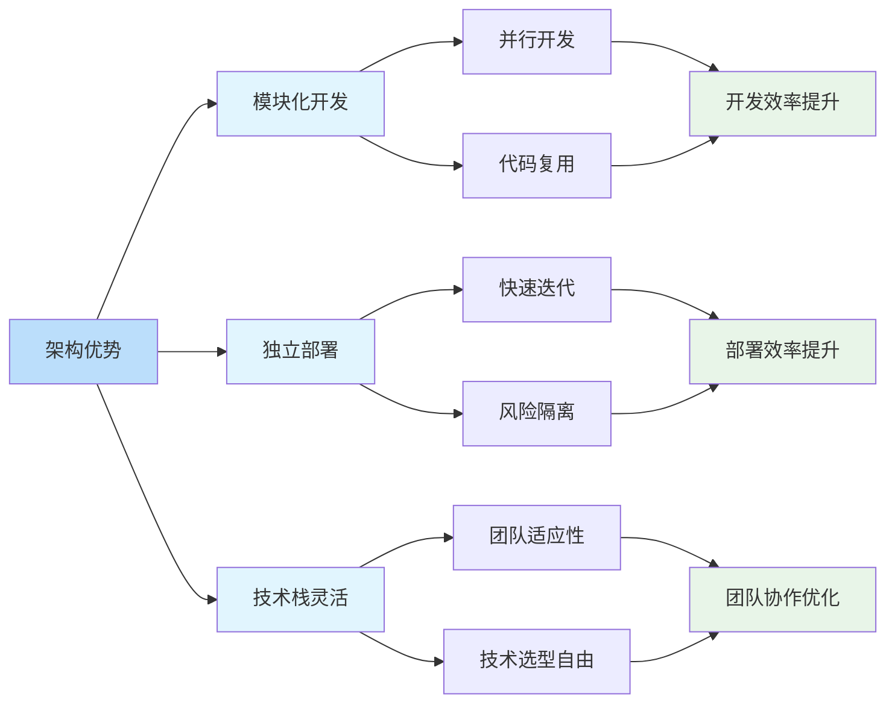

# Vue/React Monorepo 微前端架构全景解析

## 简介

本文档旨在全面、深入地剖析一个采用现代化技术栈构建的中后台前端项目。通过从宏观架构到微观代码实现，从理论分析到实践指南，完整地呈现该项目的设计思想、工程化实践与核心优势。该项目基于 Vue 3/React 生态，采用业界前沿工程化方案构建的复杂应用。

## 效果特点

### 视觉特性

- **模块化设计**：采用 Monorepo 管理多个子应用
- **架构清晰**：微前端架构实现应用解耦
- **技术先进**：集成 Vue 3 和 React 双技术栈
- **工程化完善**：完整的代码质量保障体系

### 技术特性

- **双技术栈支持**：同时支持 Vue 3 和 React 应用
- **Monorepo 架构**：基于 pnpm Workspaces 管理项目
- **微前端实现**：采用 Qiankun 实现微前端架构
- **工程化体系**：TypeScript、ESLint、Prettier 等完整工具链

## 工作原理



## 核心实现原理

### 1. 整体技术栈概览

该项目采用双技术栈支持，既支持 Vue 3 应用也支持 React 应用：

#### Vue 3 技术栈

| 分类      | 技术/库         | 版本    | 作用                       |
| --------- | --------------- | ------- | -------------------------- |
| 核心框架  | Vue.js          | ^3.5.22 | 渐进式 JavaScript 框架     |
| 路由管理  | Vue Router      | ^4.6.3  | 官方路由管理器             |
| 状态管理  | Pinia           | ^2.3.1  | Vue 官方推荐的状态管理库   |
| UI 组件库 | Arco Design Vue | ^2.57.0 | 字节跳动出品的企业级组件库 |

#### React 技术栈

| 分类      | 技术/库           | 版本    | 作用                             |
| --------- | ----------------- | ------- | -------------------------------- |
| 核心框架  | React             | ^18.3.1 | 用于构建用户界面的 JavaScript 库 |
| 路由管理  | React Router      | ^6.26.0 | React 官方路由管理器             |
| 状态管理  | Redux Toolkit     | ^2.2.7  | Redux 官方推荐的状态管理工具     |
| UI 组件库 | Arco Design React | ^2.65.0 | 字节跳动出品的企业级组件库       |

#### 通用技术栈

| 分类      | 技术/库                             | 版本             | 作用                               |
| --------- | ----------------------------------- | ---------------- | ---------------------------------- |
| 构建工具  | Vite                                | ^5.4.20          | 新一代前端构建工具                 |
| 编程语言  | TypeScript                          | ~5.4.5           | JavaScript 的超集，提供静态类型    |
| 架构模式  | Qiankun                             | ^2.10.16         | 微前端框架，用于构建大型复杂应用   |
| CSS 方案  | Tailwind CSS & Less                 | ^3.4.18 & ^4.4.2 | 原子化 CSS 框架与 CSS 预处理器结合 |
| HTTP 请求 | Axios                               | ^1.12.2          | 基于 Promise 的 HTTP 客户端        |
| 代码规范  | ESLint, Prettier, Husky, commitlint | -                | 保证代码质量、风格统一和提交规范   |

### 2. 项目架构：基于 pnpm Workspaces 的 Monorepo + Qiankun 微前端

#### Monorepo 架构

该项目采用 pnpm 的 workspaces 功能来管理多个子应用（package）。从 package.json 的 scripts 中可以看到，`pnpm -F <package-name> dev` 这样的命令用于独立启动不同的子应用。这种结构便于代码复用（如 common-ui, common-utils）、统一依赖管理和标准化工程配置。

#### 微前端架构 (Micro-Frontends)

项目引入了 qiankun 和 vite-plugin-qiankun。这表明项目采用微前端架构，其中有一个主应用（基座）负责承载和路由，而其他应用作为微应用被动态加载。qiankun 是一个基于 single-spa 的微前端实现方案，旨在轻松构建生产可用的微前端架构体系。这种架构非常适合大型、由不同团队维护的复杂系统，可以实现独立开发、独立部署，降低了应用间的耦合度。

### 3. 系统关系图谱：基座、微应用与共享模块

为了更形象地理解各模块间的关系，我们可以将其想象成一个"太阳系"：

- 🪐 太阳 (基座应用): dvp-portal
- orbiting_planet 行星 (微应用):
  - dvp-backstage (Vue 应用)
  - dvp-blue-shield (React 应用)
  - dvp-business-hub (Vue 应用)
  - dvp-ar-benefit (React 应用)
  - dvp-procure-guard (Vue 应用)
  - dvp-legal-monitor (React 应用)
- 🌌 宇宙法则 (共享模块):
  - common-ui
  - common-utils

#### 详细关系解读

1. **dvp-portal (基座应用 - The Main App/Portal)**
   dvp-portal 是整个系统的核心入口和容器。

   **角色**: 它是 Qiankun 架构中的 主应用（基座）。

   **职责**:

   - 应用框架提供者: 提供整个应用的"外壳"，包括顶部导航栏、侧边菜单栏、用户状态管理等全局 UI 元素。
   - 路由中心: 负责监听浏览器 URL 变化，动态加载并渲染对应的微应用。
   - 全局状态与通信: 管理全局共享的状态（如用户信息），并提供应用间的通信机制。
   - 用户认证: 统一处理登录逻辑，并将认证信息传递给各个微应用。

2. **其他 dvp-\* 应用 (微应用 - The Micro Apps)**
   dvp-backstage, dvp-blue-shield 等都是独立的、功能内聚的 微应用。

   **角色**: 它们是 Qiankun 架构中的 子应用。

   **职责**:

   - 业务功能实现: 专注于实现特定的业务功能。
   - 独立开发与部署: 可由不同团队独立开发、测试和部署，不影响其他应用。
   - 与基座的关系: 遵循 Qiankun 协议，导出生命周期钩子，由基座进行加载和卸载。

3. **common-ui & common-utils (共享模块 - The Shared Libraries)**
   这两个包是整个 Monorepo 的基石，体现了代码复用的最佳实践。

   **角色**: 被所有应用共享的本地依赖包。

   **职责**:

   - common-ui 的职责: 封装通用业务组件，确保所有系统 UI 一致性。
   - common-utils 的职责: 提供跨应用的通用工具函数，如封装的 axios 实例、日期格式化、权限验证等。

### 4. 构建与开发环境：Vite 生态系统

项目全面拥抱 Vite 生态，以提升开发体验和构建效率。

- **Vite 作为构建核心**: 利用其基于原生 ES Module 的开发服务器，提供了极快的冷启动和热更新（HMR）速度。
- **基础配置 (vite.base.config.ts)**: 抽象通用 Vite 配置，包括路径别名、构建产物分类、生产环境移除 console.log 等优化。
- **子应用配置**: 通过 unplugin-auto-import 和 unplugin-vue-components/unplugin-react-components 实现组件和 API 的按需加载；通过 server.proxy 解决开发环境跨域问题；通过 base 配置项支持微前端部署。

### 5. 代码质量与工程化

项目建立了一套完整的工程化体系来保障代码质量和开发效率：

- **TypeScript**: 全面采用，提供静态类型检查，增强代码的可维护性和健壮性。
- **ESLint & Prettier**: 结合使用，统一代码风格和编码规范。
- **Husky & commitlint**: 通过 Git Hooks，在代码提交前自动运行 commitlint 检查提交信息是否符合规范，确保提交历史的清晰可读。

## 核心流程深度剖析

理解了宏观架构后，我们通过分析两个最关键的用户流程——统一登录和路由系统，来深入探究该架构在实践中是如何运作的。

### 1. 架构剖析：以"统一登录"模块为核心

统一登录是串联起所有系统的"钥匙"。其实现方式清晰地反映了整个项目的架构思想。

#### 统一登录流程分析



统一登录流程详细步骤：

1. **用户访问入口**: 任何访问都首先由 dvp-portal (基座应用) 接管。
2. **认证检查 (在基座中)**: 基座的路由守卫会检查本地 Token。若无效，则重定向到基座的登录页；若有效，则继续。
3. **用户登录**: 用户在基座登录页完成认证，基座将获取的 Token 存入 Cookie，并将用户信息存入全局状态管理（Pinia/Redux）。
4. **加载微应用**: 登录成功后，Qiankun 根据 URL 加载对应的微应用。
5. **认证信息同步**: 微应用通过 common-utils 中封装的全局 axios 实例发起请求。该实例的请求拦截器会自动从 Cookie 中读取 Token 并添加到请求头中。

**关键实践**: 所有应用都 不直接使用 axios，而是使用这个来自共享模块的预配置实例，从而实现认证能力的无感植入。

6. **登出**: 用户点击基座上的"登出"按钮，由基座负责清除 Token 和全局状态，并重定向回登录页。

#### 架构优势总结

- **职责单一**: 基座全权负责认证、路由分发和全局布局。
- **关注点分离**: 微应用无需关心登录逻辑，只需专注于自身业务。
- **高内聚、低耦合**: 认证逻辑内聚在基座中，与微应用解耦。
- **体验无缝**: 对用户而言，整个系统浑然一体，体验流畅。

### 2. 架构剖析：以"路由系统"为核心

项目的路由系统被巧妙地拆分成了两层：基座主路由 + 微应用子路由。

路由工作流程详解：

我们可以将这个关系想象成一个大型机场的运作模式：

- ✈️ 机场塔台 (基座主路由): 决定了用户请求应该飞往哪个微应用。
- 🛃 航站楼内部指引 (微应用子路由): 一旦进入微应用，其内部路由负责引导用户到具体的业务页面。

#### 路由工作流程

1. **入口与分发 (在 dvp-portal 中)**:
   当用户访问 `https://your-app.com/backstage/dashboard` 时：

   - 基座应用的 Vue Router/React Router 首先捕获 `/backstage` 路径
   - 根据配置，Qiankun 启动并加载 `dvp-backstage` 微应用
   - 浏览器 URL 保持为 `/backstage/dashboard`，但实际内容由 `dvp-backstage` 渲染

2. **微应用内部路由**:

   - `dvp-backstage` 微应用内部有自己独立的路由系统
   - 当 URL 为 `/backstage/dashboard` 时，微应用渲染仪表板页面
   - 当 URL 为 `/backstage/users` 时，微应用渲染用户管理页面

3. **路由通信机制**:
   - 基座与微应用通过 Qiankun 提供的生命周期钩子进行路由同步
   - 微应用的路由变化会通知基座更新导航状态
   - 基座的导航点击会触发微应用的路由跳转

## 自定义参数说明

在实际使用中，可以根据需求调整以下参数：

### 1. 微应用配置参数

```typescript
// Vue 微应用配置
interface VueMicroAppConfig {
	name: string; // 微应用名称
	entry: string; // 微应用入口地址
	container: string; // 微应用容器ID
	activeRule: string; // 激活规则
	props?: Record<string, any>; // 传递给微应用的属性
}

// React 微应用配置
interface ReactMicroAppConfig {
	name: string;
	entry: string;
	container: string;
	activeRule: string;
	props?: Record<string, any>;
}
```

### 2. 共享模块配置

```typescript
// common-utils 配置
interface CommonUtilsConfig {
	apiBaseURL: string; // API 基础地址
	timeout: number; // 请求超时时间
	withCredentials: boolean; // 是否携带凭证
}

// common-ui 配置
interface CommonUIConfig {
	theme: 'light' | 'dark'; // 主题
	locale: string; // 语言
	size: 'small' | 'medium' | 'large'; // 组件尺寸
}
```

### 3. 构建配置参数

```typescript
// vite.base.config.ts
export default defineConfig({
	// 路径别名配置
	resolve: {
		alias: {
			'@': path.resolve(__dirname, './src'),
			'@common': path.resolve(__dirname, '../common')
		}
	},
	// 构建配置
	build: {
		rollupOptions: {
			output: {
				chunkFileNames: 'js/[name]-[hash].js',
				entryFileNames: 'js/[name]-[hash].js',
				assetFileNames: 'assets/[name]-[hash].[ext]'
			}
		}
	}
});
```

## 实现方案对比

| 方案                   | 优点                   | 缺点       | 适用场景       |
| ---------------------- | ---------------------- | ---------- | -------------- |
| **纯 Vue 3 架构**      | 技术栈统一，学习成本低 | 扩展性有限 | 单一技术栈团队 |
| **纯 React 架构**      | 生态丰富，组件复用性强 | 技术栈单一 | React 专精团队 |
| **Vue/React 双栈架构** | 兼容性强，灵活性高     | 维护成本高 | 多技术栈团队   |
| **Monorepo + 微前端**  | 模块化清晰，独立部署   | 架构复杂   | 大型复杂项目   |

## 高级功能

### 1. 跨应用通信机制

```typescript
// 基座应用通信管理
class CommunicationManager {
	// 发送全局事件
	static dispatchGlobalEvent(eventName: string, data?: any) {
		window.dispatchEvent(new CustomEvent(eventName, { detail: data }));
	}

	// 监听全局事件
	static listenGlobalEvent(eventName: string, callback: (data: any) => void) {
		window.addEventListener(eventName, (event: CustomEvent) => {
			callback(event.detail);
		});
	}

	// 微应用间通信
	static microAppCommunication(source: string, target: string, message: any) {
		// 通过基座中转消息
		CommunicationManager.dispatchGlobalEvent(`microapp:${target}`, {
			from: source,
			data: message
		});
	}
}
```

### 2. 动态微应用加载

```typescript
// 动态注册微应用
class MicroAppRegistry {
	private static apps: MicroAppConfig[] = [];

	// 注册微应用
	static registerApp(config: MicroAppConfig) {
		this.apps.push(config);
		// 动态注册到 Qiankun
		registerMicroApps([config]);
	}

	// 获取所有注册的应用
	static getRegisteredApps() {
		return this.apps;
	}

	// 根据条件动态加载应用
	static async loadAppIf(condition: () => boolean, config: MicroAppConfig) {
		if (condition()) {
			this.registerApp(config);
			// 启动 Qiankun
			start();
		}
	}
}
```

### 3. 共享状态管理

```typescript
// 全局状态管理 (Vue + Pinia)
import { defineStore } from 'pinia';

export const useGlobalStore = defineStore('global', {
	state: () => ({
		userInfo: null,
		theme: 'light',
		locale: 'zh-CN'
	}),

	actions: {
		setUserInfo(info: any) {
			this.userInfo = info;
		},

		setTheme(theme: string) {
			this.theme = theme;
			// 通知所有微应用主题变化
			window.dispatchEvent(new CustomEvent('theme-change', { detail: theme }));
		}
	}
});

// 全局状态管理 (React + Redux)
import { createSlice, configureStore } from '@reduxjs/toolkit';

const globalSlice = createSlice({
	name: 'global',
	initialState: {
		userInfo: null,
		theme: 'light',
		locale: 'zh-CN'
	},
	reducers: {
		setUserInfo: (state, action) => {
			state.userInfo = action.payload;
		},
		setTheme: (state, action) => {
			state.theme = action.payload;
			// 通知所有微应用主题变化
			window.dispatchEvent(new CustomEvent('theme-change', { detail: action.payload }));
		}
	}
});

export const { setUserInfo, setTheme } = globalSlice.actions;
export const store = configureStore({
	reducer: {
		global: globalSlice.reducer
	}
});
```

## 性能分析



## 故障排除

### 1. 微应用加载失败

**问题**: 微应用无法正常加载或显示空白页面
**解决方案**:

- 检查微应用的 entry 配置是否正确
- 验证微应用是否正确导出了 Qiankun 生命周期钩子
- 确认基座应用的 activeRule 配置是否匹配

### 2. 样式冲突问题

**问题**: 不同微应用之间出现样式冲突
**解决方案**:

- 使用 CSS Modules 或 CSS-in-JS 隔离样式
- 为每个微应用设置独立的 CSS 命名空间
- 在构建时添加样式前缀

### 3. 状态同步异常

**问题**: 基座与微应用之间状态不同步
**解决方案**:

- 检查全局状态管理配置是否正确
- 验证事件监听和派发机制是否正常工作
- 确认共享模块的版本是否一致

## 最佳实践

### 1. 项目结构规范

```
monorepo-project/
├── packages/
│   ├── portal/              # 基座应用
│   ├── backstage/           # Vue 微应用
│   ├── blue-shield/         # React 微应用
│   ├── common-ui/           # 共享UI组件
│   └── common-utils/        # 共享工具函数
├── package.json             # 根目录 package.json
└── pnpm-workspace.yaml      # pnpm workspace 配置
```

### 2. 开发环境配置

```bash
# 启动基座应用
pnpm -F portal dev

# 启动 Vue 微应用
pnpm -F backstage dev

# 启动 React 微应用
pnpm -F blue-shield dev

# 构建所有应用
pnpm build
```

### 3. 部署策略

- 基座应用独立部署，作为主入口
- 各微应用独立构建和部署
- 通过 Nginx 或 CDN 配置实现统一访问

## 应用场景

### 1. 企业级中后台系统

```typescript
// 企业级系统架构示例
const enterpriseSystem = {
	portal: {
		name: 'enterprise-portal',
		description: '企业级系统基座',
		techStack: 'Vue 3 + Pinia + Arco Design'
	},
	microApps: [
		{
			name: 'user-management',
			description: '用户管理系统',
			techStack: 'Vue 3',
			team: 'User Team'
		},
		{
			name: 'order-management',
			description: '订单管理系统',
			techStack: 'React',
			team: 'Order Team'
		},
		{
			name: 'inventory-management',
			description: '库存管理系统',
			techStack: 'Vue 3',
			team: 'Inventory Team'
		}
	]
};
```

### 2. 多团队协作开发

```typescript
// 团队独立开发配置
const teamConfig = {
	frontendTeamA: {
		apps: ['user-management', 'profile-center'], // Vue 应用
		techLead: 'Vue Expert'
	},
	frontendTeamB: {
		apps: ['order-management', 'payment-center'], // React 应用
		techLead: 'React Expert'
	},
	sharedResources: {
		components: 'common-ui',
		utilities: 'common-utils',
		maintainer: 'Architect Team'
	}
};
```

## 总结

通过"Vue/React + Monorepo + 微前端"架构，我们可以构建一个高度模块化、可扩展且技术栈灵活的前端项目：

1. **技术栈灵活性**：同时支持 Vue 3 和 React，满足不同团队的技术偏好
2. **模块化开发**：通过 Monorepo 实现代码复用和统一管理
3. **独立部署**：微前端架构实现应用解耦和独立部署
4. **工程化完善**：完整的代码质量保障和开发工具链

这一架构方案相比传统的单体应用有以下优势：

- **扩展性强**：可以轻松添加新的微应用和技术栈
- **团队协作**：不同团队可以独立开发和部署自己的应用
- **风险隔离**：单个应用的问题不会影响整个系统
- **技术演进**：可以逐步升级技术栈而不影响其他应用

通过合理的架构设计和工程化实践，我们可以为中大型前端项目提供一个高效、可靠的解决方案，满足复杂业务场景的需求。
