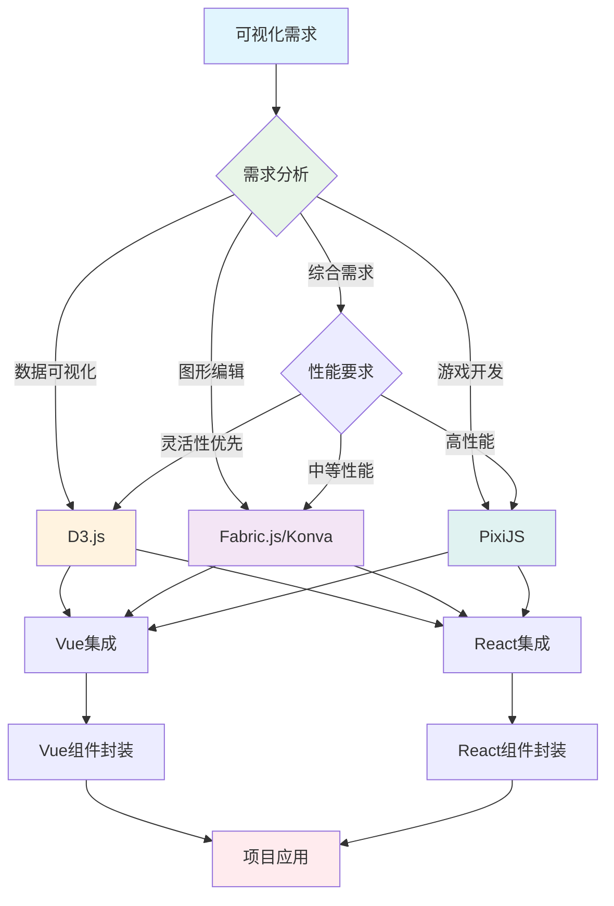
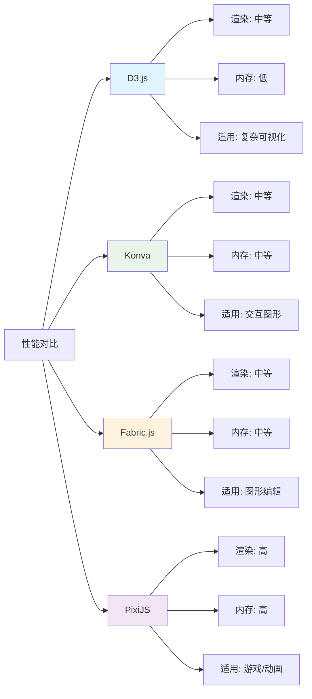

# 可视化图形库对比与选型指南

## 简介

在现代前端开发中，可视化图形库扮演着越来越重要的角色。无论是数据可视化仪表盘、交互式白板，还是 2D 游戏开发，选择合适的图形库都是项目成功的关键。本文将深入对比分析 D3.js、Konva、Fabric.js 和 PixiJS 四个主流可视化图形库，提供 Vue 和 React 集成方案，并给出选型建议。

## 效果特点

### 视觉特性

- **多样化选择**：涵盖数据可视化、图形编辑、游戏引擎等多种类型
- **跨框架支持**：提供 Vue 和 React 集成方案
- **性能对比**：详细分析各库的性能特点
- **应用场景**：针对不同场景提供选型建议

### 技术特性

- **多维度对比**：从核心原理、社区生态、应用场景等维度对比
- **代码示例**：提供原生 JavaScript、Vue 和 React 示例
- **集成方案**：详细的框架集成指南
- **最佳实践**：总结各库的最佳使用方式

## 工作原理



## 核心实现原理

### 1. 功能分类概览

按照功能分类，图形库可以概括如下：

| 功能分类        | 示例                                                                                                                                                          |
| --------------- | ------------------------------------------------------------------------------------------------------------------------------------------------------------- |
| 数据可视化库    | - D3.js：灵活的数据驱动库，适合复杂可视化<br>- ECharts：易用，支持多种图表类型<br>- Highcharts：商业图表库，擅长金融和报表图表<br>- Cesium：3D 地图可视化框架 |
| 图形编辑库      | - Konva：2D Canvas 绘图，支持交互和动画<br>- Fabric.js：强大的图形编辑功能<br>- Paper.js：专注于精确的矢量图形                                                |
| 游戏引擎/动画库 | - PixiJS：高效的 2D 渲染引擎<br>- Three.js：用于 3D 渲染的库<br>- Babylon.js：功能强大的 3D 游戏引擎<br>- PlayCanvas：功能强大的 3D 游戏引擎                  |
| 综合性图形库    | - ZRender：底层 Canvas 渲染库，也是 ECharts 的底层引擎<br>- G2：集成数据可视化和图形编辑功能                                                                  |

### 2. D3.js - 数据可视化专家

D3.js（Data-Driven Documents）是一个用于数据可视化的库，能够根据数据生成动态的 SVG、Canvas 图形。

#### 核心原理

D3.js 的核心是通过操作 DOM 元素（如 SVG 或 HTML）来实现数据驱动的可视化。它将数据与图形元素绑定，当数据发生变化时，D3.js 会自动更新对应的图形。D3.js 还支持过渡动画、事件处理和复杂的数据转换。

#### 应用场景

- 数据可视化仪表盘
- 动态交互式图表
- 地图可视化
- 数据驱动的网页内容

#### 原生 JavaScript 示例

```javascript
// 动态更新的条形图
const data = [30, 86, 168, 234, 23, 130, 145];
const svg = d3.select('svg');
const margin = { top: 20, right: 30, bottom: 40, left: 40 };
const width = +svg.attr('width') - margin.left - margin.right;
const height = +svg.attr('height') - margin.top - margin.bottom;

const x = d3
	.scaleBand()
	.domain(data.map((d, i) => i))
	.range([0, width])
	.padding(0.1);

const y = d3
	.scaleLinear()
	.domain([0, d3.max(data)])
	.nice()
	.range([height, 0]);

const g = svg.append('g').attr('transform', `translate(${margin.left},${margin.top})`);

g.append('g')
	.attr('class', 'axis axis--x')
	.attr('transform', `translate(0,${height})`)
	.call(d3.axisBottom(x).tickFormat(i => `条形 ${i + 1}`));

g.append('g').attr('class', 'axis axis--y').call(d3.axisLeft(y));

g.selectAll('.bar')
	.data(data)
	.enter()
	.append('rect')
	.attr('class', 'bar')
	.attr('x', (d, i) => x(i))
	.attr('y', d => y(d))
	.attr('width', x.bandwidth())
	.attr('height', d => height - y(d));

// 动态更新数据
setInterval(() => {
	data.forEach((d, i) => (data[i] = Math.floor(Math.random() * 250)));
	update();
}, 2000);

function update() {
	y.domain([0, d3.max(data)]).nice();

	g.selectAll('.bar')
		.data(data)
		.transition()
		.duration(500)
		.attr('y', d => y(d))
		.attr('height', d => height - y(d));

	g.select('.axis--y').transition().duration(500).call(d3.axisLeft(y));
}
```

#### Vue 集成方案

```vue
<template>
	<div ref="chartContainer" class="d3-chart"></div>
</template>

<script setup>
import * as d3 from 'd3';
import { ref, onMounted, onUnmounted } from 'vue';

const chartContainer = ref(null);
const props = defineProps({
	data: {
		type: Array,
		default: () => [30, 86, 168, 234, 23, 130, 145]
	}
});

let svg, x, y, g;

const initChart = () => {
	const margin = { top: 20, right: 30, bottom: 40, left: 40 };
	const width = 800 - margin.left - margin.right;
	const height = 400 - margin.top - margin.bottom;

	// 清空容器
	chartContainer.value.innerHTML = '';

	svg = d3.select(chartContainer.value).append('svg').attr('width', 800).attr('height', 400);

	x = d3
		.scaleBand()
		.domain(props.data.map((d, i) => i))
		.range([0, width])
		.padding(0.1);

	y = d3
		.scaleLinear()
		.domain([0, d3.max(props.data)])
		.nice()
		.range([height, 0]);

	g = svg.append('g').attr('transform', `translate(${margin.left},${margin.top})`);

	// 绘制坐标轴
	g.append('g')
		.attr('class', 'axis axis--x')
		.attr('transform', `translate(0,${height})`)
		.call(d3.axisBottom(x).tickFormat(i => `条形 ${i + 1}`));

	g.append('g').attr('class', 'axis axis--y').call(d3.axisLeft(y));

	// 绘制条形
	updateChart();
};

const updateChart = () => {
	if (!g) return;

	// 更新Y轴比例尺
	y.domain([0, d3.max(props.data)]).nice();

	// 更新条形
	const bars = g.selectAll('.bar').data(props.data);

	bars
		.enter()
		.append('rect')
		.attr('class', 'bar')
		.attr('x', (d, i) => x(i))
		.attr('width', x.bandwidth())
		.attr('y', height)
		.attr('height', 0)
		.merge(bars)
		.transition()
		.duration(500)
		.attr('y', d => y(d))
		.attr('height', d => 400 - 40 - 20 - y(d));

	bars.exit().remove();

	// 更新Y轴
	g.select('.axis--y').transition().duration(500).call(d3.axisLeft(y));
};

onMounted(() => {
	initChart();
});

onUnmounted(() => {
	// 清理资源
	if (svg) {
		svg.remove();
	}
});

// 监听数据变化
watch(
	() => props.data,
	() => {
		updateChart();
	},
	{ deep: true }
);
</script>

<style scoped>
.d3-chart {
	width: 100%;
	height: 400px;
}

.bar {
	fill: steelblue;
}

.bar:hover {
	fill: orange;
}

.axis--x path {
	display: none;
}
</style>
```

#### React 集成方案

```typescript
import React, { useState, useEffect, useRef } from 'react';
import * as d3 from 'd3';

interface D3ChartProps {
	data: number[];
	width?: number;
	height?: number;
}

const D3Chart: React.FC<D3ChartProps> = ({
	data = [30, 86, 168, 234, 23, 130, 145],
	width = 800,
	height = 400
}) => {
	const chartRef = useRef<HTMLDivElement>(null);
	const svgRef = useRef<d3.Selection<SVGSVGElement, unknown, null, undefined> | null>(null);
	const gRef = useRef<d3.Selection<SVGGElement, unknown, null, undefined> | null>(null);

	const margin = { top: 20, right: 30, bottom: 40, left: 40 };
	const innerWidth = width - margin.left - margin.right;
	const innerHeight = height - margin.top - margin.bottom;

	useEffect(() => {
		if (!chartRef.current) return;

		// 初始化 SVG
		svgRef.current = d3
			.select(chartRef.current)
			.append('svg')
			.attr('width', width)
			.attr('height', height);

		gRef.current = svgRef.current
			.append('g')
			.attr('transform', `translate(${margin.left},${margin.top})`);

		// 绘制坐标轴
		gRef.current
			.append('g')
			.attr('class', 'axis axis--x')
			.attr('transform', `translate(0,${innerHeight})`);

		gRef.current.append('g').attr('class', 'axis axis--y');

		// 初始绘制
		updateChart();

		return () => {
			// 清理资源
			if (svgRef.current) {
				svgRef.current.remove();
			}
		};
	}, []);

	const updateChart = () => {
		if (!gRef.current) return;

		// 更新比例尺
		const x = d3
			.scaleBand()
			.domain(data.map((d, i) => i.toString()))
			.range([0, innerWidth])
			.padding(0.1);

		const y = d3
			.scaleLinear()
			.domain([0, d3.max(data) || 0])
			.nice()
			.range([innerHeight, 0]);

		// 更新条形
		const bars = gRef.current.selectAll('.bar').data(data);

		bars
			.enter()
			.append('rect')
			.attr('class', 'bar')
			.attr('x', (d, i) => x(i.toString()) || 0)
			.attr('width', x.bandwidth())
			.attr('y', innerHeight)
			.attr('height', 0)
			.merge(bars as any)
			.transition()
			.duration(500)
			.attr('y', d => y(d))
			.attr('height', d => innerHeight - y(d));

		bars.exit().remove();

		// 更新坐标轴
		gRef.current.select('.axis--x').call(d3.axisBottom(x).tickFormat(i => `条形 ${+i + 1}`));

		gRef.current.select('.axis--y').transition().duration(500).call(d3.axisLeft(y));
	};

	useEffect(() => {
		updateChart();
	}, [data]);

	return <div ref={chartRef} style={{ width, height }} />;
};

export default D3Chart;
```

### 3. Konva - 2D 图形库

Konva 是一个 2D 图形库，基于 HTML5 Canvas 技术，主要用于创建复杂的用户交互界面。

#### 核心原理

Konva 的核心是基于 Canvas API 进行渲染，它通过封装图形层（Layer）和舞台（Stage）的概念来管理图形的绘制与事件处理。通过构建多层次的图形对象，Konva 可以高效地控制哪些部分需要重新绘制，并通过事件监听器实现用户交互（如拖动、缩放、点击等）。

#### 应用场景

- 数据可视化
- 交互式白板
- 可拖拽的 UI 组件
- 轻量级 2D 游戏开发

#### 原生 JavaScript 示例

```javascript
// Konva 事件处理示例
const stage = new Konva.Stage({
	container: 'container',
	width: 800,
	height: 600
});

const layer = new Konva.Layer();
const rect = new Konva.Rect({
	x: 100,
	y: 100,
	width: 100,
	height: 100,
	fill: 'red',
	draggable: true
});

rect.on('click', () => {
	rect.fill(`hsl(${Math.random() * 360}, 100%, 50%)`); // 随机颜色
	layer.batchDraw(); // 更新图层
});

layer.add(rect);
stage.add(layer);
```

#### Vue 集成方案

```vue
<template>
	<div ref="container" class="konva-container"></div>
</template>

<script setup>
import { ref, onMounted, onUnmounted } from 'vue';
import Konva from 'konva';

const container = ref(null);
const stage = ref(null);
const layer = ref(null);

const props = defineProps({
	width: {
		type: Number,
		default: 800
	},
	height: {
		type: Number,
		default: 600
	}
});

const initStage = () => {
	stage.value = new Konva.Stage({
		container: container.value,
		width: props.width,
		height: props.height
	});

	layer.value = new Konva.Layer();
	stage.value.add(layer.value);

	// 添加示例图形
	addSampleShapes();
};

const addSampleShapes = () => {
	if (!layer.value) return;

	// 矩形
	const rect = new Konva.Rect({
		x: 100,
		y: 100,
		width: 100,
		height: 100,
		fill: 'red',
		draggable: true
	});

	rect.on('click', () => {
		rect.fill(`hsl(${Math.random() * 360}, 100%, 50%)`);
		layer.value.batchDraw();
	});

	// 圆形
	const circle = new Konva.Circle({
		x: 300,
		y: 150,
		radius: 50,
		fill: 'blue',
		draggable: true
	});

	circle.on('click', () => {
		circle.fill(`hsl(${Math.random() * 360}, 100%, 50%)`);
		layer.value.batchDraw();
	});

	layer.value.add(rect, circle);
	layer.value.draw();
};

onMounted(() => {
	initStage();
});

onUnmounted(() => {
	if (stage.value) {
		stage.value.destroy();
	}
});

defineExpose({
	addShape(shape) {
		if (layer.value) {
			layer.value.add(shape);
			layer.value.draw();
		}
	},
	clear() {
		if (layer.value) {
			layer.value.destroyChildren();
			layer.value.draw();
		}
	}
});
</script>

<style scoped>
.konva-container {
	width: 100%;
	height: 600px;
	border: 1px solid #ccc;
}
</style>
```

#### React 集成方案

```typescript
import React, { useState, useEffect, useRef } from 'react';
import Konva from 'konva';

interface KonvaCanvasProps {
	width?: number;
	height?: number;
}

const KonvaCanvas: React.FC<KonvaCanvasProps> = ({ width = 800, height = 600 }) => {
	const containerRef = useRef<HTMLDivElement>(null);
	const stageRef = useRef<Konva.Stage | null>(null);
	const layerRef = useRef<Konva.Layer | null>(null);

	useEffect(() => {
		if (!containerRef.current) return;

		// 初始化舞台
		stageRef.current = new Konva.Stage({
			container: containerRef.current,
			width,
			height
		});

		// 初始化图层
		layerRef.current = new Konva.Layer();
		stageRef.current.add(layerRef.current);

		// 添加示例图形
		addSampleShapes();

		return () => {
			// 清理资源
			if (stageRef.current) {
				stageRef.current.destroy();
			}
		};
	}, [width, height]);

	const addSampleShapes = () => {
		if (!layerRef.current) return;

		// 矩形
		const rect = new Konva.Rect({
			x: 100,
			y: 100,
			width: 100,
			height: 100,
			fill: 'red',
			draggable: true
		});

		rect.on('click', () => {
			rect.fill(`hsl(${Math.random() * 360}, 100%, 50%)`);
			layerRef.current?.batchDraw();
		});

		// 圆形
		const circle = new Konva.Circle({
			x: 300,
			y: 150,
			radius: 50,
			fill: 'blue',
			draggable: true
		});

		circle.on('click', () => {
			circle.fill(`hsl(${Math.random() * 360}, 100%, 50%)`);
			layerRef.current?.batchDraw();
		});

		layerRef.current.add(rect, circle);
		layerRef.current.draw();
	};

	const addShape = (shape: Konva.Shape) => {
		if (layerRef.current) {
			layerRef.current.add(shape);
			layerRef.current.draw();
		}
	};

	const clear = () => {
		if (layerRef.current) {
			layerRef.current.destroyChildren();
			layerRef.current.draw();
		}
	};

	return (
		<div>
			<div ref={containerRef} style={{ width, height, border: '1px solid #ccc' }} />
			<div style={{ marginTop: '10px' }}>
				<button onClick={addSampleShapes}>添加示例图形</button>
				<button onClick={clear} style={{ marginLeft: '10px' }}>
					清空画布
				</button>
			</div>
		</div>
	);
};

export default KonvaCanvas;
```

### 4. Fabric.js - 图形编辑专家

Fabric.js 是一个强大的基于 Canvas 的 JavaScript 图形库，专注于矢量图形和图像编辑。

#### 核心原理

Fabric.js 提供了一个完整的对象模型，允许开发者在 Canvas 上管理和操作图形对象。每个对象都是独立的，并且可以通过简单的 API 实现旋转、缩放、位移等操作。Fabric.js 支持将图形导出为 SVG 或 JSON 以便保存和重用。

#### 应用场景

- 在线图片编辑器
- 矢量图形设计工具
- 个性化定制平台
- 交互式图形应用

#### 原生 JavaScript 示例

```javascript
// Fabric.js 基础示例
const canvas = new fabric.Canvas('canvas');

// 添加矩形
const rect = new fabric.Rect({
	left: 100,
	top: 100,
	fill: 'red',
	width: 100,
	height: 100
});

canvas.add(rect);

// 添加文本
const text = new fabric.Text('Hello Fabric!', {
	left: 200,
	top: 200,
	fill: 'blue',
	fontSize: 20
});

canvas.add(text);

// 事件处理
rect.on('selected', () => {
	console.log('矩形被选中');
});

// 导出为 JSON
const json = canvas.toJSON();
console.log(json);

// 从 JSON 恢复
// canvas.loadFromJSON(json);
```

#### Vue 集成方案

```vue
<template>
	<div>
		<canvas ref="canvasElement" width="800" height="600"></canvas>
		<div class="controls">
			<button @click="addRectangle">添加矩形</button>
			<button @click="addCircle">添加圆形</button>
			<button @click="addText">添加文本</button>
			<button @click="clearCanvas">清空画布</button>
			<button @click="exportJSON">导出JSON</button>
			<button @click="saveImage">保存图片</button>
		</div>
	</div>
</template>

<script setup>
import { ref, onMounted, onUnmounted } from 'vue';
import { fabric } from 'fabric';

const canvasElement = ref(null);
const canvas = ref(null);

const initCanvas = () => {
	canvas.value = new fabric.Canvas(canvasElement.value, {
		selection: true,
		preserveObjectStacking: true
	});

	// 设置画布背景
	canvas.value.setBackgroundColor('#f0f0f0');

	// 添加事件监听
	canvas.value.on('object:selected', options => {
		console.log('对象被选中:', options.target);
	});
};

const addRectangle = () => {
	if (!canvas.value) return;

	const rect = new fabric.Rect({
		left: 100,
		top: 100,
		fill: `hsl(${Math.random() * 360}, 100%, 50%)`,
		width: 100,
		height: 100,
		rx: 10,
		ry: 10
	});

	canvas.value.add(rect);
	canvas.value.setActiveObject(rect);
};

const addCircle = () => {
	if (!canvas.value) return;

	const circle = new fabric.Circle({
		left: 200,
		top: 200,
		radius: 50,
		fill: `hsl(${Math.random() * 360}, 100%, 50%)`
	});

	canvas.value.add(circle);
	canvas.value.setActiveObject(circle);
};

const addText = () => {
	if (!canvas.value) return;

	const text = new fabric.Text('Hello Fabric!', {
		left: 300,
		top: 300,
		fill: `hsl(${Math.random() * 360}, 100%, 50%)`,
		fontSize: 20
	});

	canvas.value.add(text);
	canvas.value.setActiveObject(text);
};

const clearCanvas = () => {
	if (!canvas.value) return;
	canvas.value.clear();
	canvas.value.setBackgroundColor('#f0f0f0');
};

const exportJSON = () => {
	if (!canvas.value) return;
	const json = canvas.value.toJSON();
	console.log('Canvas JSON:', json);
	// 可以保存到本地存储或发送到服务器
	localStorage.setItem('fabricCanvas', JSON.stringify(json));
};

const saveImage = () => {
	if (!canvas.value) return;
	const dataURL = canvas.value.toDataURL({
		format: 'png',
		quality: 0.8
	});

	// 创建下载链接
	const link = document.createElement('a');
	link.download = 'fabric-canvas.png';
	link.href = dataURL;
	link.click();
};

onMounted(() => {
	initCanvas();
});

onUnmounted(() => {
	if (canvas.value) {
		canvas.value.dispose();
	}
});
</script>

<style scoped>
canvas {
	border: 1px solid #ccc;
	box-shadow: 0 2px 10px rgba(0, 0, 0, 0.1);
}

.controls {
	margin-top: 10px;
}

.controls button {
	margin-right: 10px;
	padding: 8px 16px;
	background-color: #007bff;
	color: white;
	border: none;
	border-radius: 4px;
	cursor: pointer;
}

.controls button:hover {
	background-color: #0056b3;
}
</style>
```

#### React 集成方案

```typescript
import React, { useState, useEffect, useRef } from 'react';
import { fabric } from 'fabric';

interface FabricCanvasProps {
	width?: number;
	height?: number;
}

const FabricCanvas: React.FC<FabricCanvasProps> = ({ width = 800, height = 600 }) => {
	const canvasRef = useRef<HTMLCanvasElement>(null);
	const fabricCanvasRef = useRef<fabric.Canvas | null>(null);
	const [objectCount, setObjectCount] = useState(0);

	useEffect(() => {
		if (!canvasRef.current) return;

		// 初始化画布
		fabricCanvasRef.current = new fabric.Canvas(canvasRef.current, {
			selection: true,
			preserveObjectStacking: true,
			width,
			height
		});

		// 设置画布背景
		fabricCanvasRef.current.setBackgroundColor('#f0f0f0');

		// 添加事件监听
		fabricCanvasRef.current.on('object:added', () => {
			setObjectCount(fabricCanvasRef.current?.getObjects().length || 0);
		});

		fabricCanvasRef.current.on('object:removed', () => {
			setObjectCount(fabricCanvasRef.current?.getObjects().length || 0);
		});

		return () => {
			// 清理资源
			if (fabricCanvasRef.current) {
				fabricCanvasRef.current.dispose();
			}
		};
	}, [width, height]);

	const addRectangle = () => {
		if (!fabricCanvasRef.current) return;

		const rect = new fabric.Rect({
			left: 100,
			top: 100,
			fill: `hsl(${Math.random() * 360}, 100%, 50%)`,
			width: 100,
			height: 100,
			rx: 10,
			ry: 10
		});

		fabricCanvasRef.current.add(rect);
		fabricCanvasRef.current.setActiveObject(rect);
	};

	const addCircle = () => {
		if (!fabricCanvasRef.current) return;

		const circle = new fabric.Circle({
			left: 200,
			top: 200,
			radius: 50,
			fill: `hsl(${Math.random() * 360}, 100%, 50%)`
		});

		fabricCanvasRef.current.add(circle);
		fabricCanvasRef.current.setActiveObject(circle);
	};

	const addText = () => {
		if (!fabricCanvasRef.current) return;

		const text = new fabric.Text('Hello Fabric!', {
			left: 300,
			top: 300,
			fill: `hsl(${Math.random() * 360}, 100%, 50%)`,
			fontSize: 20
		});

		fabricCanvasRef.current.add(text);
		fabricCanvasRef.current.setActiveObject(text);
	};

	const clearCanvas = () => {
		if (!fabricCanvasRef.current) return;
		fabricCanvasRef.current.clear();
		fabricCanvasRef.current.setBackgroundColor('#f0f0f0');
		setObjectCount(0);
	};

	const exportJSON = () => {
		if (!fabricCanvasRef.current) return;
		const json = fabricCanvasRef.current.toJSON();
		console.log('Canvas JSON:', json);
		// 可以保存到本地存储或发送到服务器
		localStorage.setItem('fabricCanvas', JSON.stringify(json));
	};

	const saveImage = () => {
		if (!fabricCanvasRef.current) return;
		const dataURL = fabricCanvasRef.current.toDataURL({
			format: 'png',
			quality: 0.8
		});

		// 创建下载链接
		const link = document.createElement('a');
		link.download = 'fabric-canvas.png';
		link.href = dataURL;
		link.click();
	};

	return (
		<div>
			<canvas
				ref={canvasRef}
				width={width}
				height={height}
				style={{ border: '1px solid #ccc', boxShadow: '0 2px 10px rgba(0,0,0,0.1)' }}
			/>
			<div style={{ marginTop: '10px' }}>
				<button
					onClick={addRectangle}
					style={{
						marginRight: '10px',
						padding: '8px 16px',
						backgroundColor: '#007bff',
						color: 'white',
						border: 'none',
						borderRadius: '4px',
						cursor: 'pointer'
					}}
				>
					添加矩形
				</button>
				<button
					onClick={addCircle}
					style={{
						marginRight: '10px',
						padding: '8px 16px',
						backgroundColor: '#007bff',
						color: 'white',
						border: 'none',
						borderRadius: '4px',
						cursor: 'pointer'
					}}
				>
					添加圆形
				</button>
				<button
					onClick={addText}
					style={{
						marginRight: '10px',
						padding: '8px 16px',
						backgroundColor: '#007bff',
						color: 'white',
						border: 'none',
						borderRadius: '4px',
						cursor: 'pointer'
					}}
				>
					添加文本
				</button>
				<button
					onClick={clearCanvas}
					style={{
						marginRight: '10px',
						padding: '8px 16px',
						backgroundColor: '#dc3545',
						color: 'white',
						border: 'none',
						borderRadius: '4px',
						cursor: 'pointer'
					}}
				>
					清空画布
				</button>
				<button
					onClick={exportJSON}
					style={{
						marginRight: '10px',
						padding: '8px 16px',
						backgroundColor: '#28a745',
						color: 'white',
						border: 'none',
						borderRadius: '4px',
						cursor: 'pointer'
					}}
				>
					导出JSON
				</button>
				<button
					onClick={saveImage}
					style={{
						padding: '8px 16px',
						backgroundColor: '#28a745',
						color: 'white',
						border: 'none',
						borderRadius: '4px',
						cursor: 'pointer'
					}}
				>
					保存图片
				</button>
				<span style={{ marginLeft: '20px' }}>对象数量: {objectCount}</span>
			</div>
		</div>
	);
};

export default FabricCanvas;
```

### 5. PixiJS - 高性能 2D 渲染引擎

PixiJS 是一个高效的 2D 渲染引擎，基于 WebGL 技术，同时也支持 Canvas 回退。

#### 核心原理

PixiJS 的核心是基于 WebGL 进行渲染，提供了高性能的 2D 图形渲染能力。它通过场景图（Scene Graph）来管理显示对象，并利用 WebGL 的硬件加速能力实现流畅的动画效果。

#### 应用场景

- 2D 游戏开发
- 高性能动画应用
- 交互式媒体应用
- 实时数据可视化

#### 原生 JavaScript 示例

```javascript
// PixiJS 基础示例
const app = new PIXI.Application({
	width: 800,
	height: 600,
	backgroundColor: 0x1099bb
});

document.body.appendChild(app.view);

// 创建精灵
const sprite = PIXI.Sprite.from('https://pixijs.io/examples/examples/assets/bunny.png');

// 设置精灵属性
sprite.x = app.screen.width / 2;
sprite.y = app.screen.height / 2;
sprite.anchor.set(0.5);
sprite.scale.set(2);

// 添加到舞台
app.stage.addChild(sprite);

// 动画循环
app.ticker.add(delta => {
	sprite.rotation += 0.01 * delta;
});
```

#### Vue 集成方案

```vue
<template>
	<div>
		<div ref="pixiContainer" class="pixi-container"></div>
		<div class="controls">
			<button @click="addBunny">添加兔子</button>
			<button @click="clearStage">清空舞台</button>
			<button @click="toggleAnimation">{{ isAnimating ? '暂停' : '开始' }}动画</button>
			<span>精灵数量: {{ spriteCount }}</span>
		</div>
	</div>
</template>

<script setup>
import { ref, onMounted, onUnmounted } from 'vue';
import * as PIXI from 'pixi.js';

const pixiContainer = ref(null);
const app = ref(null);
const spriteCount = ref(0);
const isAnimating = ref(true);

const initPixi = () => {
	// 创建 PIXI 应用
	app.value = new PIXI.Application({
		width: 800,
		height: 600,
		backgroundColor: 0xf0f0f0,
		resolution: window.devicePixelRatio || 1,
		autoDensity: true
	});

	// 将画布添加到容器
	pixiContainer.value.appendChild(app.value.view);

	// 开始动画循环
	app.value.ticker.add(animate);
};

const animate = delta => {
	if (!isAnimating.value) return;

	// 旋转所有精灵
	app.value.stage.children.forEach(child => {
		if (child instanceof PIXI.Sprite) {
			child.rotation += 0.01 * delta;
		}
	});
};

const addBunny = () => {
	if (!app.value) return;

	// 创建精灵
	const bunny = PIXI.Sprite.from('https://pixijs.io/examples/examples/assets/bunny.png');

	// 设置精灵属性
	bunny.x = Math.random() * app.value.screen.width;
	bunny.y = Math.random() * app.value.screen.height;
	bunny.anchor.set(0.5);
	bunny.scale.set(2);

	// 添加到舞台
	app.value.stage.addChild(bunny);
	spriteCount.value = app.value.stage.children.length;
};

const clearStage = () => {
	if (!app.value) return;

	// 移除所有子元素
	app.value.stage.removeChildren();
	spriteCount.value = 0;
};

const toggleAnimation = () => {
	isAnimating.value = !isAnimating.value;
};

onMounted(() => {
	initPixi();
});

onUnmounted(() => {
	if (app.value) {
		app.value.destroy(true);
	}
});
</script>

<style scoped>
.pixi-container {
	width: 800px;
	height: 600px;
	border: 1px solid #ccc;
	box-shadow: 0 2px 10px rgba(0, 0, 0, 0.1);
}

.controls {
	margin-top: 10px;
}

.controls button {
	margin-right: 10px;
	padding: 8px 16px;
	background-color: #007bff;
	color: white;
	border: none;
	border-radius: 4px;
	cursor: pointer;
}

.controls button:hover {
	background-color: #0056b3;
}

.controls button:last-child {
	background-color: #28a745;
}

.controls button:last-child:hover {
	background-color: #1e7e34;
}
</style>
```

#### React 集成方案

```typescript
import React, { useState, useEffect, useRef } from 'react';
import * as PIXI from 'pixi.js';

interface PixiCanvasProps {
	width?: number;
	height?: number;
}

const PixiCanvas: React.FC<PixiCanvasProps> = ({ width = 800, height = 600 }) => {
	const pixiContainerRef = useRef<HTMLDivElement>(null);
	const appRef = useRef<PIXI.Application | null>(null);
	const [spriteCount, setSpriteCount] = useState(0);
	const [isAnimating, setIsAnimating] = useState(true);

	useEffect(() => {
		if (!pixiContainerRef.current) return;

		// 创建 PIXI 应用
		appRef.current = new PIXI.Application({
			width,
			height,
			backgroundColor: 0xf0f0f0,
			resolution: window.devicePixelRatio || 1,
			autoDensity: true
		});

		// 将画布添加到容器
		pixiContainerRef.current.appendChild(appRef.current.view as HTMLCanvasElement);

		// 开始动画循环
		appRef.current.ticker.add(animate);

		return () => {
			// 清理资源
			if (appRef.current) {
				appRef.current.destroy(true);
			}
		};
	}, [width, height]);

	const animate = (delta: number) => {
		if (!isAnimating || !appRef.current) return;

		// 旋转所有精灵
		appRef.current.stage.children.forEach(child => {
			if (child instanceof PIXI.Sprite) {
				child.rotation += 0.01 * delta;
			}
		});
	};

	const addBunny = () => {
		if (!appRef.current) return;

		// 创建精灵
		const bunny = PIXI.Sprite.from('https://pixijs.io/examples/examples/assets/bunny.png');

		// 设置精灵属性
		bunny.x = Math.random() * appRef.current.screen.width;
		bunny.y = Math.random() * appRef.current.screen.height;
		bunny.anchor.set(0.5);
		bunny.scale.set(2);

		// 添加到舞台
		appRef.current.stage.addChild(bunny);
		setSpriteCount(appRef.current.stage.children.length);
	};

	const clearStage = () => {
		if (!appRef.current) return;

		// 移除所有子元素
		appRef.current.stage.removeChildren();
		setSpriteCount(0);
	};

	const toggleAnimation = () => {
		setIsAnimating(!isAnimating);
	};

	return (
		<div>
			<div
				ref={pixiContainerRef}
				style={{ width, height, border: '1px solid #ccc', boxShadow: '0 2px 10px rgba(0,0,0,0.1)' }}
			/>
			<div style={{ marginTop: '10px' }}>
				<button
					onClick={addBunny}
					style={{
						marginRight: '10px',
						padding: '8px 16px',
						backgroundColor: '#007bff',
						color: 'white',
						border: 'none',
						borderRadius: '4px',
						cursor: 'pointer'
					}}
				>
					添加兔子
				</button>
				<button
					onClick={clearStage}
					style={{
						marginRight: '10px',
						padding: '8px 16px',
						backgroundColor: '#dc3545',
						color: 'white',
						border: 'none',
						borderRadius: '4px',
						cursor: 'pointer'
					}}
				>
					清空舞台
				</button>
				<button
					onClick={toggleAnimation}
					style={{
						marginRight: '10px',
						padding: '8px 16px',
						backgroundColor: isAnimating ? '#ffc107' : '#28a745',
						color: 'white',
						border: 'none',
						borderRadius: '4px',
						cursor: 'pointer'
					}}
				>
					{isAnimating ? '暂停' : '开始'}动画
				</button>
				<span>精灵数量: {spriteCount}</span>
			</div>
		</div>
	);
};

export default PixiCanvas;
```

## 实现方案对比

### 详细对比表格

| 特性           | D3.js          | Konva       | Fabric.js | PixiJS       |
| -------------- | -------------- | ----------- | --------- | ------------ |
| **主要用途**   | 数据可视化     | 2D 图形交互 | 图形编辑  | 2D 游戏/动画 |
| **渲染技术**   | SVG/Canvas/DOM | Canvas      | Canvas    | WebGL/Canvas |
| **性能**       | 中等           | 中等        | 中等      | 高           |
| **学习曲线**   | 陡峭           | 中等        | 中等      | 中等         |
| **社区支持**   | 极好           | 好          | 好        | 好           |
| **文档完善度** | 极好           | 好          | 好        | 好           |
| **框架集成**   | 容易           | 容易        | 容易      | 容易         |
| **移动端支持** | 好             | 好          | 好        | 极好         |
| **动画支持**   | 好             | 极好        | 好        | 极好         |
| **事件处理**   | 中等           | 极好        | 极好      | 好           |

### 性能分析



## 自定义参数说明

### 1. D3.js 自定义参数

```typescript
interface D3Config {
	// 图表尺寸
	width: number;
	height: number;
	margin: {
		top: number;
		right: number;
		bottom: number;
		left: number;
	};

	// 动画配置
	animationDuration: number;
	transitionEase: d3.easeFn;

	// 颜色配置
	colorScheme: string[];
	backgroundColor: string;

	// 轴配置
	xAxis: {
		show: boolean;
		label: string;
		ticks: number;
	};
	yAxis: {
		show: boolean;
		label: string;
		ticks: number;
	};
}
```

### 2. Konva 自定义参数

```typescript
interface KonvaConfig {
	// 舞台配置
	width: number;
	height: number;
	backgroundColor: string;

	// 图层配置
	layerCount: number;
	layerZIndex: number[];

	// 对象配置
	defaultFill: string;
	defaultStroke: string;
	defaultStrokeWidth: number;

	// 交互配置
	draggable: boolean;
	selectable: boolean;
	resizable: boolean;
}
```

### 3. Fabric.js 自定义参数

```typescript
interface FabricConfig {
	// 画布配置
	width: number;
	height: number;
	backgroundColor: string;

	// 对象配置
	defaultFill: string;
	defaultStroke: string;
	defaultStrokeWidth: number;

	// 交互配置
	selection: boolean;
	selectionColor: string;
	selectionLineWidth: number;

	// 导出配置
	exportFormat: 'png' | 'jpeg' | 'svg';
	exportQuality: number;
}
```

### 4. PixiJS 自定义参数

```typescript
interface PixiConfig {
	// 应用配置
	width: number;
	height: number;
	backgroundColor: number;
	transparent: boolean;
	resolution: number;

	// 渲染配置
	antialias: boolean;
	autoDensity: boolean;
	preserveDrawingBuffer: boolean;

	// 性能配置
	roundPixels: boolean;
	forceCanvas: boolean;

	// 动画配置
	autoStart: boolean;
	sharedTicker: boolean;
}
```

## 高级功能

### 1. 跨库数据共享

```typescript
// 统一数据模型
interface VisualizationData {
	id: string;
	type: 'bar' | 'line' | 'pie' | 'scatter';
	data: Array<{
		x: number | string;
		y: number;
		label?: string;
		color?: string;
	}>;
	options: {
		title: string;
		xAxisLabel: string;
		yAxisLabel: string;
		colors: string[];
	};
}

// 数据转换器
class DataTransformer {
	// 转换为 D3.js 格式
	static toD3(data: VisualizationData) {
		return {
			data: data.data.map(d => ({ x: d.x, y: d.y })),
			config: {
				title: data.options.title,
				colors: data.options.colors
			}
		};
	}

	// 转换为 Konva 格式
	static toKonva(data: VisualizationData) {
		return {
			shapes: data.data.map(d => ({
				type: 'rect',
				x: typeof d.x === 'number' ? d.x : 0,
				y: d.y,
				fill: d.color || data.options.colors[0]
			}))
		};
	}

	// 转换为 Fabric.js 格式
	static toFabric(data: VisualizationData) {
		return {
			objects: data.data.map(d => ({
				type: 'rect',
				left: typeof d.x === 'number' ? d.x : 0,
				top: d.y,
				fill: d.color || data.options.colors[0]
			}))
		};
	}

	// 转换为 PixiJS 格式
	static toPixi(data: VisualizationData) {
		return {
			sprites: data.data.map(d => ({
				x: typeof d.x === 'number' ? d.x : 0,
				y: d.y,
				tint: d.color ? parseInt(d.color.replace('#', ''), 16) : 0xffffff
			}))
		};
	}
}
```

### 2. 响应式设计

```typescript
// 响应式图形组件
class ResponsiveVisualization {
	private resizeObserver: ResizeObserver | null = null;

	constructor(private container: HTMLElement, private visualization: any) {
		this.initResizeObserver();
	}

	private initResizeObserver() {
		this.resizeObserver = new ResizeObserver(entries => {
			for (let entry of entries) {
				const { width, height } = entry.contentRect;
				this.visualization.resize(width, height);
			}
		});

		this.resizeObserver.observe(this.container);
	}

	destroy() {
		if (this.resizeObserver) {
			this.resizeObserver.disconnect();
		}
	}
}
```

### 3. 主题系统

```typescript
// 主题配置
interface Theme {
	colors: {
		primary: string;
		secondary: string;
		background: string;
		text: string;
		accent: string;
	};
	typography: {
		fontFamily: string;
		fontSize: number;
		fontWeight: number;
	};
	spacing: {
		small: number;
		medium: number;
		large: number;
	};
}

// 主题管理器
class ThemeManager {
	private static themes: Record<string, Theme> = {
		light: {
			colors: {
				primary: '#1976d2',
				secondary: '#dc004e',
				background: '#ffffff',
				text: '#000000',
				accent: '#ff4081'
			},
			typography: {
				fontFamily: 'Roboto, sans-serif',
				fontSize: 14,
				fontWeight: 400
			},
			spacing: {
				small: 8,
				medium: 16,
				large: 24
			}
		},
		dark: {
			colors: {
				primary: '#90caf9',
				secondary: '#f48fb1',
				background: '#121212',
				text: '#ffffff',
				accent: '#ff4081'
			},
			typography: {
				fontFamily: 'Roboto, sans-serif',
				fontSize: 14,
				fontWeight: 400
			},
			spacing: {
				small: 8,
				medium: 16,
				large: 24
			}
		}
	};

	static applyTheme(visualization: any, themeName: string) {
		const theme = this.themes[themeName];
		if (theme) {
			visualization.setTheme(theme);
		}
	}

	static getTheme(themeName: string): Theme {
		return this.themes[themeName];
	}
}
```

## 故障排除

### 1. 性能问题

**问题**: 图形渲染卡顿或内存占用过高
**解决方案**:

- 对于大量数据可视化，考虑使用 PixiJS 或 Canvas 渲染
- 合理使用对象池避免频繁创建销毁
- 实现虚拟滚动或分页加载大数据集
- 使用 Web Workers 处理复杂计算

### 2. 兼容性问题

**问题**: 在某些浏览器或设备上显示异常
**解决方案**:

- 检查浏览器对 WebGL/Canvas 的支持情况
- 提供降级方案（如 Canvas 回退到 SVG）
- 使用 Polyfill 解决 API 兼容性问题
- 针对移动端优化触摸事件处理

### 3. 集成问题

**问题**: 与 Vue/React 框架集成时出现生命周期或状态管理问题
**解决方案**:

- 正确处理组件的挂载和销毁生命周期
- 使用 refs 或 refs 回调正确获取 DOM 元素
- 合理管理图形库实例的创建和销毁
- 使用框架的状态管理机制同步图形状态

## 最佳实践

### 1. 选择建议

根据不同场景选择合适的图形库：

1. **数据可视化仪表盘**：推荐 D3.js
2. **交互式图形编辑器**：推荐 Fabric.js
3. **2D 游戏或高性能动画**：推荐 PixiJS
4. **简单图形交互应用**：推荐 Konva

### 2. 性能优化

```typescript
// 性能优化工具类
class PerformanceOptimizer {
	// 批量更新
	static batchUpdate(operations: (() => void)[]) {
		// 暂停渲染
		// 执行所有操作
		// 恢复渲染并触发一次重绘
	}

	// 对象池
	static createObjectPool<T>(createFn: () => T, resetFn: (obj: T) => void) {
		const pool: T[] = [];

		return {
			get(): T {
				return pool.pop() || createFn();
			},
			release(obj: T) {
				resetFn(obj);
				pool.push(obj);
			}
		};
	}

	// 节流渲染
	static throttleRender(renderFn: () => void, delay: number) {
		let timeoutId: number | null = null;

		return () => {
			if (timeoutId) {
				cancelAnimationFrame(timeoutId);
			}

			timeoutId = requestAnimationFrame(() => {
				renderFn();
				timeoutId = null;
			});
		};
	}
}
```

### 3. 代码组织

```typescript
// 推荐的项目结构
/*
visualization-project/
├── src/
│   ├── components/
│   │   ├── d3/
│   │   │   ├── charts/
│   │   │   ├── axes/
│   │   │   └── utils/
│   │   ├── konva/
│   │   │   ├── shapes/
│   │   │   ├── layers/
│   │   │   └── utils/
│   │   ├── fabric/
│   │   │   ├── objects/
│   │   │   ├── tools/
│   │   │   └── utils/
│   │   └── pixi/
│   │       ├── sprites/
│   │       ├── filters/
│   │       └── utils/
│   ├── hooks/
│   │   ├── useD3.ts
│   │   ├── useKonva.ts
│   │   ├── useFabric.ts
│   │   └── usePixi.ts
│   ├── utils/
│   │   ├── dataTransform.ts
│   │   ├── themeManager.ts
│   │   └── performance.ts
│   └── types/
│       ├── d3.d.ts
│       ├── konva.d.ts
│       ├── fabric.d.ts
│       └── pixi.d.ts
├── examples/
└── tests/
*/
```

## 应用场景

### 1. 企业级数据可视化平台

```typescript
// 企业级可视化平台架构
interface EnterpriseVisualizationPlatform {
	// 多种图表类型支持
	chartTypes: {
		bar: typeof D3Chart;
		line: typeof D3Chart;
		pie: typeof D3Chart;
		scatter: typeof D3Chart;
	};

	// 主题系统
	themes: {
		light: Theme;
		dark: Theme;
		custom: Theme;
	};

	// 数据源适配器
	dataAdapters: {
		csv: DataAdapter;
		json: DataAdapter;
		api: DataAdapter;
		database: DataAdapter;
	};

	// 导出功能
	exporters: {
		png: Exporter;
		svg: Exporter;
		pdf: Exporter;
		json: Exporter;
	};
}
```

### 2. 在线图形编辑器

```typescript
// 在线图形编辑器功能
interface OnlineGraphicEditor {
	// 工具系统
	tools: {
		select: SelectionTool;
		pen: PenTool;
		shape: ShapeTool;
		text: TextTool;
		eraser: EraserTool;
	};

	// 图层管理
	layers: LayerManager;

	// 历史记录
	history: HistoryManager;

	// 协作功能
	collaboration: {
		realTime: RealTimeCollaboration;
		versionControl: VersionControl;
	};
}
```

## 总结

通过对 D3.js、Konva、Fabric.js 和 PixiJS 四个主流可视化图形库的深入分析，我们可以得出以下结论：

1. **D3.js** 适合复杂的数据可视化需求，具有极高的灵活性但学习曲线较陡峭
2. **Konva** 适合需要丰富交互功能的 2D 图形应用，API 设计友好易于上手
3. **Fabric.js** 适合图形编辑和设计类应用，提供了完整的对象模型和编辑功能
4. **PixiJS** 适合高性能要求的 2D 游戏和动画应用，基于 WebGL 提供卓越的渲染性能

在选择图形库时，应根据具体的应用场景、性能要求和技术栈来决定。同时，随着现代前端框架的发展，这些图形库都能很好地与 Vue 和 React 集成，为开发者提供了丰富的选择。

通过合理的架构设计和性能优化，我们可以构建出既功能强大又用户体验优秀的可视化应用。
