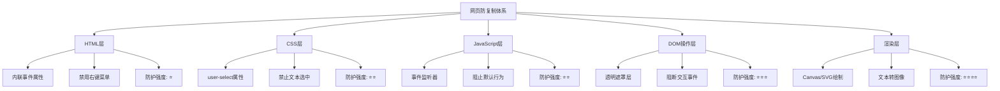

# 网页内容防复制技术详解

## 简介

网页内容防复制是一种前端保护技术，通过 **HTML、CSS、JavaScript、遮罩层或 Canvas 等手段**，限制用户选中、复制或右键操作，防止文本、图片等被轻易获取。其目的在于提高内容盗用门槛、保护原创版权和减少爬虫抓取，虽然不能彻底防止复制，但能有效提升操作难度与合规性。

## 防护体系架构



## 五层防护技术详解

### 1. HTML 层防护

**原理**: 利用内联事件属性拦截浏览器默认行为

**实现方式**:

```html
<body oncontextmenu="return false;" onselectstart="return false;">
	<p ondragstart="return false;">右键菜单已被禁用！</p>
</body>
```

**特点**:

- ✅ 实现简单，无需额外代码
- ❌ 容易被禁用 JavaScript 破解
- ❌ 防护强度最低

### 2. CSS 层防护

**原理**: 通过 CSS 属性控制用户交互行为

**实现方式**:

```css
.no-select {
	user-select: none;
	-webkit-user-select: none;
	-moz-user-select: none;
	-ms-user-select: none;
	pointer-events: none; /* 可选：禁用所有鼠标事件 */
}
```

**特点**:

- ✅ 兼容性好，支持所有现代浏览器
- ✅ 可以精确控制特定元素
- ❌ 可通过开发者工具轻易移除

### 3. JavaScript 层防护

**原理**: 监听关键事件并阻止默认行为

**基础实现**:

```javascript
// 禁用右键菜单
document.addEventListener('contextmenu', e => e.preventDefault());

// 禁用复制操作
document.addEventListener('copy', e => e.preventDefault());

// 禁用快捷键
document.addEventListener('keydown', e => {
	// 禁用 Ctrl+C, Ctrl+A, Ctrl+S, F12 等
	if (e.ctrlKey && ['c', 'a', 's', 'u'].includes(e.key.toLowerCase())) {
		e.preventDefault();
	}
	if (e.key === 'F12' || (e.ctrlKey && e.shiftKey && e.key === 'I')) {
		e.preventDefault();
	}
});

// 禁用选中
document.addEventListener('selectstart', e => e.preventDefault());
```

### 4. DOM 操作层防护

**原理**: 添加透明遮罩层阻止用户交互

**实现方式**:

```html
<style>
	.protection-mask {
		position: fixed;
		top: 0;
		left: 0;
		width: 100vw;
		height: 100vh;
		z-index: 9999;
		background: transparent;
		pointer-events: auto;
	}
</style>

<div class="protection-mask"></div>
```

### 5. 渲染层防护

**原理**: 将文本转换为 Canvas 绘制的图像

**实现方式**:

```javascript
function renderTextToCanvas(text, canvasId) {
	const canvas = document.getElementById(canvasId);
	const ctx = canvas.getContext('2d');

	ctx.font = '16px Arial';
	ctx.fillStyle = '#333';
	ctx.fillText(text, 10, 30);
}
```

## Vue 实现方案

### 基础防护组件

```vue
<template>
	<div
		ref="protectedContent"
		class="copy-protection"
		:class="{ 'protection-active': isProtectionActive }"
		@contextmenu.prevent
		@selectstart.prevent
		@dragstart.prevent
		@copy.prevent
	>
		<slot />

		<!-- 透明遮罩层 -->
		<div v-if="useMask" class="protection-mask" @click.stop />
	</div>
</template>

<script setup lang="ts">
import { ref, onMounted, onUnmounted } from 'vue';

interface Props {
	level?: 'basic' | 'medium' | 'high';
	useMask?: boolean;
	disableDevTools?: boolean;
	customMessage?: string;
}

const props = withDefaults(defineProps<Props>(), {
	level: 'medium',
	useMask: false,
	disableDevTools: true,
	customMessage: '内容受保护，禁止复制'
});

const protectedContent = ref<HTMLElement>();
const isProtectionActive = ref(true);

// 键盘事件处理
const handleKeyDown = (e: KeyboardEvent) => {
	const forbiddenKeys = [
		'F12',
		'I',
		'C',
		'A',
		'S',
		'U',
		'P' // Ctrl组合键
	];

	if (props.disableDevTools) {
		// 禁用开发者工具
		if (
			e.key === 'F12' ||
			(e.ctrlKey && e.shiftKey && e.key === 'I') ||
			(e.ctrlKey && e.shiftKey && e.key === 'C')
		) {
			e.preventDefault();
			showWarning();
			return;
		}
	}

	if (e.ctrlKey && forbiddenKeys.includes(e.key.toUpperCase())) {
		e.preventDefault();
		showWarning();
	}
};

// 显示警告信息
const showWarning = () => {
	// 可以使用 toast 或其他提示组件
	console.warn(props.customMessage);
};

// 检测开发者工具
const detectDevTools = () => {
	const threshold = 160;

	setInterval(() => {
		if (
			window.outerHeight - window.innerHeight > threshold ||
			window.outerWidth - window.innerWidth > threshold
		) {
			showWarning();
			// 可以添加更多处理逻辑
		}
	}, 1000);
};

onMounted(() => {
	document.addEventListener('keydown', handleKeyDown);

	if (props.disableDevTools) {
		detectDevTools();
	}

	// 禁用右键菜单
	document.addEventListener('contextmenu', e => e.preventDefault());
});

onUnmounted(() => {
	document.removeEventListener('keydown', handleKeyDown);
	document.removeEventListener('contextmenu', e => e.preventDefault());
});
</script>

<style scoped>
.copy-protection {
	position: relative;
	user-select: none;
	-webkit-user-select: none;
	-moz-user-select: none;
	-ms-user-select: none;
}

.protection-mask {
	position: absolute;
	top: 0;
	left: 0;
	width: 100%;
	height: 100%;
	z-index: 10;
	background: transparent;
	pointer-events: auto;
}

.protection-active {
	/* 可以添加保护激活时的样式 */
}
</style>
```

### 使用示例

```vue
<template>
	<div>
		<CopyProtection
			level="high"
			:use-mask="true"
			:disable-dev-tools="true"
			custom-message="此内容受版权保护"
		>
			<h2>受保护的内容</h2>
			<p>这段文字受到多层防护，无法轻易复制。</p>
		</CopyProtection>
	</div>
</template>

<script setup lang="ts">
import CopyProtection from './components/CopyProtection.vue';
</script>
```

## React 实现方案

### 防护 Hook

```typescript
import { useEffect, useCallback, useRef } from 'react';

interface UseProtectionOptions {
	level?: 'basic' | 'medium' | 'high';
	disableDevTools?: boolean;
	disableRightClick?: boolean;
	disableSelection?: boolean;
	disableCopy?: boolean;
	onViolation?: (type: string) => void;
}

export const useContentProtection = (options: UseProtectionOptions = {}) => {
	const {
		level = 'medium',
		disableDevTools = true,
		disableRightClick = true,
		disableSelection = true,
		disableCopy = true,
		onViolation
	} = options;

	const protectionRef = useRef<HTMLDivElement>(null);

	const handleViolation = useCallback(
		(type: string) => {
			onViolation?.(type);
			console.warn(`检测到违规操作: ${type}`);
		},
		[onViolation]
	);

	const handleKeyDown = useCallback(
		(e: KeyboardEvent) => {
			// 禁用开发者工具快捷键
			if (disableDevTools) {
				if (e.key === 'F12' || (e.ctrlKey && e.shiftKey && ['I', 'C', 'J'].includes(e.key))) {
					e.preventDefault();
					handleViolation('开发者工具');
					return;
				}
			}

			// 禁用复制相关快捷键
			if (disableCopy && e.ctrlKey) {
				const forbiddenKeys = ['c', 'a', 's', 'p', 'u'];
				if (forbiddenKeys.includes(e.key.toLowerCase())) {
					e.preventDefault();
					handleViolation('复制操作');
				}
			}
		},
		[disableDevTools, disableCopy, handleViolation]
	);

	const handleContextMenu = useCallback(
		(e: MouseEvent) => {
			if (disableRightClick) {
				e.preventDefault();
				handleViolation('右键菜单');
			}
		},
		[disableRightClick, handleViolation]
	);

	const handleSelectStart = useCallback(
		(e: Event) => {
			if (disableSelection) {
				e.preventDefault();
				handleViolation('文本选择');
			}
		},
		[disableSelection, handleViolation]
	);

	const handleCopy = useCallback(
		(e: ClipboardEvent) => {
			if (disableCopy) {
				e.preventDefault();
				handleViolation('复制操作');
			}
		},
		[disableCopy, handleViolation]
	);

	// 检测开发者工具
	const detectDevTools = useCallback(() => {
		if (!disableDevTools) return;

		const threshold = 160;
		const check = () => {
			if (
				window.outerHeight - window.innerHeight > threshold ||
				window.outerWidth - window.innerWidth > threshold
			) {
				handleViolation('开发者工具打开');
			}
		};

		const interval = setInterval(check, 1000);
		return () => clearInterval(interval);
	}, [disableDevTools, handleViolation]);

	useEffect(() => {
		document.addEventListener('keydown', handleKeyDown);
		document.addEventListener('contextmenu', handleContextMenu);
		document.addEventListener('selectstart', handleSelectStart);
		document.addEventListener('copy', handleCopy);

		const cleanupDevToolsDetection = detectDevTools();

		return () => {
			document.removeEventListener('keydown', handleKeyDown);
			document.removeEventListener('contextmenu', handleContextMenu);
			document.removeEventListener('selectstart', handleSelectStart);
			document.removeEventListener('copy', handleCopy);
			cleanupDevToolsDetection?.();
		};
	}, [handleKeyDown, handleContextMenu, handleSelectStart, handleCopy, detectDevTools]);

	return { protectionRef };
};
```

### React 防护组件

```typescript
import React, { ReactNode } from 'react';
import { useContentProtection } from './hooks/useContentProtection';

interface ProtectionWrapperProps {
	children: ReactNode;
	level?: 'basic' | 'medium' | 'high';
	useMask?: boolean;
	disableDevTools?: boolean;
	className?: string;
	style?: React.CSSProperties;
	onViolation?: (type: string) => void;
}

const ProtectionWrapper: React.FC<ProtectionWrapperProps> = ({
	children,
	level = 'medium',
	useMask = false,
	disableDevTools = true,
	className = '',
	style = {},
	onViolation
}) => {
	const { protectionRef } = useContentProtection({
		level,
		disableDevTools,
		onViolation
	});

	const protectionStyles: React.CSSProperties = {
		position: 'relative',
		userSelect: 'none',
		WebkitUserSelect: 'none',
		MozUserSelect: 'none',
		msUserSelect: 'none',
		...style
	};

	return (
		<div
			ref={protectionRef}
			className={`copy-protection ${className}`}
			style={protectionStyles}
			onContextMenu={e => e.preventDefault()}
			onSelectStart={e => e.preventDefault()}
			onDragStart={e => e.preventDefault()}
			onCopy={e => e.preventDefault()}
		>
			{children}

			{useMask && (
				<div
					style={{
						position: 'absolute',
						top: 0,
						left: 0,
						width: '100%',
						height: '100%',
						zIndex: 10,
						background: 'transparent',
						pointerEvents: 'auto'
					}}
					onClick={e => e.stopPropagation()}
				/>
			)}
		</div>
	);
};

export default ProtectionWrapper;
```

### 使用示例

```typescript
import React from 'react';
import ProtectionWrapper from './components/ProtectionWrapper';

const App: React.FC = () => {
	const handleViolation = (type: string) => {
		alert(`检测到违规操作: ${type}`);
	};

	return (
		<div>
			<ProtectionWrapper
				level="high"
				useMask={true}
				disableDevTools={true}
				onViolation={handleViolation}
			>
				<h2>受保护的内容</h2>
				<p>这段文字受到多层防护，无法轻易复制。</p>
			</ProtectionWrapper>
		</div>
	);
};

export default App;
```

## 高级防护策略

### 1. Canvas 文本渲染

```typescript
interface CanvasTextOptions {
	text: string;
	fontSize?: number;
	fontFamily?: string;
	color?: string;
	width?: number;
	height?: number;
}

const useCanvasText = (options: CanvasTextOptions) => {
	const canvasRef = useRef<HTMLCanvasElement>(null);

	useEffect(() => {
		const canvas = canvasRef.current;
		if (!canvas) return;

		const ctx = canvas.getContext('2d');
		if (!ctx) return;

		const {
			text,
			fontSize = 16,
			fontFamily = 'Arial',
			color = '#333',
			width = 400,
			height = 100
		} = options;

		canvas.width = width;
		canvas.height = height;

		ctx.font = `${fontSize}px ${fontFamily}`;
		ctx.fillStyle = color;
		ctx.textBaseline = 'middle';
		ctx.fillText(text, 10, height / 2);
	}, [options]);

	return canvasRef;
};
```

### 2. 动态内容加密

```typescript
const useContentEncryption = (content: string) => {
	const [decryptedContent, setDecryptedContent] = useState('');

	useEffect(() => {
		// 简单的内容混淆
		const decrypt = (encrypted: string) => {
			return encrypted.split('').reverse().join('');
		};

		// 延迟解密，增加破解难度
		const timer = setTimeout(() => {
			setDecryptedContent(decrypt(content));
		}, 100);

		return () => clearTimeout(timer);
	}, [content]);

	return decryptedContent;
};
```

### 3. 虚拟滚动保护

```typescript
const useVirtualProtection = (items: string[]) => {
	const [visibleItems, setVisibleItems] = useState<string[]>([]);
	const containerRef = useRef<HTMLDivElement>(null);

	useEffect(() => {
		const updateVisibleItems = () => {
			// 只渲染可见区域的内容
			const startIndex = Math.floor(window.scrollY / 50);
			const endIndex = startIndex + 10;
			setVisibleItems(items.slice(startIndex, endIndex));
		};

		window.addEventListener('scroll', updateVisibleItems);
		updateVisibleItems();

		return () => window.removeEventListener('scroll', updateVisibleItems);
	}, [items]);

	return { visibleItems, containerRef };
};
```

## 破解方法与对策

### 常见破解方式

| 破解方法        | 针对层级   | 对策               |
| --------------- | ---------- | ------------------ |
| 禁用 JavaScript | HTML/JS 层 | 服务端渲染关键内容 |
| 修改 CSS 样式   | CSS 层     | 动态样式注入       |
| 删除遮罩层      | DOM 层     | 多层遮罩+动态重建  |
| OCR 识别        | 渲染层     | 添加干扰元素       |
| 查看源码        | 所有层级   | 内容加密+混淆      |

### 防护强化策略

```typescript
// 1. 动态防护重建
const useDynamicProtection = () => {
	useEffect(() => {
		const rebuildProtection = () => {
			// 检查并重建被破坏的防护
			const masks = document.querySelectorAll('.protection-mask');
			if (masks.length === 0) {
				// 重新创建遮罩层
				createProtectionMask();
			}
		};

		const interval = setInterval(rebuildProtection, 1000);
		return () => clearInterval(interval);
	}, []);
};

// 2. 多重验证
const useMultiLayerValidation = () => {
	const [isValid, setIsValid] = useState(true);

	useEffect(() => {
		const validate = () => {
			// 检查多个防护层是否完整
			const checks = [checkCSSProtection(), checkJSProtection(), checkDOMProtection()];

			setIsValid(checks.every(Boolean));
		};

		const interval = setInterval(validate, 2000);
		return () => clearInterval(interval);
	}, []);

	return isValid;
};
```

## 性能优化建议

### 1. 事件节流

```typescript
const useThrottledProtection = () => {
	const throttledHandler = useCallback(
		throttle((e: Event) => {
			// 处理保护逻辑
		}, 100),
		[]
	);

	return throttledHandler;
};
```

### 2. 内存管理

```typescript
const useProtectionCleanup = () => {
	const cleanupFunctions = useRef<(() => void)[]>([]);

	const addCleanup = useCallback((fn: () => void) => {
		cleanupFunctions.current.push(fn);
	}, []);

	useEffect(() => {
		return () => {
			cleanupFunctions.current.forEach(fn => fn());
			cleanupFunctions.current = [];
		};
	}, []);

	return addCleanup;
};
```

## 应用场景与最佳实践

### 1. 内容分级保护

```typescript
const getProtectionLevel = (contentType: string) => {
	const levels = {
		public: 'basic',
		premium: 'medium',
		confidential: 'high'
	};
	return levels[contentType] || 'basic';
};
```

### 2. 用户体验平衡

```typescript
const useUserFriendlyProtection = () => {
	const [showWarning, setShowWarning] = useState(false);

	const handleProtectionTrigger = useCallback(() => {
		setShowWarning(true);
		setTimeout(() => setShowWarning(false), 3000);
	}, []);

	return { showWarning, handleProtectionTrigger };
};
```

## 总结

网页内容防复制技术通过多层防护体系，可以有效提高内容保护的门槛。虽然无法做到绝对防护，但合理的实现可以在保护内容和用户体验之间找到平衡点。

**关键要点**：

- 采用多层防护策略，提高破解难度
- 平衡安全性和用户体验
- 定期更新防护机制，应对新的破解方法
- 结合服务端验证，构建完整的安全体系

**注意事项**：

- 过度的防护可能影响正常用户体验
- 需要考虑无障碍访问的兼容性
- 防护机制应该是渐进增强的，而不是破坏性的
