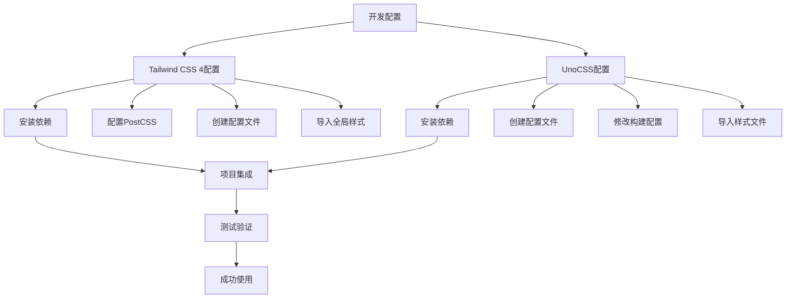

# Tailwind CSS 4 与 UnoCSS 最新配置全攻略

在日常开发中，给样式命名这件事总是既琐碎又费时间。虽然重要，但大多数时候，它并不是最有创造力的部分。直到接触到 Tailwind CSS —— 这个框架彻底改变了写样式的方式。它的类名设计极具复用性，写起来简洁、直观，搭配好之后几乎不用再定义额外的样式，整个过程就像在"拼积木"，丝滑又高效。

## 效果特点

### 技术特性

- **原子化 CSS**: 使用预定义的类名来构建样式，无需编写自定义 CSS
- **高性能**: Tailwind CSS 4 渲染性能已超越 UnoCSS
- **按需加载**: 只生成实际使用的 CSS 类名，减少文件体积
- **易于维护**: 统一的命名规范和样式系统

### 视觉特性

- **一致性**: 通过设计系统确保整个项目的样式一致性
- **灵活性**: 支持自定义配置和即时值样式
- **响应式**: 内置响应式设计支持
- **主题化**: 支持自定义主题和扩展

## 工作原理



## Tailwind CSS 4 配置实战

### 安装依赖

需要安装的依赖有三项：

1. `tailwindcss`：核心库，用来解析模板文件（HTML、Vue、React 等），提取类名并生成对应的样式
2. `@tailwindcss/postcss`：用于将 Tailwind 运行在 PostCSS 环境中
3. `postcss`：CSS 转译工具平台，相当于 Babel 之于 JavaScript

安装命令如下：

```bash
pnpm add -D tailwindcss @tailwindcss/postcss postcss
```

### 配置 postcss.config.js

Tailwind CSS 4 中不再需要执行 `npx tailwindcss init -p` 命令。配置文件写法更简洁：

```javascript
// ESM 写法
export default {
	plugins: {
		'@tailwindcss/postcss': {}
	}
};

// CJS 写法
module.exports = {
	plugins: [require('@tailwindcss/postcss')]
};
```

### （可选）配置 tailwind.config.mjs

Tailwind 4 中这个文件不是必须的，但如果你需要自定义扫描路径或扩展主题，可以添加：

```javascript
export default {
	content: ['./src/**/*.{ts,tsx}'],
	theme: {
		extend: {}
	},
	plugins: []
};
```

### 导入全局样式

最后一步，在全局样式文件（如 index.css）中加入：

```css
@import 'tailwindcss';
```

到这里，Tailwind CSS 4 已经可以愉快使用了。

## UnoCSS 配置实战

UnoCSS 一直被认为是性能更优的原子化样式框架，主要原因有三点：

1. 它直接作为 Vite/Rollup 插件在内存中运行，无需 PostCSS，少了一层解析开销
2. UnoCSS 的规则集是模块化按需加载的，而 Tailwind 核心包含所有默认规则与主题
3. UnoCSS 支持类名哈希化，例如 text-[rgb(255,0,0)] 会被转换成 u-1e0s，进一步减小 HTML 体积

### 安装依赖

```bash
pnpm add -D unocss @unocss/vite @unocss/preset-wind3
```

各包用途：

| 包名                 | 作用                                        |
| -------------------- | ------------------------------------------- |
| unocss               | UnoCSS 的核心引擎，解析类名并生成原子化 CSS |
| @unocss/vite         | 将 UnoCSS 集成进 Vite 构建流程，支持 HMR    |
| @unocss/preset-wind3 | 提供类似 Tailwind v3 的默认原子类规则集     |

### 创建 uno.config.js

```javascript
import { defineConfig } from 'unocss';
import presetWind3 from '@unocss/preset-wind3';

export default defineConfig({
	presets: [presetWind3()],
	content: {
		pipeline: {
			include: [/.(vue|js|ts|jsx|tsx|html)($|?)/]
		}
	}
});
```

### 修改 vite.config.ts

解决 ESM/CJS 兼容性问题：

```javascript
export default defineConfig(async () => {
	const { default: UnoCSS } = await import('@unocss/vite');
	return {
		plugins: [uni(), UnoCSS()]
	};
});
```

### 在入口文件中导入 UnoCSS

在 src/main.ts 中加入：

```javascript
import 'uno.css';
```

### 测试是否成功

```html
<div class="h-[200px] text-[#0000ff]">测试</div>
```

运行项目后，如果蓝色文字和高度样式立即生效，说明配置成功！

## 参数配置说明

### Tailwind CSS 4 配置参数

| 参数名    | 类型     | 默认值 | 说明                   |
| --------- | -------- | ------ | ---------------------- |
| `content` | string[] | []     | 指定需要扫描的文件路径 |
| `theme`   | object   | {}     | 自定义主题配置         |
| `plugins` | array    | []     | 使用的插件列表         |

### UnoCSS 配置参数

| 参数名                     | 类型     | 默认值 | 说明             |
| -------------------------- | -------- | ------ | ---------------- |
| `presets`                  | array    | []     | 使用的预设规则集 |
| `content.pipeline.include` | RegExp[] | []     | 包含的文件类型   |
| `content.pipeline.exclude` | RegExp[] | []     | 排除的文件类型   |

## 配置示例

### Tailwind CSS 4 自定义主题

```javascript
export default {
	content: ['./src/**/*.{ts,tsx}'],
	theme: {
		extend: {
			colors: {
				primary: '#3b82f6',
				secondary: '#64748b'
			},
			spacing: {
				128: '32rem',
				144: '36rem'
			}
		}
	},
	plugins: []
};
```

### UnoCSS 扩展配置

```javascript
import { defineConfig } from 'unocss';
import presetWind3 from '@unocss/preset-wind3';

export default defineConfig({
	presets: [presetWind3()],
	content: {
		pipeline: {
			include: [/.(vue|js|ts|jsx|tsx|html)($|?)/],
			exclude: [/node_modules/, /\.git/]
		}
	},
	theme: {
		colors: {
			primary: '#3b82f6',
			secondary: '#64748b'
		}
	}
});
```

## 性能优化

### 1. 内容扫描优化

```javascript
// Tailwind CSS 4
export default {
  content: [
    './src/**/*.{html,js,ts,jsx,tsx,vue}',
    // 排除不需要扫描的文件
    '!./src/assets/**/*',
  ],
};

// UnoCSS
export default defineConfig({
  content: {
    pipeline: {
      include: [/.(vue|js|ts|jsx|tsx|html)($|?)/],
      exclude: [/node_modules/, /dist/],
    },
  },
});
```

### 2. 构建优化

```javascript
// vite.config.ts
export default defineConfig({
	build: {
		rollupOptions: {
			external: ['unocss', 'tailwindcss']
		}
	}
});
```

## 故障排除

### 1. 命令失效问题

**问题**: `npx tailwindcss init -p` 命令在 Tailwind CSS 4 中失效
**解决方案**: Tailwind CSS 4 不再需要此命令，直接配置 postcss.config.js 即可

### 2. HMR 不更新问题

**问题**: 类名哈希化导致即时值样式更新不及时
**解决方案**: 简化配置，仅考虑特定平台需求

### 3. ESM/CJS 冲突问题

**问题**: `@unocss/vite` 是纯 ESM 包，与 CommonJS 加载逻辑冲突
**解决方案**: 使用动态导入强制使用 ESM 模式加载

## 应用场景

### 1. React 项目集成

```javascript
// postcss.config.js
module.exports = {
	plugins: [require('@tailwindcss/postcss')]
};

// tailwind.config.js
export default {
	content: ['./src/**/*.{js,jsx,ts,tsx}'],
	theme: {
		extend: {}
	},
	plugins: []
};
```

### 2. Vue 项目集成

```javascript
// uno.config.js
import { defineConfig } from 'unocss';
import presetWind3 from '@unocss/preset-wind3';

export default defineConfig({
	presets: [presetWind3()],
	content: {
		pipeline: {
			include: [/.(vue|js|ts)($|?)/]
		}
	}
});
```

### 3. 小程序项目集成

```javascript
// 注意兼容性问题
export default defineConfig({
	presets: [presetWind3()],
	content: {
		pipeline: {
			include: [/.(wxml|wxss|js|ts)($|?)/]
		}
	}
});
```

## 技术要点

### 1. 原子化 CSS 理念

- 使用功能性类名而非语义化类名
- 通过组合实现复杂样式
- 减少 CSS 文件体积

### 2. 构建工具集成

- Tailwind CSS 4 与 PostCSS 深度集成
- UnoCSS 作为 Vite/Rollup 插件直接运行
- 支持热更新和按需加载

### 3. 兼容性考虑

- Tailwind CSS 4 在某些平台兼容性还不理想
- UnoCSS 提供更好的跨平台支持
- 需要根据项目需求选择合适的方案
