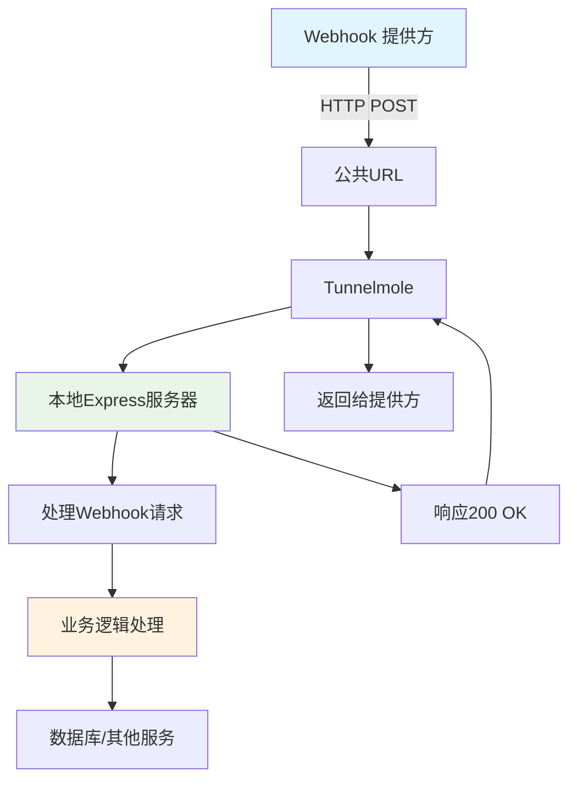

# Webhook 示例与 Node.js 教程：使用 Express 构建实时 Webhook 接收器并通过 Tunnelmole 测试

## 简介

Webhook 是现代 Web 开发中实现实时数据传输的重要机制。与传统的轮询方式不同，Webhook 采用"推送"模型，当特定事件发生时，服务提供方会主动向指定的 URL 发送 HTTP 请求。本教程将详细介绍如何使用 Node.js 和 Express 构建一个 Webhook 接收器，并通过 Tunnelmole 工具将其暴露到公网进行测试。

## 效果特点

### 核心特性

- **实时数据传输**：基于事件驱动的实时数据推送机制
- **高效通信**：避免轮询开销，提高系统效率
- **广泛适用**：适用于支付通知、代码推送、订单更新等多种场景
- **易于测试**：通过 Tunnelmole 实现本地服务的公网访问

### 技术优势

- **轻量级实现**：基于 Express 框架，代码简洁易懂
- **安全可靠**：支持请求验证和签名检查
- **开源工具**：使用完全开源的 Tunnelmole 进行本地测试
- **标准化响应**：遵循 Webhook 最佳实践

## 工作原理



Webhook 的工作流程如下：

1. Webhook 提供方（如 Stripe、GitHub）在特定事件发生时向指定 URL 发送 HTTP POST 请求
2. 请求首先到达通过 Tunnelmole 映射的公共 URL
3. Tunnelmole 将请求转发到本地运行的 Express 服务器
4. Express 服务器接收并处理请求，执行相应的业务逻辑
5. 服务器返回 200 OK 响应确认接收
6. Tunnelmole 将响应返回给 Webhook 提供方

## 核心实现

### 基础环境准备

在开始构建 Webhook 接收器之前，需要确保系统已安装以下工具：

1. **Node.js 和 npm**：从 [Node.js 官方网站](https://nodejs.org/) 下载并安装
2. **代码编辑器**：推荐使用 Visual Studio Code
3. **Tunnelmole**：用于将本地服务映射到公网的工具

Tunnelmole 安装命令：

```bash
# Linux 和 macOS
curl -O https://install.tunnelmole.com/xD345/install && sudo bash install

# Windows
# 1. 下载 tmole.exe
# 2. 将可执行文件放在系统的 PATH 文件夹中
```

### Express 服务器实现

创建项目目录并初始化：

```bash
mkdir webhook-receiver-example
cd webhook-receiver-example
npm init -y
npm install express body-parser
```

创建 [index.js](file:///Users/hejianfei/Desktop/01-%E5%BC%80%E5%8F%91%E9%A1%B9%E7%9B%AE/01-%E5%89%8D%E7%AB%AF%E9%A1%B9%E7%9B%AE/h-news/book/example/components/react/keyboard-shortcuts/index.js) 文件并添加以下代码：

```javascript
const express = require('express');
const bodyParser = require('body-parser');

// Initialize the Express app
const app = express();
const port = 3000;

// Use body-parser middleware to parse JSON request bodies
app.use(bodyParser.json());

// Define a welcome message for the root URL
app.get('/', (req, res) => {
	res.send('Welcome to the Webhook Receiver! Use the /webhook-example endpoint for POST requests.');
});

/**
 * This is our main webhook handler endpoint.
 * It listens for POST requests and logs the received body.
 */
app.post('/webhook-example', (req, res) => {
	console.log('--- New Webhook Received ---');

	// The webhook payload is in the request body
	const payload = req.body;

	console.log('Headers:', JSON.stringify(req.headers, null, 2));
	console.log('Payload:', JSON.stringify(payload, null, 2));

	// You can add your processing logic here.
	// For example, save data to a database, trigger an email, etc.

	// Respond to the webhook provider to acknowledge receipt
	res.status(200).send('Webhook received successfully!');
});

// Start the server and listen for connections
app.listen(port, () => {
	console.log(`Server is running on http://localhost:${port}`);
	console.log('Listening for webhooks at the /webhook-example endpoint.');
});
```

### 启动本地服务器

运行以下命令启动本地服务器：

```bash
node index.js
```

正常情况下会看到输出：

```
Server is running on http://localhost:3000
Listening for webhooks at the /webhook-example endpoint.
```

## 高级功能

### 自定义参数配置

为了增强 Webhook 接收器的功能，可以添加以下自定义参数：

#### 1. 端口配置

```javascript
// 从环境变量获取端口，如果没有则使用默认值
const port = process.env.PORT || 3000;
```

#### 2. 路径配置

```javascript
// 允许通过环境变量自定义 webhook 路径
const webhookPath = process.env.WEBHOOK_PATH || '/webhook-example';
app.post(webhookPath, (req, res) => {
	// 处理逻辑
});
```

#### 3. 日志级别配置

```javascript
// 支持不同日志级别
const logLevel = process.env.LOG_LEVEL || 'info';

const logger = {
	info: msg => {
		if (logLevel === 'info' || logLevel === 'debug') {
			console.log(msg);
		}
	},
	debug: msg => {
		if (logLevel === 'debug') {
			console.log(`[DEBUG] ${msg}`);
		}
	}
};
```

#### 4. 白名单配置

```javascript
// IP 白名单验证
const allowedIPs = process.env.ALLOWED_IPS ? process.env.ALLOWED_IPS.split(',') : [];

app.post(webhookPath, (req, res) => {
	const clientIP = req.ip || req.connection.remoteAddress;

	if (allowedIPs.length > 0 && !allowedIPs.includes(clientIP)) {
		return res.status(403).send('Forbidden: IP not allowed');
	}

	// 处理 webhook 逻辑
});
```

### 安全性增强

#### Webhook 签名验证

大多数 Webhook 提供商（如 GitHub、Stripe）会在请求头中包含签名用于验证请求来源：

```javascript
const crypto = require('crypto');

// 验证 webhook 签名
function verifySignature(payload, signature, secret) {
	const expectedSignature =
		'sha256=' + crypto.createHmac('sha256', secret).update(payload, 'utf8').digest('hex');

	return crypto.timingSafeEqual(
		Buffer.from(signature, 'hex'),
		Buffer.from(expectedSignature, 'hex')
	);
}

app.post(webhookPath, (req, res) => {
	const signature = req.headers['x-hub-signature-256'];
	const secret = process.env.WEBHOOK_SECRET;

	if (secret && signature) {
		const rawBody = JSON.stringify(req.body);
		if (!verifySignature(rawBody, signature, secret)) {
			return res.status(401).send('Unauthorized: Invalid signature');
		}
	}

	// 处理 webhook 逻辑
});
```

## Tunnelmole 公网映射

在 Node.js 服务器运行时，打开新的终端窗口并运行 Tunnelmole：

```bash
tmole 3000
```

Tunnelmole 将输出类似以下的公网 URL：

```
Your Tunnelmole Public URLs are below and are accessible internet wide. Always use HTTPs for the best security

https://k29d1m-ip-XX-XX-XX-XX.tunnelmole.net ⟶ http://localhost:3000
http://k29d1m-ip-XX-XX-XX-XX.tunnelmole.net ⟶ http://localhost:3000
```

获取 HTTPS URL 作为您的公共 Webhook URL。完整的 Webhook 端点将是：
`https://YOUR-UNIQUE-SUBDOMAIN.tunnelmole.net/webhook-example`

## 测试验证

使用 curl 命令发送测试请求：

```bash
curl -X POST \
  https://YOUR-UNIQUE-SUBDOMAIN.tunnelmole.net/webhook-example \
  -H 'Content-Type: application/json' \
  -H 'X-Custom-Header: TestFromCurl' \
  -d '{
    "event_type": "user.created",
    "timestamp": "'$(date -u +"%Y-%m-%dT%H:%M:%SZ")'",
    "data": {
      "user_id": "usr_12345",
      "name": "Jane Doe",
      "email": "jane.doe@example.com"
    }
  }'
```

如果成功，curl 将返回 `Webhook received successfully!`，同时在服务器终端可以看到详细的日志输出：

```
--- New Webhook Received ---
Headers: {
  "content-type": "application/json",
  "x-custom-header": "TestFromCurl",
  "host": "k29d1m-ip-XX-XX-XX-XX.tunnelmole.net",
  "accept": "*/*",
  "content-length": "164",
  ...
}
Payload: {
  "event_type": "user.created",
  "timestamp": "2025-07-15T10:30:00Z",
  "data": {
    "user_id": "usr_12345",
    "name": "Jane Doe",
    "email": "jane.doe@example.com"
  }
}
```

## 应用场景

Webhook 在现代应用开发中有着广泛的应用场景：

### 1. 支付通知

```javascript
app.post('/webhook/payment', (req, res) => {
	const event = req.body;

	switch (event.type) {
		case 'payment.succeeded':
			// 处理支付成功逻辑
			updateOrderStatus(event.data.orderId, 'paid');
			break;
		case 'payment.failed':
			// 处理支付失败逻辑
			notifyUserPaymentFailed(event.data.orderId);
			break;
	}

	res.status(200).send('Received');
});
```

### 2. 代码仓库事件

```javascript
app.post('/webhook/github', (req, res) => {
	const event = req.body;
	const eventType = req.headers['x-github-event'];

	switch (eventType) {
		case 'push':
			// 处理代码推送事件
			triggerCIProcess(event.repository.name);
			break;
		case 'pull_request':
			// 处理 Pull Request 事件
			notifyTeamOfPR(event.pull_request);
			break;
	}

	res.status(200).send('Received');
});
```

### 3. 电商订单更新

```javascript
app.post('/webhook/shopify', (req, res) => {
	const event = req.body;

	switch (event.topic) {
		case 'orders/create':
			// 处理新订单创建
			processNewOrder(event.payload);
			break;
		case 'orders/updated':
			// 处理订单更新
			updateInventory(event.payload);
			break;
	}

	res.status(200).send('Received');
});
```

## 最佳实践

### 1. 快速响应

始终在处理完关键验证后立即返回 200 OK 响应，避免 Webhook 提供方重试：

```javascript
app.post('/webhook', (req, res) => {
	// 快速验证签名等关键信息
	if (!isValidSignature(req)) {
		return res.status(401).send('Invalid signature');
	}

	// 立即响应
	res.status(200).send('Received');

	// 异步处理业务逻辑
	processWebhookAsync(req.body);
});
```

### 2. 幂等性处理

确保相同的 Webhook 请求多次处理不会产生副作用：

```javascript
const processedEvents = new Set();

app.post('/webhook', (req, res) => {
	const eventId = req.headers['x-event-id'];

	// 检查是否已处理过该事件
	if (processedEvents.has(eventId)) {
		return res.status(200).send('Already processed');
	}

	// 标记为已处理
	processedEvents.add(eventId);

	// 处理事件
	handleEvent(req.body);

	res.status(200).send('Received');
});
```

### 3. 错误处理和重试机制

实现适当的错误处理和重试逻辑：

```javascript
app.post('/webhook', async (req, res) => {
	try {
		await processWebhook(req.body);
		res.status(200).send('Success');
	} catch (error) {
		// 记录错误日志
		console.error('Webhook processing error:', error);

		// 根据错误类型决定响应码
		if (error.retryable) {
			// 503 会触发提供方重试
			res.status(503).send('Temporary error, please retry');
		} else {
			// 400 表示请求错误，不应重试
			res.status(400).send('Bad request');
		}
	}
});
```

## 故障排除

### 1. 连接问题

- 确保本地服务器正在运行
- 检查防火墙设置是否阻止了端口访问
- 验证 Tunnelmole 是否正确安装并运行

### 2. 签名验证失败

- 确认密钥配置正确
- 检查请求体是否完整未被中间件修改
- 验证时间戳是否在允许的时间窗口内

### 3. 请求超时

- 优化 Webhook 处理逻辑，避免长时间运行
- 将耗时操作放到后台队列处理
- 调整 Webhook 提供方的超时设置

## 总结

Webhook 是构建事件驱动、实时响应应用的重要技术。通过本教程，我们学习了：

1. Webhook 的工作原理和优势
2. 使用 Express 构建 Webhook 接收器的方法
3. 通过 Tunnelmole 实现本地服务公网访问
4. Webhook 安全性增强措施
5. 最佳实践和常见问题解决方法

掌握这些知识后，您可以将 Webhook 集成到各种服务中，如支付系统、代码仓库、电商平台等，实现高效的实时数据同步和自动化处理。
