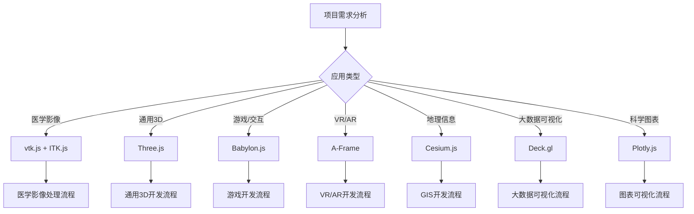

# Web端3D可视化库

## 简介

vtk.js 是一个由 Kitware 开发的 Web 端 3D 可视化库，它是经典 C++ 可视化工具包 VTK (Visualization Toolkit) 的 JavaScript 实现版本。它允许开发者在浏览器中直接加载、渲染和交互复杂的 3D 科学数据（如医学影像、体积数据、几何模型等），而不依赖任何插件。

## 一、vtk.js 核心特点

| 功能类别 | 说明 |
|----------|------|
| **跨平台渲染** | 基于 WebGL 2，支持浏览器端高性能 3D 渲染 |
| **兼容 VTK 数据结构** | 与原生 VTK 数据模型一致（如 vtkPolyData, vtkImageData 等） |
| **体绘制与表面渲染** | 支持体积渲染（Volume Rendering）、表面（Surface）、等值面（Isosurface）等 |
| **交互工具** | 提供相机控制、拾取（picking）、切片（slice）、测量等交互能力 |
| **管线式架构** | 采用 VTK 的数据流管线思想，模块化设计 |
| **可与 WebXR 结合** | 支持 VR/AR 显示 |
| **可与 React/Vue 集成** | 提供 React 组件封装方案，方便在前端框架中使用 |

## 二、核心模块结构

vtk.js 按功能分为多个子模块：

| 模块 | 功能 |
|------|------|
| **Rendering** | 渲染器、相机、演员（actor）、映射器（mapper）等 |
| **Filters** | 数据过滤器（如等值面提取、体绘制等） |
| **Interaction** | 事件交互、鼠标控制、选取等 |
| **IO** | 数据读取（支持 .vtk, .vti, .stl, .obj 等） |
| **Common** | 核心数据结构（如 vtkPolyData, vtkImageData） |
| **Widgets** | 提供交互式工具（切片平面、测距、窗口调节等） |

## 三、基本使用流程

### 基础示例

```javascript
import 'vtk.js/Sources/favicon';
import vtkFullScreenRenderWindow from 'vtk.js/Sources/Rendering/Misc/FullScreenRenderWindow';
import vtkSphereSource from 'vtk.js/Sources/Filters/Sources/SphereSource';
import vtkMapper from 'vtk.js/Sources/Rendering/Core/Mapper';
import vtkActor from 'vtk.js/Sources/Rendering/Core/Actor';

// 1. 创建全屏渲染窗口
const fullScreenRenderer = vtkFullScreenRenderWindow.newInstance();
const renderer = fullScreenRenderer.getRenderer();
const renderWindow = fullScreenRenderer.getRenderWindow();

// 2. 创建几何源
const sphereSource = vtkSphereSource.newInstance({
  phiResolution: 30,
  thetaResolution: 30
});

// 3. 映射器与演员
const mapper = vtkMapper.newInstance();
mapper.setInputConnection(sphereSource.getOutputPort());

const actor = vtkActor.newInstance();
actor.setMapper(mapper);
renderer.addActor(actor);

// 4. 渲染场景
renderer.resetCamera();
renderWindow.render();
```

### React 集成示例

```jsx
import React, { useRef, useEffect } from 'react';
import vtkGenericRenderWindow from 'vtk.js/Sources/Rendering/Misc/GenericRenderWindow';
import vtkSphereSource from 'vtk.js/Sources/Filters/Sources/SphereSource';
import vtkMapper from 'vtk.js/Sources/Rendering/Core/Mapper';
import vtkActor from 'vtk.js/Sources/Rendering/Core/Actor';

const VTKComponent = () => {
  const vtkContainerRef = useRef(null);

  useEffect(() => {
    const genericRenderWindow = vtkGenericRenderWindow.newInstance();
    genericRenderWindow.setContainer(vtkContainerRef.current);
    
    const renderer = genericRenderWindow.getRenderer();
    const renderWindow = genericRenderWindow.getRenderWindow();

    // 创建球体
    const sphereSource = vtkSphereSource.newInstance();
    const mapper = vtkMapper.newInstance();
    const actor = vtkActor.newInstance();

    mapper.setInputConnection(sphereSource.getOutputPort());
    actor.setMapper(mapper);
    renderer.addActor(actor);

    renderer.resetCamera();
    renderWindow.render();

    return () => {
      genericRenderWindow.delete();
    };
  }, []);

  return <div ref={vtkContainerRef} style={{ width: '100%', height: '400px' }} />;
};
```

## 四、数据可视化应用场景

| 应用方向 | 示例 |
|----------|------|
| **医学影像** | MRI/CT 三维体渲染、切片、标注 |
| **工程仿真** | CFD 流场可视化、网格展示 |
| **科学数据** | 地理体积渲染、分子结构展示 |
| **教育科研** | Web3D 实验可视化、在线教学 |

## 五、生态与扩展

### 文件格式支持
- `.vtk`, `.vti`, `.stl`, `.obj`, `.vtp`, `.vtp.gz`, `.vti.gz`

### Web 端工具集成
- 可与 ITK.js 搭配读取医学图像（DICOM）
- 可通过 ParaView Glance 快速搭建可视化平台（基于 vtk.js）

---

vtk.js 虽然功能强大，但它偏重**科学可视化（Scientific Visualization）**方向。如果你想在 Web 端实现 3D 渲染、医学影像、工程仿真或数据可视化，不同场景下有多种可替代方案。下面是详细对比与推荐表。

## 六、可替代或互补的库分类总览

| 类型 | 代表库 | 适用场景 | 特点 |
|------|--------|----------|------|
| **科学可视化类** | VTK.js、ITK.js、XTK | 医学影像、工程仿真 | 支持体绘制、网格、切片、DICOM |
| **通用 3D 渲染类** | Three.js、Babylon.js | 通用 3D 场景、模型展示 | 灵活、生态广、性能好 |
| **Web GPU 渲染类** | Filament、Luma.gl | 高性能科学渲染、WebGPU 支持 | 性能强、未来趋势 |
| **医学影像专用类** | Cornerstone.js、AMI.js、XTK | DICOM 影像浏览、切片 | 专为医学影像设计 |
| **体数据可视化类** | Niivue、AMI.js | 体积渲染、CT/MRI | 简洁快速加载 NIfTI 等格式 |
| **高阶可视化平台** | ParaView Glance、OHIF Viewer | 快速搭建医学/科研可视化工具 | 基于 vtk.js 与 ITK.js 封装 |
| **VR/AR 可视化类** | A-Frame、WebXR | 虚拟现实、增强现实 | 沉浸式体验、跨平台 |
| **地理空间可视化类** | Cesium.js、Deck.gl | GIS、地图、地理数据 | 地理坐标、大数据、时空分析 |
| **数据图表可视化类** | Plotly.js、Observable Plot | 科学图表、统计可视化 | 交互图表、数据分析 |

## 七、各主流替代库详细说明

### Three.js
**最通用的 Web3D 库**

```javascript
import * as THREE from 'three';

// 创建场景、相机、渲染器
const scene = new THREE.Scene();
const camera = new THREE.PerspectiveCamera(75, window.innerWidth / window.innerHeight, 0.1, 1000);
const renderer = new THREE.WebGLRenderer();

// 创建几何体
const geometry = new THREE.BoxGeometry();
const material = new THREE.MeshBasicMaterial({ color: 0x00ff00 });
const cube = new THREE.Mesh(geometry, material);
scene.add(cube);

// 渲染循环
function animate() {
  requestAnimationFrame(animate);
  cube.rotation.x += 0.01;
  cube.rotation.y += 0.01;
  renderer.render(scene, camera);
}
animate();
```

**特点：**
- 生态系统最完善，社区活跃
- 学习资源丰富，文档完善
- 支持各种 3D 格式导入
- 适合游戏、可视化、艺术创作

### ITK.js
**医学影像处理（VTK.js 的兄弟库）**

```javascript
import { readImageArrayBuffer } from 'itk/readImageArrayBuffer';

// 读取医学影像文件
const { image, webWorker } = await readImageArrayBuffer(null, arrayBuffer, 'image.dcm');

// 获取影像信息
console.log('Image dimensions:', image.size);
console.log('Image spacing:', image.spacing);
console.log('Image origin:', image.origin);
```

**特点：**
- 支持 DICOM、NIfTI、NRRD 格式的加载与解析
- 可与 vtk.js 无缝衔接完成体渲染
- 内置图像过滤、分割、转换功能（WebAssembly 实现）

### Cornerstone.js
**医学影像浏览器框架**

```javascript
import cornerstone from 'cornerstone-core';
import cornerstoneWADOImageLoader from 'cornerstone-wado-image-loader';

// 启用元素
const element = document.getElementById('dicomImage');
cornerstone.enable(element);

// 加载并显示 DICOM 图像
const imageId = 'wadouri:https://example.com/image.dcm';
cornerstone.loadImage(imageId).then(image => {
  cornerstone.displayImage(element, image);
});
```

**特点：**
- 支持 DICOM 显示、缩放、窗宽窗位调节、标注、测量
- 医学系统常用（如 OHIF Viewer）
- 主要支持 2D 切片渲染，但可以配合 vtk.js 进行 3D 扩展

### Niivue
**面向 NIfTI/Volume 渲染的现代库（基于 WebGL2）**

```javascript
import { Niivue } from '@niivue/niivue';

const nv = new Niivue();
nv.attachTo('gl', false);

// 加载 NIfTI 文件
const volumeList = [
  {
    url: './mni152.nii.gz',
    volume: { hdr: null, img: null },
    name: 'mni152.nii.gz',
    intensityMin: 0,
    intensityMax: 100,
    intensityRange: [0, 100]
  }
];

nv.loadVolumes(volumeList);
```

**特点：**
- 简洁、高效的体渲染实现
- 适合 MRI / fMRI 数据展示
- API 友好、支持 Shader 自定义

### Babylon.js
**高性能 3D 游戏与可视化引擎**

```javascript
import { Engine, Scene, ArcRotateCamera, HemisphericLight, MeshBuilder } from '@babylonjs/core';

const canvas = document.getElementById('renderCanvas');
const engine = new Engine(canvas, true);

const createScene = () => {
  const scene = new Scene(engine);
  
  // 创建相机
  const camera = new ArcRotateCamera('camera', -Math.PI / 2, Math.PI / 2.5, 10, Vector3.Zero(), scene);
  camera.attachTo(canvas, true);
  
  // 创建光源
  const light = new HemisphericLight('light', new Vector3(0, 1, 0), scene);
  
  // 创建球体
  const sphere = MeshBuilder.CreateSphere('sphere', { diameter: 2 }, scene);
  
  return scene;
};

const scene = createScene();
engine.runRenderLoop(() => {
  scene.render();
});
```

**特点：**
- 与 Three.js 类似，但内置物理引擎和节点系统
- 支持 WebXR / WebGPU
- 可实现复杂交互与动画

### ParaView Glance
**零代码 3D 科学可视化平台**

```javascript
// ParaView Glance 是一个完整的 Web 应用，通常通过 URL 直接使用
// 也可以嵌入到自己的应用中
import { createViewer } from 'paraview-glance';

const container = document.getElementById('glance-container');
const viewer = createViewer(container);

// 加载数据文件
viewer.loadFile('path/to/data.vtk');
```

**特点：**
- 基于 vtk.js 构建的完整 WebApp
- 直接上传 .vtk、.vti、.stl 文件可视化
- 可自定义渲染布局与视图交互
- 可作为项目二次开发基础

### XTK (X Toolkit)
**轻量级医学影像可视化库**

```javascript
import X from 'xtk';

// 创建 3D 渲染器
const r = new X.renderer3D();
r.container = 'container3d';
r.init();

// 加载 NIfTI 文件
const volume = new X.volume();
volume.file = 'brain.nii.gz';
r.add(volume);
r.render();
```

**特点：**
- 专注于医学影像可视化
- 支持 DICOM、NIfTI、MGH 等格式
- 轻量级，易于集成
- 提供 2D 和 3D 渲染能力

### AMI.js (Advanced Medical Imaging)
**现代医学影像处理库**

```javascript
import AMI from 'ami.js';

// 创建加载器
const loader = new AMI.LoadersVolume();

// 加载 DICOM 系列
loader.load(['dicom1.dcm', 'dicom2.dcm', 'dicom3.dcm'])
  .then(() => {
    // 创建场景和渲染器
    const scene = new THREE.Scene();
    const camera = new THREE.PerspectiveCamera();
    const renderer = new THREE.WebGLRenderer();
    
    // 创建体积渲染
    const stack = loader.data[0].stack[0];
    const volumeGeometry = new AMI.GeometriesStack(stack);
    const volumeMaterial = new AMI.MaterialsVolumeRendering();
    const volume = new THREE.Mesh(volumeGeometry, volumeMaterial);
    
    scene.add(volume);
    renderer.render(scene, camera);
  });
```

**特点：**
- 基于 Three.js 构建
- 专为医学影像设计
- 支持多种医学影像格式
- 提供高级渲染功能

### A-Frame
**Web VR/AR 框架**

```html
<!DOCTYPE html>
<html>
<head>
  <script src="https://aframe.io/releases/1.4.0/aframe.min.js"></script>
</head>
<body>
  <a-scene>
    <a-box position="-1 0.5 -3" rotation="0 45 0" color="#4CC3D9"></a-box>
    <a-sphere position="0 1.25 -5" radius="1.25" color="#EF2D5E"></a-sphere>
    <a-cylinder position="1 0.75 -3" radius="0.5" height="1.5" color="#FFC65D"></a-cylinder>
    <a-plane position="0 0 -4" rotation="-90 0 0" width="4" height="4" color="#7BC8A4"></a-plane>
    <a-sky color="#ECECEC"></a-sky>
  </a-scene>
</body>
</html>
```

**特点：**
- 基于 HTML 的 VR/AR 开发
- 底层使用 Three.js
- 支持 WebXR
- 易于学习和使用

### Deck.gl
**大数据可视化框架**

```javascript
import { Deck } from '@deck.gl/core';
import { ScatterplotLayer } from '@deck.gl/layers';

const deck = new Deck({
  container: 'deck-container',
  initialViewState: {
    longitude: -122.4,
    latitude: 37.8,
    zoom: 12
  },
  layers: [
    new ScatterplotLayer({
      data: [
        { position: [-122.4, 37.8], size: 100, color: [255, 0, 0] }
      ],
      getPosition: d => d.position,
      getRadius: d => d.size,
      getFillColor: d => d.color
    })
  ]
});
```

**特点：**
- 专注于大数据可视化
- 支持地理信息系统（GIS）
- 高性能渲染
- 丰富的图层类型

### Cesium.js
**3D 地球和地理空间可视化**

```javascript
import { Viewer, Cartesian3, Color } from 'cesium';

// 创建 Cesium 查看器
const viewer = new Viewer('cesiumContainer');

// 添加 3D 模型
viewer.entities.add({
  position: Cartesian3.fromDegrees(-75.62898254394531, 40.02804946899414, 300.0),
  model: {
    uri: './models/building.glb',
    scale: 1.0
  }
});

// 飞行到指定位置
viewer.camera.flyTo({
  destination: Cartesian3.fromDegrees(-75.62898254394531, 40.02804946899414, 1000.0)
});
```

**特点：**
- 专业的地理空间 3D 可视化
- 支持地形、影像、3D 瓦片
- 时间动画支持
- 精确的地理坐标系统

### Plotly.js
**科学数据可视化库**

```javascript
import Plotly from 'plotly.js-dist';

// 3D 散点图
const trace = {
  x: [1, 2, 3, 4],
  y: [10, 11, 12, 13],
  z: [2, 3, 4, 5],
  mode: 'markers',
  marker: {
    size: 12,
    color: ['rgb(255,0,0)', 'rgb(0,255,0)', 'rgb(0,0,255)', 'rgb(255,255,0)']
  },
  type: 'scatter3d'
};

const layout = {
  title: '3D Scatter Plot',
  scene: {
    xaxis: { title: 'X Axis' },
    yaxis: { title: 'Y Axis' },
    zaxis: { title: 'Z Axis' }
  }
};

Plotly.newPlot('plotly-div', [trace], layout);
```

**特点：**
- 专注于科学数据可视化
- 支持多种图表类型
- 交互性强
- 易于集成到 Web 应用

### Filament (Web)
**高性能实时渲染引擎**

```javascript
import { Engine, Scene, Camera, Renderer } from 'filament';

// 初始化 Filament 引擎
const engine = new Engine();
const scene = engine.createScene();
const camera = engine.createCamera();
const renderer = engine.createRenderer();

// 加载 3D 模型
const asset = engine.loadAsset('model.glb');
const renderable = asset.createRenderable();
scene.addEntity(renderable);

// 渲染循环
function render() {
  renderer.render(scene, camera);
  requestAnimationFrame(render);
}
render();
```

**特点：**
- Google 开发的高性能渲染引擎
- 支持 WebGL 和 WebGPU
- 物理基础渲染（PBR）
- 移动端优化

### Luma.gl
**WebGL 数据可视化框架**

```javascript
import { AnimationLoop, Model } from '@luma.gl/engine';
import { Buffer, clear } from '@luma.gl/webgl';

const animationLoop = new AnimationLoop({
  onInitialize({gl}) {
    const model = new Model(gl, {
      vs: vertexShader,
      fs: fragmentShader,
      geometry: new CubeGeometry(),
      uniforms: {
        uTime: 0
      }
    });
    return {model};
  },
  
  onRender({gl, model, tick}) {
    clear(gl, {color: [0, 0, 0, 1]});
    model.setUniforms({uTime: tick * 0.01});
    model.draw();
  }
});

animationLoop.start();
```

**特点：**
- Uber 开发的 WebGL 框架
- 专注于数据可视化
- 高性能计算
- 与 Deck.gl 配合使用

## 八、选择建议

| 场景 | 推荐库 | 理由 |
|------|--------|------|
| **医学影像（DICOM、CT、MRI）** | VTK.js + ITK.js 或 Cornerstone.js | 专业支持体渲染与切片 |
| **科学仿真（CFD、点云、网格）** | VTK.js 或 ParaView Glance | 支持复杂数据结构 |
| **通用 3D 模型/教育可视化** | Three.js / Babylon.js | 灵活易用、生态完善 |
| **脑科学影像** | Niivue 或 XTK | 专注 NIfTI、体积可视化 |
| **WebGPU 性能渲染** | Filament / Luma.gl | 新一代 GPU 后端 |
| **VR/AR 应用** | A-Frame / WebXR | 沉浸式体验开发 |
| **地理信息系统（GIS）** | Cesium.js / Deck.gl | 地理空间数据可视化 |
| **大数据可视化** | Deck.gl / Luma.gl | 高性能大规模数据渲染 |
| **科学数据图表** | Plotly.js / Observable Plot | 交互式统计图表 |
| **游戏开发** | Babylon.js / Three.js | 物理引擎、复杂交互 |
| **轻量级医学影像** | XTK / AMI.js | 快速集成、简单易用 |

## 九、性能对比

| 库名 | 渲染性能 | 学习曲线 | 生态系统 | 文档质量 | 社区活跃度 |
|------|----------|----------|----------|----------|------------|
| **vtk.js** | ⭐⭐⭐⭐ | ⭐⭐ | ⭐⭐⭐ | ⭐⭐⭐ | ⭐⭐⭐ |
| **Three.js** | ⭐⭐⭐⭐⭐ | ⭐⭐⭐⭐ | ⭐⭐⭐⭐⭐ | ⭐⭐⭐⭐⭐ | ⭐⭐⭐⭐⭐ |
| **Babylon.js** | ⭐⭐⭐⭐⭐ | ⭐⭐⭐ | ⭐⭐⭐⭐ | ⭐⭐⭐⭐ | ⭐⭐⭐⭐ |
| **Cornerstone.js** | ⭐⭐⭐ | ⭐⭐⭐⭐ | ⭐⭐⭐ | ⭐⭐⭐ | ⭐⭐⭐ |
| **Niivue** | ⭐⭐⭐⭐ | ⭐⭐⭐⭐⭐ | ⭐⭐ | ⭐⭐⭐⭐ | ⭐⭐ |
| **ITK.js** | ⭐⭐⭐⭐ | ⭐⭐ | ⭐⭐⭐ | ⭐⭐⭐ | ⭐⭐⭐ |
| **XTK** | ⭐⭐⭐ | ⭐⭐⭐⭐ | ⭐⭐ | ⭐⭐ | ⭐⭐ |
| **AMI.js** | ⭐⭐⭐⭐ | ⭐⭐⭐ | ⭐⭐ | ⭐⭐⭐ | ⭐⭐ |
| **A-Frame** | ⭐⭐⭐ | ⭐⭐⭐⭐⭐ | ⭐⭐⭐⭐ | ⭐⭐⭐⭐ | ⭐⭐⭐⭐ |
| **Cesium.js** | ⭐⭐⭐⭐⭐ | ⭐⭐⭐ | ⭐⭐⭐⭐ | ⭐⭐⭐⭐ | ⭐⭐⭐⭐ |
| **Deck.gl** | ⭐⭐⭐⭐⭐ | ⭐⭐⭐ | ⭐⭐⭐⭐ | ⭐⭐⭐⭐ | ⭐⭐⭐⭐ |
| **Plotly.js** | ⭐⭐⭐ | ⭐⭐⭐⭐⭐ | ⭐⭐⭐⭐ | ⭐⭐⭐⭐⭐ | ⭐⭐⭐⭐ |
| **Filament** | ⭐⭐⭐⭐⭐ | ⭐⭐ | ⭐⭐ | ⭐⭐⭐ | ⭐⭐ |
| **Luma.gl** | ⭐⭐⭐⭐⭐ | ⭐⭐ | ⭐⭐⭐ | ⭐⭐⭐ | ⭐⭐⭐ |

## 十、库的安装和配置

### npm 安装方式

```bash
# vtk.js
npm install vtk.js

# Three.js
npm install three
npm install @types/three  # TypeScript 支持

# Babylon.js
npm install @babylonjs/core @babylonjs/loaders

# ITK.js
npm install itk

# Cornerstone.js
npm install cornerstone-core cornerstone-tools cornerstone-wado-image-loader

# Niivue
npm install @niivue/niivue

# XTK
npm install xtk

# AMI.js
npm install ami.js

# A-Frame
npm install aframe

# Cesium.js
npm install cesium

# Deck.gl
npm install @deck.gl/core @deck.gl/layers

# Plotly.js
npm install plotly.js-dist

# Luma.gl
npm install @luma.gl/engine @luma.gl/webgl
```

### CDN 引入方式

```html
<!-- Three.js -->
<script src="https://cdnjs.cloudflare.com/ajax/libs/three.js/r128/three.min.js"></script>

<!-- Babylon.js -->
<script src="https://cdn.babylonjs.com/babylon.js"></script>

<!-- A-Frame -->
<script src="https://aframe.io/releases/1.4.0/aframe.min.js"></script>

<!-- Plotly.js -->
<script src="https://cdn.plot.ly/plotly-latest.min.js"></script>

<!-- Cesium.js -->
<script src="https://cesium.com/downloads/cesiumjs/releases/1.95/Build/Cesium/Cesium.js"></script>
<link href="https://cesium.com/downloads/cesiumjs/releases/1.95/Build/Cesium/Widgets/widgets.css" rel="stylesheet">
```

## 十一、实际项目集成建议

### 项目架构选择



### 技术栈组合建议

| 项目类型 | 主要库 | 辅助库 | 构建工具 | 框架集成 |
|----------|--------|--------|----------|----------|
| **医学影像系统** | vtk.js + ITK.js | Cornerstone.js | Webpack/Vite | React/Vue |
| **3D 展示网站** | Three.js | GSAP, Lottie | Vite/Parcel | React/Vue/Svelte |
| **游戏项目** | Babylon.js | Cannon.js | Webpack | React/Angular |
| **VR/AR 应用** | A-Frame | WebXR Polyfill | Webpack | 原生 HTML |
| **GIS 应用** | Cesium.js | Turf.js | Webpack | React/Vue |
| **数据可视化** | Deck.gl + Plotly.js | D3.js | Vite | React |

## 十二、性能优化建议

### 通用优化策略

```javascript
// 1. 按需加载
import { Scene, PerspectiveCamera, WebGLRenderer } from 'three';
// 而不是 import * as THREE from 'three';

// 2. 几何体复用
const geometry = new BoxGeometry(1, 1, 1);
const material = new MeshBasicMaterial({ color: 0x00ff00 });

for (let i = 0; i < 1000; i++) {
  const mesh = new Mesh(geometry, material);
  scene.add(mesh);
}

// 3. 实例化渲染
const instancedMesh = new InstancedMesh(geometry, material, 1000);
scene.add(instancedMesh);

// 4. LOD (Level of Detail)
const lod = new LOD();
lod.addLevel(highDetailMesh, 0);
lod.addLevel(mediumDetailMesh, 50);
lod.addLevel(lowDetailMesh, 100);
scene.add(lod);
```

### 内存管理

```javascript
// 正确的资源清理
function cleanup() {
  // 清理几何体
  geometry.dispose();
  
  // 清理材质
  material.dispose();
  
  // 清理纹理
  texture.dispose();
  
  // 清理渲染器
  renderer.dispose();
  
  // 清理场景
  scene.clear();
}
```

## 十三、总结

选择合适的 3D 可视化库需要根据具体的应用场景和需求：

### 决策流程

1. **明确项目需求**：确定是医学影像、通用3D、游戏、VR/AR还是数据可视化
2. **评估团队技术栈**：考虑团队的JavaScript/TypeScript水平和学习能力
3. **考虑性能要求**：大数据量选择高性能库，简单应用选择易用库
4. **评估维护成本**：选择文档完善、社区活跃的库
5. **考虑未来扩展**：选择生态系统丰富的库

### 推荐组合

- **入门级项目**：Three.js + React/Vue
- **医学影像项目**：vtk.js + ITK.js + React
- **企业级3D应用**：Babylon.js + TypeScript
- **快速原型**：A-Frame 或 Plotly.js
- **高性能需求**：Filament 或 Luma.gl

### 学习路径建议

1. **基础阶段**：从 Three.js 或 A-Frame 开始
2. **进阶阶段**：学习 Babylon.js 或 vtk.js
3. **专业阶段**：深入 WebGL 和着色器编程
4. **专家阶段**：掌握 WebGPU 和高性能渲染

每个库都有其独特的优势和适用场景，关键是要根据项目的具体需求、团队的技术水平和长期维护考虑来做出最合适的选择。随着 WebGPU 的普及，未来的 Web 3D 可视化将会有更多的可能性。
