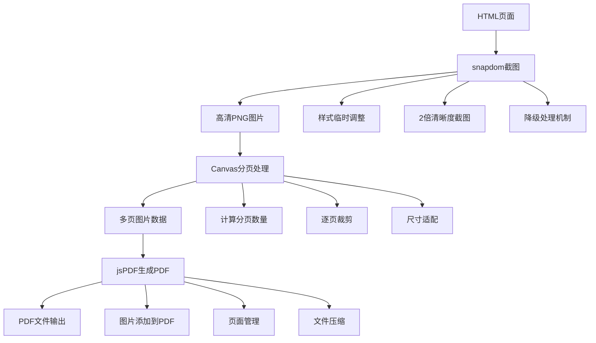

# HTML 页面转换 PDF 技术方案

## 简介

本文深入讲解如何使用 snapdom 和 jsPDF 实现高质量的 HTML 转 PDF 功能，并通过一个完整的消息列表导出案例，带你掌握这套方案的核心技术。该方案解决了传统 html2canvas + jsPDF 方案在样式还原度和截图质量上的不足。

## 工作原理



## 核心实现

### 1. 技术选型优势

| 技术        | 优势                                                            |
| ----------- | --------------------------------------------------------------- |
| **snapdom** | 高保真截图，完美还原 CSS 样式，包括 flexbox、grid、渐变、阴影等 |
| **jsPDF**   | 纯前端方案，功能丰富，支持多种纸张格式和插件生态                |

### 2. 核心流程

整个导出过程分为 4 个步骤：

1. **DOM 截图**：使用 snapdom 将 HTML 元素转换为高清 PNG 图片
2. **图片分页**：将长图片按照 A4 页面高度进行分割
3. **生成 PDF**：使用 jsPDF 将分页图片添加到 PDF 文档
4. **文件输出**：保存或下载生成的 PDF 文件

### 3. DOM 截图实现 (snapdom)

```typescript
import { snapdom } from '@zumer/snapdom';

// 图片质量配置
const IMAGE_QUALITY = 0.95;
const IMAGE_FORMAT = 'image/png' as const;

/**
 * 将 DOM 元素转换为图片
 */
export async function captureElementToImage(
	element: HTMLElement,
	quality: number = IMAGE_QUALITY
): Promise<string> {
	console.log('开始截图...');

	// 保存原始样式
	const originalOverflow = element.style.overflow;
	const originalHeight = element.style.height;
	const originalMaxHeight = element.style.maxHeight;

	// 临时设置样式，确保完整截图
	element.style.overflow = 'visible';
	element.style.height = 'auto';
	element.style.maxHeight = 'none';

	try {
		// 核心：使用 snapdom 进行截图
		const capture = await snapdom(element, {
			scale: 2, // 2倍清晰度
			quality: quality
		});

		// 优先使用 toPng()
		const imgElement = await capture.toPng();
		const dataUrl = imgElement.src;

		// 验证数据有效性
		if (!dataUrl || dataUrl.length < 100) {
			console.log('toPng 返回无效，尝试 toCanvas...');
			const canvas = await capture.toCanvas();
			return canvas.toDataURL(IMAGE_FORMAT, quality);
		}

		console.log('截图成功，大小:', (dataUrl.length / 1024).toFixed(2), 'KB');
		return dataUrl;
	} finally {
		// 恢复原始样式
		element.style.overflow = originalOverflow;
		element.style.height = originalHeight;
		element.style.maxHeight = originalMaxHeight;
	}
}
```

### 4. 图片分页实现 (Canvas)

```typescript
// 尺寸常量
const A4_WIDTH_MM = 210;
const A4_HEIGHT_MM = 297;
const PDF_MARGIN_MM = 10;
const PDF_CONTENT_WIDTH_MM = A4_WIDTH_MM - PDF_MARGIN_MM * 2; // 190mm
const PDF_CONTENT_HEIGHT_MM = A4_HEIGHT_MM - PDF_MARGIN_MM * 2; // 277mm

// 1mm = 3.7795275590551 像素（96 DPI）
const MM_TO_PX = 3.7795275590551;

// 分页后的图片数据
interface PageImageData {
	dataUrl: string;
	width: number;
	height: number;
}

/**
 * 将长图片分割成多个 A4 页面
 */
export async function splitImageIntoPages(imageDataUrl: string): Promise<PageImageData[]> {
	return new Promise((resolve, reject) => {
		const img = new Image();
		img.crossOrigin = 'anonymous';

		img.onload = () => {
			const pages: PageImageData[] = [];
			const originalWidth = img.width;
			const originalHeight = img.height;

			// 将 A4 内容区域转换为像素（考虑 scale=2）
			const pageContentHeightPx = Math.floor(
				PDF_CONTENT_HEIGHT_MM * MM_TO_PX * 2 // scale=2
			);
			const pageContentWidthPx = Math.floor(PDF_CONTENT_WIDTH_MM * MM_TO_PX * 2);

			// 计算缩放比例（图片宽度适配页面宽度）
			const widthScale = pageContentWidthPx / originalWidth;
			const scaledHeight = originalHeight * widthScale;

			// 计算总页数
			const totalPages = Math.ceil(scaledHeight / pageContentHeightPx);

			console.log(`原始尺寸: ${originalWidth}x${originalHeight}px`);
			console.log(`缩放后高度: ${scaledHeight}px, 总页数: ${totalPages}`);

			// 逐页裁剪
			for (let pageIndex = 0; pageIndex < totalPages; pageIndex++) {
				const startY = pageIndex * pageContentHeightPx;
				const endY = Math.min(startY + pageContentHeightPx, scaledHeight);
				const currentPageHeight = Math.floor(endY - startY);

				// 计算源图片对应的区域
				const sourceStartY = startY / widthScale;
				const sourceHeight = currentPageHeight / widthScale;

				// 创建新 Canvas
				const canvas = document.createElement('canvas');
				const ctx = canvas.getContext('2d')!;

				canvas.width = pageContentWidthPx;
				canvas.height = currentPageHeight;

				// 高质量渲染
				ctx.imageSmoothingEnabled = true;
				ctx.imageSmoothingQuality = 'high';

				// 绘制当前页内容
				ctx.drawImage(
					img,
					0,
					sourceStartY, // 源图片起始位置
					originalWidth,
					sourceHeight, // 源图片尺寸
					0,
					0, // 目标起始位置
					pageContentWidthPx,
					currentPageHeight // 目标尺寸
				);

				// 转换为 data URL
				const pageDataUrl = canvas.toDataURL(IMAGE_FORMAT, IMAGE_QUALITY);

				pages.push({
					dataUrl: pageDataUrl,
					width: pageContentWidthPx,
					height: currentPageHeight
				});

				console.log(`第 ${pageIndex + 1}/${totalPages} 页处理完成`);
			}

			resolve(pages);
		};

		img.onerror = () => reject(new Error('图片加载失败'));
		img.src = imageDataUrl;
	});
}
```

### 5. PDF 生成实现 (jsPDF)

```typescript
import { jsPDF } from 'jspdf';

/**
 * 将分页图片数据转换为 PDF
 */
export async function convertPagesToPDF(
	pages: PageImageData[],
	filename: string = 'export.pdf'
): Promise<void> {
	if (pages.length === 0) {
		throw new Error('没有可导出的页面数据');
	}

	// 创建 PDF 实例
	const pdf = new jsPDF({
		orientation: 'portrait',
		unit: 'mm',
		format: 'a4',
		compress: true
	});

	// A4 尺寸常量
	const A4_WIDTH_MM = 210;
	const A4_HEIGHT_MM = 297;
	const MARGIN_MM = 10;
	const CONTENT_WIDTH_MM = 190;
	const CONTENT_HEIGHT_MM = 277;

	// 添加第一页（已创建）
	const firstPage = pages[0];
	pdf.addImage(firstPage.dataUrl, 'PNG', MARGIN_MM, MARGIN_MM, CONTENT_WIDTH_MM, CONTENT_HEIGHT_MM);

	// 添加后续页面
	for (let i = 1; i < pages.length; i++) {
		const page = pages[i];

		// 添加新页面
		pdf.addPage();

		// 添加图片
		pdf.addImage(page.dataUrl, 'PNG', MARGIN_MM, MARGIN_MM, CONTENT_WIDTH_MM, CONTENT_HEIGHT_MM);
	}

	// 保存文件
	pdf.save(filename);
}
```

## 自定义参数配置

### 1. 图片质量参数

```typescript
interface ImageQualityConfig {
	scale: number; // 截图缩放倍数 (推荐 2)
	quality: number; // 图片质量 (0-1, 推荐 0.95)
	format: 'image/png' | 'image/jpeg'; // 图片格式
}
```

### 2. PDF 页面参数

```typescript
interface PDFConfig {
	orientation: 'portrait' | 'landscape'; // 页面方向
	unit: 'mm' | 'pt' | 'cm' | 'in'; // 单位
	format: 'a4' | 'a3' | 'letter'; // 纸张格式
	margin: number; // 边距(mm)
	compress: boolean; // 是否压缩
}
```

### 3. 分页参数

```typescript
interface PaginationConfig {
	contentWidth: number; // 内容宽度(mm)
	contentHeight: number; // 内容高度(mm)
	autoScale: boolean; // 是否自动缩放适配
}
```

## 应用场景

1. **客服系统**：导出聊天记录用于存档或投诉处理
2. **电商平台**：生成订单详情、发票等 PDF 文档
3. **报表系统**：将可视化图表和数据导出为 PDF 报告
4. **在线文档**：支持用户将网页内容离线保存
5. **合同签署**：生成合同 PDF 用于电子签名

## 技术优势对比

| 方案                | 样式还原 | 分页处理 | 清晰度 | 性能  | 兼容性 |
| ------------------- | -------- | -------- | ------ | ----- | ------ |
| **snapdom + jsPDF** | ★★★★★    | ★★★★★    | ★★★★★  | ★★★★☆ | ★★★★☆  |
| html2canvas + jsPDF | ★★★☆☆    | ★★★☆☆    | ★★★☆☆  | ★★★☆☆ | ★★★☆☆  |
| 服务端方案          | ★★★★★    | ★★★★★    | ★★★★★  | ★★★★★ | ★★★★★  |

## 最佳实践

### 1. 性能优化建议

- 对于大量内容，建议分批处理避免阻塞主线程
- 合理设置 scale 参数平衡清晰度和性能
- 使用 Web Worker 处理图片分页计算

### 2. 兼容性处理

- 检测浏览器是否支持所需 API
- 提供降级方案（如服务端渲染）
- 处理跨域图片加载问题

### 3. 用户体验优化

- 提供进度提示和加载状态
- 支持取消操作
- 提供导出预览功能

## 故障排除

### 1. 图片加载失败

**问题**：截图返回空白或无效图片
**解决方案**：

- 检查元素是否正确渲染
- 确认样式临时调整是否生效
- 验证 snapdom 版本兼容性

### 2. PDF 内容被截断

**问题**：PDF 页面内容显示不完整
**解决方案**：

- 检查分页计算逻辑
- 验证尺寸转换是否正确
- 调整页面边距参数

### 3. 导出文件过大

**问题**：生成的 PDF 文件体积过大
**解决方案**：

- 降低图片 quality 参数
- 调整 scale 参数（如使用 1.5 而非 2）
- 启用 PDF 压缩选项

## 总结

本文介绍的 snapdom + jsPDF 方案通过以下创新点解决了传统 HTML 转 PDF 的核心问题：

1. **高保真还原**：snapdom 完美还原 CSS 样式，包括现代布局特性
2. **智能分页**：基于 Canvas 的精确分页算法避免内容截断
3. **高清输出**：2 倍缩放确保打印质量
4. **纯前端实现**：无需服务端支持，降低部署复杂度
5. **容错机制**：完善的降级处理和错误恢复

该方案已在实际项目中验证，能够稳定处理各种复杂 HTML 内容的 PDF 导出需求。
