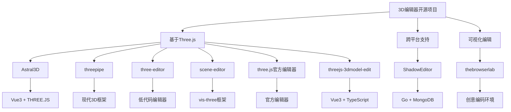

# 经典 3D 编辑器开源项目

## 简介

一些经典的 3D 编辑器开源项目，这些项目基于 Three.js 等 WebGL 技术构建

## 项目概览



## 详细项目介绍

### 1. Astral3D

**描述**：基于 Vue3 + THREE.JS 免费开源的三维引擎及配套编辑器，包含 BIM 轻量化、CAD 解析预览、粒子系统、插件系统等功能。

**特点**：

- 强大的 3D 场景内容元素的编辑和保存功能
- 丰富多样的 3D 元素内容
- 支持 BIM 和 CAD 等工业建模文件的加载渲染

**技术栈**：

- 前端框架：Vue3
- 3D 引擎：Three.js
- 协议：Apache-2.0 license

**自定义参数**：

```javascript
// Astral3D配置参数示例
const astral3DConfig = {
	bim: {
		enable: true,
		lightweight: true,
		format: ['rvt', 'ifc', 'dwg']
	},
	cad: {
		parser: 'internal',
		preview: true
	},
	particle: {
		system: 'custom',
		maxCount: 10000
	},
	plugin: {
		enable: true,
		autoLoad: true
	}
};
```

**注意事项**：

- 项目可用于个人学习
- 商用需要向作者申请授权

**链接**：
**在线地址**：[editor.astraljs.com](https://editor.astraljs.com)

**Github**: [Astral3D](https://github.com/mlt131220/Astral3D)

### 2. thebrowserlab

**描述**：一个「运行在浏览器里的 3D 编辑器 + 创意编码 (creative-coding) 环境」

**特点**：

- 支持加载视频、文本、图片、粒子等内容
- 提供丰富的编辑表单参数可视化编辑配置
- 支持在线代码的脚本内容写入设置 3D 场景内容

**技术栈**：

- 协议：MIT license
- 支持自由 fork、修改、商用

**自定义参数**：

```javascript
// thebrowserlab配置参数示例
const browserLabConfig = {
	media: {
		video: true,
		text: true,
		image: true,
		particle: true
	},
	editor: {
		visual: true,
		code: true,
		livePreview: true
	},
	scripting: {
		language: 'javascript',
		sandbox: true
	}
};
```

**链接**：

**在线地址**：[thebrowserlab.com/](https://thebrowserlab.com/)

**Github**: [thebrowserlab](https://github.com/icurtis1/thebrowserlab)

### 3. threepipe

**描述**：一个基于 Three.js 构建的现代 3D 框架

**特点**：

- 基于 Three.js 进行二次封装
- 适合从简单 3D 模型预览到复杂交互/渲染应用
- 通过简单 API 快速创建复杂的 3D 模型预览器和编辑器

**技术栈**：

- 3D 引擎：Three.js
- 协议：Apache-2.0 协议

**自定义参数**：

```javascript
// threepipe配置参数示例
const threepipeConfig = {
	rendering: {
		quality: 'high',
		antialias: true,
		shadows: true
	},
	interaction: {
		controls: ['orbit', 'transform'],
		picking: true
	},
	plugins: {
		loader: ['gltf', 'obj', 'fbx'],
		exporter: ['gltf', 'obj']
	}
};
```

**注意事项**：

- 学习成本较高
- 商用可能需要授权

**链接**：

**在线地址**：[editor.threepipe.org/](https://editor.threepipe.org/)

**Github**: [repalash](https://github.com/repalash/threepipe)

###

### 4. ShadowEditor

**描述**：基于 Three.js、Go 语言和 MongoDB 的跨平台的 3D 场景编辑器，支持桌面版和 Web 版。

**特点**：

- 跨平台支持 Windows / Linux / Mac
- 支持桌面版和 Web 版
- 前后端一体的项目

**技术栈**：

- 前端：Three.js
- 后端：Go 语言
- 数据库：MongoDB
- 协议：MIT 许可证

**自定义参数**：

```javascript
// ShadowEditor配置参数示例
const shadowEditorConfig = {
	platform: {
		desktop: true,
		web: true,
		mobile: false
	},
	backend: {
		language: 'go',
		database: 'mongodb',
		api: 'rest'
	},
	frontend: {
		framework: 'vanilla',
		version: '107'
	}
};
```

**注意事项**：

- three.js 版本较老（107 版本）
- 作者也推出了商业版

**链接**：

**在线地址**：[https://www.hylab.cn/shadoweditor/](https://www.hylab.cn/shadoweditor/)

**Github**: [tengge1](https://gitee.com/tengge1/ShadowEditor)

###

### 5. three-editor

**描述**：一个基于 Three.js 的 可视化 / 低代码 3D 编辑器 / 内核／框架。目标是降低使用 Three.js 的门槛，让构建 Web 3D 场景更简单、更迅速

**特点**：

- 提供"可视化 + 配置 + 编辑 + 渲染"能力
- 降低 Three.js 使用门槛
- 快速构建 3D 场景/项目

**技术栈**：

- 3D 引擎：Three.js
- 类型：可视化/低代码编辑器

**自定义参数**：

```javascript
// three-editor配置参数示例
const threeEditorConfig = {
	visualization: {
		dragAndDrop: true,
		propertyPanel: true,
		timeline: true
	},
	lowCode: {
		template: ['model', 'scene', 'animation'],
		component: ['light', 'camera', 'object']
	},
	export: {
		format: ['json', 'gltf', 'obj'],
		autoSave: true
	}
};
```

**注意事项**：

- 可编辑参数配置较少
- 自定义需求多时需谨慎考虑

**链接**：

**在线地址**：[threejs-editor](https://z2586300277.github.io/threejs-editor/)

**Github**: [github.com/z2586300277/three-editor](https://github.com/z2586300277/three-editor)

###

### 6. scene-editor

**描述**：vis-three/scene-editor 是基于 vis-three 框架构建的，vis-three 本身是一个封装自 Three.js 的前端 3D 开发框架，用于简化 Web3D 开发

**特点**：

- 基于 vis-three 衍生开发的 3D 编辑器
- 提供完整的 Web 3D 场景编辑功能
- 即使对 3D 或 Three.js 不熟也能轻松编辑 3D 场景

**技术栈**：

- 基础框架：vis-three（封装自 Three.js）
- 编译：Vue3 项目编译打包后

**自定义参数**：

```javascript
// scene-editor配置参数示例
const sceneEditorConfig = {
	framework: {
		base: 'vis-three',
		wrapper: 'vue3'
	},
	editor: {
		drag: true,
		property: true,
		hierarchy: true
	},
	source: {
		available: false, // 源代码不可用
		compiled: true
	}
};
```

**注意事项**：

- 仓库代码是 Vue3 项目编译打包后的
- 无源代码，二次开发困难

**链接**：

**在线地址**：[z2586300277.github.io/threejs-edi…](https://z2586300277.github.io/threejs-editor/)

**Github**: [github.com/Shiotsukikaedesari/vis-three](https://github.com/Shiotsukikaedesari/vis-three)

**Gitee**:[gitee.com/vis-three/s…](https://gitee.com/vis-three/scene-editor)

###

### 7. three.js 官方编辑器

**描述**：Three.js（著名的 WebGL / Web 3D 渲染库）自带 / 官方提供的可视化编辑器

**特点**：

- 3D 编辑器的鼻祖
- 唯一能和 three.js 最新版本保持随时同步的编辑器
- 很多商业项目和开源项目功能都参考了此项目

**技术栈**：

- 实现：原生 JavaScript
- 3D 引擎：Three.js

**自定义参数**：

```javascript
// three.js官方编辑器配置参数示例
const threeJSEditorConfig = {
	core: {
		version: 'latest',
		sync: true
	},
	features: {
		geometry: true,
		material: true,
		light: true,
		camera: true
	},
	export: {
		format: ['json', 'glb', 'gltf'],
		code: true
	}
};
```

**注意事项**：

- 使用原生 js 实现
- 二次开发和扩展功能成本较大

**链接**：

**在线地址**：[threejs.org/editor/](https://threejs.org/editor/)

**Github**: [github.com/mrdoob/thre…](https://github.com/mrdoob/three.js/tree/master/editor)

###

### 8. threejs-3dmodel-edit

**描述**：一个基于 Three.js + Vue 3 + TypeScript + Pinia 的前端 3D 模型编辑器 / 可视化编辑平台

**特点**：

- 完整、现代、易用的 Web-based 3D 模型编辑器
- 把 Three.js 功能通过 Vue/TS/Pinia 封装
- 让非专业 3D 建模背景的人也能容易地加载/编辑/导出/展示 3D 模型
- 基于企业级项目代码开发标准规范

**技术栈**：

- 前端框架：Vue 3
- 语言：TypeScript
- 状态管理：Pinia
- 3D 引擎：Three.js

**自定义参数**：

```javascript
// threejs-3dmodel-edit配置参数示例
const modelEditConfig = {
	framework: {
		vue: '3',
		typescript: true,
		pinia: true
	},
	model: {
		format: ['gltf', 'glb', 'obj', 'fbx'],
		operation: ['load', 'edit', 'export', 'preview']
	},
	enterprise: {
		standard: true,
		scalable: true
	}
};
```

**链接**：

**在线地址**：[threeflowx.cn/open/#/](https://threeflowx.cn/open/#/)

**Github**: [github.com/zhangbo126/…](https://github.com/zhangbo126/threejs-3dmodel-edit)

**Gitee**:[gitee.com/ZHANG_6666/…](https://gitee.com/ZHANG_6666/Three.js3D)

##

## 技术对比

| 项目                 | 技术栈                  | 协议       | 特点         | 适用场景 |
| -------------------- | ----------------------- | ---------- | ------------ | -------- |
| Astral3D             | Vue3 + Three.js         | Apache-2.0 | BIM/CAD 支持 | 工业建模 |
| thebrowserlab        | Three.js                | MIT        | 创意编码     | 艺术创作 |
| threepipe            | Three.js                | Apache-2.0 | 现代框架     | 复杂应用 |
| ShadowEditor         | Three.js + Go + MongoDB | MIT        | 跨平台       | 全栈开发 |
| three-editor         | Three.js                | 未明确     | 低代码       | 快速开发 |
| scene-editor         | vis-three               | 未明确     | 可视化编辑   | 入门学习 |
| three.js 官方编辑器  | Three.js                | MIT        | 官方支持     | 标准参考 |
| threejs-3dmodel-edit | Vue3 + TS + Pinia       | 未明确     | 企业级       | 项目开发 |

## 选择建议

### 1. 学习入门

- **推荐**：scene-editor、three-editor
- **理由**：可视化操作，降低学习门槛

### 2. 工业应用

- **推荐**：Astral3D、ShadowEditor
- **理由**：支持 BIM/CAD 等工业格式

### 3. 创意编程

- **推荐**：thebrowserlab
- **理由**：支持创意编码和脚本编写

### 4. 企业项目

- **推荐**：threejs-3dmodel-edit、threepipe
- **理由**：现代化技术栈，企业级规范

### 5. 标准参考

- **推荐**：three.js 官方编辑器
- **理由**：与 Three.js 版本同步，功能标准

## 最佳实践

### 1. 技术选型

- 根据项目需求选择合适的技术栈
- 考虑团队技术背景和学习成本
- 评估项目长期维护需求

### 2. 二次开发

- 优先选择 MIT 协议项目
- 关注项目活跃度和社区支持
- 考虑项目的可扩展性

### 3. 商用考虑

- 注意各项目的许可证协议
- 商用前确认授权要求
- 考虑技术支持和维护成本
