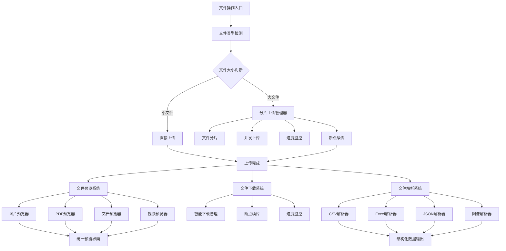
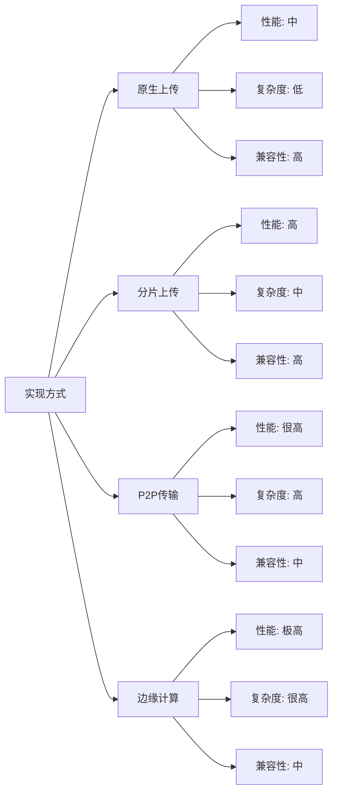

# 前端文件"全家桶"：企业级文件管理系统完整解决方案

## 简介

在现代企业级应用中，文件操作是最高频、最复杂的场景之一。从简单的图片上传到TB级大文件传输，从多格式在线预览到智能数据解析，每一个环节都面临着性能、体验和稳定性的挑战。本文将为你构建一个完整的前端文件处理体系，解决从上传到解析的全链路问题。

## 技术特点

### 核心功能特性

- **智能分片上传**: 支持大文件分片上传，自动断点续传
- **多格式预览**: 支持图片、PDF、文档、视频等多种格式在线预览
- **高效下载**: 支持断点续传、并发下载、进度监控
- **智能解析**: 自动识别文件类型，提取结构化数据
- **性能优化**: 内存管理、缓存策略、并发控制

### 技术优势

- **模块化设计**: 可插拔的组件架构，易于扩展和维护
- **类型安全**: 完整的TypeScript类型定义
- **错误处理**: 完善的异常处理和用户提示机制
- **安全防护**: 文件类型验证、大小限制、恶意文件检测

## 系统架构



## 核心实现原理

### 文件类型管理系统

**核心思路**：

- 建立完整的文件类型分类体系
- 为不同类型文件制定专门的处理策略
- 支持自定义文件类型扩展和配置

**技术优势**：

- 类型安全的文件处理流程
- 灵活的配置和扩展机制
- 统一的错误处理和用户反馈

**适用场景**：

- 企业文档管理系统
- 在线协作平台
- 内容管理系统
- 数据分析平台

### 高级文件类型管理器

```typescript
interface FileTypeConfig {
  extensions: string[];
  maxSize: string;
  preview: 'browser_native' | 'third_party_lib' | 'custom_renderer';
  parsing: 'full_content' | 'metadata_only' | 'structured_data';
  security: {
    allowExecutable: boolean;
    scanForMalware: boolean;
    contentValidation: boolean;
  };
  performance: {
    enableCache: boolean;
    compressionLevel: number;
    chunkSize: number;
  };
}

class AdvancedFileTypeManager {
  private fileCategories: Map<string, FileTypeConfig>;
  private customValidators: Map<string, (file: File) => boolean>;
  
  constructor(config: Partial<FileTypeConfig> = {}) {
    this.fileCategories = new Map();
    this.customValidators = new Map();
    this.initializeDefaultCategories();
  }

  // 注册自定义文件类型
  registerFileType(category: string, config: FileTypeConfig) {
    this.fileCategories.set(category, config);
  }

  // 注册自定义验证器
  registerValidator(category: string, validator: (file: File) => boolean) {
    this.customValidators.set(category, validator);
  }

  // 智能文件类型检测
  detectFileType(file: File): string {
    const extension = this.getFileExtension(file.name).toLowerCase();
    const mimeType = file.type;
    
    // 基于扩展名检测
    for (const [category, config] of this.fileCategories) {
      if (config.extensions.includes(extension)) {
        return category;
      }
    }
    
    // 基于MIME类型检测
    return this.detectByMimeType(mimeType);
  }

  // 验证文件安全性
  validateFileSecurity(file: File, category: string): ValidationResult {
    const config = this.fileCategories.get(category);
    if (!config) {
      return { valid: false, error: '未知文件类型' };
    }

    // 文件大小验证
    const maxSize = this.parseSizeLimit(config.maxSize);
    if (file.size > maxSize) {
      return { 
        valid: false, 
        error: `文件过大，最大支持 ${config.maxSize}` 
      };
    }

    // 可执行文件检查
    if (!config.security.allowExecutable && this.isExecutableFile(file)) {
      return { 
        valid: false, 
        error: '不允许上传可执行文件' 
      };
    }

    // 自定义验证器
    const customValidator = this.customValidators.get(category);
    if (customValidator && !customValidator(file)) {
      return { 
        valid: false, 
        error: '文件未通过自定义验证' 
      };
    }

    return { valid: true };
  }

  // 获取文件处理配置
  getProcessingConfig(category: string): FileTypeConfig | null {
    return this.fileCategories.get(category) || null;
  }
}
```

### 企业级分片上传管理器

```typescript
interface UploadConfig {
  chunkSize: number;
  maxConcurrency: number;
  retryCount: number;
  enableChecksum: boolean;
  enableCompression: boolean;
  securityValidation: boolean;
  progressCallback?: (progress: UploadProgress) => void;
  errorCallback?: (error: UploadError) => void;
}

class EnterpriseFileUploader {
  private config: UploadConfig;
  private uploadTasks: Map<string, UploadTask>;
  private securityScanner: SecurityScanner;
  private compressionWorker: CompressionWorker;

  constructor(config: Partial<UploadConfig> = {}) {
    this.config = {
      chunkSize: 5 * 1024 * 1024, // 5MB
      maxConcurrency: 3,
      retryCount: 3,
      enableChecksum: true,
      enableCompression: false,
      securityValidation: true,
      ...config
    };
    
    this.uploadTasks = new Map();
    this.securityScanner = new SecurityScanner();
    this.compressionWorker = new CompressionWorker();
  }

  // 添加文件到上传队列
  async addFile(file: File, options: UploadOptions = {}): Promise<string> {
    const taskId = this.generateTaskId(file);
    
    // 安全验证
    if (this.config.securityValidation) {
      const securityResult = await this.securityScanner.scan(file);
      if (!securityResult.safe) {
        throw new Error(`安全检查失败: ${securityResult.reason}`);
      }
    }

    // 文件压缩（可选）
    let processedFile = file;
    if (this.config.enableCompression && this.shouldCompress(file)) {
      processedFile = await this.compressionWorker.compress(file);
    }

    const task: UploadTask = {
      id: taskId,
      file: processedFile,
      originalFile: file,
      status: 'pending',
      chunks: this.createChunks(processedFile),
      progress: 0,
      uploadedBytes: 0,
      startTime: null,
      options
    };

    this.uploadTasks.set(taskId, task);
    this.startUpload(taskId);
    
    return taskId;
  }

  // 智能重试机制
  private async retryChunk(task: UploadTask, chunkIndex: number): Promise<void> {
    const chunk = task.chunks[chunkIndex];
    
    if (chunk.retryCount >= this.config.retryCount) {
      throw new Error(`分片 ${chunkIndex} 重试次数超限`);
    }

    // 指数退避策略
    const delay = Math.pow(2, chunk.retryCount) * 1000;
    await new Promise(resolve => setTimeout(resolve, delay));
    
    chunk.retryCount++;
    return this.uploadChunk(task, chunkIndex);
  }

  // 网络状态自适应
  private adaptToNetworkCondition(): void {
    const connection = (navigator as any).connection;
    if (connection) {
      const { effectiveType, downlink } = connection;
      
      // 根据网络状况调整并发数和分片大小
      if (effectiveType === 'slow-2g' || downlink < 0.5) {
        this.config.maxConcurrency = 1;
        this.config.chunkSize = 1 * 1024 * 1024; // 1MB
      } else if (effectiveType === '4g' && downlink > 10) {
        this.config.maxConcurrency = 5;
        this.config.chunkSize = 10 * 1024 * 1024; // 10MB
      }
    }
  }
}
```

## 实现方案对比

| 方案 | 优点 | 缺点 | 适用场景 | 性能评级 |
|------|------|------|----------|----------|
| **原生FormData** | 简单易用，兼容性好 | 功能有限，无法断点续传 | 小文件上传 | ⭐⭐⭐ |
| **分片上传** | 支持大文件，可断点续传 | 实现复杂，服务端配合 | 大文件上传 | ⭐⭐⭐⭐⭐ |
| **WebRTC传输** | P2P传输，减轻服务器压力 | 兼容性问题，NAT穿透 | 内网文件传输 | ⭐⭐⭐⭐ |
| **WebAssembly** | 高性能处理，接近原生 | 开发复杂度高，包体积大 | 复杂文件处理 | ⭐⭐⭐⭐⭐ |

## 高级功能

### 功能 1：智能文件压缩

```typescript
class SmartFileCompressor {
  private compressionStrategies: Map<string, CompressionStrategy>;

  constructor() {
    this.compressionStrategies = new Map([
      ['image', new ImageCompressionStrategy()],
      ['document', new DocumentCompressionStrategy()],
      ['video', new VideoCompressionStrategy()]
    ]);
  }

  async compress(file: File, options: CompressionOptions = {}): Promise<File> {
    const fileType = this.detectFileType(file);
    const strategy = this.compressionStrategies.get(fileType);
    
    if (!strategy) {
      return file; // 不支持压缩的文件类型直接返回
    }

    const compressionLevel = this.calculateOptimalCompression(file, options);
    return await strategy.compress(file, compressionLevel);
  }

  private calculateOptimalCompression(file: File, options: CompressionOptions): number {
    // 基于文件大小、网络状况、用户偏好计算最优压缩级别
    const networkSpeed = this.getNetworkSpeed();
    const fileSize = file.size;
    
    if (networkSpeed < 1 && fileSize > 10 * 1024 * 1024) {
      return 0.6; // 低网速大文件，高压缩比
    } else if (networkSpeed > 10) {
      return 0.9; // 高网速，保持质量
    }
    
    return 0.8; // 默认压缩比
  }
}
```

### 功能 2：实时协作文件编辑

```typescript
class CollaborativeFileEditor {
  private websocket: WebSocket;
  private operationalTransform: OperationalTransform;
  private conflictResolver: ConflictResolver;

  constructor(fileId: string, userId: string) {
    this.websocket = new WebSocket(`ws://api.example.com/collaborate/${fileId}`);
    this.operationalTransform = new OperationalTransform();
    this.conflictResolver = new ConflictResolver();
    
    this.setupCollaboration();
  }

  // 发送编辑操作
  sendOperation(operation: EditOperation): void {
    const transformedOp = this.operationalTransform.transform(operation);
    this.websocket.send(JSON.stringify({
      type: 'operation',
      operation: transformedOp,
      timestamp: Date.now()
    }));
  }

  // 处理远程操作
  private handleRemoteOperation(operation: EditOperation): void {
    const resolvedOp = this.conflictResolver.resolve(operation);
    this.applyOperation(resolvedOp);
    this.updateUI(resolvedOp);
  }

  // 冲突解决策略
  private resolveConflict(localOp: EditOperation, remoteOp: EditOperation): EditOperation {
    // 基于时间戳和用户优先级的冲突解决
    if (localOp.timestamp < remoteOp.timestamp) {
      return this.operationalTransform.transform(localOp, remoteOp);
    }
    return localOp;
  }
}
```

### 功能 3：AI驱动的文件内容分析

```typescript
class AIFileAnalyzer {
  private mlModel: MLModel;
  private textExtractor: TextExtractor;
  private imageAnalyzer: ImageAnalyzer;

  constructor() {
    this.mlModel = new MLModel();
    this.textExtractor = new TextExtractor();
    this.imageAnalyzer = new ImageAnalyzer();
  }

  async analyzeFile(file: File): Promise<FileAnalysisResult> {
    const fileType = this.detectFileType(file);
    
    switch (fileType) {
      case 'image':
        return await this.analyzeImage(file);
      case 'document':
        return await this.analyzeDocument(file);
      case 'video':
        return await this.analyzeVideo(file);
      default:
        return await this.analyzeGeneric(file);
    }
  }

  private async analyzeImage(file: File): Promise<ImageAnalysisResult> {
    const imageData = await this.imageAnalyzer.extractFeatures(file);
    
    return {
      type: 'image',
      objects: await this.mlModel.detectObjects(imageData),
      text: await this.mlModel.extractText(imageData),
      sentiment: await this.mlModel.analyzeSentiment(imageData),
      tags: await this.mlModel.generateTags(imageData),
      quality: this.imageAnalyzer.assessQuality(imageData)
    };
  }

  private async analyzeDocument(file: File): Promise<DocumentAnalysisResult> {
    const text = await this.textExtractor.extract(file);
    
    return {
      type: 'document',
      summary: await this.mlModel.generateSummary(text),
      keywords: await this.mlModel.extractKeywords(text),
      sentiment: await this.mlModel.analyzeSentiment(text),
      language: await this.mlModel.detectLanguage(text),
      entities: await this.mlModel.extractEntities(text),
      readabilityScore: this.calculateReadability(text)
    };
  }
}
```

## 响应式设计

### 移动端优化策略

```typescript
class MobileFileManager {
  private touchHandler: TouchHandler;
  private gestureRecognizer: GestureRecognizer;
  private adaptiveUI: AdaptiveUI;

  constructor() {
    this.touchHandler = new TouchHandler();
    this.gestureRecognizer = new GestureRecognizer();
    this.adaptiveUI = new AdaptiveUI();
    
    this.sbileOptimizations();
  }

  private setupMobileOptimizations(): void {
    // 触摸手势支持
    this.gestureRecognizer.on('pinch', thishZoom.bind(this));
    this.gestureRecognizer.on('swipe', this.handleSwipeNavigation.bind(this));
    this.gestureR('longpress', this.handleContextMenu.bind(this));

    // 自适应UI
    this.adaptiveUI.on('orientationchange', thandleOrientationChange.bind(this));
    this.adaptiveUI.on('resize', this.handleViewportResize.bind(this));

    // 性能优化
    this.enrtualScrolling();
    this.enableLazyLoading();
    this.optimizeForLowMemory();
  }

  private handlePinchZoom(event: PinchEve: void {
    if (this.currentPreview?.type === 'image') {
      const scale = Math.max(0.5, Math.min(3, event.scale));
      this.currentPreview.setScale(scale);
    }
  }

  private enableVirtualScrolling(): void {
    // 虚拟滚动优化大量文件列表性能
    const virtualScroller =ew VirtualScroller({
      itemHeight: 60,
      bufferSize: 10,
      renderItem: this.renderFileItem.bind(this)
    });
    
    this.fileList.setVirtualScroller(virtualScroller);
  }
}
```

## 性能优化

### 1. 内存管理优化

```typescript
clmoryManager {
  private memoryPool: ObjectPool<ArrayBuffer>;
  private gcScheduler: GCScheduler;
  private memoryMonitor: MemoryMonitor;

  consor() {
    this.memoryPool = new ObjectPool(() => nerayBuffer(1024 * 1024));
    this.gcScheduler = new GCScheduler();
    this.memoryMonitor = new MemoryMonitor();
    
    this.setupMemoryOptimization();
  }

vate setupMemoryOptimization(): void {
    // 监控内存使用
    this.memoryMonitor.on('high-usage', this.hMemoryUsage.bind(this));
    this.memoryMonitor.on('low-memory', this.handleLowMemory.bind(this));

    // 定期垃圾回收
    this.gcScheduler.schedule(() => {
      this.cleanupUnusedResources();
      this.compactMemoryPool();
    }, 30000); //n  private handleHighMemoryUsage(): void {
    // 清理缓存
    this.clearPreviewCache();
    this.clearThumbnailCache();
    
    // 降低并发数
    this.reduceMaxConcurrency();
    
    // 强制垃圾回收
    this.forceGarbageCollection();
  }

  allocateBuffer(size: number): Buffer {
    if (size <= 1024 * 1024) {
      return this.memoryPool.acquire();
    }
    return new ArrayBuffer(siz;
  }

  releaseBuffer(buffer: ArrayBuffer): void {
    if (buffer.byteLength === 1024 * 1024) {
      this.memoryPool.release(buffer);
    }
  }
}
```

### 2. 网络优化策略

```typescript
class NetworkOptimizer {
  private connectionMonitor: ConnectionMonitor;
  private ree: PriorityQueue<NetworkRequest>;
  private cacheManager: CacheManager;

  constructor() {
    this.connectionMonitor = new Connec();
    this.requestQueue = new PriorityQueue();
    this.cacheManager = new Cacheer();
    
    this.setupNetworkOptimization();
  }

  private setupNetworkOptimization(): void {
    // 网络状态监控
    this.connectionMonitor.on('online', this.handleOnline.bind(this));
    this.connectionor.on('offline', this.handleOffline.bind(this));
    this.connectionMonitor.on('slow', this.handleSlowConnection.bind(this));

    //理
    this.requestQueue.setPriorityFunction(this.calculateRequestPriority.bind(this));
  }

  private calculateRequestPriority(requworkRequest): number {
    // 基于请求类型、用户交互、文件大小等因素计算优先级
    let priority = 0;
    
    if (request.type === 'preview') priity += 100;
    if (request.userInitiated) priority += 50;
    if (request.fileSize < 1024 * 1024) priority += 25;
    
    retury;
  }

  private handleSlowConnection(): void {
    // 降低图片质量
    this.reduceImageQuality();
    
    /
    this.enableAggressiveCompression();
    
    // 减少并发请求
    this.reduceConcurrentRequests();
  }
}
```

## 故障排除

### 1. 上传失败诊断

**问题**: 大文件上传频繁失败
**解决方案**:

- 检查网络连接稳定性
- 调整分片大小和重试策略
- 验证服务端超时配置
- 启用详细的错误日志记录

### 2. 预览性**问题**: 大文件预览卡顿或崩溃
**解决方案**:

- 实现渐进式加载
- 使用Web Worker处理计算密集任务
- 启用虚拟化渲染
- 优化内存使用和垃圾回收

### 3. 兼容性问题

**问题**: 某些浏览器功能不可用
**解决方案**:

- 实现功能检测和优雅降级
- 提供Polyfill支持
- 使用渐进增强策略
- 建立完善的兼容性测试体系

## 技术要点

### 1. 现代Web API应用

- 使用File API和Blob API处理文件数据
- 利用Web Work台处理
- 采用Service Worker实现离线支持
- 应用WebAssembly提升性能

### 2. 安全最佳实践

- 客户端文件类型验证
- 服务端安全扫描
- CSP内容安全策略
- 防止XSS和CSRF攻击

### 3. 用户体验优化

- 实时进度反馈
- 智n- 响应式设计
- 无障碍访问支持

## 应用场景

### 1. 企业文档管理

```typescript
// 企业级文档管理系统集成
const documentManager = new EnterpriseFileManager({
  maxFileSize: '100MB',
  allowedTypes: ['pdf', 'doc', 'docx', 'xls', 'ppt', 'pptx'],
  enableVersionControl: true,
  enableCollaboration: true,
  securityLevel: 'enterprise'
});

documentManagload', async (file) => {
  // 自动版本管理
  await documentManager.createVersion(file);
  
  // 内容索引
  await documentManager.indContent(file);
  
  // 权限检查
  await documentManager.validatePermissions(file);
});
```

### 2. 在线教育平台

```typescript
// 教育资源管理
const edunFileManager = new EducationFileManager({
  supportedFormats: ['video', 'audio', 'document', 'interactive'],
  enableTranscodi  enableSubtitles: true,
  adaptiveStreaming: true
});

educationFileManager.on('videoUpload', async (video) => {
  // 自动转码多种格式
  await educationFileManager.transcodeVideo(video);
  
  // 生成缩略图
  await educationFileManager.generateThumbnails(video);
  
  // AI字幕生成
  await educationFileManager.generateSubtitles(video);
});
```

### 3. 数据分析平台

```typescript
// 数据文件处理
const dataAnalyzer = new DataFileAnalyzer({
  supportedFormats: ['csv', 'excel', 'json', 'parquet'],
  enableDataProfiling: true,
  enableSchemaDetection: true,
  maxDataSize: '1GB'
});

dataAnalyzer.on('dataUpload', async (dataFile) => {
  // 数据质量检查
  const quality = await dataAnalyzer.assessDataQuality(dataFile);
  
  // 自动模式检测
  const schema = await dataAnalyzer.detectSchema(dataFile);
  
  // 数据预览生成
  const preview = await dataAnalyzer.generatePreview(dataFile);
});
```

## 性能分析

不同实现方式的性能对比：



## 安全考虑

### 1. 文件安全扫描

```typescript
class SecurityScanner {
  private virusScanner: VirusScanner;
  private contentValidator: ContentValidator;
  private behaviorAnalyzer: BehaviorAnalyzer;

  async scanFile(file: File): Promise<SecurityScanResult> {
    const results = await Promise.all([
      this.virusScanner.scan(file),
      this.contentValidator.validate(file),
      this.behaviorAnalyzer.analyze(file)
    ]);

    return {
      safe: results.every(result => result.safe),
      threats: results.flatMap(result => result.threats),
      recommendations: this.generateRecommendations(results)
    };
  }

  private generateRecommendations(results: ScanResult[]): string[] {
    const recommendations = [];
    
    if (results.some(r => r.suspiciousContent)) {
      recommendations.push('建议在隔离环境中打开文件');
    }
    
    if (results.some(r => r.unknownFormat)) {
      recommendations.push('未知文件格式，建议谨慎处理');
    }
    
    return recommendations;
  }
}
```

### 2. 访问控制

```typescript
class AccessController {
  private permissions: PermissionManager;
  private audit: AuditLogger;

  async validateAccess(user: User, file: File, operation: string): Promise<boolean> {
    // 检查用户权限
    const hasPermission = await this.permissions.check(user, file, operation);
    
    // 记录访问日志
    await this.audit.log({
      user: user.id,
      file: file.name,
      operation,
      timestamp: Date.now(),
      result: hasPermission ? 'allowed' : 'denied'
    });

    return hasPermission;
  }
}
```

## 结语

前端文件操作是一个涉及网络传输、内存管理、格式解析、性能优化的复杂技术领域。通过本文介绍的企业级解决方案，你可以构建出稳定、高效、安全的文件管理系统，无论是简单的图片上传还是复杂的TB级文件处理都能游刃有余。

**关键要点**：
- 模块化设计确保系统的可扩展性和可维护性
- 性能优化策略保证用户体验的流畅性
- 安全防护机制确保数据和系统的安全性
- 响应式设计适配各种设备和场景

记住：**优秀的文件操作体验是产品专业性的重要体现**。从进度显示到错误恢复，从格式兼容到性能优化，每一个细节都影响着用户的最终体验。

---

**思考题**：在你的项目中，如何平衡文件处理的性能和安全性？欢迎分享你的实践经验！