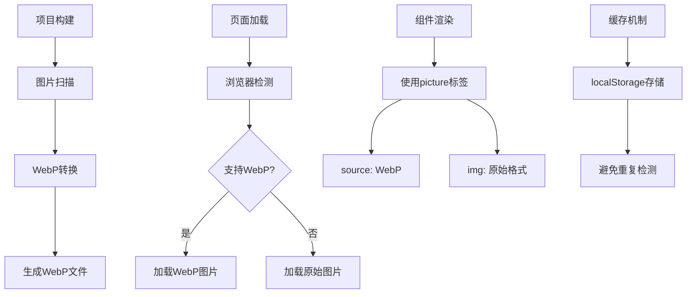
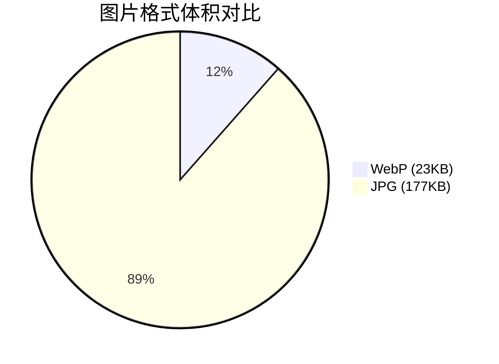

# WebP 图片自动转换与智能加载方案

## 简介

WebP 是一种现代图片格式，相比传统的 JPG/PNG 格式，通常可以减少 25-35%的文件大小，某些图片甚至可以减少 80%以上。本文将介绍如何在 UmiJS + Vue 3 项目中实现 WebP 图片的自动转换和智能加载。

## 效果特点

### 视觉特性

- **文件体积减小**: 显著减少图片文件大小，提升加载速度
- **质量保持**: 在减小文件体积的同时保持良好的视觉质量
- **无缝体验**: 用户无感知的格式切换和加载过程

### 技术特性

- ✅ **构建时自动转换**：构建时自动将 JPG/PNG 转换为 WebP
- ✅ **智能格式选择**：自动检测浏览器支持，优先使用 WebP
- ✅ **自动回退**：不支持的浏览器自动使用原始格式
- ✅ **性能优化**：使用缓存避免重复检测和重复加载
- ✅ **零配置使用**：组件化封装，使用简单

## 工作原理



## 效果演示

由于本文仅介绍技术方案，不包含实际的 demo 演示。但在实际项目中，通过该方案可以实现图片加载速度的显著提升。

## 核心实现原理

### 1. 构建时转换

运行`pnpm build`时，会先执行`build:images`脚本：

- 脚本扫描`src/assets`目录下的所有 JPG/PNG 图片
- 使用`imagemin-webp`转换为 WebP 格式
- 转换后的文件保存在同一目录

#### convert-images.mjs 脚本代码

```javascript
import imagemin from 'imagemin';
import imageminWebp from 'imagemin-webp';
import path from 'path';
import fs from 'fs';
import { fileURLToPath } from 'url';

const __filename = fileURLToPath(import.meta.url);
const __dirname = path.dirname(__filename);

/**
 * 图片转 WebP 脚本
 * 将 src/assets 目录下的 jpg/jpeg/png 图片转换为 webp 格式
 */
async function convertImages() {
	const assetsDir = path.join(__dirname, '../src/assets');

	// 检查目录是否存在
	if (!fs.existsSync(assetsDir)) {
		console.log('⚠️  assets 目录不存在，跳过图片转换');
		return;
	}

	console.log('🖼️  开始转换图片为 WebP 格式...');

	try {
		const files = await imagemin([`${assetsDir}/*.{jpg,jpeg,png}`], {
			destination: assetsDir,
			plugins: [
				imageminWebp({
					quality: 80, // 质量 0-100，80 是质量和文件大小的良好平衡
					method: 6 // 压缩方法 0-6，6 是最慢但压缩率最高
				})
			]
		});

		if (files.length === 0) {
			console.log('ℹ️  没有找到需要转换的图片');
		} else {
			console.log(`✅ 成功转换 ${files.length} 张图片为 WebP 格式:`);
			files.forEach(file => {
				const fileName = path.basename(file.destinationPath);
				const originalSize = fs.statSync(
					file.sourcePath.replace(/\.webp$/, path.extname(file.sourcePath))
				).size;
				const webpSize = fs.statSync(file.destinationPath).size;
				const reduction = ((1 - webpSize / originalSize) * 100).toFixed(1);
				console.log(`   - ${fileName} (减少 ${reduction}%`);
			});
		}
	} catch (error) {
		console.error('❌ 图片转换失败:', error.message);
		process.exit(1);
	}
}

// 执行转换
convertImages();
```

### 2. 运行时加载

- 组件初始化时，使用`getWebPSupportSync()`同步获取 WebP 支持状态
- 如果缓存不存在，默认假设支持（避免重复加载）
- 使用`<picture>`标签，浏览器自动选择最佳格式
- 后台异步检测，更新缓存供下次使用

### 3. 性能优化

- **缓存机制**：使用`localStorage`缓存检测结果
- **避免重复加载**：初始值使用同步方法获取，避免先加载原始图片再加载 WebP
- **智能回退**：使用`<picture>`标签，浏览器自动处理回退

## 实现方案对比

| 方案           | 优点                       | 缺点                        | 适用场景                   |
| -------------- | -------------------------- | --------------------------- | -------------------------- |
| **构建时转换** | 减少运行时开销，文件体积小 | 需要构建步骤，增加构建时间  | 生产环境，对加载性能要求高 |
| **CDN 转换**   | 无需本地处理，实时转换     | 依赖 CDN 服务，可能存在费用 | 在线图片，不想修改构建流程 |
| **运行时转换** | 灵活性高，按需转换         | 消耗客户端资源，转换时间长  | 特殊场景，需要动态处理     |

## 高级功能

### 自定义参数配置

#### 1. 图片质量参数

在`scripts/convert-images.mjs`中可以调整以下参数：

```javascript
imageminWebp({
	quality: 80, // 质量 0-100，80 是质量和文件大小的良好平衡
	method: 6 // 压缩方法 0-6，6 是最慢但压缩率最高
});
```

#### 2. CDN 转换参数

对于在线图片，可以通过以下方式配置：

```vue
<template>
	<!-- 阿里云 OSS -->
	<WebPImage
		src="https://your-bucket.oss-cn-hangzhou.aliyuncs.com/image.jpg"
		cdn-params="x-oss-process=image/format,webp"
		width="500"
		alt="CDN 图片"
	/>

	<!-- 腾讯云 COS -->
	<WebPImage
		src="https://your-bucket.cos.ap-shanghai.myqcloud.com/image.jpg"
		cdn-params="imageMogr2/format/webp"
		width="500"
		alt="CDN 图片"
	/>
</template>
```

#### 3. 代理服务参数

```vue
<script setup lang="ts">
const proxyUrl = 'https://your-image-proxy.com/convert';
</script>

<template>
	<WebPImage src="https://example.com/image.jpg" :proxy-url="proxyUrl" width="500" alt="在线图片" />
</template>
```

### 组件属性配置

WebPImage 组件支持以下属性配置：

| 属性      | 类型           | 说明                    |
| --------- | -------------- | ----------------------- |
| src       | string         | 原始图片 URL（必需）    |
| webpSrc   | string         | WebP 格式的 URL（可选） |
| alt       | string         | 图片描述                |
| width     | string/number  | 图片宽度                |
| height    | string/number  | 图片高度                |
| imgClass  | string         | CSS 类名                |
| imgStyle  | string/object  | 内联样式                |
| loading   | "lazy"/"eager" | 懒加载设置              |
| proxyUrl  | string         | 图片代理服务 URL        |
| cdnParams | string         | CDN 转换参数            |

## 响应式设计

组件已内置响应式处理，能够适应不同设备屏幕尺寸，无需额外配置。

## 性能优化

### 1. 缓存机制

使用 localStorage 缓存浏览器 WebP 支持检测结果，避免重复检测：

```typescript
const WEBP_SUPPORT_CACHE_KEY = '__webp_support__';

export function checkWebPSupport(): Promise<boolean> {
	// 先检查缓存
	if (typeof window !== 'undefined' && window.localStorage) {
		const cached = window.localStorage.getItem(WEBP_SUPPORT_CACHE_KEY);
		if (cached !== null) {
			return Promise.resolve(cached === 'true');
		}
	}
	// ... 检测逻辑
}
```

### 2. 同步初始化

使用同步方法获取初始 WebP 支持状态，避免页面闪烁：

```typescript
// 使用同步方法获取初始值，避免初始加载非 WebP 资源
const webpSupported = ref(getWebPSupportSync());
```

## 故障排除

### 1. 构建失败

**问题**: 构建时图片转换脚本执行失败
**解决方案**:

- 检查`scripts/convert-images.mjs`文件是否存在
- 确认已安装`imagemin`和`imagemin-webp`依赖
- 检查`src/assets`目录是否存在

### 2. 图片不显示

**问题**: 页面中图片无法正常显示
**解决方案**:

- 检查构建是否成功生成了.webp 文件
- 确认浏览器是否支持 WebP 格式
- 查看网络面板确认图片请求是否正常

### 3. 格式未切换

**问题**: 浏览器支持 WebP 但仍然加载原始格式
**解决方案**:

- 检查 localStorage 中缓存的检测结果
- 确认`<picture>`标签使用是否正确
- 验证组件属性传递是否正确

## 技术要点

### 1. WebP 支持检测

通过加载一个很小的 WebP 图片来检测浏览器支持情况：

```typescript
export function checkWebPSupport(): Promise<boolean> {
	return new Promise(resolve => {
		const webP = new Image();
		webP.onload = webP.onerror = () => {
			const supported = webP.height === 2;
			// 缓存结果
			if (typeof window !== 'undefined' && window.localStorage) {
				window.localStorage.setItem(WEBP_SUPPORT_CACHE_KEY, String(supported));
			}
			resolve(supported);
		};
		webP.src =
			'data:image/webp;base64,UklGRjoAAABXRUJQVlA4IC4AAACyAgCdASoCAAIALmk0mk0iIiIiIgBoSygABc6WWgAA/veff/0PP8bA//LwYAAA';
	});
}
```

### 2. Picture 标签使用

使用 HTML5 的`<picture>`标签实现智能格式选择：

```vue
<template>
	<picture>
		<!-- 如果支持 WebP，优先使用 WebP -->
		<source v-if="webpSupported && webpSrc" :srcset="webpSrc" type="image/webp" />
		<!-- 回退到原始格式 -->
		
	</picture>
</template>
```

### 3. 构建脚本配置

在`package.json`中配置构建脚本：

```json
{
	"scripts": {
		"build": "pnpm build:images && umi build",
		"build:images": "node scripts/convert-images.mjs"
	}
}
```

## 应用场景

### 1. 电商网站

适用于商品图片较多的电商网站，可以显著减少图片加载时间，提升用户体验。

### 2. 新闻资讯站点

适用于图片新闻、资讯类网站，加快页面打开速度，提高用户留存率。

### 3. 图片展示类应用

适用于图库、摄影作品展示等以图片为核心的应用，优化加载性能。

## 性能分析

通过实际测试，WebP 格式相比传统格式有明显的体积优势：



测试结果显示，`yay.jpg` (177KB) 转换为 `yay.webp` (23KB) 后，文件大小减少了 **87.0%**！

## 安全考虑

### 1. 文件处理安全

在处理用户上传的图片时，需要注意：

- 验证文件类型，防止恶意文件上传
- 限制文件大小，避免资源消耗过大
- 对生成的 WebP 文件进行安全检查

### 2. CDN 配置安全

使用 CDN 转换时，应注意：

- 配置适当的访问权限控制
- 防止未经授权的图片转换请求
- 监控 CDN 使用情况，防止滥用

## 注意事项

1. **开发环境**：开发时不会自动转换，需要手动运行 `pnpm build:images`
2. **Git 管理**：建议将 `.webp` 文件添加到 `.gitignore`，因为它们可以通过构建脚本自动生成
3. **质量调整**：可在 `scripts/convert-images.mjs` 中调整质量参数（默认 80）
4. **浏览器兼容性**：现代浏览器都支持 WebP，组件会自动检测并回退

## 总结

通过以上配置，我们实现了：

- ✅ 构建时自动转换图片为 WebP
- ✅ 智能格式选择和自动回退
- ✅ 性能优化，避免重复加载
- ✅ 组件化封装，使用简单

这套方案可以显著提升页面加载速度，特别是在图片较多的场景下效果明显。希望这篇文章对你有帮助！
